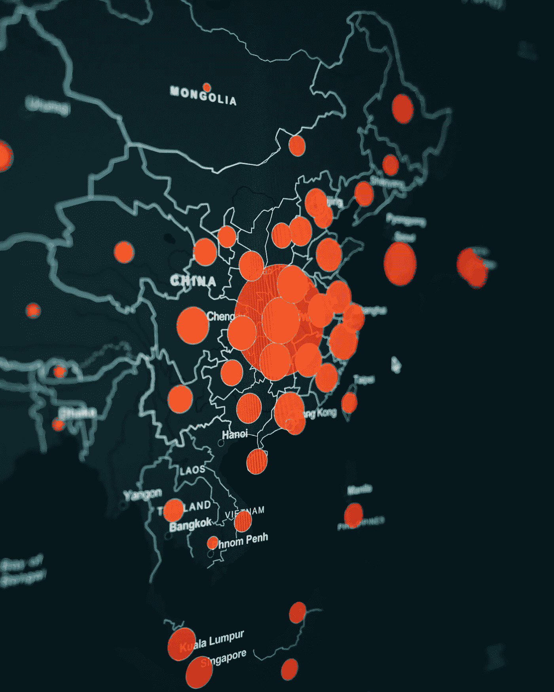
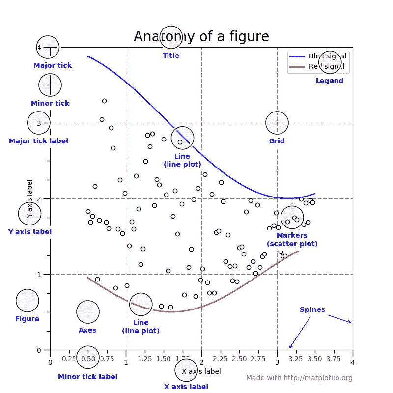

# Altair vs. Matplotlib

> 原文：<https://towardsdatascience.com/altair-vs-matplotlib-69ac4979d112?source=collection_archive---------19----------------------->

## Python 可视化库的比较



[粘土银行](https://unsplash.com/@claybanks)在 [Unsplash](https://unsplash.com/?utm_source=medium&utm_medium=referral) 拍摄的照片

如果你刚刚开始学习 Python，你可能听说过 Matplotlib。Matplotlib 是任何 Python 初学者的首选可视化库，但它是最好的吗？

在这篇文章中，我将介绍和讨论 Altair 和 Matplotlib 的区别，它们擅长什么，谁应该使用它们？

首先，我们来分析一下 Matplotlib 擅长什么。

我将使用[数据面板](https://datapane.com/)来嵌入来自每个库的可视化，以便图形保留它们的特征。

# Matplotlib

Matplotlib 是一个详尽的可视化库，包含许多功能。它的概念是基于 MATLAB 的绘图 API。使用过 MATLAB 的人会感觉更自在。这很可能是科学家将学习的第一个 Python 可视化库数据。

> Matplotlib 让简单的事情变得简单，让困难的事情变得可能。
> 
> — [Matplotlib 文档](https://matplotlib.org/)

上图描述了 Matplotlib 图形的一般概念。



图片来自 [Matplotlib 文档](https://matplotlib.org/faq/usage_faq.html)。

## 赞成的意见

*   **可定制**

由于 Matplotlib 的底层接口特性，它可以绘制任何东西。如果你只是想要一个快速的实验，几行代码就可以绘制出你想要的任何数学函数。如果你想绘制复杂的观想，稍加修改，你就能做到！甚至支持 3D 可视化。

先说一个简单的情节。

```
import numpy as np
import matplotlib.pyplot as pltx = np.linspace(1, 100)
y = 3 * x ** 2fig = plt.figure()
plt.plot(y)
plt.title(r"$y = 3x^2$")
```

它甚至可以绘制以下文本:

```
# [https://gist.github.com/khuyentran1401/d0e7397ecefcb8412a161817d1e23685#file-text-py](https://gist.github.com/khuyentran1401/d0e7397ecefcb8412a161817d1e23685#file-text-py)fig = plt.figure()plt.text(0.6, 0.7, "learning", size=40, rotation=20.,
         ha="center", va="center",
         bbox=dict(boxstyle="round",
                   ec=(1., 0.5, 0.5),
                   fc=(1., 0.8, 0.8),
                   )
         )plt.text(0.55, 0.6, "machine", size=40, rotation=-25.,
         ha="right", va="top",
         bbox=dict(boxstyle="square",
                   ec=(1., 0.5, 0.5),
                   fc=(1., 0.8, 0.8),
                   )
         )
```

*   **动画**

Matplotlib 还提供了一个实时动画包。它允许你绘制实时数据，如正弦波，甚至纳斯达克股票市场指数！

```
"""
==================
Animated line plot
==================
"""
# [https://matplotlib.org/3.1.1/gallery/animation/simple_anim.html](https://matplotlib.org/3.1.1/gallery/animation/simple_anim.html)import numpy as np
import matplotlib.pyplot as plt
import matplotlib.animation as animationfig, ax = plt.subplots()x = np.arange(0, 2*np.pi, 0.01)
line, = ax.plot(x, np.sin(x))def animate(i):
    line.set_ydata(np.sin(x + i / 50))  # update the data.
    return line,ani = animation.FuncAnimation(
    fig, animate, interval=20, blit=True, save_count=50)# To save the animation, use e.g.
#
# ani.save("movie.mp4")
#
# or
#
# writer = animation.FFMpegWriter(
#     fps=15, metadata=dict(artist='Me'), bitrate=1800)
# ani.save("movie.mp4", writer=writer)plt.show()
```

## 骗局

*   **不灵活**

由于其低级接口的性质，绘制简单的数据将是容易的。然而，当数据变得非常复杂时，诸如格式化之类的琐碎问题将需要更多的代码行。

我将使用本文中的 GitHub 数据集来演示:

[](/i-scraped-more-than-1k-top-machine-learning-github-profiles-and-this-is-what-i-found-1ab4fb0c0474) [## 我收集了超过 1k 的顶级机器学习 Github 配置文件，这就是我的发现

### 从 Github 上的顶级机器学习档案中获得见解

towardsdatascience.com](/i-scraped-more-than-1k-top-machine-learning-github-profiles-and-this-is-what-i-found-1ab4fb0c0474) 

下图显示了当数据变得庞大而复杂时，它看起来是多么杂乱无章。

接下来，我们来了解一下牛郎星。

# 阿尔泰尔

Altair 采用了与 Matplotlib 完全不同的方法。这是一个声明性的统计可视化库，最初于 2016 年发布，基于 [Vega](https://vega.github.io/vega/) 和 [Vega-Lite](https://vega.github.io/vega/) 构建。它还使用 Pandas Dataframe 进行数据表达。他们心中有三种设计方法:

*   受约束的、简单的和声明性的，以允许关注数据而不是诸如格式化之类的琐碎问题。
*   发出遵循 Vega 和 Vega-Lite 规范的 JSON 输出
*   使用现有的可视化库呈现规格

## 赞成的意见

*   **直观且结构化**

Altair 提供了一种非常直观和结构化的绘图方法。我将使用 Matplotlib 部分中的简单示例:

```
import numpy as np
import altair as altx = np.linspace(1, 100)
y = 3 * x ** 2df_alt = pd.DataFrame({'x': x, 'y': y})alt.Chart(df_alt).mark_line().encode(
    x='x',
    y='y'
)
```

你可以看到我们如何用 Matplotlib 做同样的事情，但是代码更少！

牛郎星的基本特征:

*   马克斯（英格兰人姓氏）

标记指定数据在图中的表示方式。例如，`mark_line()`将数据表示为线形图，`mark_point()`使其成为散点图，`mark_circle()`创建带有实心圆的散点图。

*   编码

编码由`encode()`调用。它允许将数据映射到不同的通道，如 x、y、颜色、形状等。例如，如果我的数据框架中有多列，我可以将 x 轴和 y 轴映射到不同的数据列。或者，如果我想用不同的颜色给我的图着色，我可以改变我的编码通道。

*   **互动**

《牛郎星》最独特的特点之一就是互动剧情。使用`interactive()`你可以让任何情节互动，允许你放大和缩小，突出情节的某些区域等等。当您有大量复杂的数据时，此功能特别有用。

*   **灵活**

凭借其声明性，Altair 只需几行代码就可以绘制复杂的数据集！这使得数据科学家在数据可视化方面有更好的用户体验，而不必担心琐碎的绘图问题。

下面的例子展示了 Altair 的交互性和灵活性。直方图绘制了突出显示的区域。想组合多个剧情？使用`&`符号即可！您已经可以看到构建这样复杂的东西所需的代码有多少了。

```
# [https://altair-viz.github.io/gallery/selection_histogram.html](https://altair-viz.github.io/gallery/selection_histogram.html)
from vega_datasets import datasource = data.cars()brush = alt.selection(type='interval')points = alt.Chart(source).mark_point().encode(
    x='Horsepower:Q',
    y='Miles_per_Gallon:Q',
    color=alt.condition(brush, 'Origin:N', alt.value('lightgray'))
).add_selection(
    brush
)bars = alt.Chart(source).mark_bar().encode(
    y='Origin:N',
    color='Origin:N',
    x='count(Origin):Q'
).transform_filter(
    brush
)plot = points & bars
plot
```

## 骗局

*   **不可定制**

通过 Altair 的声明式和高级绘图方法，它使绘制复杂的机器学习模型变得更加困难。在 [Altair 文档](https://altair-viz.github.io/user_guide/faq.html)中，他们也不建议创建超过 5000 行的图，这会导致错误。

*   **没有三维可视化**

数据科学家通常需要在 3D 平面上进行可视化，以便更好地解释数据。它的例子包括降维技术，如主成分分析(PCA)，或 word2vec 等等。在这种情况下，我会默认使用 Matplotlib 或其他具有更好 3D 可视化支持的可视化库。

# 结论

就是这样！我希望你学到了一些关于 Matplotlib 和 Altair 的新知识。现在，你应该在你的项目中实践你所学到的东西。如果您热衷于学习更多关于数据可视化的知识，您应该探索其他库，如 Seaborn、Plotly、Bokeh 和 Folium。

[](/top-6-python-libraries-for-visualization-which-one-to-use-fe43381cd658) [## 可视化的 6 大 Python 库:使用哪一个？

### 对使用哪种可视化工具感到困惑？我为你分析了每个图书馆的利弊

towardsdatascience.com](/top-6-python-libraries-for-visualization-which-one-to-use-fe43381cd658) 

上面由 Khuyen 写的文章包括了 6 个不同可视化库的概要。

最后，如果你想和我聊天，请在 [LinkedIn](https://www.linkedin.com/in/eugene-teoh/) 上联系我！