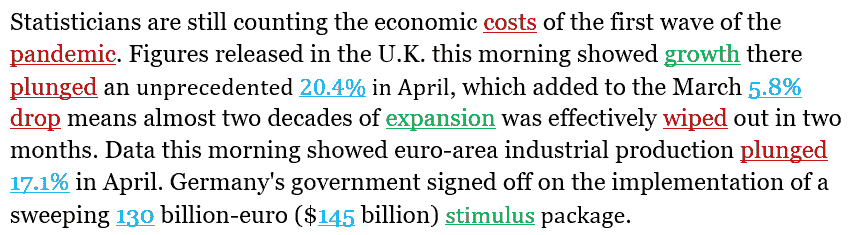
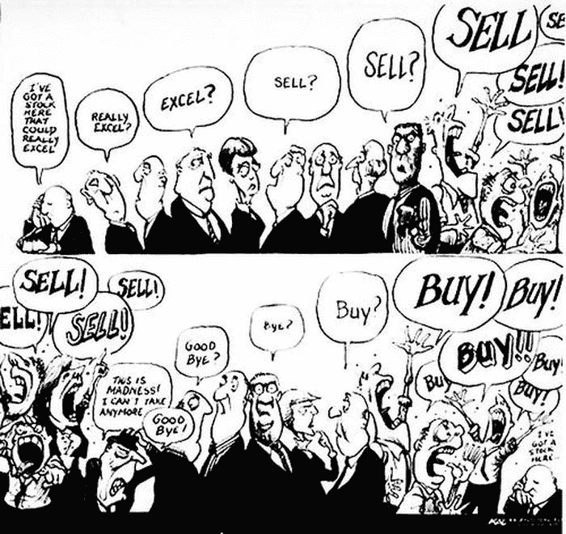
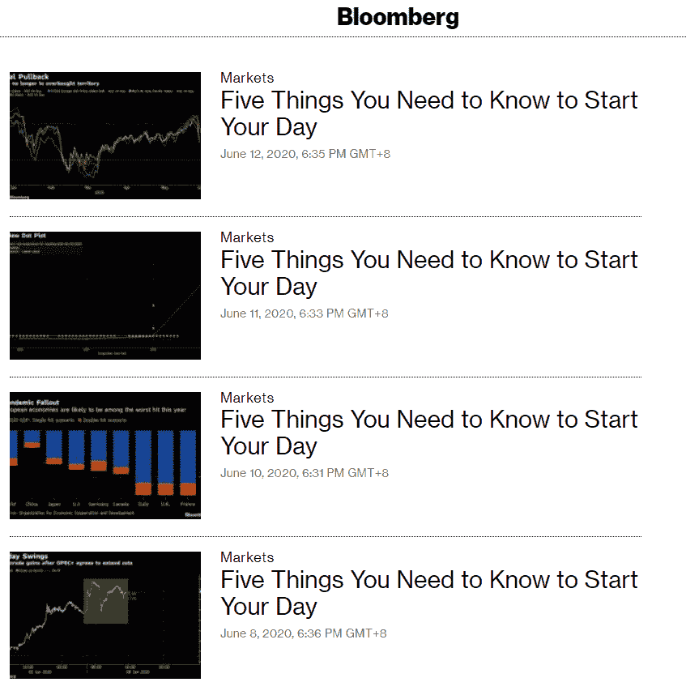
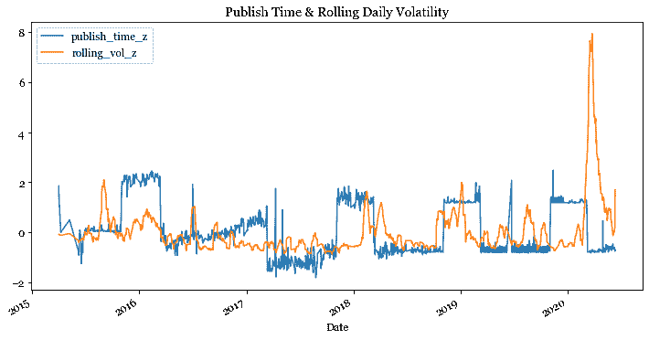
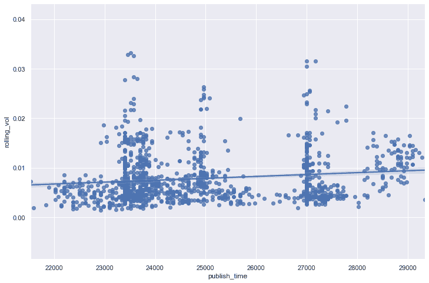

# 替代数据:利用记者的行为进行交易

> 原文：<https://towardsdatascience.com/alternative-data-trading-on-the-behaviour-of-reporters-a31cb4f7a448?source=collection_archive---------42----------------------->

## 利用出版行为预测市场波动

# 为什么不是情感分析？

新闻情感分析作为一种替代数据形式正在成为主流。数据提供商已经在他们的平台上提供文本挖掘产品，金融机构的内部研究团队已经研究了一段时间。NLP 模型在试图解释报告中的单词、短语和数字时也会变得非常复杂。



https://www . Bloomberg . com/news/news/news/2020-06-12/开始新的一天需要知道的五件事

在这种情况下，像 130 这样的数字意味着什么？消极的词比积极的词多，这是否意味着该段落有积极的情绪？对谁有利？即使考虑了文章的上下文，人类读者可能仍然无法理解这些数字对谁意味着什么，更不用说机器了。这让我想到了另一种方法，我们可以系统地从这些报告中获取价值。

# 气泡诱导回声室



【http://g.foolcdn.com/image/? URL = https % 3A % 2F % 2fg . fool cdn . com % 2f editorial % 2f images % 2f 152771% 2f broker-ratings . jpg&w = 1200&h = 630&op = resize

我偶然看到关于市场分析师的*回声室*性质的评论，这使我有一种直觉，最大最早的记者往往能够直接或通过他们报道的*回声*影响每日市场。我时常有这样的印象，当一家极具影响力的媒体报道他们认为重要的日常事件时，当天晚些时候的报道听起来往往非常相似。发生的事件肯定是市场的关键驱动因素，但报告本身可能会影响市场的势头和狂热。

# 一个新的保守的想法

你熟悉这个吗？


[http://www . Bloomberg . com/news/news/news/2020-06-12/开始新的一天需要知道的五件事](http://www.bloomberg.com/news/newsletters/2020-06-12/five-things-you-need-to-know-to-start-your-day)

我认为这份来自彭博的每日报告代表了我所提到的内容。虽然它可能不是对前一天+前一夜发生的个别事件的最快报道，但我认为它是我能访问的最受欢迎和最快的事件摘要之一。你可能没有注意到报告的出版日期和时间。



[http://www . Bloomberg . com/authors/ARIYqLnEHrg/lor can-Roche-Kelly](http://www.bloomberg.com/authors/ARIYqLnEHrg/lorcan-roche-kelly)

我注意到 [Lorcan Roche Kelly](https://medium.com/u/2cb13cb31f88?source=post_page-----a31cb4f7a448--------------------------------) 几乎是自 2015 年 4 月以来这份报告背后唯一的人。事实上，我发现这是在他作为编辑加入彭博市场后不久出现的。


【http://www.linkedin.com/in/lorcan-roche-kelly-8aa31422/ 

这让我对他的出版行为感兴趣，这导致了我的假设和最终的交易信号。

# 我们能利用出版行为来预测每日市场波动吗？

虽然他可能有 101 个原因来提前或推迟发布报告，例如，度过了一个糟糕的夜晚，错过了上班的交通工具，有一个讨厌的实习生不愿意一大早离开他，但我愿意首先相信信号的可能性。假设他这些年来一直在处理日常事务，我预计，在一个普通的日子里，如果他在前一天有更多的事件要报道，或者如果他必须报告一篇可能需要更多事实核查的重要文章，他可能需要更长的时间来发表报告。然后，我们可以用这个时间作为代理，来确定市场在开盘时对消息数量或大小的反应会有多不稳定。

这一想法的优点在于，从报告发布之时起，就可以立即、系统地表明对波动性的立场。它也不会暴露于任何可能是不必要的风险的消息解密。假设这份报告在市场上有分量，我们可以在势头到来之前低价买入。

# 数据

彭博是出了名的难刮，所以我求助于我的快速手得到[报告](https://www.bloomberg.com/authors/ARIYqLnEHrg/lorcan-roche-kelly)的日期和时间。如果你有其他选择，请告诉我！我把 UTC 00:00:00 开始的秒数作为我的自变量。我用 yfinance 得到了 S & P500 的价格，并采用了一个 10 大小的滚动窗口每日回报标准差作为我的每日波动性度量，这被用作我的因变量。然后 X 和 Y 都被归一化。



我们可以观察到最近的黑天鹅，波动率飙升至 8 SDs。我去掉了超过 3sd 的点，做了一个散点图。一个简单的回归结果显示 publish_time 的 R 平方为 0.02，t-stat 为 5.075。



# 模型

该模型是两个变量的简单线性回归，用于使用看不见的报告的 publish_time 预测样本外波动率。出于方便，我使用了 VIX 指数，并把它当作一只股票来交易，但你可以使用从 VIX 期货到 SPX 跨界的东西，从及时性和模型成本中获取更多阿尔法。如果预测波动率 z 值比前一天增加至少 0.05，模型将买入开盘价，卖出收盘价。同样，如果预测它将减少至少 0.05，则模型会将其做空。否则，不会采取任何立场。

# 结果

包括新冠肺炎期和异常值在内的整个数据集被分为训练:2015 年 4 月 1 日至 2019 年 8 月 19 日和测试:2019 年 8 月 20 日至 2020 年 6 月 11 日。在整个测试期间，该模型的表现优于持有长期 VIX 的基准。它产生了正的预期回报，但由于 0.02 的无风险利率，夏普比率为负。

```
Model
Expected Return: 0.0064269
Daily Volatility: 0.076790
Sharpe Ratio: -0.17676

Long VIX throughout
Expected Return: -0.0048733
Daily Volatility: 0.079744
Sharpe Ratio: -0.31192
```

# 结论

我提出了一个观察每日早市电话/报告的及时性的原始想法，以获得市场每日波动的信号。甚至使用目前的替代数据流似乎是一个回音室，正在慢慢失去它的优势。我希望这可以推广到其他数据源，用于各种产品的交易，或者以其他方式补充当前替代数据的使用。

***注来自《走向数据科学》的编辑:*** *虽然我们允许独立作者根据我们的* [*规则和指导方针*](/questions-96667b06af5) *发表文章，但我们不认可每个作者的贡献。你不应该在没有寻求专业建议的情况下依赖一个作者的作品。详见我们的* [*读者术语*](/readers-terms-b5d780a700a4) *。*