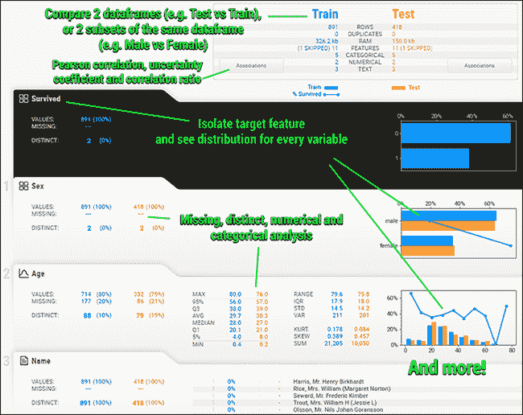

# 用于数据科学的替代 Python 库

> 原文：<https://towardsdatascience.com/alternative-python-libraries-for-data-science-1ae2f0611542?source=collection_archive---------16----------------------->

## 旨在为初学者简化数据科学过程的一些有用的库


马克·弗莱彻·布朗在 [Unsplash](https://unsplash.com?utm_source=medium&utm_medium=referral) 上的照片

机器学习领域正在突飞猛进地发展。以同样的速度，新的库正在被添加到数据科学武库中。如今，一个任务可以用多个库以多种方式执行。在所有这些过多的新库中，有几个因其易用性和开箱即用的实现而脱颖而出。在本文中，我将介绍五个这样的库，它们可以加速传统机器学习的过程，从而降低入门门槛。

> 下面是代码的[链接。](https://nbviewer.jupyter.org/github/parulnith/Data-Science-Articles/blob/main/Alternative%20Python%20libraries%20for%20Data%C2%A0Science/Alternative%20Python%20libraries%20for%20Data%C2%A0Science.ipynb)

# 1.数据分析基线库

[**Dabl**](https://amueller.github.io/dabl/dev/) 库由 [Andreas Mueller](https://amueller.github.io/) 创建，他是 [scikit-learn](https://scikit-learn.org/) 机器学习库的核心开发者和维护者之一。dabl 背后的想法是让监督机器学习对初学者来说更容易理解，并减少常见任务的样板文件。Dabl 从 **scikit-learn** 和 **auto-sklearn** 中获得灵感。该库正在积极开发中，因此不建议用于生产。参考官方[网站](https://amueller.github.io/dabl/dev/index.html)获取更多信息和示例。

## 装置

```
*# Installing the library*
!pip install dabl 
```

## 使用

Dabl 可用于数据集的自动化预处理、快速 EDA 以及初始模型构建，作为典型机器学习管道的一部分。让我们在[泰坦尼克号数据集](https://www.kaggle.com/c/titanic)的帮助下演示这个库的一些用例。我们将从导入库和数据集开始。

```
#import the basiclibraries
import numpy as np 
import pandas as pd 
import matplotlib.pyplot as plt#importing dabl
import dabl#import the dataset
titanic_df = pd.read_csv('../input/titanic/train.csv')
titanic.info()
```


titanic.info() |作者图片

1.  **检测特征类型**

作为预处理的一部分， [dabl 试图识别缺失值、特征类型和错误数据。如果检测语义类型(连续、分类、序数、文本等。)失败，用户可以提供](https://amueller.github.io/dabl/dev/user_guide.html#data-cleaning) `[type_hints](https://amueller.github.io/dabl/dev/user_guide.html#data-cleaning)` [也可以提供](https://amueller.github.io/dabl/dev/user_guide.html#data-cleaning)。

```
titanic_df_clean = dabl.clean(titanic_df, verbose=1)
```


**2。使用 dabl** 进行探索性数据分析

dabl 提供了一个高级界面，总结了几个常见的高级图。显示低维数据集的所有特征；对于高维数据集，仅显示给定任务的最具信息性的特征。让我们看看这个过程是如何进行的。

```
dabl.plot(titanic_df, target_col="Survived")
```


目标分布|作者图片


作者图片


作者图片


作者图片

上面所有的图都是用一行代码生成的。

**3。使用 dabl** 建立初始模型

dabl 还可以快速找到我们数据的基线模型。SimpleClassifier 实现了拟合和预测的标准 scikit-learn API。

```
ec = dabl.SimpleClassifier(random_state=0).fit(titanic_df, target_col="Survived")
```


作者图片

# 2.情感

[**Emot**](https://github.com/NeelShah18/emot) 是 Python 的表情符号和表情检测包。当我们必须预处理我们的文本数据以消除表情符号和表情符号时，它会非常方便。这个库接受一个字符串作为输入，并返回一个字典列表。

## 装置

```
*# installation and importing the library*
!pip install emot
```

## 使用

我们来看几个包含表情符号和表情符号的字符串。我们将使用表情符号将这些表情符号转换成文本。

```
import emot
text = "The weather is ☁️, we might need to carry our ☂️ :# Detecting emojis
("emot.emoji(text)
```


作者图片

```
# Detecting emoticons
emot.emoticons(text)
```


作者图片

# 3.Flashtext

[**Flastext**](https://github.com/vi3k6i5/flashtext) 是一个 Python 包，让你**从一个句子中提取关键词**或者**替换句子中的关键词**。它基于 [FlashText 算法](https://arxiv.org/abs/1711.00046)，比 NLP 任务的正则表达式要快得多。

## 装置

```
# installation and importing the library
!pip install flashtext -q 
```

## 使用

数据集来自之前的 Kaggle 比赛:[真实与否？灾难推文 NLP](https://www.kaggle.com/c/nlp-getting-started)，目标是创建一个机器学习模型来预测推文是否属于灾难类别。这是一个二元分类问题的恰当例子。让我们导入库和数据集，并快速浏览一下数据。

```
from flashtext import KeywordProcessor
twitter_df =  pd.read_csv('data/tweets.csv')
twitter_df.head()
```


作者图片

让我们为训练集中的所有 tweets 创建一个语料库。

```
corpus = ', '.join(twitter_df.text)
corpus[:1000]
```


作者图片

1.  **提取关键词/搜索语料库中的单词**

我们来计算一下' **flood** '这个词在语料库中出现了多少次？

```
processor = KeywordProcessor()
processor.add_keyword(‘flood’)
found = processor.extract_keywords(corpus)
print(len(found))
```

58

单词`flood` 在上述语料库中出现 `58` 次。

**2。替换文本文档中的单词**

我们还可以轻松替换文档中的单词。让我们用这个库来替换所有出现的单词。`forest fire`’(不区分大小写)与`fire'`同。

```
processor = KeywordProcessor(case_sensitive = False)
processor.add_keyword('forest fire','fire')
found = processor.replace_keywords(corpus)
print(found[:100])
```


作者图片

单词`Forest Fire`被替换成了单词 fire。类似地，我们也可以替换特殊字符、超链接等。从一份文件中。

# 4.SweetViz

[Sweetviz](https://github.com/fbdesignpro/sweetviz) 是一个开源的 Python 库，它可以用一行代码为 kickstart EDA(探索性数据分析)生成漂亮的高密度可视化效果。输出是一个完全独立的 HTML 应用程序。

该库可以执行以下任务的快速分析:

*   目标分析
*   想象和比较
*   混合型协会
*   类型推断:自动检测数字、分类和文本特征，可选手动覆盖，等等

让我们通过泰坦尼克号数据集来看看它的演示

## 装置

```
# Installing the library
!pip install sweetviz
```

## 使用

Sweetviz 有一个名为 **Analyze()，**的函数，该函数分析整个数据集并提供详细的可视化报告。

```
# importing sweetviz
import sweetviz as sv
#analyzing the dataset
advert_report = sv.analyze(titanic_df)
#display the report
advert_report.show_html('titanic.html')
```



HTML 报告视图|来源:[https://github.com/fbdesignpro/sweetviz](https://github.com/fbdesignpro/sweetviz)

SweetViz HTML 报告视图|作者视频

# 5.数字计算器

[Numerizer](https://github.com/jaidevd/numerizer) 是一个 Python 模块，用于将自然语言数字转换成整数和浮点数。它是红宝石[编号器](https://github.com/jduff/numerizer)的端口。这在预处理文本数据时很有用。

## 装置

```
!pip install numerizer
```

## 使用

我们将看到 numerizer 如何快速地将文本数字转换成数字。


作者图片

# 结论

这些是我最近遇到的一些有趣且有用的数据科学 python 库。这些库在某种程度上替代了现有的库，但可以用来补充它们。最终目标是增强和优化机器学习过程，降低初学者的门槛。如果你知道其他可以添加到列表中的人，请在下面的评论中提到他们。