# 我是确定还是不确定？—不确定性与神经网络对话

> 原文：<https://towardsdatascience.com/am-i-sure-or-unsure-talks-with-a-neural-network-fc0e14d31373?source=collection_archive---------56----------------------->

## 基于深度神经网络的后验概率分析

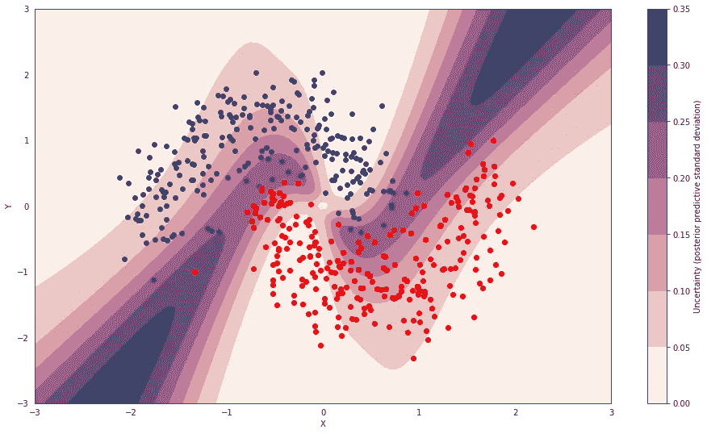

图片[1]

如果你的手机在提示你刚从后院摘的蘑菇是否有毒，最好确定一下！计算机视觉应用现在被神经网络的应用所主导。他们影响了我们每一个人的生活，因此，也增加了怀疑。关于这个黑匣子机器的可信任度，已经有很多[辩论](https://qz.com/1146753/ai-is-now-so-complex-its-creators-cant-trust-why-it-makes-decisions/)。一个模型让自己更值得信任的一个方法是告诉我们它对自己的决定有多确定，而不是仅仅说“这是我的决定”。

但是接下来的问题是，当前最先进的神经网络在*确定他们对自己的决定有多确信方面有多好。*

通过这篇文章，我们将了解—

*   预测确定性对模型意味着什么[置信度校准]
*   我们如何衡量它？[可靠性图和 ECE]
*   为什么我们首先应该期望模型被校准？[地图，KL 散度和交叉熵]

## 让我们开始我们的旅程——信心校准

*预测代表真实可能性的概率估计值的问题被称为置信度校准。*例如，给定 100 个预测，每个预测的置信度为 0.8，我们预计其中 80 个应该被正确分类。衡量这一点最简单的方法是绘制一张置信度与准确度的曲线图。这就是所谓的**可靠性图**。

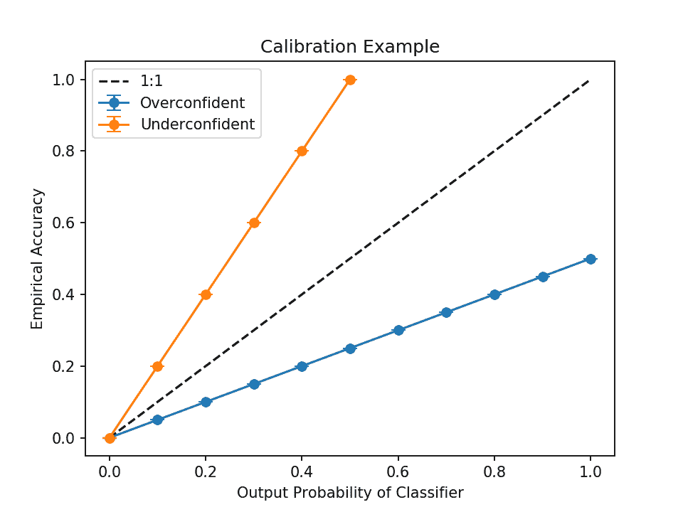

这里的 x 轴是箱精度或正确样本的数量/该箱中的样本总数-

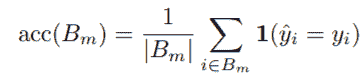

箱精度

y 轴是这个区间的置信度或平均概率

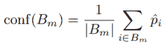

置信度校准

如果置信度始终等于准确度，即 **x=y 线**，则模型被**完美校准。**如果模型的校准图位于 x=y(完美校准)线之上，这意味着它对正确类别给出了更高的概率估计，这使其**过于自信**。正确类别的较低概率估计意味着模型是**不确定的。**

## 校准分数—预期校准误差(ECE)

我们能把可靠性图转换成一个数字来比较不同型号的校准吗？

*置信度和准确性之间的期望值差异*

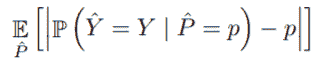

直观上，它可以理解为模型的校准图和 x=y 线之间的差异，即完美的校准线。

## 真实交易——为什么我们一开始就应该期望对模型进行校准？

我们通过由下式给出的最大似然估计( **MLE** )来优化神经网络

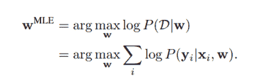

即，在给定权重/模型参数的情况下，我们最大化数据的概率。如果我们添加一个正则项，我们可以看到 MLE 转化为最大后验概率( **MAP** )估计。如果我们有 W 上的高斯先验，P(w)就是 l2 正则化，如果我们有 W 上的拉普拉斯先验，就是 l1 正则化。

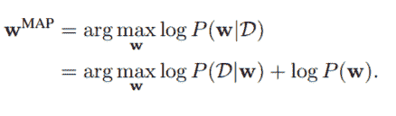

*我们希望模型输出的概率与数据的真实后验相匹配！我们需要一个损失函数来最小化模型输出的标签上的分布与数据的精确后验分布之间的距离(我们通过 KL-divergence 来最小化两个分布之间的距离)。*

## KL 散度和损失函数

首先，我们来看看在单类分类 looks 的情况下，通常被‘取’为‘后验’的是什么。如果我们有两个类——一只猫和一只狗(请注意，这不代表数据的真实后验概率)。如果有一只狗，后半部分看起来像[0，1]，如果有一只猫，后半部分看起来像[1，0]。(在这种情况下，我们的后验看起来像一个**德尔塔函数**

这个二元分类任务的 KL-散度可以由下式给出

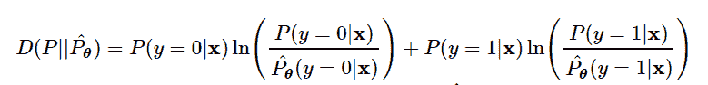

其中 x 是输入图片，P 是实际分布，P_theta 是由我们的模型计算的。

平均 KL 散度可由下式给出—

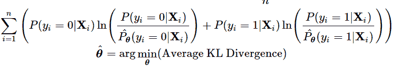

我们已经可以看到这是优化神经网络最常用的损失函数的形式——交叉熵*。*

进一步简化—

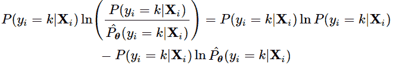

因为第一项不依赖于θ项，因此不影响 argmin_theta。由此得出的等式是交叉熵损失——

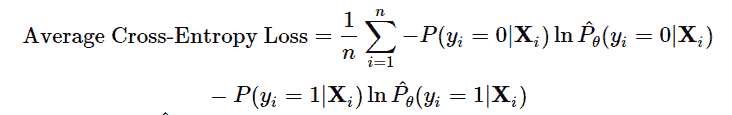

因此，最小化交叉熵等同于最小化模型输出和来自数据的后验之间的 KL-散度。因此，从理论上讲，任何神经网络都应该被完美地校准(导致校准错误的原因有很多，让我们暂时把它留到另一篇文章中吧！)

[1]pymc[https://docs . pymc . io/notebooks/Bayesian _ neural _ network _ advi . html](https://docs.pymc.io/notebooks/bayesian_neural_network_advi.html)

[2]关于神经网络的标定[https://arxiv.org/pdf/1706.04599.pdf](https://arxiv.org/pdf/1706.04599.pdf)