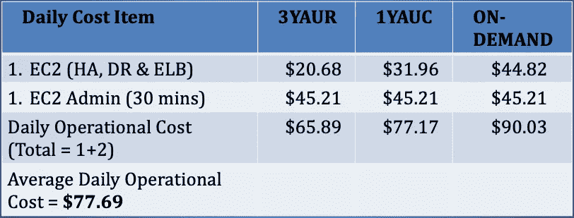
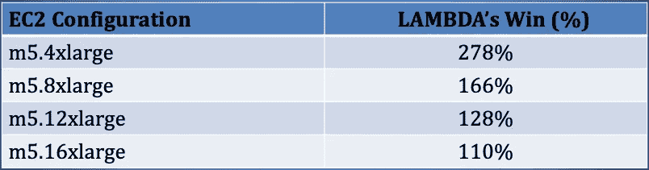

# 借助 AWS Lambda 实现惊人的数据集成成本节约— (2022 年)

> 原文：<https://towardsdatascience.com/amazing-cost-savings-with-aws-lambda-for-data-integration-2020-b048021175e3?source=collection_archive---------38----------------------->

## AWS 上基于服务器和无服务器数据集成中心的成本比较

# 介绍

数据集成是一项关键的 IT 功能，专注于向企业提供高质量的标准化数据，从而使分析、机器学习和人工智能计划能够增加商业价值。以下是一些推荐的读物(以防你需要):

1) [无服务器数据集成—第一部分(2019)](https://medium.com/@gvaidyanatha/serverless-data-integration-part-i-2019-b3b3b3bc332a)

2) [无服务器数据集成—第二部分(2019)](https://medium.com/@gvaidyanatha/serverless-data-integration-part-ii-2019-fb55d180feb)

3) [在 AWS 上为企业数据交付构建无服务器数据集成中心(2022)](https://medium.com/@gvaidyanatha/architecting-serverless-data-integration-hubs-on-aws-for-enterprise-data-delivery-2022-6eba5edf93a0)

云计算的主要价值主张之一是最大限度地降低资本成本，并代之以运营成本。虽然对于处于云之旅早期的组织来说，这是一个很好的起点，但从长远来看，控制运营成本的需求非常重要。这就是无服务器计算在适当的工作负载中发挥巨大作用的地方，尤其是在运行数据集成中心时。

影响云中计算系统成本的因素有多个方面。最突出的是 CPU、内存、存储、网络、数据传输(入口和出口)和 API 调用。在本文中，我将重点关注**计算**方面(CPU &内存)。对于给定的工作负载，这使得 AWS *EC2* (基于服务器)和 AWS *Lambda* (无服务器)之间能够进行良好的比较。在两种模型中，其他成本成分被假定为相等。一个例外是 *EC2 管理成本*(运营成本)。这与 *Lambda* 无关，并为可以在无服务器模式上运行的工作负载创造了巨大的成本优化机会。

# 等效日成本(EDC)

在金融界，术语*等价年成本(EAC)* 用于确定在资产生命周期内拥有、运营和维护资产的年成本，同时比较具有不同成本特征的资产。我简化了这个概念，引入了术语 ***等价日成本****(***)*，来比较 *EC2* 和 *Lambda* 的日成本。这是我的定义*

**等效每日成本(EDC)* *是给定 EC2 实例的派生每日成本，相当于 24 小时时间间隔内“n”次 Lambda 调用的成本。**

# *作案手法*

## *选择 EC2 实例族*

*AWS *EC2* 实例有多种形状和大小。对于我们的成本计算工作，我选择了'*通用 M5 级*'实例系列，并挑选了 4 个配置作为运行中心的潜在候选配置(图 1):*

**

*图 1: m-class 实例系列配置详细信息*

## *选择 AWS 定价模式*

*为了确保 *EC2* 价格点的公平和多样化，选择了 3 种不同的定价模式。分别是— 3 年期全提前预留( **3YAUR** )、1 年期全提前可转换( **1YAUC** )和按需(**按需**)。每种定价模式的简介:*

***3YAUR** 是最便宜的定价模式，但需要预付 3 年的费用。人们必须预订这些实例，并为服务“预先支付”，以换取最高的折扣。这种定价模式没有灵活性。*

***1YAUC** 的折扣百分比比 3YAUR 小，但提供了更大的运营灵活性。它允许在一年的时间内改变机器的配置。预付一年的服务费用。修改配置时，会进行所需的价格调整。*

***按需**是最昂贵也是最灵活的定价模式。它真正允许人们随意供应和取消供应 EC2 实例。尽管没有预先确定的时间段或前期成本，但与 3YAUR & 1YAUC 相比，此定价模式的总成本(在规定的时间段内)是最高的。这种定价模式的成本和灵活性选项与 *Lambda* 不相上下。*

# *定义工作负载和 Lambda 概要文件*

*正在讨论的工作负载是一个双线程 CPU 密集型 Python 程序，它为中心处理入站数据。它的运行时间是 5 分钟(300 秒)。在无服务器模型部署中，*λ*配置有 ***3 GB 内存*** ，因此导致为调用期间提供的微容器分配了 ***2 个 vcpu***。*

## *计算 EC2 的每日计算最大值*

*在我们计算 EC2 实例的 EDC 并将其与*λ*进行比较之前，我们首先需要计算 *EC2 的*最大每日计算能力。例如，一个***m 5.4x large***Linux*EC2*实例，配置有 ***16 个 vcpu***和 ***64 个 GiB*** 内存，运行我们之前定义的工作负载，具有以下计算**最大值**:*

1.  *并发执行=**8(16*vcpu*/2)***
2.  *执行数/小时= **96** (( **60 分钟/5 分钟** ) **x 8** )*
3.  *执行数/天=**2304**(**96 x 24**)*

*表 1 计算并列出了所有 4 个实例的每日计算最大值(使用图 1 中的# vCPUs 列):*

**

*表 1:按 m 系列配置计算的每日计算最大值*

*表 1 中的每个计算的*计算最大值*，允许我们比较 4 个不同定价模型(包括 *Lambda 的*)的日常成本，针对每个 *EC2* 配置。*

*在接下来的章节中，我们将使用 ***m5.4xlarge*** 作为等价成本计算的示例。有了**2304**可能在 ***m5.4xlarge*** 上的每日计算最大值，我们现在计算*对*λ*的计算等效性*。*

## *计算 Lambda 的成本(调用成本)*

*[AWS 定价计算器](https://calculator.aws/#/)，显示 **$34.56** ，针对**m 5.4x large 配置的**2304*Lambda*调用。因此，每次调用的成本是 **$0.015** 。供您参考，我们工作负载的“空闲层”计算为每月 **444** 次调用，价值为 **$6.66** 。*

*在此成本计算练习中执行的所有计算都是“无自由层”。这是为了保持准确(精确)的等值计算。图 2 详细说明了我们如何得出 **$34.56** :*

**

*图 2: AWS 价格计算器— Lambda 调用成本*

*使用 [AWS 简单月度计算器](https://calculator.s3.amazonaws.com/index.html)完成 *EC2* 年度成本计算。 *EC2 日成本* = *EC 年成本/365* 。对于一个 *m5.4xlarge* 实例，表 2 列出了所有 3 个 *EC2* 定价模型的每日成本及其在 **2，304 次**调用时的 *Lambda* 成本当量(LAMBDA-E )(来自图 2)。*

**

*表 2:定价模型的 Lambda 等效性—m5.4x 大型*

# *EC2 与 Lambda 的比较——成本和调用(一)*

## *等效日成本— EC2 与 Lambda (I)*

*通过计算出的 *EDC* ，我们可视化了所有 4 个选择的实例和 4 个不同定价模型的数据，在图 3 中等同于它们各自的每日最大值。 *Lambda* 在所有选择的配置和定价模式中是最贵的。坚持住，这个故事还有更多内容:)*

**

*图 3:按定价模型划分的等效每日成本— EC2 与 Lambda — m5 级实例系列(I)*

## *LAMBDA 调用可能(LIP)*

*有了所有 3 种 EC2 定价模式的每日成本，我们使用所有 3 种价格来计算一辆 *m5.4xlarge* 的 *Lambda* 调用的可能性( **LIP** )。LIP 是一个重要的指标，因为它提供了在给定成本基础上可以进行多少计算的精确数字。这在表 3 中列出:*

**

*表 3:定价模型可能的 Lambda 调用— m5.4xlarge*

*表 3 显示了相应的 LIP 编号及其各自的成本。我们的 Python 工作负载和 *Lambda* 配置文件允许我们在 **$7.07** 调用 **471** *Lambda* 。这是我们在计算成本时需要重点关注的一个重要概念。*

## *等效的每日调用— EC2 与 Lambda (I)*

*表 3 中导出的 LIP 数允许我们开始使用调用来比较成本。图 4 显示了所有 4 个选择的 *EC2* 实例和 4 个不同的定价模型。图 4 中出现了一个有趣的现象。*

**

*图 4:定价模型可能的日常调用— m5 级实例系列(I)*

*考虑一下按需定价的 m5.4xlarge 的情况 Python 工作负载需要在一天内至少被调用*1232*次(成本—*$ 18.48/天*)才具有成本效益。*

*如果*1232*个程序没有在 24 小时内执行，我们可以有把握地得出结论——*系统空闲时间*。回想一下，数据集成中心的本质是处理活动的爆发，然后是“空闲/安静时间”。支付 *1，232* 个可能的调用而不利用所有的计算能力，会导致浪费开支。这为运营成本优化创造了机会。*

*有了 *Lambda* ，人们只需为准确的调用次数付费。空闲时间是没有成本的。这是 *Lambda 的*固有特性，并为我们下一个讨论主题*运营成本*提供了一个很好的切入点。*

**注意:示例 LIP 值 2，304 是 m5.4xlarge 计算能力的每日最大 Lambda 调用量(LIP)。这不是 Lambda 上的实际调用次数，而是用来衡量成本的标准。**

## *EC2 的温柔呵护(TLC)*

*EC2 实例需要定期管理以进行护理和维护。这需要作为这些基于服务器的系统的运营成本考虑在内。这些成本与无服务器领域无关(纯粹从计算角度来看)。以下是数据集成中心环境下 *EC2* 的常规运营成本列表:*

*1)高可用性和灾难恢复配置所需的额外 *EC2* 实例(每个高可用性(HA) &灾难恢复(DR)配置至少需要 *3 个 EC2* 实例)*

*2) *弹性负载平衡器(ELB)* 满足自动扩展和故障转移的需求*

*3)管理任务—安装、修补和升级操作系统、Route53、SSL/TLS 证书管理器、CloudWatch、备份、资源标签等*

*4)与 *EC2* 管理相关的人员成本(工资、税收、福利)*

*使用*λ*，1–4 不会产生‘额外成本’。1–4 it 中的一些甚至与 *Lambda* 无关，因为其成本纯粹与计算相关。它本身支持 HA & DR，不需要自动扩展，也不需要任何操作系统安装/修补/升级。表 4 是三种定价模式下 *m5.4xlarge* 的日常 *EC2* 运营成本的示例汇总，其中人员成本为***【90.42 美元/小时*** 。*

**

*表 4:定价模型的日常运营成本*

**注意:AWS 简单计算器用于 EC2 & ELB 定价。每小时 90.42 美元的人员成本是从 AWS 解决方案架构师的平均市场工资(140，000 美元)开始计算的，其中还添加了工资税(TX)和福利成本。工资税计算在****【tsheets.com】****进行，福利费用从* ***2018 劳动统计局*** *取得。**

# *EC2 与 Lambda 的比较——成本和调用(二)*

## *等效每日成本/每日调用— EC2 与 Lambda (II)*

*考虑到**$ 77.69/天**的额外运营成本，每日成本和每日调用图表讲述了一个不同的故事。使用 *Lambda* 成本计算工具，我们得到了 **$77.69** 的**5179**调用的额外 LIP。修改后的图表如下图 5 和图 6 所示:*

**

*图 5:定价模型的等效日常成本— EC2 与 Lambda — m5 级实例系列(II)*

**

*图 6:定价模型可能的日常调用——m-class 实例系列(II)*

# *通过 AWS Lambda(无服务器计算)节省成本*

*在增加运营成本后，关于 *Lambda 的*成本效益出现了以下见解:*

1.  **Lambda* 与 *m5.4xlarge* 和 *m5.8xlarge* 配置相比，在所有选择的定价模式中均以显著优势胜出。表 5 列出了 Lambda 相对于 *m5.4xlarge* 的胜出幅度(便宜%):*

**

*表 m5.4xlarge 的每日成本利润*

*2.在图 6 中， *m5.4xlarge* 的计算当量(2，304，虚线)和实际值之间的唇差被标记为“成本优化机会”。这是不会改变计算能力的额外运营成本。其他配置也存在类似的差异。*

*3. *Lambda* 在所有 4 种 EC2 配置中胜出。从成本和灵活性的角度来看， *EC2 的*按需定价是与 *Lambda* 最接近的可比较选项。*

*4.*与按需配置相比，Lambda 的*在较小配置下赢得的利润要大得多。表 6 提供了中奖号码:*

**

*表 6:按需的每日成本胜利利润— m5 级实例系列*

*5.对于 *m5.12xlarge* 配置， *Lambda* 仅以**5.77 美元/天**的差距输给了 3YAUR。*

*6.对于 *m5.16xlarge (* 我们最大的配置) *Lambda* 分别以**32.25 美元**和**9.99 美元**的差距输给了 3YAUR & 1YAUC。换句话说， *EC2* 只在最大配置上以 **130%** 的优势和以 **108%** 的优势稳操胜券。*

# *结论*

*在我们的成本核算练习中，采用了一种 *64-vCPU* 机器配置，一种 ***3 年期全部预付保留(3YAUR)*** 或 ***1 年期全部预付可兑换(1YAUC)*** 定价选项，以令人信服地击败 *Lambda* 。鉴于 *Lambda 的*与 *EC2 的*最接近的对等物是**按需**定价模型，这确实令人惊讶。 *Lambda* 在所有采用**按需定价**的配置中明显胜出。因此，这种等效的日常成本计算练习提供了必要的上下文和数字细节，说明 *AWS Lambda* 如何使数据集成的运营成本最小化。 *Go 无服务器宝贝*！*