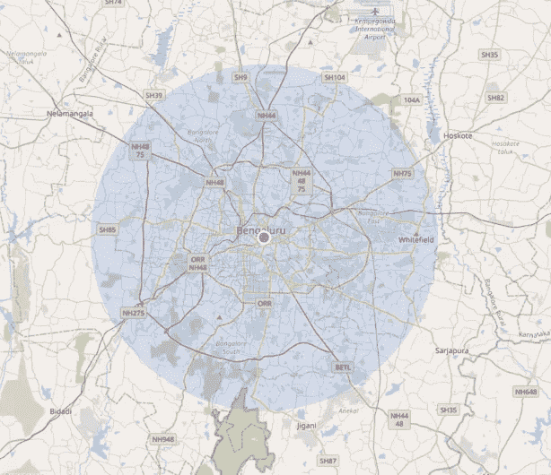

# 令人惊讶的免费地理定位替代谷歌地图

> 原文：<https://towardsdatascience.com/amazing-geolocation-alternative-to-google-maps-466827f30028?source=collection_archive---------43----------------------->

## 对于年轻的初创公司和小企业来说， **OpenStreetMap** 为打造下一件大事提供了优势

由[凯尔·格伦](https://unsplash.com/@kylejglenn?utm_source=medium&utm_medium=referral)在 [Unsplash](https://unsplash.com?utm_source=medium&utm_medium=referral) 上拍摄

OpenStreetMap(OSM) 是一个免费使用的地理定位解决方案，一个可编辑的全球地图，由贡献者开发，并以开放内容许可的方式发布。

今天，最成功的独角兽创业公司都建立在地理定位服务上，如地图、导航、路线、地点和街景。除此之外，这些服务已经被如下所述的不同业务领域大量使用-

1.  **顺风车** —优步、Lyft、滴滴出行、Ola。
2.  **汽车制造商** —丰田、大众、福特、特斯拉。
3.  **送餐** — FoodPanda，Zomato，Swiggy，Uber 吃。
4.  **旅游观光** — Expedia，美国运通。
5.  **在线** **发货跟踪**产品等诸多领域。

当我在网上搜索免费的谷歌地图替代品时，我了解了 OpenStreetMap。我真正喜欢 OSM 的是他们潜在的使命:

> “我们开始这样做是因为大多数你认为免费的地图实际上都有使用上的法律或技术限制，阻止人们以创造性、生产性或意想不到的方式使用它们。”-开放街道地图基金会

够了！这可能是任何开发团队、小创意和年轻创业公司最初面临挑战和挫折的真正原因。所以，我想做一些关于 OSM 的研究，并与大家分享。

Giphey.com 的 Gif 地图

谷歌地图最受这些大企业和独角兽初创公司的青睐，因为它们每小时和每天都有数百万次地图、路线和地点请求。但是对于中小型企业来说，随着他们的增长，可能很难负担得起谷歌提供的 ***即付即用*** 订阅模式。然而，谷歌地图提供了几千次免费访问和每月 200 美元的积分。

# 特征

有很多简单的方法来创建自己的地图，使用 OSM 根据您的要求进行修改。它们是:

*   易于学习并立即可用
*   支持 GPS 跟踪
*   地理编码过程-将地址转换为地理坐标
*   反向地理编码-将地理坐标转换为人类可读的地址
*   能够离线加载地图数据
*   允许投稿(添加、编辑、上传数据)
*   能够对多媒体文件(笔记、照片、视频)进行地理标记。

# 突出

## 1.[开发](https://wiki.openstreetmap.org/wiki/Develop)

它在众多流行的框架和语言中有不同的项目、库、插件和应用程序编程接口(API ),如 JavaScript、Java、Ruby、C++等。它运行在相对较小的服务器部署上。

## 2.[地图](https://www.openstreetmap.org/directions)

您可以将它用于常规浏览地点、导航、方向和共享位置。试试这里 [OpenStreetMap](https://www.openstreetmap.org/directions) 。

这是我在城市中的当前位置，如 [OpenStreetMap](https://www.openstreetmap.org/directions) 所示。

# 缺点

因为像 OpenStreetMap 这样的产品很大程度上依赖于贡献者和志愿者。它们也有几个缺点。以下是一些缺点:

*   少数情况下的数据不如 Google APIs 准确。
*   质量和可靠性很难达到高标准。
*   这些产品不定期更新和自愿。
*   根据用户反馈，OSM API 仅适用于原始地理数据。

> 但是当然，免费创业更好。

## [OpenLayers](https://openlayers.org/)

OpenLayers 是另一个完全免费的解决方案，用于在应用程序和产品中显示动态地图。它从各种来源绘制图块，包括 [OpenStreetMap](https://www.openstreetmap.org/) 。除了基本的地图，OpenLayers 还允许我们渲染矢量图层，并在地图上放置标记。

OpenStreetMap 许可证允许免费访问世界地图图像和所有底层地图数据。他们的主要目的是促进这些数据的新的有趣的用途。最后，在使用 OpenStreetMap 数据和 API 之前，先看一遍[版权](https://www.openstreetmap.org/copyright)页面，知道如何给 OpenStreetMap 及其贡献者鸣谢。

## 资源:

 [## 寻求帮助

### 使用初学者指南和贡献地图数据了解如何开始向项目贡献地图数据。如果你是…

wiki.openstreetmap.org](https://wiki.openstreetmap.org/wiki/Get_help)  [## 学习主义

### 回顾 2015-07-12 本指南一步一步展示如何开始使用 OpenStreetMap。您将学习如何设置…

learnosm.org](https://learnosm.org/en/beginner/) 

我希望您通过尽可能的支持来欣赏开源技术！🤗OpenStreetMap 不仅仅是开放数据，而是真正的开源产品，我们可以[贡献](https://wiki.openstreetmap.org/wiki/How_to_contribute)！

在下面的评论区写下你的建议和反馈。

**阅读我下面的其他文章，在媒体上关注我:**

 [## 仅用 5 行代码实现人脸检测

### 使用世界上最简单的人脸识别 python 库来识别和操作人脸。

towardsdatascience.com](/face-detection-in-just-5-lines-of-code-5cc6087cb1a9)  [## 一目了然地重温所有 10 款棱角分明的款式

### 谷歌最近发布了其广受欢迎的网络和移动框架的 v10。

medium.com](https://medium.com/swlh/revisit-all-10-angular-versions-in-a-glance-f7f778498160) 

让我们在 LinkedIn([@ kapilraghuwansh](https://www.linkedin.com/in/kapilraghuwanshi/)I)和 Twitter ( [@techygeeek](https://twitter.com/techygeeeky) y)上保持联系，获取更多这类引人入胜的技术文章和教程。🤝