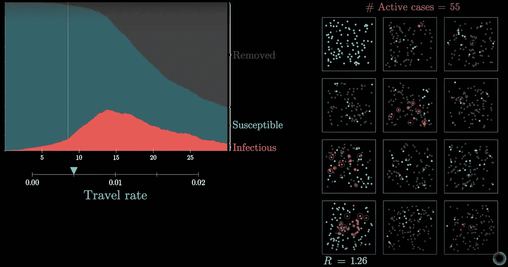
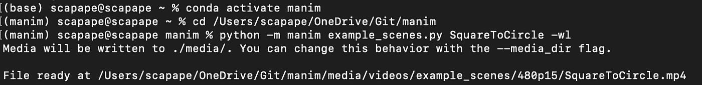
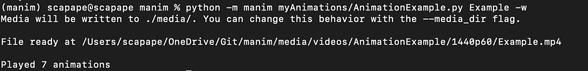

# 惊人的数学视觉效果

> 原文：<https://towardsdatascience.com/amazing-math-visuals-4aba53c48c43?source=collection_archive---------28----------------------->

## Manim 帮助你创建时尚的数学视频

鲁本·特奥在 [Unsplash](https://unsplash.com?utm_source=medium&utm_medium=referral) 上拍摄的照片

一个很棒的 YouTube 数学频道是 [3Brown1Blue](https://www.youtube.com/c/3blue1brown) 。这些视频的一个显著特点是视觉效果，你可以复制它——只要你有一些空闲时间让 **Python 库 Manim** (由该频道的作者 Grant Sanderson 编写)工作。

是的，你可以用 Manim 模拟疫情(截图来自 [3Brown1Blue](https://www.youtube.com/c/3blue1brown) YoutTube 视频)。

让 Manim 工作不是我轻易说的事情，当一个更新 Manim *打破了以前工作良好的东西*后，你可能会经历轻微的愤怒反应。话虽如此，我们只能感谢这个非凡的开源工具(您可以为它的开发做出贡献)。

我的建议是耐心并坚持这些建议:

1.  从新的虚拟环境开始。我已经设法在 Windows 和 macOS 中使用 [conda](https://docs.conda.io/projects/conda/en/latest/user-guide/install/) 设置了 Manim。
2.  查看这些资源中的任何一个来安装它需要的系统级和 Python 依赖项(并获得如何获得大部分 Manim 的灵感): [Repperium Science](https://repperiumsci.blogspot.com/2019/12/my-adventures-with-manim-part_22.html) 、 [Talking Physics](https://talkingphysics.wordpress.com/2019/01/08/getting-started-animating-with-manim-and-python-3-7/) 或 [Manim GitHub](https://github.com/3b1b/manim) 本身。
3.  如果你打算用文本或公式展示视觉效果，LaTeX 是唯一需要的，MikTex 是我在 Windows 和 macOS 安装中的选择。
4.  克隆或压缩下载 [Manim GitHub](https://github.com/3b1b/manim) 库(如果您需要旧版本，请查看如何从 GitHub 库[这里](https://coderwall.com/p/xyuoza/git-cloning-specific-commits)下载特定提交)。
5.  如果使用版本控制工具，如果您计划用 [Manim GitHub](https://github.com/3b1b/manim) 库保持 Manim 的本地版本是最新的，要格外小心。

> 你迟早会把它修好的，不要放弃！

要测试 Manim 是否正常工作，如果使用 Conda(强烈推荐),则在 Windows 或 macOS 的终端中打开 Anaconda 提示符，激活您安装依赖项的环境，导航到您克隆或解压缩 Manim 存储库的位置，并运行一个预定义的示例(例如，SquareToCircle 将生成一个转换为圆形的正方形短片)。如果成功，你将创建你的第一个 Manim 动画！

激活我的“manim”conda 环境，并在终端 MacOS 中导航到我的“manim”本地文件夹。

现在是享受一些*数学*乐趣的时候了。对于您的项目，我建议在 Manim 的文件夹结构中创建一个文件夹(我称我的为“myAnimations”)。下面的脚本将在一个图形中显示两个简单的函数。

请注意，这个(以及几乎每个)示例的基本结构可以概括为:

*   创建一个类(我称之为*示例*)，它从一个拥挤的 Manim 父类(例如 *GraphScene* )继承方法。
*   用动画定义一个**构造**方法。

运行示例脚本，一个新的 mp4 文件将被添加到媒体文件夹中。成功！

在终端 MacOS 中使用 Manim 运行 AnimationExample.py。

运行 AnimationExample.py 的输出文件。

我希望这篇文章对你有用，并且下次你想出让数学变得生动的方法时，你会想到。

查看许多有用的资源开始学习: [Repperium Science](https://repperiumsci.blogspot.com/2019/12/my-adventures-with-manim-part_22.html) 、 [Talking Physics](https://talkingphysics.wordpress.com/2019/01/08/getting-started-animating-with-manim-and-python-3-7/) 或 [Manim GitHub](https://github.com/3b1b/manim) 本身。

在 [Manim GitHub](https://github.com/3b1b/manim) 资源库中找到的通用动画代码受麻省理工学院许可。