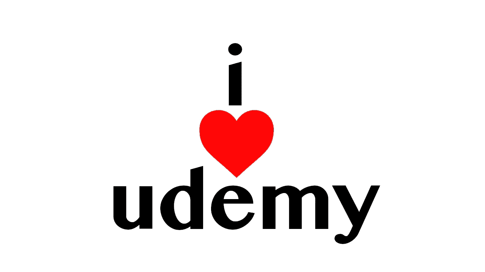

# 学习计算机科学的惊人的 Udemy 课程

> 原文：<https://towardsdatascience.com/amazing-udemy-courses-to-learn-computer-science-bcc7a1cc5e12?source=collection_archive---------69----------------------->

## 用这 3 门伟大的课程来治愈疫情的厌倦并开始学习吧。

如果你和我一样，被困在家里可能会让你变得有点疯狂。幸运的是，你可以在家里的电脑上做许多富有成效的事情，这些事情会占用你的时间，直到你可以安全地去电影院或公园打篮球。一个很好的例子是通过在线课程学习新技能，一个很好的例子是提供这种服务的网站 Udemy。

# №1:通过制作雅达利游戏学习汇编

 [## 通过为 Atari 2600 制作游戏来学习汇编语言

### 你是否对这个铺天盖地的/快节奏的/框架式的/丛林式的软件世界感到有点厌倦了…

www.udemy.com](https://www.udemy.com/course/programming-games-for-the-atari-2600/) 

让我们面对现实吧，学习汇编可能是一个有抱负的计算机科学家一生中最难做的事情之一。大多数程序员都不会在编程中走到这一步，而且汇编也没有实际用途。虽然这是部分正确的，因为大多数现代应用程序都是基于 web 的，并且适合脚本语言的环境，但是学习汇编也意味着

> 了解装配。

我相信这是一种重要且相当有价值的能力。首先，您可以了解控制流、指针和标志。虽然这些都很棒，但与使用注册表内核、处理器命令和内存时获得的知识相比，它们还是有些逊色。这正是计算机的工作方式，因此，了解所有这些如何组合在一起并一起使用，将使你成为一名更好的程序员和科学家。

本课程将带您学习 Atari 2600 的大量硬件课程。如果你像我一样，即使你没有生活在雅达利 2600 的时代，你也可能玩过雅达利 2600 的一些游戏，这些游戏让你有点怀念 8 位时代(E.T .之前)。在熟悉雅达利之后，你会深入了解 6502 汇编。先学习 6502 组装，再学习 x64 组装的优势在于，与现代处理器组装相比，6502 组装既一致又简单。

在这个 14 小时的课程结束时，你将能够用汇编语言创建一个 Atari 游戏，在 6502 汇编程序中进行汇编，并在像 Stella 这样的定制卡带或仿真器上运行你的 Atari 游戏。大约一年前我上了这门课，我记得很清楚，我还有一台老款雅达利，是我爸年轻时的。作为一个恶作剧，我制作了一个带有双人游戏的定制弹夹，但更重要的是——我的名字签在了最后。不用说，任何和我一起玩这个游戏的人都对我的名字是如何被登录到这个游戏中感到震惊和困惑。直到今天，它还躺在我祖父母的阁楼上。

# №2:从零开始的操作系统

 [## 从头开始操作系统-第 1 部分

### 你刚刚在网上偶然发现了最完整、最深入的操作系统系列课程。有超过 2700 名学生…

www.udemy.com](https://www.udemy.com/course/operating-systems-from-scratch-part1/) 

这是另一门课程，它会教给你很多关于计算机内部工作的信息。从头开始学习操作系统的工作原理和学习汇编语言编程的区别在于，学习操作系统会让你与你的软件有更好的联系。这不仅对现代汇编很重要，例如，对于系统调用和各种其他内核交互，而且从底层学习软件如何与硬件交互对于计算机编程来说肯定很方便。

无论您是在编写脚本语言、编译语言，甚至汇编语言，能够理解您的代码如何与您的操作系统和外围设备交互都是非常重要的。这门课程的一个优点是，除了基本的计算知识之外，你可以完全不学任何知识，然后从头开始理解操作系统是如何工作的。

虽然这门课肯定比汇编课短一点，要上 8 个小时，但课程通常既深入又简洁。没有太多的时间被浪费，这对于那些试图在不打瞌睡的情况下学习的人来说是一件非常好的事情。

该课程包括对调度算法和内存分配的深入研究，同时也提供了对操作系统工作原理的了解。

# №3: Shell 脚本:了解如何自动化命令行任务

 [## Shell 脚本:了解如何自动化命令行任务

### 加入其他 20，000 名成功学生的行列，世卫组织已经掌握了 SHELL 脚本和 LINUX 操作系统…

www.udemy.com](https://www.udemy.com/course/shell-scripting-linux/) 

Shell 脚本/Bash 自动化是我非常熟悉和喜欢的一个概念，您应该也是。使用 Bash 实现代码自动化的好处是，您可以将它作为一个系统来使用，将所有东西联系在一起。这伴随着可以加载到 Bash 会话中的环境变量，以及能够使用 Bash 非常容易和快速地读取和写入文本。使用 Bash，您可以访问一系列应用程序来完成一系列任务，并按照您喜欢的方式利用它们来自动完成特定的任务。

不用说，熟悉 Unix 命令行和 bash 肯定会让您的程序员和科学家生涯受益匪浅。在我看来，熟悉 bash 可能是一个程序员能够拥有的最重要的技能之一。这是因为它为服务器管理、执行、系统脚本编写和开发操作打开了大门，并且使编程变得更加容易。

# 结论

Udemy 上有很多很酷的课程，可以帮助你学习任何与计算机相关的东西。在这三个中，我买了前两个，我的一个好朋友向任何想学习 Bash 的人推荐了第三个。我认为所有这些都是重要的技能，更重要的是，它们会教会你很多你可能从未了解过的计算机知识。

了解汇编、Bash 和操作系统内部工作原理的结合当然是需要掌握的大量知识。然而，有数百万的 Udemy 课程可以浏览和查看，其中一些课程是特价甚至免费的。因此，有了这个疫情，你肯定可以充分利用你的时间，在 Udemy 上查看有用的东西！