# 亚马逊广告分析—扩展

> 原文：<https://towardsdatascience.com/amazon-ads-analytics-extended-f42dad55f61b?source=collection_archive---------31----------------------->

## 使用 Prophet 时间序列、随机森林和 SHAP 值进行需求和销售预测。

马库斯·温克勒在 [Unsplash](https://unsplash.com/s/photos/analytics?utm_source=unsplash&utm_medium=referral&utm_content=creditCopyText) 上的照片

亚马逊的全球电子商务销售额预计[将增长 20%，到 2020 年](https://www.businessinsider.com/amazon-global-ecommerce-sales-will-reach-416-billion-in-2020-2020-7)达到 4168 亿美元，亚马逊广告收入也保持同步增长。2020 年，亚马逊在美国的广告收入预计将达到[127.5 亿美元](https://www.statista.com/statistics/259811/net-us-advertising-revenues-of-amazon/#:~:text=In%202020%2C%20Amazon's%20ad%20revenues,revenue%20grew%20by%2039.4%20percent.)(2019 年为 103.2 亿美元)。

随着活动的增加，人们可以预期销售工具会有一定的改进，如 ads analytics，所以我决定将这个主题用于我在 inspire boot camp 的数据科学顶点项目。

我从 Amazon.com 的几个大型消费品牌的广告活动中获取数据，目的是寻找提高广告投资回报率和预测未来销售的潜在方法。

数据存储在 13 个表中，这些表反映了亚马逊的统计数据。关于数据的更多细节，以及我写的代码，你可以在我的 GitHub 页面找到。

我使用的技术:

*   预测潜在销售额的 Prophet 时间序列。
*   来自 Sklearn 的随机森林回归器，用于预测影响销售的因素。
*   用于模型解释的沙普利附加解释(SHAP 值)算法。

# 关键词性能

我的目标是动态分析每个关键字的性能，并预测未来的需求。

首先，我使用 Plotly library 显示了所有活动中每个搜索词的性能。下面是一个“洗手液”的例子。

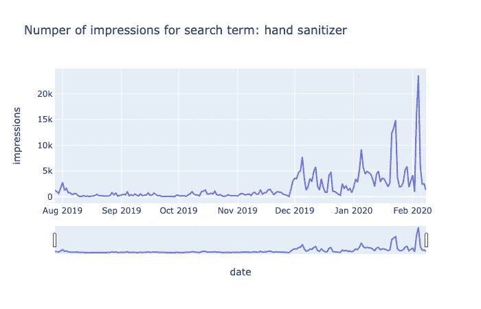

在所有活动中，关键字“洗手液”的日浏览量。图片作者。

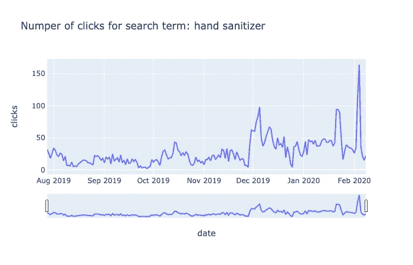

所有活动中关键字“洗手液”的日点击量。图片作者。

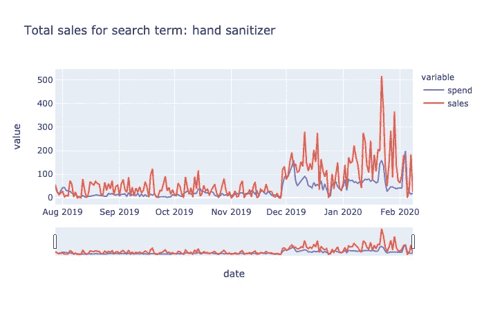

所有活动中关键字“洗手液”的日销售额(以美元计)。图片作者。

## 关键字的未来销售预测

为了推断未来的销售，我使用了 Prophet 时间序列。这张图表预测了关键字“洗手液”的销售额。

每个黑色散点图点代表以美元计的实际日销售额，模型预测显示为蓝线，表示两个月的预测。

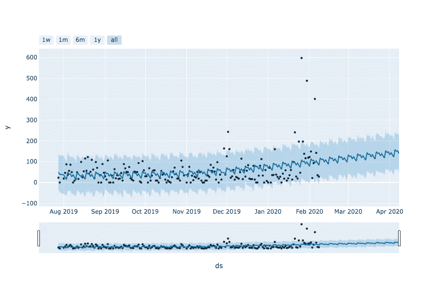

关键字“洗手液”的销售预测(每天以美元计)。图片作者。

我们可以从这个关键字看到销售的整体趋势，以及每周的波动成分。总体趋势预示着对洗手液的需求将会增长。每周波动成分显示，一周中的某一天在洗手液需求中起着重要作用——大多数销售发生在周日、周一和周二。

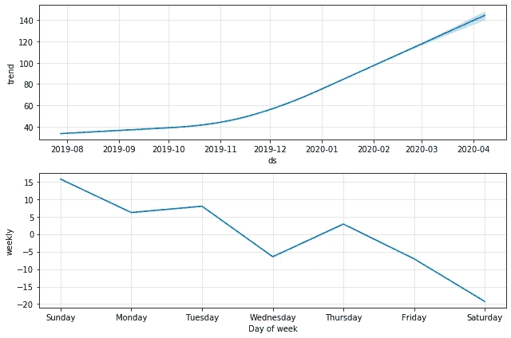

关键字“洗手液”的 Prophet 时间序列预测的整体趋势和每周部分。图片作者。

# 产品分析

我按 ASIN 对数据进行了分组，并研究了每种产品的性能。

对于这个例子，我选择了洗手液，因为它是今年 COVID 的热门产品。一家销售洗手液的公司可能会从广告分析中受益，广告分析提供了一些对动荡未来的洞察。

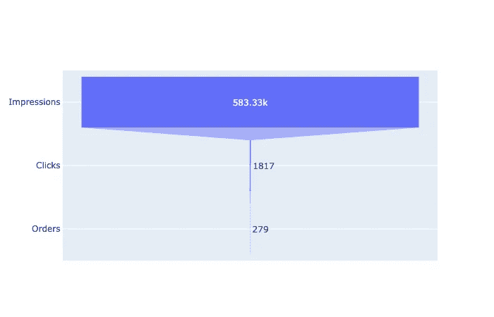

产品“洗手液”的销售漏斗。图片作者。

这张图表显示了洗手液的漏斗:

展示->点击->订单

我还为每个产品创建了一些高级数据分析，按活动分组(如下图)，以查看哪些活动表现良好，哪些需要改进。

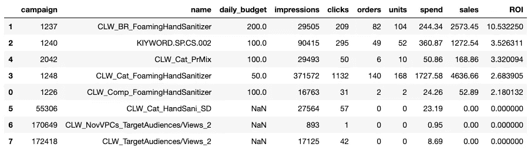

“洗手液”产品的广告活动表现。图片作者。

## 动态中的产品性能

类似于关键词，我做了时间序列分析，动态看产品表现，预测未来销量。

在所有活动中，产品“洗手液”的每日展示次数。图片作者。

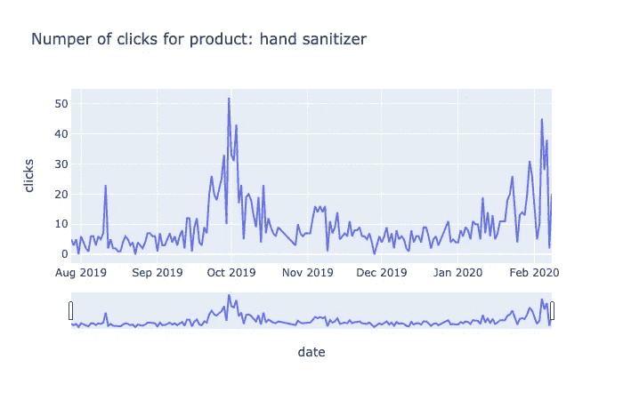

所有营销活动中“洗手液”产品的日点击数。图片作者。

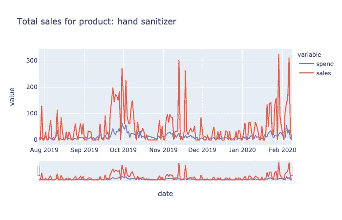

所有营销活动中产品“洗手液”的每日销售额和支出(以美元计)。图片作者。

使用 Prophet 时间序列，我为每种产品建立销售预测。下图显示了两周洗手液销售预测、总体趋势和每周波动部分。

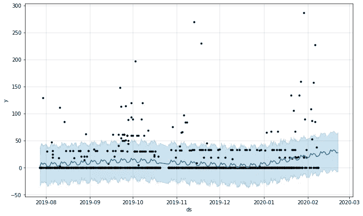

产品“洗手液”的销售预测(每天以美元计)。图片作者。

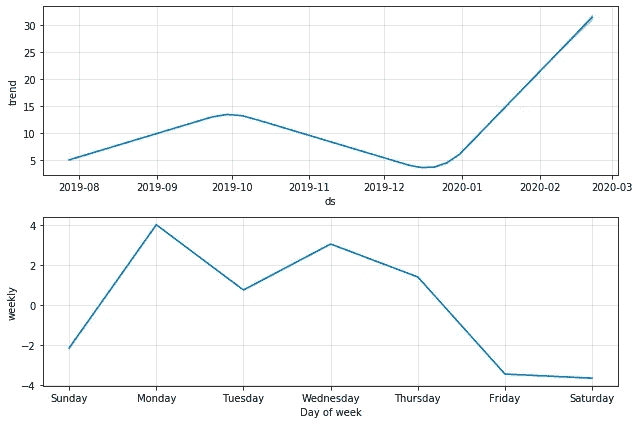

产品“洗手液”的 Prophet 时间序列预测的总体趋势和每周部分。图片作者。

# 影响销售的因素

最后，我想调查影响产品销售的因素。为此，我构建了一个 ML 模型(来自 Sklearn 的随机森林回归器)，并使用 SHAP 值来可视化特征的重要性。

我使用以下特征来预测销售额:

*   印象
*   点击
*   CTR
*   中国共产党（the Communist Party of China）
*   花钱
*   文件夹
*   每日预算

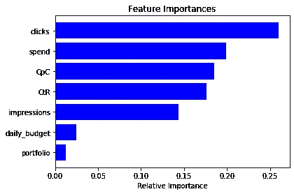

产品“洗手液”销售的特征重要性图。图片作者。

每个特性对结果(销售)有不同的影响。通过绘制这些特征重要性参数，可以从模型本身得出高级视图。

这张图表显示了“点击次数”和“花费的钱”是最重要的特征(这是有意义的)，但是它们到底是如何影响销售的呢？为了更好地理解模型行为，我研究了 SHAP 价值观。

SHAP 汇总图显示了每个因素的预测值与目标变量(销售额)的正相关和负相关关系。每个点代表训练数据的一次观察。

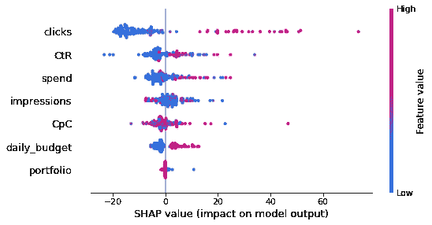

“洗手液”产品销售预测的 SHAP 值汇总图。图片作者。

如果你不熟悉 SHAP 价值观，[这篇精彩的中间文章](/shap-explained-the-way-i-wish-someone-explained-it-to-me-ab81cc69ef30)将帮助你更好地理解 SHAP 价值观是什么，[这篇文章解释了每个图表的含义](/explain-your-model-with-the-shap-values-bc36aac4de3d)。

有了 SHAP，我们可以深入了解每个功能的行为。例如，我们可以看到“每次点击成本”如何影响我们的销售。

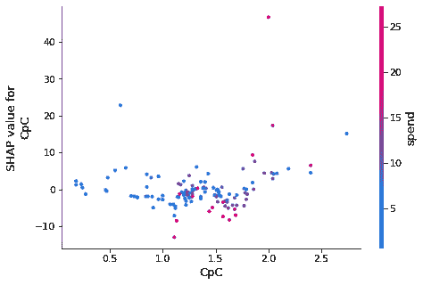

SHAP 重视“洗手液”产品的销售和点击费用的依赖图。图片作者。

对于每一次观察(在我们的例子中是每天)，我们可以观察力图的所有特征。这张图片展示了我们的第 12 次观察。那一天，总销售额为 70.99 美元。该模型的基本价值(平均值)为 54.44 美元，推动销售增长的主要因素是点击量——我们有 7 次点击量。

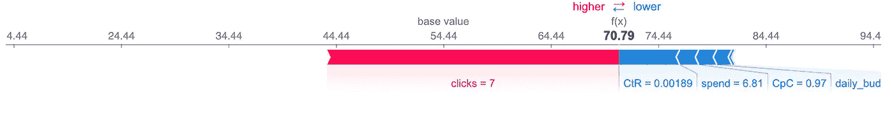

产品“洗手液”的个人 SHAP 值图(用于第 12 天预测)。图片作者。

# 摘要

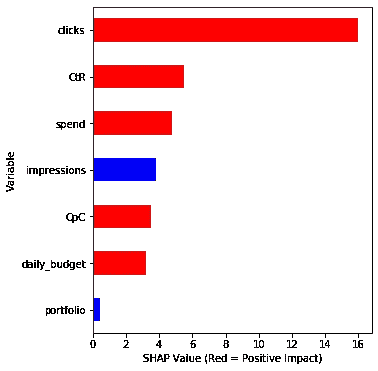

“洗手液”销售预测的 SHAP 值(简化版)。图片作者。

下图显示了对一种产品(洗手液)销售的所有特征重要性和效果的简单解释。

红色表示特征与目标变量正相关。在这种模式下，高点击率、CTR、CpC 和日预算会增加销售额。

高印象和某些投资组合类型会降低销售额；这一发现让我开始研究针对特定环境的活动。

事实证明，赞助产品广告类型产生高印象，但洗手液销量低，而赞助品牌则相反。调整广告设置应该会提高广告的投资回报率。

# 包扎

*   亚马逊广告数据的时间序列分析可用于预测未来的产品需求和销售，而 ML 建模也可用于更好地了解影响产品销售业绩的因素。
*   根据销售频率和销量，按天或按周对数据进行分组以获得更好的结果可能是有意义的——使用您自己的数据集进行实验。
*   ML 分析和预测表明，有时销售和广告统计数据之间的相关性可能会引起争议。在这种情况下，深入研究活动和广告设置是一个好主意。

我的项目的原始代码和其他细节在这里: [GitHub](https://github.com/JuliaSokolova/amazon_-eCommerce_optimization) 。

如果您对我在您项目中的代码实现有任何疑问或需要帮助，请随时通过 LinkedIn 联系我。