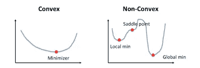
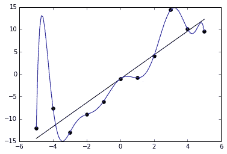

# 亚马逊的数据科学家面试实践问题

> 原文：<https://towardsdatascience.com/amazon-data-scientist-interview-practice-problems-15b9b86e86c6?source=collection_archive---------3----------------------->

## 一些亚马逊面试问题的演练！

克里斯蒂安·威迪格在 [Unsplash](https://unsplash.com/s/photos/amazon?utm_source=unsplash&utm_medium=referral&utm_content=creditCopyText) 上拍摄的照片

鉴于我的文章、 [Google 的数据科学面试脑筋急转弯](/googles-data-science-interview-brain-teasers-7f3c1dc4ea7f)、 [40 个数据科学家的统计面试问题及答案](/40-statistics-interview-problems-and-answers-for-data-scientists-6971a02b7eee)、[微软数据科学面试问题及答案](/microsoft-data-science-interview-questions-and-answers-69ccac16bd9b)、 [5 个数据科学家常见的 SQL 面试问题](/40-statistics-interview-problems-and-answers-for-data-scientists-6971a02b7eee)的受欢迎程度，这次我在网上搜集了一批亚马逊的数据科学面试问题，尽我所能的进行了解答。尽情享受吧！

## 问:*如果有 8 个相同重量的弹珠和 1 个稍重一点的弹珠(总共 9 个弹珠)，需要称重多少次才能确定哪个弹珠最重？*

作者创建的图像

需要称重两次(见上文 A 和 B 部分):

1.  你将九个弹珠分成三组，每组三个，称其中两组的重量。如果天平平衡(选择 1)，你知道重的弹球在第三组弹球中。否则，您将选择权重更大的组(选项 2)。
2.  然后你将练习同样的步骤，但是你将有三组一个弹球，而不是三组三个。

## 问:凸与非凸代价函数的区别；当一个代价函数是非凸的时候意味着什么？

摘自加州大学洛杉矶分校谢卓瑞

**凸函数**是指在图形上任意两点之间画出的一条线位于图形上或图形上方。它有一个最小值。

**非凸函数**是在图上任意两点之间画的线可能与图上其他点相交的函数。它的特征是“波浪形”。

当成本函数是非凸的时，这意味着该函数有可能找到局部最小值而不是全局最小值，从优化的角度来看，这在机器学习模型中通常是不希望的。

## 问:什么是过度拟合？

摘自维基百科

过度拟合是一种错误，即模型“拟合”数据太好，导致模型具有高方差和低偏差。因此，过度拟合模型将会不准确地预测新的数据点，即使它对训练数据具有高的准确性。

## 问:改变基本会员费会对市场产生什么影响？

我对这个问题的答案没有 100%的把握，但我会尽力而为！

让我们举一个主要会员费上涨的例子——有两方参与，买方和卖方。

对于买家来说，提高会员费的影响最终取决于买家需求的价格弹性。如果价格弹性很高，那么给定的价格上涨将导致需求大幅下降，反之亦然。继续购买会员费的买家可能是亚马逊最忠诚和最活跃的客户——他们也可能更加重视 prime 产品。

卖家将受到打击，因为现在购买亚马逊一篮子产品的成本更高了。也就是说，一些产品将受到更严重的打击，而其他产品可能不会受到影响。亚马逊最忠实的顾客购买的高端产品可能不会受到太大影响，比如电子产品。

## 问:描述一下树、SVM 和随机森林。谈论他们的优点和缺点。

决策树:一种树状模型，用于根据一个或多个条件对决策进行建模。

*   优点:易于实现，直观，处理缺失值
*   缺点:高方差，不准确

支持向量机:一种分类技术，可以找到一个**超平面**或两类数据之间的边界，使两类数据之间的差距最大化。有许多平面可以分隔这两个类别，但只有一个平面可以最大化类别之间的边距或距离。

*   优点:高维精确
*   缺点:容易过度拟合，不能直接提供概率估计

随机森林:一种基于决策树的[集成学习](https://en.wikipedia.org/wiki/Ensemble_learning)技术。随机森林包括使用原始数据的[自举数据集](https://machinelearningmastery.com/a-gentle-introduction-to-the-bootstrap-method/)创建多个决策树，并在决策树的每一步随机选择一个变量子集。然后，该模型选择每个决策树的所有预测的模式。

*   优点:可以实现更高的准确性，处理缺失值，不需要特征缩放，可以确定特征重要性。
*   缺点:黑盒，计算量大

## 问:为什么降维很重要？

降维是减少数据集中要素数量的过程。这主要在您想要减少模型中的方差(过度拟合)的情况下很重要。

维基百科陈述了降维的四个优点([见此处](https://en.wikipedia.org/wiki/Dimensionality_reduction#Advantages_of_dimensionality_reduction)):

1.  *它减少了所需的时间和存储空间*
2.  *多重共线性的消除改善了机器学习模型参数的解释*
3.  *当数据降低到非常低的维度时，如 2D 或 3D* ，将变得更容易可视化
4.  *它避免了维数灾难*

## 问:商品在位置 A 的概率是 0.6，在位置 b 的概率是 0.8。在亚马逊网站上找到该商品的概率是多少？

我们需要对这个问题做一些假设才能回答。**让我们假设在亚马逊上有两个可能的地方购买特定商品，在位置 A 找到它的概率是 0.6，在位置 B 找到它的概率是 0.8。在亚马逊上找到该商品的概率可以这样解释**:

我们可以把上面的话重新措辞为 P(A) = 0.6，P(B) = 0.8。此外，让我们假设这些是独立的事件，这意味着一个事件的概率不受另一个事件的影响。然后我们可以使用公式…

P(A 或 B) = P(A) + P(B) — P(A 和 B)
P(A 或 B) = 0.6 + 0.8 - (0.6*0.8)
P(A 或 B) = 0.92

## 问:描述一下 SVM。

*在之前的问题中已经提供了答案*

## 问:什么是助推？

Boosting 是一种集成方法，通过减少模型的偏差和方差来改进模型，最终将弱学习者转换为强学习者。总体思路是训练一个弱学习器，通过对前一个学习器的学习，依次迭代改进模型。*你可以在这里* 了解更多 [*。*](https://medium.com/greyatom/a-quick-guide-to-boosting-in-ml-acf7c1585cb5)

# 感谢阅读！

如果你喜欢我的工作，想支持我…

1.  支持我的最好方式就是在**媒体**上[这里](https://medium.com/@terenceshin)关注我。
2.  在 **Twitter** [这里](https://twitter.com/terence_shin)成为第一批关注我的人之一。我会在这里发布很多更新和有趣的东西！
3.  此外，成为第一批订阅我的新 **YouTube 频道** [这里](https://www.youtube.com/channel/UCmy1ox7bo7zsLlDo8pOEEhA?view_as=subscriber)！
4.  在 **LinkedIn** [这里](https://www.linkedin.com/in/terenceshin/)关注我。
5.  在我的**邮箱列表** [这里](https://forms.gle/UGdTom9G6aFGHzPD9)注册。
6.  看看我的网站，[**terenceshin.com**](https://terenceshin.com/)。

# 资源

 [## 亚马逊数据科学家面试问题

### 62 个亚马逊数据科学家面试问题和 61 个面试评论。由…匿名发布的免费采访详情

www.glassdoor.ca](https://www.glassdoor.ca/Interview/Amazon-Data-Scientist-Interview-Questions-EI_IE6036.0,6_KO7,21.htm?countryRedirect=true)  [## 亚马逊数据科学访谈

### 亚马逊为 Alexa 招聘的开发人员比谷歌招聘的都多。

medium.com](https://medium.com/acing-ai/amazon-ai-interview-questions-acing-the-ai-interview-3ed4e671920f)  [## 过度拟合

### 在统计学中，过度拟合是“一个分析的结果过于接近或精确地对应于一个特定的…

en.wikipedia.org](https://en.wikipedia.org/wiki/Overfitting) 

[http://web . cs . UCLA . edu/~ chohsieh/teaching/cs 260 _ winter 2019/lecture 3 . pdf](http://web.cs.ucla.edu/~chohsieh/teaching/CS260_Winter2019/lecture3.pdf)