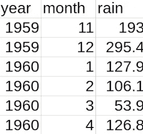
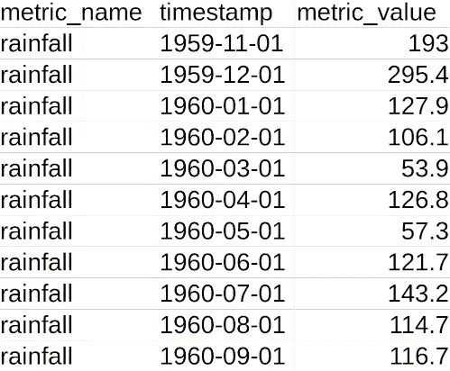
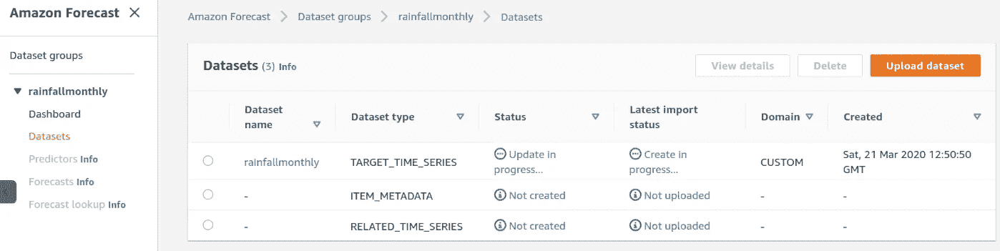
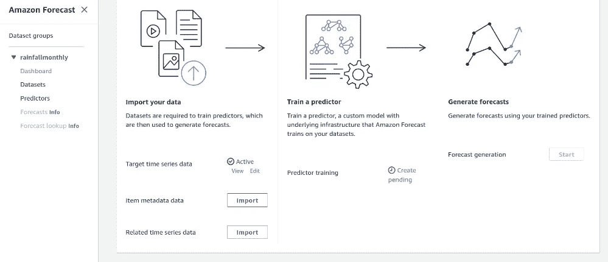
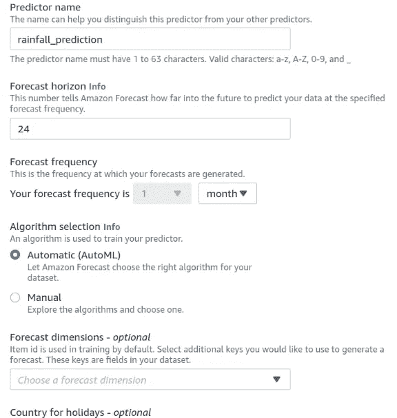
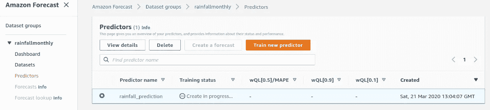
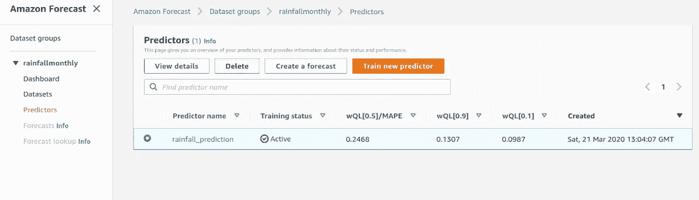
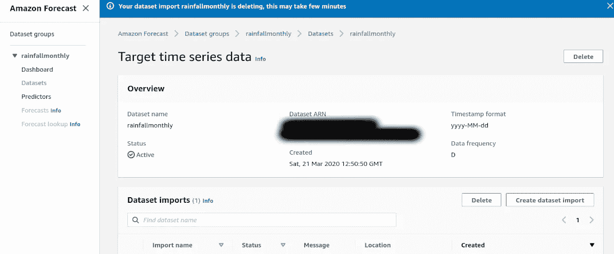
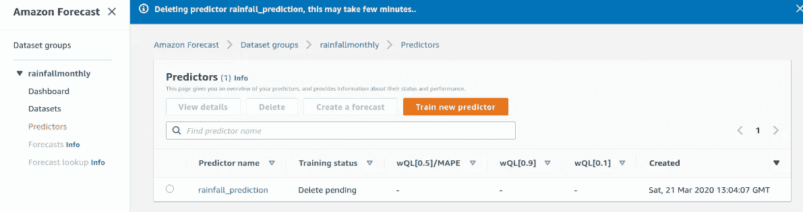
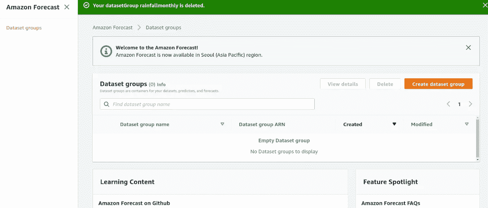

# 亚马逊预报:预测月降雨模式

> 原文：<https://towardsdatascience.com/amazon-forecast-predicting-monthly-rainfall-patterns-ebbb172b1182?source=collection_archive---------35----------------------->

## 亚马逊预测使用机器学习工具来提供时间序列预测。如果使用得当，这个平台可以非常有效地做出明智的时间序列预测。

在这个例子中，我们来看看如何使用亚马逊预测来预测降雨数据。

正在讨论的数据集包括 722 个月的降雨数据。爱尔兰新港的降雨量数据来源于英国气象局网站。

# 数据处理

要用 Amazon Forecast 建立预测模型，首先需要对时间序列数据进行如下配置: *metric_name，timestamp，metric_value* 。

## 格式化

这是原始的时间序列:

如上格式化后，以下是新的时间序列:

## 创建 IAM 角色

要将这些数据从 S3 加载到 Amazon Forecast 中，请确保创建一个具有必要权限的 IAM 角色:

一旦 S3 系统中的数据格式正确，就可以上传数据集:

来源:亚马逊网络服务

上传后，仪表板会将目标时间序列数据显示为活动状态:

来源:亚马逊网络服务

## 创建预测器

既然数据已经上传，就可以创建预测器了。Amazon Forecast 提供了两个预测选项:

*   **自动(AutoML):** 在这个选项下，Amazon Forecast 分析数据，然后选择一个合适的模型进行预测。
*   **手动:**用户手动选择他/她选择的算法进行预测。

在本例中，我们使用自动选项。

来源:亚马逊网络服务

预测范围设置为 **24** (即预测两年的月降雨量数据)，节假日的预测维度和国家保留默认设置。

现在，您应该会看到一个**“正在创建…”**培训状态:

来源:亚马逊网络服务

# 结果

获得了以下预测:

来源:亚马逊网络服务

报告了 10%、50%和 90%分位数的预测分位数。

据报告，预测值与实际值的偏差在 10%分位数处最低，偏差为 **9.8%** ，而在 50%分位数附近最高，偏差超过 **24%** 。这意味着预测是向下偏的，这在这种情况下似乎是有意义的。

例如，下面是 Excel 中一段时间内降雨量数据的简单图表:

我们可以看到，该系列的特点是临时峰值，降雨量特别高于正常水平。这些异常使序列的总体平均值向上倾斜，因此对较高分位数的预测不太准确也就不足为奇了。

在这个例子中，Amazon Forecast 已经完成了合理的预测工作，但是可以对时间序列模型进行进一步的调查，以更好地捕捉这个数据集中的波动性。在这方面，我们不能排除 LSTM 或 GARCH 等非预定义算法实际上可能更适合这类数据。

关于分位数测量的更多信息可以在亚马逊预测的[文档中找到。](https://docs.aws.amazon.com/forecast/latest/dg/metrics.html)

现在已经获得了预测，如果数据集组不在使用中，最好将其关闭。

# 删除数据集组

为此，必须先删除数据集和预测值，然后才能彻底删除数据集组。

来源:亚马逊网络服务

来源:亚马逊网络服务

删除上述内容后，可以删除数据集组本身:

来源:亚马逊网络服务

# 结论

这是对 Amazon Forecast 以及如何配置该平台来进行时间序列预测的介绍。文章探讨了:

*   如何修改时间序列数据集以用于 Amazon Forecast
*   时间序列预测的可用选项
*   如何解读预测结果

希望你觉得这篇文章有用，非常感谢你的时间。

*免责声明:本文“按原样”呈现，仅作为亚马逊预测的介绍性教程——根据 AWS 客户协议，使用亚马逊预测是用户自己的责任。与其他 AWS 服务一样，Amazon Forecast 也有自己的定价结构，用户有责任熟悉这些结构。关于亚马逊预测定价结构的更多信息可以在* [*定价文档*](https://aws.amazon.com/forecast/pricing/) *下找到。本文中的发现和解释是作者的，不以任何方式得到 Metéire ann 的认可或隶属于 Metéire ann。*