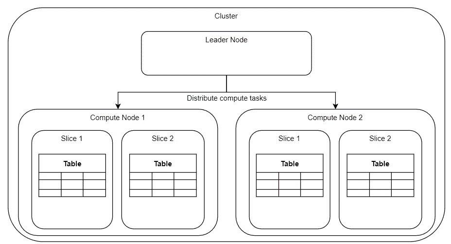

# 亚马逊红移架构

> 原文：<https://towardsdatascience.com/amazon-redshift-architecture-b674513eb996?source=collection_archive---------14----------------------->

## 数据仓库|亚马逊红移

## 理解红移的基础

数据工程师甚至分析师，理解技术并充分有效地利用它是很重要的。在许多情况下，Redshift 被视为像 SQL Server 一样的传统数据库，管理工作留给了 DBA。我认为，如果遵循 Redshift 最佳实践，专职 DBA 的角色就会减少到偶尔的管理和维护。

在这篇文章中，我们将探索这个架构，并理解每个组件对查询的影响。

# 简单的观点

从 10，000 英尺的高空看，Redshift 看起来像任何其他关系数据库，具有相当标准的 SQL 和实体，如表、视图、存储过程和常见的数据类型。

我们将从表开始，因为这些表是持久数据存储的容器，并允许我们垂直深入到架构中。这是从 10，000 英尺高空看上去的红移:

简单的 10，000 英尺视角

Redshift 是一个集群仓库，每个集群可以容纳多个数据库。正如所料，每个数据库都包含多个对象，如表、视图、存储过程等。

# 节点和切片

众所周知，Redshift 是一个分布式的集群服务，因此期望数据表存储在多个节点上是合乎逻辑的。

> 节点是具有专用 CPU、内存和磁盘的计算单元。Redshift 有两种类型的节点:Leader 和 Compute。领导者节点管理跨计算节点的数据分发和查询执行。数据仅存储在计算节点上。

领导者和计算节点

为了理解红移是如何分布数据的，我们需要知道一些关于计算节点的细节。

> 片是磁盘存储的逻辑分区。每个节点都有多个存储片，允许在每个节点上跨存储片进行并行访问和处理。

每个节点的切片数量取决于节点实例类型。Redshift 目前提供 3 类实例:密集计算(`dc2`)、密集存储(`ds2)`)和托管存储(`ra3`)。根据实例族和实例类型，切片的范围可以从每个节点 2 个到每个节点 16 个；[详见本](https://docs.aws.amazon.com/redshift/latest/mgmt/working-with-clusters.html#working-with-clusters-overview)。这个概念的目标是在所有节点上平均分配查询工作负载，以利用并行计算并提高效率。因此，默认行为是在将数据加载到如下所示的表中时，将数据均匀分布在所有节点的所有存储片上。

具有表分布的节点和切片

每个片以 1MB 的块存储多个表。这种切片和节点系统实现了两个目标:

1.  **在所有计算节点上均匀分布数据和计算。**
2.  **将数据和计算放在一起，最大限度地减少数据传输，提高节点间的连接效率。**

# 柱状存储

影响计算的红移的一个关键特征是数据的列存储。除了查询效率的架构和设计之外，数据本身以列格式存储。对于任何聚合，大多数分析查询都将利用表中的少量列。不必深入细节，数据是按列而不是按行存储的。这为红移提供了多重优势。

**磁盘 I/O 显著减少**，因为只访问必要的数据。这意味着查询性能与被访问的数据量成反比，表中的列数不计入磁盘 I/O 成本。从 100 列表中选择 5 列的查询只需访问 5%的数据块空间。

**每个数据块包含来自单个列的值。**这意味着每个块中的数据类型总是相同的。Redshift 可以对每个数据块应用特定和适当的压缩，从而增加在相同磁盘和内存空间内处理的数据量。与每个块使用几 KB 的其他数据库相比，使用 1MB 的块大小可以提高效率。

总体而言，由于压缩、大块大小和列存储，Redshift 可以高效地处理数据，并随着数据使用量的增加而扩展。理解了这一点，数据库开发人员就可以编写最佳查询，避免 OLTP 数据库中的`select *`。

# 工作量管理

到目前为止，数据存储和管理已经显示出显著的优势。现在是时候考虑在 Redshift 上管理查询和工作负载了。Redshift 是一个数据仓库，预计会被多个用户和自动化进程同时查询。工作负载管理(WLM)是一种控制向查询组或用户组分配计算资源的方法。通过 WLM，可以确定某些工作负载的优先级并确保流程的稳定性。

WLM 允许定义具有特定内存分配、并发限制和超时的“队列”。每个查询都通过一个队列执行。提交查询时，Redshift 会根据用户或查询组将其分配到特定的队列中。有些默认队列无法修改，例如超级用户、真空维护和短查询(< 20 秒)。WLM 队列是可配置的，但是，亚马逊提供了一个替代方案，这是一个完全管理的 WLM 模式，称为“自动 WLM”。在“自动 WLM”模式下，一切都由红移服务管理，包括并发和内存管理。

理解红移架构是获得其优势的关键。红移通常被误解为另一个数据库引擎，因为工程师/分析师缺乏这方面的知识。该架构可用于提供非常高吞吐量的查询和大量数据处理。