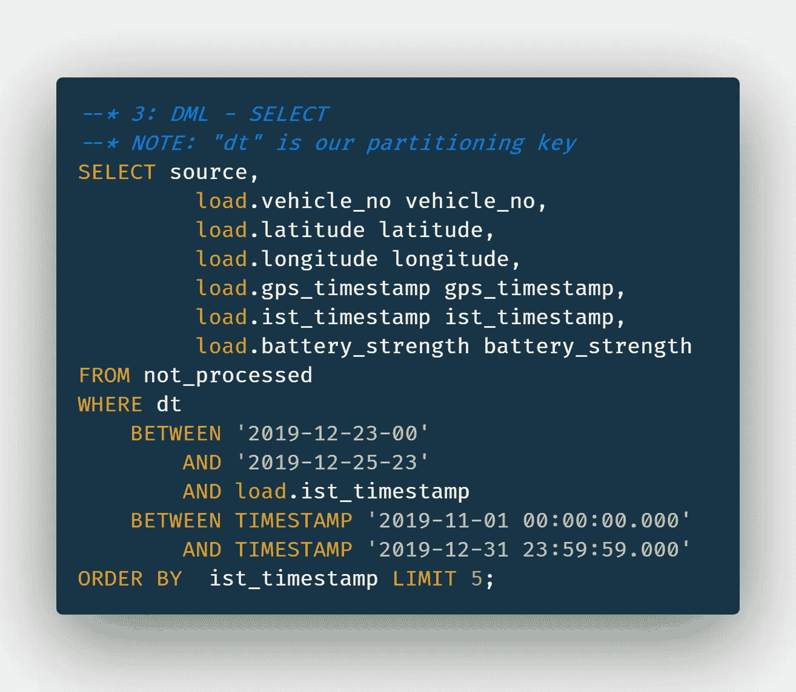

# 大数据/流:亚马逊 S3 数据湖|移动存储和分析流数据(接近实时)|无服务器方法

> 原文：<https://towardsdatascience.com/amazon-s3-data-lake-storing-analyzing-the-streaming-data-on-the-go-a-serverless-approach-48b68a9433ff?source=collection_archive---------27----------------------->

## 通过存储流数据创建亚马逊 S3 数据湖，并在旅途中以近乎实时的方式进行分析…


aws.amazon.com S3 数据湖无服务器架构

# 目录

1.  **什么是流数据及其主要挑战(3V)？**
2.  **什么是无服务器方法，我们为什么要使用无服务器方法？**
3.  **先决条件— AWS + AWS Kinesis 消防水带交付流+ AWS Kinesis 生产商/消费者+ AWS Lambda + AWS S3 存储+ AWS Athena —鸟瞰图**
4.  **AWS Kinesis 交付流设置—逐步进行**
5.  **奖励-专业技巧！**

# 1: **什么是流数据及其主要挑战(3V)？**

流式数据仅仅意味着连续的数据流。今天，在互联网时代，智能手机、手表、GPS 传感器等设备是流行的数据流来源。

> ***注*** *:所有这些设备通过互联网相互连接而创建的生态系统，就是我们所说的* ***物联网(IoT)。***

**流数据(3V)的 3 个主要挑战:**

***1:速度(吞吐量/分钟):*** 从千兆字节/分钟**(GB/分钟)**到千兆字节/分钟**(TB/分钟)**。以这种速度消费流数据而不丢失任何信息始终不是一件容易的任务，也不是微不足道的。

*****3:卷(DB 大小):*** 从 TB**(TBs)**到 Pb**(PBs)**到 EB**(EBs)**，存储流数据需要大量的空间，并且再次扫描这些原始数据以对其进行查询也成为一项具有挑战性的任务。**

> ****提示** *:这些 3V 是决定数据类别(小型、中型或大型数据)的关键参数，因此在决定我们存储数据所需的数据库存储解决方案类型时也起着关键作用。迷茫？见下图:***

****

**基于 3V 的小型、中型和大型数据之间的差异**

# **什么是无服务器方法，我们为什么要使用无服务器方法？**

**在阅读了“无服务器”这个词之后，让我首先澄清常见的误解&困惑——无服务器并不意味着在没有服务器的情况下执行计算。简单地说就是将管理服务器的责任委托给**云服务提供商(AWS/谷歌云平台(GCP)/微软 Azure)** ，这样我们就可以始终专注于业务逻辑！**

****那么，我们为什么要使用无服务器的方法呢？****

**我已经提到了流数据的 3 个主要挑战。它不仅需要大量的团队努力，而且需要不断的维护。自动缩放/弹性也不是微不足道的。最终更多的成本！**

**但是，在无服务器中，情况正好相反，我们需要最少的维护。云服务提供商将为我们自动扩展，最终减少维护和成本！**

> *****注:*** 在奖金-亲提示:我也将分享，如何配置交付流，使其成本尽可能最低。**

# **3:先决条件— AWS + AWS Kinesis 消防水带交付流+ AWS Kinesis 生产商/消费者+ AWS Lambda + AWS S3 存储+ AWS Athena —鸟瞰视图**

****

**AWS Kinesis 交付流—拉姆达— S3 —雅典娜(数据分析)|图片来源:SDS**

> ****AWS** :亚马逊网络服务(AWS)是我们正在使用的云提供商。人们可以使用谷歌云平台(GCP)或微软 Azure 来获得各自的服务。**

*   *****AWS Kinesis Firehose 交付流:*** Kinesis 只不过是一个托管(无服务器)的 Apache Kafka。AWS 通常有 2 个使用 Kinesis 的选项。Kinesis 数据流(用于实时)& Kinesis 消防水带交付流，这是一种近实时(~60 秒延迟)服务。这个博客，将使用 AWS 消防软管 Kinesis 交付流前进。**
*   ****AWS Kinesis Producer:**AWS kine sis Producer SDK(高性能首选)或 AWS Kinesis Agent 是向 AWS kine sis 传送数据的两种流行方式。**
*   *****AWS Kinesis Consumer:***如果你想在存储数据之外消费数据，你可以使用 AWS kine sis Consumer SDK/AWS kine sis 客户端库(KCL 使用 AWS DynamoDB，如果你是 JAVA 爱好者，甚至可以使用 AWS kine sis 连接器库。**

****

**Kinesis 使用与 Apache Kafka 相同的碎片进行数据分发|图片来源:SDS**

*   *****AWS Lambda:*** 我们将使用 AWS Lambda 将我们的数据流转换为动态记录。AWS 的一个虚拟功能，我们将使用它作为服务，也称为“功能即服务”。使用方便，性价比高。[https://aws.amazon.com/lambda/](https://aws.amazon.com/lambda/)**
*   *****AWS S3:*** 我们将为我们的数据湖使用 AWS S3 服务。这是最简单、最可靠、最经济的 AWS 服务之一。**
*   *****AWS Athena:*** 为了分析存储在 AWS S3 中的数据，它将使用通常用于 AWS S3 分析和特别查询的 AWS Athena。**

# **4: AWS Kinesis 消防软管输送流设置—逐步**

*****步骤 1:*** AWS Kinesis Producer:我在这里使用的是 AWS Kinesis 代理，因为在我的例子中，数据是直接消耗到文件上的。AWS Kinesis 代理将通过 AWS Kinesis 交付流直接将这些文件对象传输到 S3。**

**Kinesis 代理需要安装在您接收流数据或生成日志数据的地方。**

```
$ sudo yum install -y aws-kinesis-agent
...
1081 packages excluded due to repository priority protections
Package aws-kinesis-agent-1.1.3-1.amzn1.noarch 
installed and on latest version$ cd /etc/aws-kinesis
$ sudo vim agent.json
```

**从上面的命令转到 agent.json，放置您的 IAM 凭据，以及您接收流或生成日志数据的服务器的位置。您可以在下面找到 agent.json 文件:**

**您也可以使用 AWS Kinesis SDK 库完成同样的工作，使用 Python 完成同样工作的代码可以在此处找到:**

****

**AWS Kinesis — Lambda 记录转换**

> *****注*** :我已经用 JavaScript 为 Kinesis Producer 库例子使用了 npm `aws-kinesis-producer`**

*****第二步:*** 现在我们来设置 AWS S3。我们只需要创建一个 AWS S3 存储桶。虽然您可以使用 AWS S3 存储桶，但您也可以选择默认的 S3 服务器端加密(S3-SSE)来进行静态加密。**

*****第三步:*** 现在我们正在设置 AWS Kinesis 交付流。您可以在下面找到选项。分区是必须的，以便 Athena 能够更快地扫描数据。我正在按小时划分以下的数据。**

****

**AWS Kinesis 交付—选项**

**如果您想使用 AWS Lambda 进行动态记录转换，也可以这样做。您可以在下面找到手动转换代码:**

> ****注:**标准记录也可以转换成 JSON。你可以在这里找到:[*https://github.com/aws/aws-lambda-java-libs*](https://github.com/aws/aws-lambda-java-libs)**

*****第四步:*** 终于，AWS 雅典娜查询到了我们 S3 AWS 的数据湖，兴奋！下面附上在雅典娜 S3 数据上制作一个数据库的查询和选择一个读取数据的查询。**

****

**AWS Athena 用于从 AWS S3 创建数据库**

**如果您的数据已经在 S3 内部分区，您也可以使用 Athena 内部现有的 S3 分区，方法是在 Athena 控制台中键入以下 ALTER 命令。**

****

**AWS Athena—S3 分区上的 ALTER 命令**

****

**AWS Athena 选择查询**

*****最终结果:*****

****

**分区数据—通过 AWS Kinesis 消防水带传输流进行 S3**

```
$ aws s3 cp s3://<bucket-key-name>/<sub-bucket-key-name>/dt=2020–01–20–08/ . — recursive | xargs -rn 1 gzip -d *data-1–2020–01–20–08–10–00–04453c-3e98–47a3-b28d-521ae9ff9b3d.log
data-1–2020–01–20–08–10–15–04453c-3e98–47a3-b28d-521ae9ff9b3d.log
data-1–2020–01–20–08–10–30–04453c-3e98–47a3-b28d-521ae9ff9b3d.log
data-1–2020–01–20–08–10–45–04453c-3e98–47a3-b28d-521ae9ff9b3d.log
```

****

**AWS Athena 查询 S3 数据后的结果**

> *****注:*** 你可能在想，AWS Athena 是如何抓取&扫描 S3 数据的？它使用 AWS Glue 数据爬虫(类似于提取转换加载(ETL)作业)。它负责引擎盖下的所有繁重工作。[https://docs . AWS . Amazon . com/glue/latest/DG/populate-data-catalog . html](https://docs.aws.amazon.com/glue/latest/dg/populate-data-catalog.html)**

**就是这样。太简单了…**

> **提及:Athena 还允许使用 SQL 查询调用机器学习。RANDOM_CUT_FOREST(用于离群值)，HOTSPOTS(用于寻找密集区域)在这方面很流行。那也很简单…**

# **5:正如最初承诺的，奖金-专业提示！**

*   *****性能:*** *总是喜欢使用 AWS Kinesis SDK 库来获得高性能&吞吐量。它也支持批处理。***

*   *******代价:*** *使用 GZIP 压缩来缩小物体的大小。恢复时只需使用****" gzip-d<S3-file-keyname>"****命令即可再次获取 raw 格式的数据。GZIP 将帮助您压缩 75%的大小，因此您最终将节省高达 75%的 S3 成本。通常，AWS S3 的成本约为 0.03 美元/GB。*****

> ******注:GZIP**以大压缩比而闻名，但与 **ZIP** 格式相比，解压缩速度慢且 CPU 使用率高。 **GZIP** 通常首选！****

*   *******成本:*** *使用 AWS S3 生命周期规则—默认情况下，AWS S3 将每个对象存储在标准区域(表示频繁访问区域)。随着时间的推移，AWS S3 生命周期规则会将对象移动到 Standard-IA(不频繁访问),这也比标准 S3 区便宜 30%。*****
*   *******安全:*** *始终启用 S3-服务器端加密(SSE)以确保安全。对于更敏感的数据，您还可以使用 S3 客户端(SSE-C ),其中，您可以通过 HTTPS 传递您的加密密钥。*****

*****感谢阅读。我希望这篇博客对你有所帮助。请继续关注更多关于前沿大数据、机器学习&深度学习的此类博客。敬请期待！最好的还在后头:)*****

****差不多就是这样！****

*******连接*** 🤝 ***:*******

*   *******邮箱***:*bbhopalw @ Gmail*****
*   *******Linkedin***:[*www.linkedin.com/in/bbhoaplw*](http://www.linkedin.com/in/bbhoaplw)****

*******用于进一步阅读***✍️***:*******

*******大数据&云工程博客:*******

*   ******【https://medium.com/@burhanuddinbhopalwala】走向数据科学出版:**[](https://medium.com/@burhanuddinbhopalwala)****

********后端工程&软件工程博客:********

*   ********DEV 社区:*** [*https://dev.to/burhanuddinbhopalwala*](https://dev.to/burhanuddinbhopalwala)*****