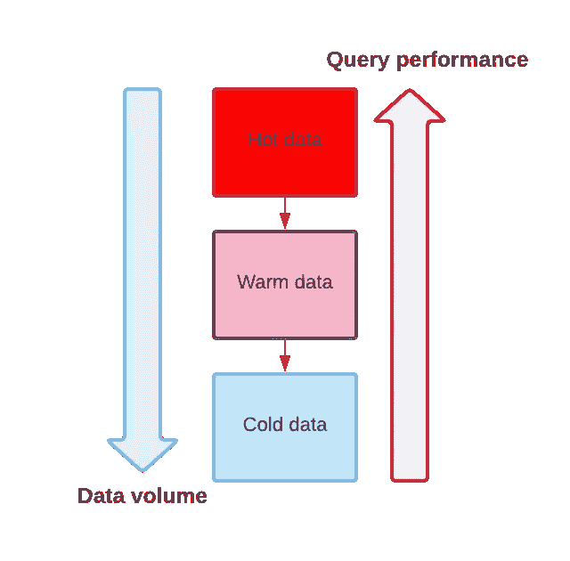
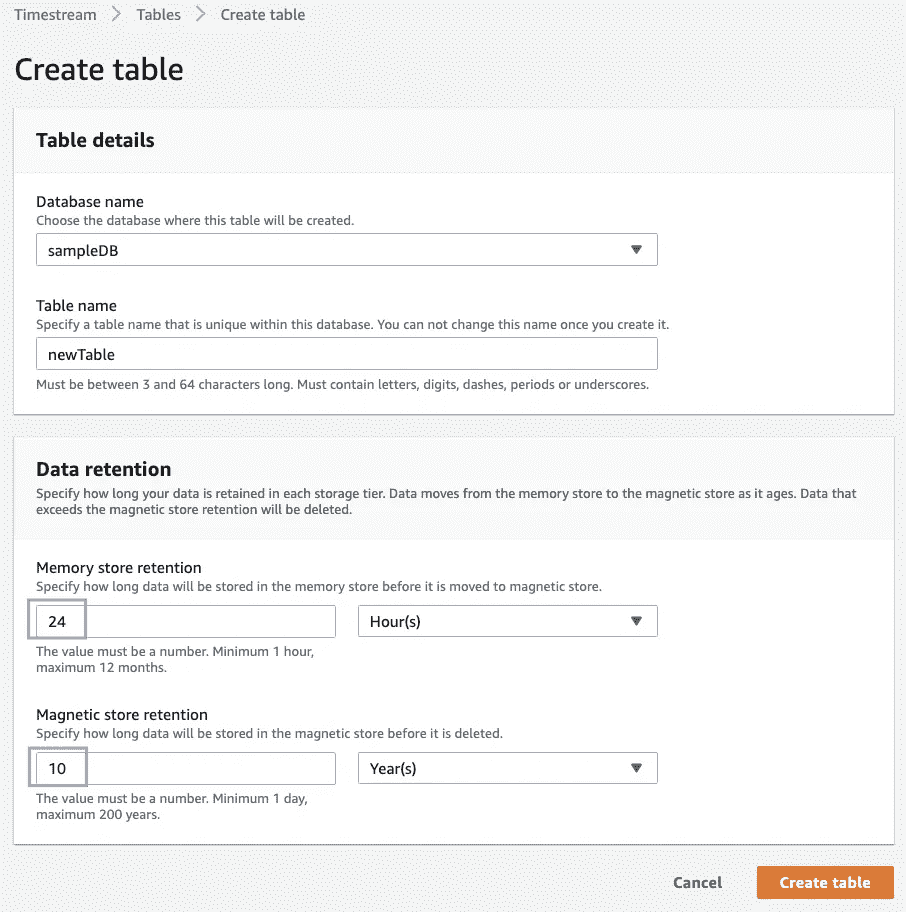
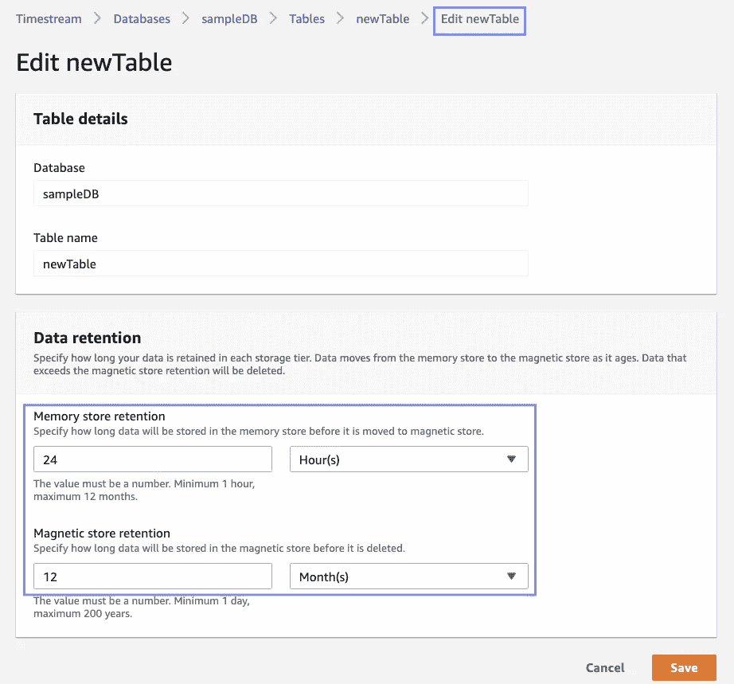
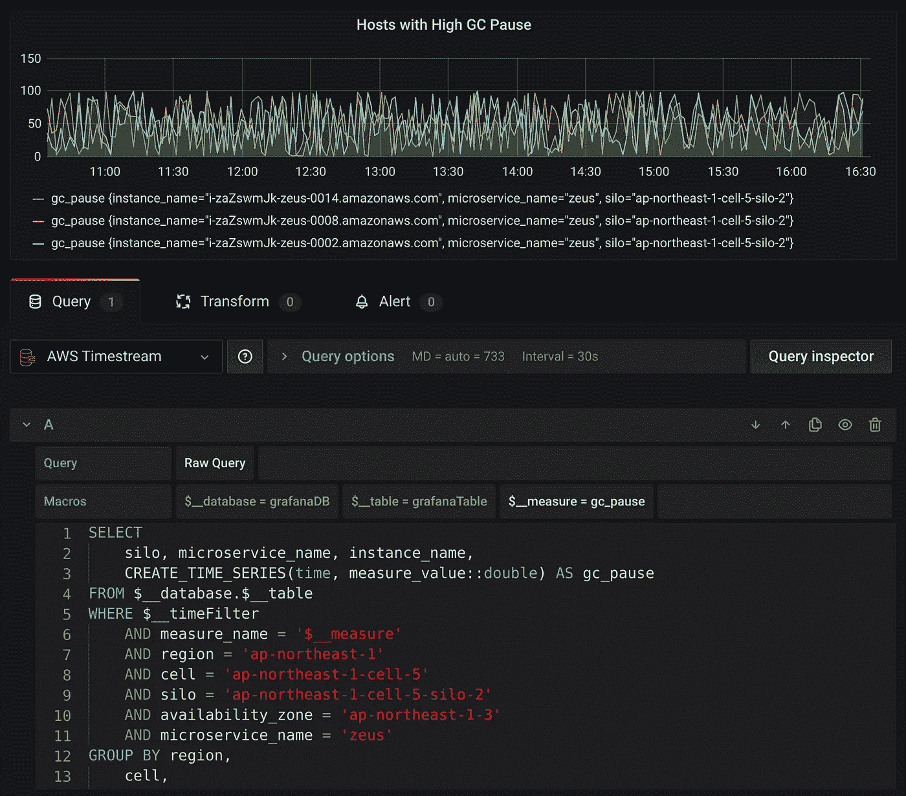
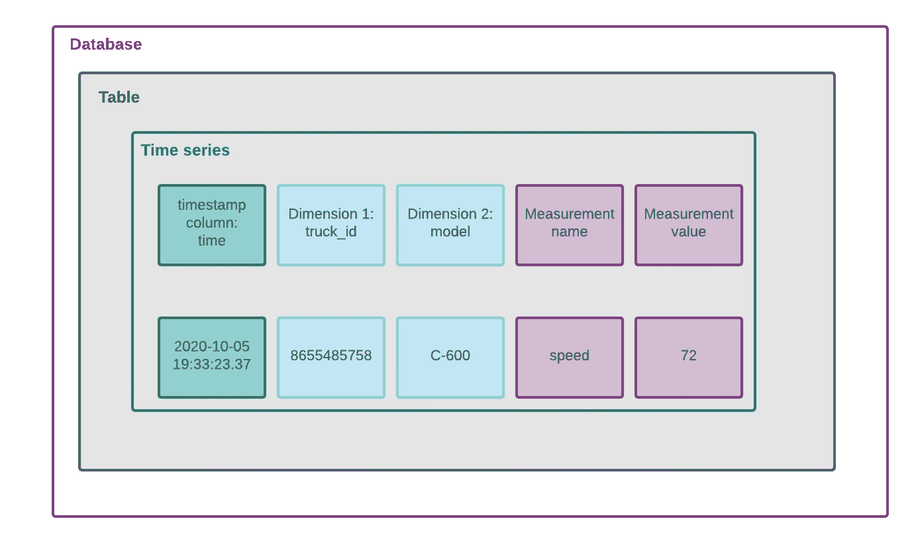
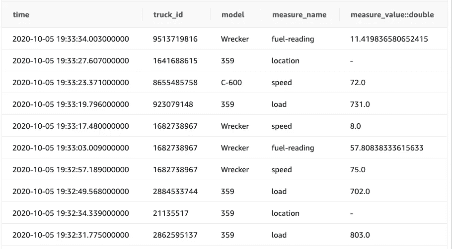
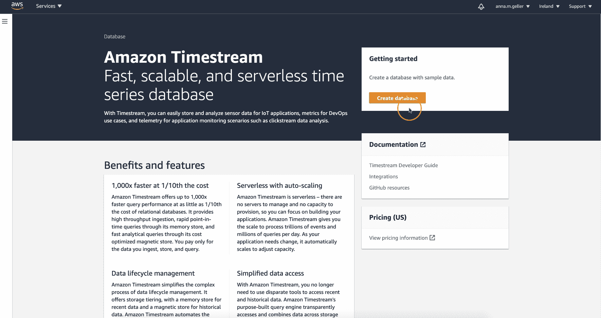
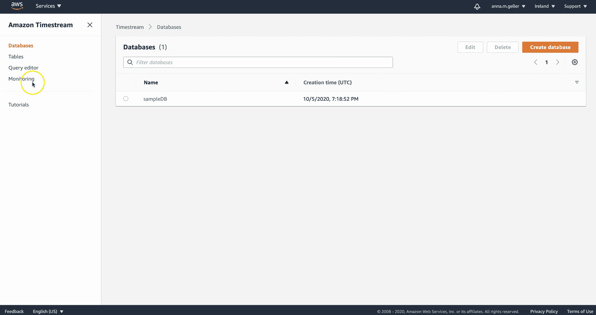

# 亚马逊时间流终于发布了——值得你花时间吗？

> 原文：<https://towardsdatascience.com/amazon-timestream-is-finally-released-is-it-worth-your-time-e6b7eff10867?source=collection_archive---------12----------------------->

## AWS 无服务器时间序列数据库经过两年的预览后终于可以使用了——这是对主要特性的第一次审查

来自 [Pexels](https://www.pexels.com/photo/graph-on-laptop-screen-3861957/?utm_content=attributionCopyText&utm_medium=referral&utm_source=pexels) 的 [ThisIsEngineering](https://www.pexels.com/@thisisengineering?utm_content=attributionCopyText&utm_medium=referral&utm_source=pexels) 摄影

ime 系列数据在数量和受欢迎程度上呈指数级增长。它本质上是分配给特定时间戳的数值集合，用于描述事物如何随时间变化。来自物联网设备、传感器、天气预报、点击流、金融股票市场数据，甚至你的心率测量值的数据——这些都是时间序列的例子。

需要跟踪随时间变化的用例非常普遍，以至于市场上的许多产品都是专门为高效存储这种类型的数据而设计的。在 2018 年的 re:Invent 期间，AWS 宣布了一项新的云服务 Amazon Timestream，与关系数据库相比，它应该可以提供 1000 倍的查询性能，并将成本降低 10 倍[1]。最好的一点是，它是无服务器的，随着存储的时间序列数据量的不断增长，它很容易扩展。

尽管该产品已经在 2018 年宣布，但直到上周才普遍上市。

在这篇文章中，我们将看看 Amazon Timestream 的特性、优点、局限性和定价，然后是一个简短的演示和结论。

# 特征

AWS 已经多次证明，他们希望通过抽象出 it 操作和开始使用他们的产品所需的东西，让他们的客户更容易使用他们的服务。时间流也不例外——没有运营计划，即使你想这么做。您可以为您的数据库配置的只是数据库名称，以及您希望数据在该数据库中保留多长时间。从技术上来说，你可以选择**短期内存存储层**和**长期磁性存储层**的保持期。这种区别是至关重要的，因为它突出了使用 Timestream 优于典型数据库的一个主要优点。我们来解释一下原因。

## 热数据与冷数据

假设您正在管理一批服务器，您需要提供一个实时仪表板，显示所有与内存和 CPU 利用率等相关的指标。为此，您需要不断地向时间序列数据库输入新的测量值。由于您只想查看最近几个小时内收集的指标的“最新”更新数据，因此您不需要将上个月的数据保存在内存中——这将是对昂贵资源的浪费。同时，您可能不希望丢弃上周的数据，因为您可能希望使用它来分析一段时间内的趋势，并检测只有在查看更大的时间窗口时才能检测到的异常。

热数据与冷数据-作者提供的图片

我们通常将那些最近更新的、频繁访问的记录称为热数据。相比之下，很久以前发生的所有事情，以及您只为少数特定分析和数据科学用例访问的所有事情，都被称为**冷数据** [2]。Amazon Timestream 允许您将两者存储在一个数据库中，这非常有用。在 Timestream 之前，为了提供低延迟的仪表板，您通常必须将热数据缓存在一些内存中的数据存储中，如 Redis，而冷数据必须存储在其他一些能够处理大量数据的数据库中，而无需倾家荡产。

## 指定热数据和冷数据的保留期

Amazon Timestream 自动管理内存和磁性存储器之间的数据移动。在我们的数据库中，我们可以有许多不同的表。然后，对于每个表，我们可以指定我们希望在每个存储层中存储该数据多长时间—在下图中，我们定义我们希望将热数据在内存中保留 24 小时，之后，将其移动到长期磁性存储。

创建新表时配置保留期—由作者创建图像

我们不需要事先猜测我们希望存储这些数据多少年，我们可以在以后轻松编辑此配置:

由作者编辑现有表格图像的保留期

对保留期的更改会立即生效。

# 更多好处

总的来说，主要优势在于它是一个无服务器的完全托管数据库，AWS 负责扩展、监控和维护底层存储和计算资源。除此之外，**的高速**和**的低成本**可能会在选择这项服务而非竞争产品时发挥重要作用。

AWS 强调安全性，因此存储在 Timestream 中的所有数据，无论是传输中的还是静态的，都是加密的。

该产品的另一个优势是**SQL 接口**，它允许用一种简单的众所周知的查询语言检索数据。除了 SQL 接口之外，还有一个 **SDK 集成**，以便您可以通过 **Python boto3** 等库与服务进行交互，还有一个 **JDBC 连接器**，它将让您像使用 Datagrip 等 SQL 客户端的传统关系数据库一样查询时间流。

在写入时，有一个突出的特性— Timestream 包含了“**第一个写入者获胜”语义，**当数据写入数据库时，它会自动检查重复项。这样，如果您第二次尝试写入相同的记录，Timestream 将保留第一条记录，并丢弃第二次写入。如果您想跟踪一段时间内的变化，这是非常有用的，如果没有发生变化，您就不会有数千个相同的行。

尽管到目前为止提到了所有的好处，但我最喜欢的功能是该服务是专门为轻松管理**常见时间序列操作**而设计的——有许多有用的功能:

*   按照您选择的时间范围(例如`bin(time_column, 7d)` →将数据分组到周箱中)，
*   通过使用一个可用的插值函数来填充缺失值。`interpolate_linear()`，
*   用于将任何时间戳转换为特定格式，或者轻松过滤最近时间窗口的数据，例如最近 3 个小时(`WHERE my_time_column <= ago(3h)`)。

最重要的是，AWS 提供了一个 **Grafana** 插件(针对 Grafana 版本≥ 7.1)和 AWS Quicksight 集成来构建漂亮的时间序列仪表盘。

grafana with time stream-Source:[https://grafana . com/grafana/plugins/grafana-time stream-data Source](https://grafana.com/grafana/plugins/grafana-timestream-datasource)

# 亚马逊时间流中时间序列的结构

总的来说，我们可以在每个数据库中创建许多表。每个表可以存储几条记录。记录的集合可以构建一个时间序列，只要它有一个时间戳列和至少一个维度、测量名称和测量值列。下图显示了表、时间序列、维度和度量之间的关系。

如何在亚马逊时间流中构建时间序列—作者图片

在表格形式中，它可能如下所示(在上图中，您可以看到第三行):

时间序列的表格形式—作者提供的图像

上表是通过以下查询从 AWS 提供的样本数据集中检索的:

# 定价

在撰写本文时，定价基于[3]:

*   存储在内存中的数据量(*短期存储*)，单位为 GB/小时
*   存储在磁性存储器或 SSD 存储器中的数据量(*长期存储*)，以每月 GB 为单位
*   扫描的每 GB 查询数
*   以 1KB 数据区块的百万次写入来衡量写入
*   跨区域数据传输(*如果适用*)。

# 演示:在 2 分钟内建立第一个数据库并查询样本数据

在下面的动画中，我演示了如何创建一个时间流数据库，并使用示例物联网表来试验该服务。通过使用 AWS 提供的示例查询，您可以看到如何使用`bin(time_column, time_interval)`语法执行动态聚合，该语法将数字数据下采样到指定的时间间隔—在下面的示例中，是一天(`1d`)。

亚马逊时间流的第一步——作者创建

以下是演示中的示例查询，展示了如何使用时序函数:

在左侧栏中，您还可以转到`Monitoring`来查看诸如查询请求延迟或成功查询结果数量之类的指标。

监控—由作者创建

# 限制

在将 Timestream 用于任何生产工作负载之前，您应该考虑三个要点。

1.  目前，该服务仅在 4 个地区受支持:美国东部-1、美国东部-2、美国西部-2 和欧盟西部-1。
2.  Timestream 支持 ANSI-2003 SQL，但不允许跨表连接。您可以在基于同一个表的 cte 之间使用连接，但是这些表是相互隔离的，因此，您不能在它们之间执行连接。在我看来，这需要更仔细的设计，以便将需要一起查询的数据保存在同一个表中。
3.  与关系数据库相比，Timestream 中的表是只追加的，这意味着不允许删除或更新。

最后两个限制强调对数据模型的全面规划。尽管您不需要用 DDL 指定表结构，因为 Timestream 在数据摄取期间会推断列，但是提前考虑一下还是值得的。

# 结论

在本文中，我们研究了最近发布的 Amazon Timestream 的主要特性，这是一个无服务器的时间序列数据库。我们调查了该服务的优势和局限性，讨论了定价，并展示了如何使用该数据库来有效地管理时间序列数据。

从题目来回答问题:是的，这个数据库似乎值得一试。从我的角度来看，最大的优势是**能够在单个系统中存储热和冷数据**，而不必在用于提供实时仪表板的内存数据库和用于分析工作负载的集中式数据库之间移动数据。最重要的是，由于**时间序列功能**，Timestream 可以加快开发速度，该功能允许按时间分组和即时聚合、缺失数据的插值，以及与 Grafana、SQL 客户端(*通过 JDBC* )和 Python boto3 SDK 的集成。

总的来说，我很高兴 AWS 最终发布了这项服务，因为我经常处理时间序列数据。我不知道为什么要花两年时间才能最终发布，但我知道 AWS，他们可能想进一步测试和改进服务，直到使用它感觉几乎“无聊”。

感谢您的阅读！我计划在使用我自己的数据处理该服务后，撰写一篇后续文章，深入探讨特定功能并进行更深入的回顾——请关注我，不要错过它。

**参考文献**

[1] AWS 博客:[https://AWS . Amazon . com/blogs/AWS/store-and-access-time-series-data-at-any-scale-with-Amazon-timestream-now-generally-available/](https://aws.amazon.com/blogs/aws/store-and-access-time-series-data-at-any-scale-with-amazon-timestream-now-generally-available/)

[2]热数据 vs 冷数据:[https://data-management-experts . com/data-management/what-the-data-temperature/](https://data-management-experts.com/data-management/what-is-the-data-temperature/)

[3]亚马逊 Timestream 定价:[https://aws.amazon.com/timestream/pricing/](https://aws.amazon.com/timestream/pricing/)

[4] AWS YouTube 频道:[https://www.youtube.com/watch?v=8RHFPNReylI&t = 1434s](https://www.youtube.com/watch?v=8RHFPNReylI&t=1434s)