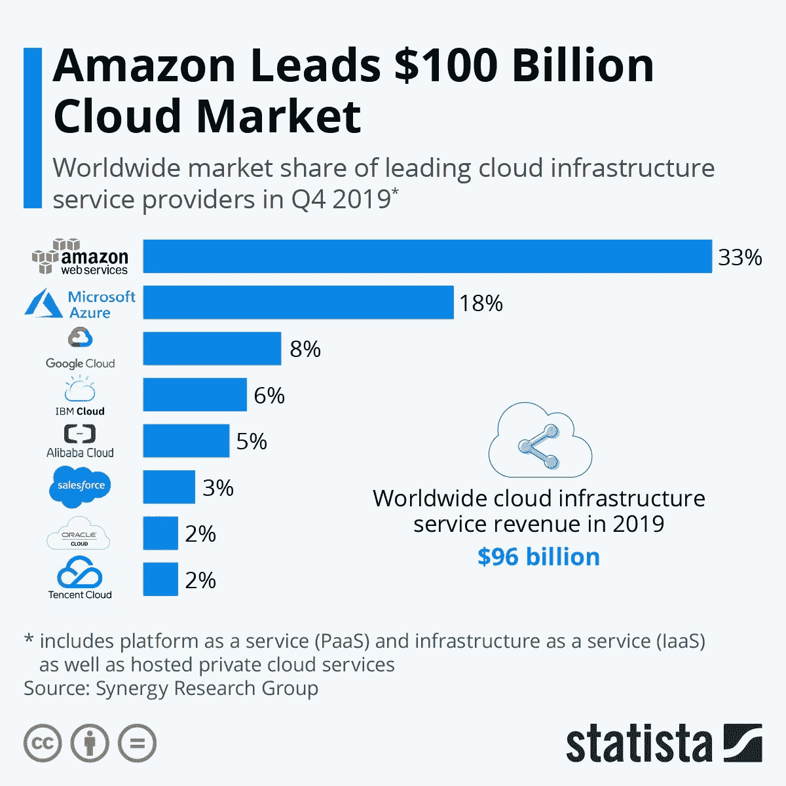

# 亚马逊能利用电子游戏实现统治世界吗？

> 原文：<https://towardsdatascience.com/amazon-video-games-fb85f147519a?source=collection_archive---------52----------------------->

## 字节/大小

## 这家市值万亿美元的企业集团即将推出被业界称为“史诗级游戏玩家之举”的游戏。


照片由来自[佩克斯](https://www.pexels.com/photo/keyboard-gaming-moody-gamer-3165335/?utm_content=attributionCopyText&utm_medium=referral&utm_source=pexels)的[露西·利兹](https://www.pexels.com/@lulizler?utm_content=attributionCopyText&utm_medium=referral&utm_source=pexels)拍摄

到 2020 年底，全球游戏产业的价值**将超过全球唱片产业和全球票房的两倍**。

[*合起来。*](https://www.nytimes.com/2020/04/02/technology/amazon-making-video-games.html)

随着视频游戏行业 2020 年的预期收入达到 1600 亿美元，亚马逊凭借原创内容进入该行业也就不足为奇了。

**亚马逊为什么要做游戏？**

# 亚马逊在这方面有着得天独厚的优势。

## **我已经进入了云端(基于游戏)**

**云游戏**是当你在玩一款运行在[新加坡](https://www.datacenterdynamics.com/en/news/wikileaks-publishes-list-aws-data-center-locations-colo-providers/https://www.datacenterdynamics.com/en/news/wikileaks-publishes-list-aws-data-center-locations-colo-providers/)(可能)某个地方的服务器上的游戏，而不是你的本地电脑或游戏机，但却以高速传输到你的屏幕上。

这项技术让你可以在任何有(出色的)互联网连接的设备上玩游戏——不需要昂贵的硬件。你可能听说过谷歌丰富多彩的产品 Stadia。

你需要大量的服务器基础设施来高速加载、渲染和传输高分辨率游戏——听起来像是亚马逊的工作。

AWS(亚马逊网络服务)在全球云基础设施服务市场占有 **33%的市场份额**；建立一个云游戏服务应该就像把你的丈夫浸在沙丁鱼油里，然后喂你的宠物老虎，让他消失一样——一点问题都没有。



资料来源:[统计数据](https://www.statista.com/chart/18819/worldwide-market-share-of-leading-cloud-infrastructure-service-providers/) CC BY-ND 3.0

## 云游戏与游戏订阅齐头并进。

游戏的未来将是基于订阅的。人们不再为一款新游戏的推出付费，而是每月付费访问一个持续更新的库——想想 T2 网飞的视频游戏。

Xbox Games Pass 和 PlayStation 现在已经允许你在云(外部服务器)上托管你的图书馆。我预计亚马逊也会效仿。

公司将把游戏订阅与云游戏捆绑在一起:想象一下，你可以通过云随时随地在任何设备上访问你的整个图书馆和高性能硬件。

## 原创内容=差异化和垂直整合

人们会倾向于购买一个订阅服务，而不是另一个，这是基于每个订阅服务提供的原创内容(虎王，有人吗？)


资料来源:[马蒂亚斯·阿佩尔](https://www.flickr.com/photos/91501748@N07/26492985594) CC0 1.0

更重要的是，原创内容意味着你可以**垂直整合**，或者控制供应链的每一部分——这意味着生产、分销等。

*   **制作:**亚马逊游戏工作室，收购双螺旋工作室，世界级的人才——这家科技公司已经准备好开始生产原创内容。
*   **分销:** [**83%的视频游戏**](https://www.statista.com/statistics/190225/digital-and-physical-game-sales-in-the-us-since-2009/) 已经实现数字化销售，因此这家全球最大的在线零售商将利用其规模，通过订阅服务+云游戏平台击败 Steam 等巨头。*我们可能会看到 Fire TV 在访问这些服务中发挥作用。*
*   **媒体:**亚马逊拥有视频游戏流媒体平台 Twitch，人们集体花费[超过**3550 亿分钟**](https://techcrunch.com/2018/02/06/twitch-now-has-27k-partners-and-150k-affiliates-making-money-from-their-videos/) 观看。超过 675，000 年，也就是我还清学生贷款的时间长度。

垂直整合降低了成本，提高了效率，增加了利润——在未来 12-24 个月内，随着如此多的人呆在家里玩游戏，这将变得很方便。


照片由[JESHOOTS.COM](https://unsplash.com/@jeshoots?utm_source=medium&utm_medium=referral)在 [Unsplash](https://unsplash.com?utm_source=medium&utm_medium=referral) 上拍摄

## 视频游戏将帮助亚马逊接管世界的主要原因是:

我一直预测这项游戏订阅服务可能会与亚马逊 Prime 捆绑在一起，亚马逊 Prime 是世界上第二有价值的**经常性收入捆绑包**(rundle)([第一是微软 Office](https://www.profgalloway.com/stream-on) )。

**经常性收入**来自订阅服务，这是目前世界上最流行的商业模式。

**捆绑包:**如果你把一堆产品/服务打包成“打折”的捆绑包，它可以让你卖出更多，扔掉价值较低的商品，增加每次购买的感知价值。

将一堆订阅捆绑在一起，你就获得了 ***rundle*** 的性感称号。微软 Office 365 和 Adobe Creative Cloud 就是很好的例子。苹果，一家掌握垂直整合的公司，可能会推出自己的 rundle，包括苹果新闻，电视+，街机和音乐。


[Julian O'hayon](https://unsplash.com/@anckor?utm_source=medium&utm_medium=referral) 在 [Unsplash](https://unsplash.com?utm_source=medium&utm_medium=referral) 拍摄的照片

Prime 提供音乐、视频、电子阅读、照片存储和免费送货:添加一个云游戏库，你就拥有了市场上最性感的 rundles 之一。

## 飞轮效应

转轮很有价值，因为它们可以充当飞轮。根据斯科特·加洛威 (NYU 大学市场学教授)的说法，飞轮描述了“…公司在其他业务部门中利用内容/忠诚度赚钱的能力。”

Rundles 为业务的其他部分创造收入——顾客在 Prime Video 上爱上约翰·卡拉辛斯基在杰克·瑞恩的胡子，并在平台上停留足够长的时间，开始在 Amazon.com 上购买更多东西。

> ***Rundles 建立忠诚，忠诚有利可图。***

随着原创内容、云游戏和游戏订阅可能很快就会进入高峰期，预计亚马逊将统治更多的市场，并向统治世界迈进一步。


```
*A* ***byte-sized deep dive*** *into the world of* ***tech*** *and* ***business*** *for the casual enthusiast.*
```

大家好，我是 Murto，是一名 17 岁的企业家，也是加拿大多伦多的学生。如果你对这篇文章有任何反馈，或者你只是想聊天，请通过 LinkedIn 联系我！后续步骤:

*   征服你的敌人
*   施咒
*   祝你愉快

谢谢！