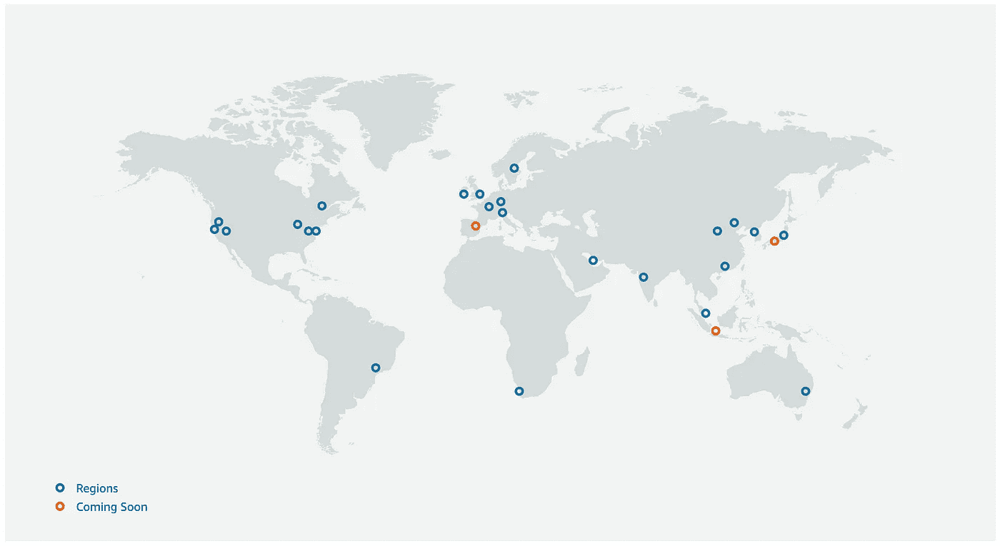
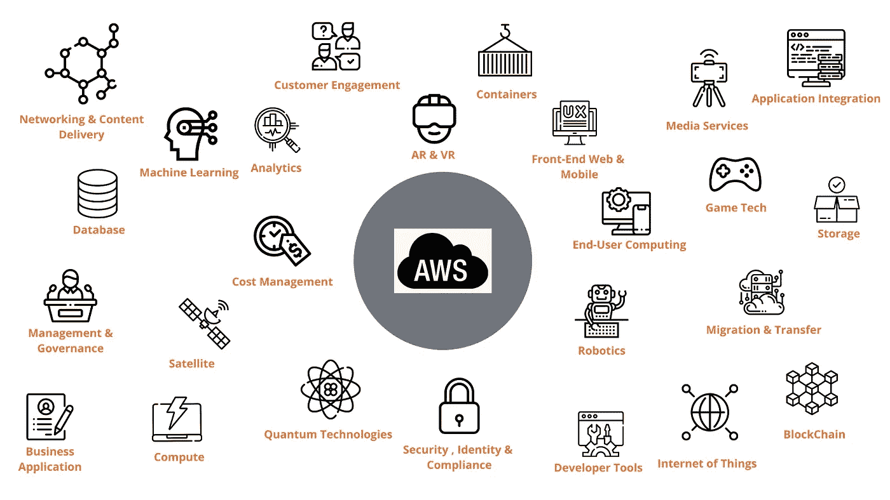

# 亚马逊网络服务(AWS)在 5 分钟内完成

> 原文：<https://towardsdatascience.com/amazon-web-services-aws-in-5-minutes-ceb6fbd30ce8?source=collection_archive---------33----------------------->

照片来自 [Unsplash](https://unsplash.com/photos/MF9Wy1NA55I)

# 介绍

随着全球对云计算及其在商业领域的潜在利益的兴趣日益增加，**亚马逊网络服务** (AWS)似乎是人们心目中的流行术语。这可能是因为 AWS 是世界上最快和最大的公共云提供商，在 190 多个国家拥有商业客户和超过 100 万的活跃用户。它连续九年在云基础架构即服务(IaaS) 的 [**Gartner 魔力象限中成为**领导者**，最近还成为云平台即服务(PaaS)的领导者。**](https://aws.amazon.com/blogs/aws/aws-named-as-a-cloud-leader-for-the-10th-consecutive-year-in-gartners-infrastructure-platform-services-magic-quadrant/#:~:text=This%20year,%20Gartner%20announced%20a,Leader%20for%20nine%20consecutive%20years.)

**在深入探讨 AWS 之前，我们先了解一下什么是云计算。**

[**云计算**](https://en.wikipedia.org/wiki/Cloud_computing) 是存储、计算能力、数据库等 IT 资源的按需可用性/交付。通过互联网，通常使用一种现收现付的定价系统。云计算有三种主要的服务模式。它们是**基础设施即服务(IAAS)** 、**平台即服务(PAAS)** 和**软件即服务(SAAS)。**

*   **IAAS**——这些服务提供对网络功能、计算能力和存储的访问。它通常是云计算的基本构建模块，例如 AWS EC2、S3、数字海洋。
*   **PAAS** —这些服务提供运行应用程序的硬件和软件工具。除了基础设施服务之外，操作系统、运行时等都是外部管理的。例如 Heroku，AWS 弹力豆茎。
*   **SAAS** —这些服务提供对由服务提供商运行和管理的完整产品的访问，例如 Gmail、dropbox、slack 等。

下图让我们更容易理解上面的每个模型

图片来自 [SAP HANA Central](http://www.hanaexam.com/p/cloud-computing-saas-paas-and-iaas.html)

*注意:上述传统 IT 类别也称为内部部署。*

云计算可以是**私有**、**社区**、**公共、**或者**混合**。但我们将专注于公共云，它允许公众付费使用其资源。它也是云服务的主要类型，如 AWS、GCP、AZURE 等。

# 自动气象站简史

*   虽然 AWS 最初是在 2002 年推出的，[它在 2006 年正式重新推出](https://en.wikipedia.org/wiki/Amazon_Web_Services)，最早提供服务的是 SQS(简单队列服务)、S3(简单存储服务)和 EC2(弹性计算云)。通过这 3 项服务，我们可以得出结论，AWS 最初是作为一个 IAAS 提供商出现的(并且主导了这个领域)。随着时间的推移，它进入了 PAAS 空间，并逐渐进入了 SAAS 空间，如亚马逊 WorkDocs。
*   截至 2006 年，已经有超过 150，000 名开发者使用 AWS。
*   2012 年，首届 **Re: invent** 大会在拉斯维加斯举行。
*   [2013 年](https://aws.amazon.com/about-aws/whats-new/2013/04/30/announcing-amazon-web-services-global-certification-program/)，AWS 宣布了其 AWS 全球认证计划，并首次推出“AWS 认证解决方案架构师—助理级”认证。目前，AWS 拥有 [12 项特定认证](https://aws.amazon.com/certification/)，分为基础(1 项认证)、助理(3 项认证)、专业(2 项认证)和专业(6 项认证)。
*   2015 年，亚马逊报告称 AWS 实现了盈利，第一季度销售额为 15.7 亿美元，被描述为一项快速增长的 50 亿美元业务。
*   2017 年，AWS 发布了一系列人工智能服务和虚拟现实服务。
*   [2020 年](https://aws.amazon.com/blogs/aws/aws-named-as-a-cloud-leader-for-the-10th-consecutive-year-in-gartners-infrastructure-platform-services-magic-quadrant/#:~:text=This%20year%2C%20Gartner%20announced%20a,Leader%20for%20nine%20consecutive%20years.)，AWS 成为云基础设施和平台服务魔力象限的领导者。

# AWS 全球基础设施

[AWS 全球基础设施](https://aws.amazon.com/about-aws/global-infrastructure/)可以分为 3 个主要部分:区域、可用性区域和边缘位置。

*   **地区**是世界上 AWS 存在的地方。在每个地区，AWS 都拥有服务客户所需的所有资源。这些区域遍布全球，以减少网络延迟，即确保按需资源尽可能靠近客户及其用户。这种传播的第二个原因是数据的潜在地理或政治限制，即根据地理法规，数据不能离开物理区域/地区。目前，共有 24 个地区(不久将增加三个地区)。

截图来自 [AWS 网站](https://aws.amazon.com/about-aws/global-infrastructure/)

*   在每个区域中，至少有两个可用区。**可用性区域**就是一个数据中心。每个区域在地理上分散在一个区域内。这有助于确保在一个区域受到洪水影响或出现连接问题时，系统或服务仍然可用。目前，有 77 个可用区域(不久将增加 9 个)。
*   **边缘位置**有助于在云中缓存资源，如视频文件或静态图像。例如，当网站用户不在 AWS 区域附近时，这些位置最有用。在网站上缓存一些静态数据可以帮助网站加载更快。目前，大约有 205 个 AWS 边缘位置。

**AWS 服务**

AWS 会不时发布新的产品服务。目前，有超过 [175 种产品服务](https://aws.amazon.com/)可以分为 25 类服务，从人工智能到计算到存储等等。所有 25 个类别的服务都包含在下图中。

来自[平面图标](https://www.flaticon.com/home)的图标和来自 [KindPNG](https://www.kindpng.com/imgv/wxJwbT_black-aws-icon-aws-icon-png-transparent-png/) 的 Aws 标志

**结论**

我们看到了为什么 AWS 在产品服务、存在和收入方面被认为是最大的云提供商。我们还确定了可获得的认证，以及 AWS 在哪个服务模式领域占主导地位。随着世界对云服务的关注，现在可能是 AWS 技术化的好时机。

***外部引用***

*   *cloud guru 的 AWS 课程简介*
*   维基百科(一个基于 wiki 技术的多语言的百科全书协作计划ˌ也是一部用不同语言写成的网络百科全书ˌ 其目标及宗旨是为全人类提供自由的百科全书)ˌ开放性的百科全书
*   AWS 网站