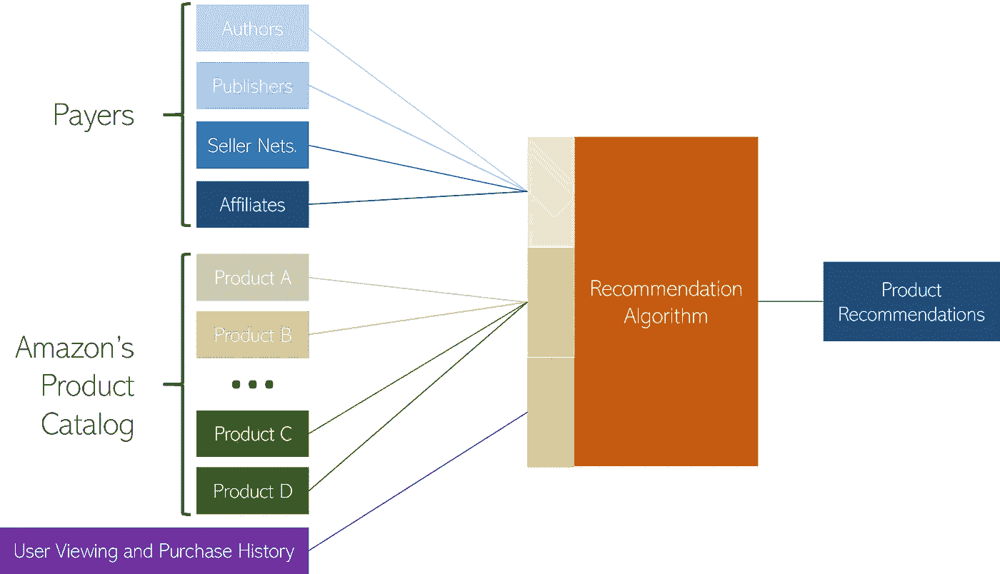
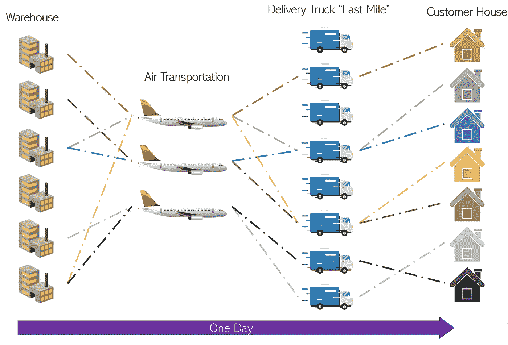

# 亚马逊复杂的隐藏数据科学系统网络

> 原文：<https://towardsdatascience.com/amazons-complex-network-of-hidden-data-science-systems-bede690eed9c?source=collection_archive---------22----------------------->

来源: [Pixabay](https://pixabay.com/photos/server-space-the-server-room-dark-2160321/)

## 数据科学:亚马逊背后隐藏的驱动力

当大多数人听到“亚马逊”这个熟悉的名字时，他们会想到用户登录 Amazon.com 时迎接他们的熟悉的购物平台。然而，在我们许多人都熟悉的表面用户界面下，亚马逊创造了一个复杂的数据科学系统网络，以推动它成为今天的科技巨头。这些系统以各种方式协同工作——有些是你可能已经预料到的，有些是你可能从未想到的——以最大化你作为客户可以给亚马逊带来的价值。

该公司于 1994 年成立，最初是一家书店，现已成为一家“百货店”，确立了其全球市场的地位。平台上的用户体验相对清晰易懂，但在幕后，亚马逊运营着一个精心制作的物流噩梦。让我们了解数据科学如何在亚马逊的商业模式中发挥不可或缺的作用。

甚至在亚马逊让你购买产品之前，它就已经与作者、出版商、卖家网络和分支机构签订了协议，在他们的平台上进行优先排序。当亚马逊在采购过程的几乎每个部分都实施了强大的推荐算法时，该公司报告称，在其第二个财年，销售额增长了 29%，达到 128.3 亿美元。推荐算法是数据科学更明显的应用之一，它不仅出现在网站上，还出现在电子邮件中，亚马逊的测试已经证明，这比现场推荐有效得多。将该算法与支付大量优先级的第三方结合起来，亚马逊已经建立了两个非常稳固的收入助推器。

亚马逊的产品价格是基于一个预测模型精心优化的，该模型确定了最佳价格，这样用户就会增加他们的价值，不会因为价格而拒绝购买。这几乎不是一个简单的“寻找临界点”问题，在这个问题中，价格比客户拒绝的价格高一美分，因为通常较高的价格与通常较低的购买数量相关。一个决定产品价格的模型不仅要考虑顾客购买它的可能性，还要考虑它的价格和许多其他产品的价格会如何影响顾客未来的购买模式。

在确定产品价格时，平衡客户购买可能性及其未来对客户的影响。

在你决定每一个产品之前，你可以快速浏览一下产品的五星评级，但是要从用户评论中获取更多的信息。一般来说，任何产品的评论部分都受到偏见的困扰——人们通常只写非常好或非常负面的评论，而大多数人只是满足于快速的 5 星评级。由于极度两极分化的评论和 5 星等级与评论部分之间的差异，顾客可能会干脆决定根本不购买该产品。

向客户提供准确的信息始终符合亚马逊的最大利益。如果亚马逊试图操纵评论，使所有产品排名靠前，短期增长可能会繁荣，但公司的品牌形象和客户信任将被破坏。另一方面，亚马逊希望让用户更多地了解那些实际上很棒，但由于有偏见的评论而形象受损的产品。事实上，虚假评论是一个有利可图的行业，在这个行业中，虚假账户企业可以被雇佣来从数百个账户中撰写热情洋溢或悲观冷淡的评论，以提升你的产品形象并击败竞争对手。亚马逊已经部分解决了这个问题，通过显示验证过的购买者，并部署模型来确定帐户的可信度和评论的有用性，这决定了它的显示顺序。

当你购买你的产品时，你很可能是亚马逊的 Prime 会员。事实证明，这种基于订阅的产品对亚马逊很有价值，成为其主要收入来源之一。为了宣传有吸引力和高价值的服务，亚马逊使用数据分析来确定和锁定特定广告的客户群。亚马逊能够如此迅速崛起的一个关键原因是因为它迎合了数字时代的[顾客](https://medium.com/swlh/how-best-buy-revived-itself-by-falling-in-love-with-the-customer-313abb001bb0) [中心主义](https://medium.com/swlh/youre-not-just-buying-coffee-at-starbucks-you-re-buying-loyalty-5d06a2affe14)热潮——亚马逊没有使用传统的一刀切、“喷雾祈祷”的营销方法，而是根据他们认为对你的影响程度来定制他们的信息。

或许是亚马逊的模式决定了你爱看书(或许是用它收购的 Goodreads 的信息)，并指出有了 Prime，你就可以在 Kindle 上阅读无限量的免费书籍。(亚马逊还会跟踪和存储用户在 Kindle 上制作的文本亮点，以进行图书推荐。)如果你还不是 Prime 会员，但经常付费让你的产品在一天或几个小时内发货，亚马逊的模式可能会提到，有了 Prime，许多运输速度都是免费的。该公司不断使用 [A/B 测试](https://medium.com/ai-in-plain-english/you-are-a-subject-in-hundreds-of-experiments-a-day-9fe65a2982ff)来调整他们的广告方法，以获得新客户。

在您购物期间，亚马逊运行信用卡交易的欺诈检测算法，该算法可能会考虑到不规则的购买行为。这些预测模型可以检测系统入侵和黑客攻击企图，防止信用卡数据或员工 ID 等数据被盗。

在你购买了一件产品后，亚马逊必须找到一种方式来运输该产品，通过产品的四个阶段:仓库、货机、“最后一英里”送货卡车运输和你的房子。

假设的产品路线图。

利用亚马逊的 90 个仓库、50 架货机和数十万辆送货卡车，数据科学算法必须规划最佳的物流运作:

*   假设一架货运飞机满载 75%,其中所有物品都是一天交货，这意味着飞机必须在一小时内准时起飞。剩余货物晚点，八小时后到达。飞机到底走不走？数据科学算法必须给出一个数字，说明如果一天的保证被打破，客户将损失多少价值，并将其与旅行成本进行比较，以做出决定。
*   亚马逊的预期运输模型使用你的购买数据来预测你可能会购买哪些产品，你可能会在什么时候购买，以及你可能需要它们的地方。结合住在你附近的人的偏好，亚马逊将你肯定会购买的产品送到你附近的配送中心，这样当你需要时就可以准备好了。
*   考虑到天气、交通拥挤或不可预见的事件，以及最小化配送成本和优化汽油购买成本和位置，您如何规划整个城市的最佳送货卡车路线？在亚马逊庞大的规模上，它不能牺牲数百毫秒的时间来咨询谷歌地图 API 相反，它必须根据交通预测创建自己的路线优化系统。这是数据科学(图论)中最困难的任务之一。
*   许多亚马逊的客户接受了更长的 4-5 天的交付窗口(要么因为他们不是 Prime，要么因为他们得到了某种形式的等待补偿)。亚马逊部署了库存预测模型，以确定每种产品在任何时间任何仓库中应该保留多少份，这样当 4-5 天的交付窗口接近结束时，产品仍然可用，同时最大限度地减少运输成本和产品腐烂。
*   在仓库内，亚马逊正在用机器人取代工人(在产品检索方面)，机器人可以不间断地工作，符合该公司的 24/7 商业模式，可以更快地工作，而且不需要支付工资。在每个仓库履行中心，亚马逊的仓库机器人会绘制最快的路线来到达分配给它的物品，并意识到其他机器人的路线。为了创造一个智能机器人大军，使其不会天真地遵循最小欧几里德距离路径，而是考虑到其他人的意图，仓库机器人使用强化学习程序进行训练。该机器学习领域寻求不断训练模型，使用外部环境反馈使其更好、更具适应性，即使在服务中也是如此。这些仓库机器人显著提高了亚马逊的产品效率。

自始至终，熟悉而简单的产品采购平台亚马逊挤满了数据科学应用程序——更不用说该公司的许多其他收入流，包括 AWS(亚马逊网络服务)，这是一种面向各地企业的数据存储和机器学习行业标准；亚马逊 Go，西雅图的一家新的无收银员、无结账的商店，使用面部识别、计算机视觉和机器学习方法；以及亚马逊的诸多收购，包括杂货巨头全食超市(Whole Foods)、鞋类销售商 Zappos(以客户服务闻名)、热门游戏流媒体平台 Twitch，以及智能门铃和安全摄像头制造商 Ring。在数字时代，数据科学的智能利用，从字面上看，转化为数十亿美元。

> “每个公司的未来都有大数据，每个公司最终都会从事数据业务。”托马斯·达文波特

*如果你喜欢这篇文章，你可能也会喜欢关于数据科学如何解决 Instacart 的复杂挑战的分析:*

 [## Instacart 如何利用数据科学解决复杂的商业问题

### 买杂货从来没有这么复杂

medium.com](https://medium.com/dataseries/how-instacart-uses-data-science-to-tackle-complex-business-problems-774a826b6ed5)