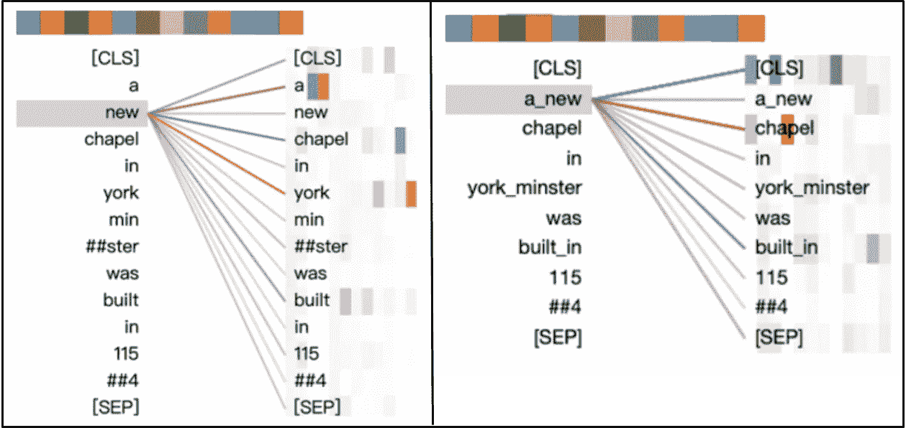

# AMBERT:多粒度的 BERT

> 原文：<https://towardsdatascience.com/ambert-a-multi-grained-bert-6564ed24bcc3?source=collection_archive---------50----------------------->

## 字节跳动的一个 BERTology 贡献(是的，抖音人！)

就在我们以为伯特的所有名字变体都被取了([罗伯塔](https://ai.facebook.com/blog/roberta-an-optimized-method-for-pretraining-self-supervised-nlp-systems/)、[艾伯特](https://arxiv.org/abs/1909.11942)、[福楼拜](https://arxiv.org/abs/1912.05372)、[科尔伯特](https://arxiv.org/abs/2004.12832)、[卡门伯特](https://camembert-model.fr/)等。)，随之而来的是 [AMBERT](https://arxiv.org/abs/2008.11869) ，另一个接管自然语言理解的变形金刚布偶的增量迭代。《安伯特》于 8 月 27 日由《抖音》和《头条》的开发商[字节跳动](https://en.wikipedia.org/wiki/ByteDance)出版。

> AMBERT 建议对 BERT 做一个简单的修改:对输入进行两次标记，一次用细粒度标记器，一次用粗粒度标记器。

这篇文章主要是对 AMBERT 论文的总结，意在提炼主要观点，但不涉及实质细节，但我偶尔会加入个人观察。我会在我自己的评论/想法前面加上🤔表情符号。

AMBERT 碰巧也是一种法国奶酪，以法国公社命名。请原谅我蹩脚的双关语。爱丽丝·多诺万·劳斯在 [Unsplash](https://unsplash.com?utm_source=medium&utm_medium=referral) 上拍摄的照片。

# 核心思想:双向标记化

AMBERT 建议对 BERT 做一个简单的改动:对输入进行两次标记化，一次用**细粒度标记器**(英文为子词或词级，中文为字符级)，一次用**粗粒度标记器**(英文为短语级，中文为词级)。希望能利用两个世界的优势。前者意味着更小的词汇量，更少的词汇外标记，每个标记更多的训练数据，从而*更好的泛化*。后者意在*对抗基于注意力的模型通过细粒度标记化学习的强烈偏见*。例如，标记“new”将强烈关注“york”，即使它们在一个句子中的共存与纽约无关(例如，“York Minster 的一个新教堂建于 1154 年”)。

“约克牧师的一座新教堂建于 1154 年”这句话中的自我关注。左图:细粒度标记化。右图:粗粒度标记化。随着细粒度的标记化，“新”错误地照顾到“约克”。通过粗粒度的标记化，“a_new”正确地照顾到了“chapel”。改编自[论文](https://arxiv.org/pdf/2008.11869.pdf)中的图 1 和图 2。

上面的例子表明，当细粒度的“a”和“new”令牌被连接成单个粗粒度的“a_new”令牌时，模型正确地将其注意力指向“chapel”。

正如这篇论文的作者所指出的，粗粒度的标记化不可能总是完美的——**更长的标记意味着在如何将字符分组为标记方面更加模糊**。🤔例如，考虑一个输入，比如“我梦想着一个有着无尽夏天的纽约”。上面的记号赋予器可能会错误地产生两个记号“a_new”和“york”。希望在这种特殊的情况下，模型会更加信任细粒度的“a”/“new”/“York”标记化。

# 两个输入共用一个 BERT 编码器

向前遍历模型包括以下两个步骤:

1.  **文本记号→记号嵌入(通过*单独的*权重):**每个记号列表(一个细粒度的，一个粗粒度的)在它自己的嵌入矩阵中查找，并转换成实值向量列表。
2.  **令牌嵌入→上下文嵌入(通过*共享*权重):**两个实值向量被馈入*同一个* BERT 编码器(一堆变换器层)——这可以通过单个编码器副本顺序完成，也可以通过两个带有绑定参数的编码器副本并行完成。这产生了两个每个标记的上下文嵌入列表。

因为 AMBERT 使用两个嵌入矩阵(每个标记化一个)，所以它的**参数计数明显高于 BERT 的**(194m 对 110M 的英语基本模型)。然而，等待时间保持相对不变，因为 AMBERT 只是增加了一组新的字典查找。

# 安伯特变奏曲

AMBERT 的普通版本做出了两个强有力的设计决策:

1.  **两个输入共享编码器**，如前一节所述。
2.  **两个输入相互独立**。细粒度令牌不关心粗粒度令牌，反之亦然。他们最终的语境嵌入是相互独立的。

作者提出了两个替代版本来挑战这些决定:

1.  AMBERT-Combo 有两个独立的编码器，一个用于一种标记化；这使得英国模型的尺寸从 194 米增加到 280 米。
2.  **AMBERT-Hybrid** 回复到传统的 BERT 模型，并单独将其输入修改为两个标记化的连接。

在深入探讨 AMBERT 的训练程序和表现之前，让我们先来看看这两个问题。当考虑分类和机器阅读理解基准的聚合指标时， **vanilla AMBERT 优于两种变体**。AMBERT-Combo 偶尔在个别任务上得分更高。消融研究支持以下假设:

1.  AMBERT-Combo 在大多数情况下表现不如普通 AMBERT，因为两个独立的编码器阻碍了标记化之间的信息共享，并允许它们各自的输出上下文嵌入发散。
2.  AMBERT-Hybrid 允许一个微调的令牌处理一些接近的粗粒度的对应部分(或者是完全相同的令牌，或者是它的一些扩展)，这削弱了重要的内部令牌化注意。

# 培训程序

对于**预训练**，作者使用标准屏蔽语言模型(MLM)目标，在两次标记化中屏蔽相同的文本跨度(例如，如果粗粒度标记“a_new”被屏蔽，那么微调的“a”和“new”标记也是如此)。最终损失将两次标记化的标准交叉熵损失相加。

当**为分类**进行微调时，上游分类器基于以下上下文嵌入做出三个预测:a)细粒度的，b)粗粒度的，以及 c)两者的串联。这些预测中的每一个对最终损失的贡献都是相同的，还有一个正则化项，它鼓励细粒度和粗粒度表示在矢量空间中接近。似乎，为了推论，作者使用了 c)中的预测，尽管措辞并不完全清楚。

# **NLU 基准测试结果**

> 平均而言，AMBERT 有时表现优于其他 BERT 衍生模型，在中国基准上的利润率高于英国基准。

*   当与其他源自 BERT 的模型进行比较时，这些模型的准确性来自于它们各自的原始论文，AMBERT **在线索分类(中文)上增加了 0.9%** ，而**在胶水(英文)上损失了 0.4%** 。正如 AMBERT 的作者所指出的，*这种比较应该仔细解释，因为基线是在稍微不同的制度下训练的。*
*   当与作者在与 AMBERT 相同的条件下重新训练的标准 BERT 模型(具有规则的词块标记化)相比时，后者**在线索分类(中文)上获得 2.77%** ，在 GLUE(英文)上获得 1.1% 。🤔*这种比较应考虑到 BERT 基线的参数少得多(英语为 110M 比 194M)。*

# 🤔关于粗粒度标记化的一个注记

我得从我对中文标记化知之甚少的免责声明说起；我的知识范围仅限于论文作者提供的内容。根据他们的描述，中文的粗粒度标记化听起来像是将字符自然分组为单词:

> 中文文本中的字符自然被视为细粒度的标记。我们对文本进行分词，并将单词视为粗粒度的表征。我们使用了字节跳动开发的分词工具来完成这项任务。

相反，我将关注英语中的粗粒度标记化:

> 我们以下面的方式对英语文本执行粗粒度的标记化。具体来说，我们首先使用 KenLM (Heafield，2011)和维基百科计算文本中的 n 元语法。接下来，我们构建一个短语级词典，它由出现频率足够高且其最后一个单词高度依赖于其先前单词的短语组成。然后，我们使用贪婪算法对文本进行短语级标记化。

这种描述有些矫揉造作，尤其是对于一篇标题中带有“符号化”一词的论文。虽然确切的过程应该更加清晰，但高级算法似乎是:1)从维基百科建立一个短语字典，2)基于频率和启发式规则对其进行删减，以识别改变开始标记会严重影响结束标记的含义的短语。

问题是——**更长的令牌不可避免地变得更加特定于领域**，尤其是当基于频率选择时。如果微调数据集(比如法律文档)的性质与维基百科不同，大多数粗粒度的标记都可能不在词汇表中，在这种情况下，模型将只依赖于细粒度的标记(即恢复到标准的 BERT)。事实上，即使没有领域转换，这个问题也是显而易见的:AMBERT 论文中的一项消融研究粗略标记了 10k 个英语句子(可能来自维基百科)，并观察到其中 86%与细粒度标记重叠。

另一个问题是粗粒度的标记化是否能够支持**多语言模型——联合词汇表的大小可能过于昂贵**。

一般来说，对自然语言理解的研究一直在向相反的方向发展，从粗粒度到细粒度:BERT 用*子词*单元取代了标准的*词*标记。确实有研究[2]表明在 MLM 中屏蔽更长的跨度是有帮助的，但是这样的论文陈述的是*输出*粒度，而不是输入粒度。

# 结论

AMBERT 用两种粒度的记号化扩充了 BERT，在中文基准测试中显示了有希望的结果。在英语数据集上，增益较低，粗粒度的标记化更加模糊。尽管如此，多层次标记化的想法仍然很有吸引力。人们可以考虑更精细的英语粒度级别，或者由不同算法产生的相同粒度的记号化。

# 参考

1.  张&李，AMBERT: [多粒度标记化的预训练语言模型](https://arxiv.org/pdf/2008.11869.pdf)(2020 年 8 月)
2.  Joshi 等人: [SpanBERT:通过表示和预测跨度来改善预训练](https://arxiv.org/abs/1907.10529) (2019)