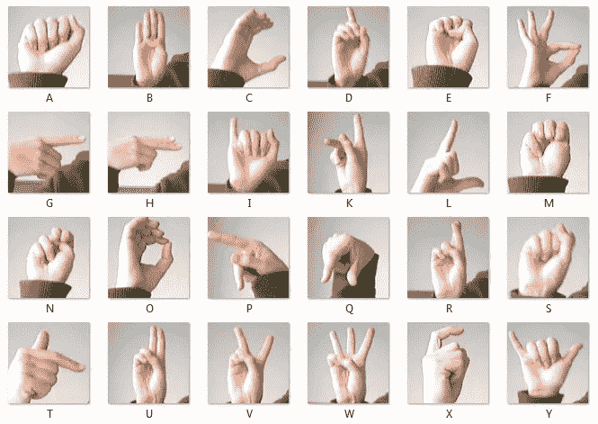
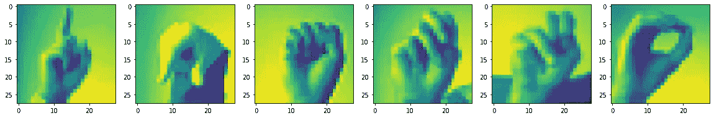
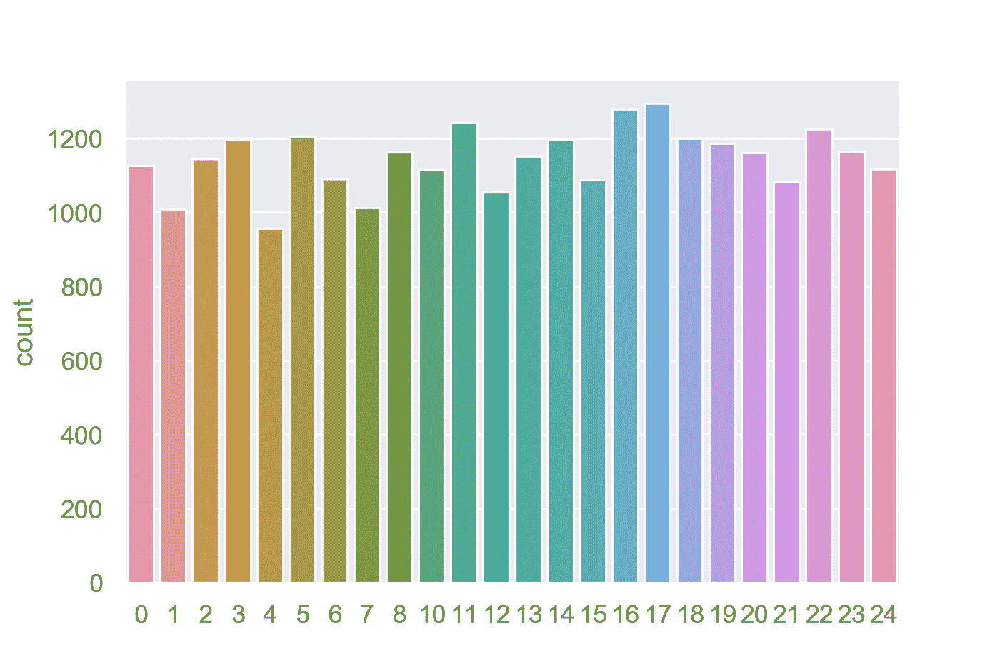
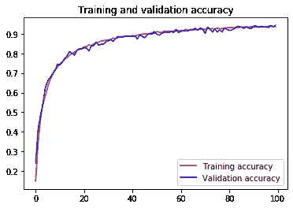
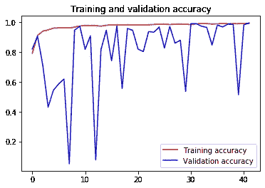
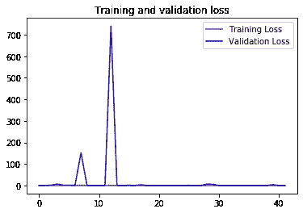
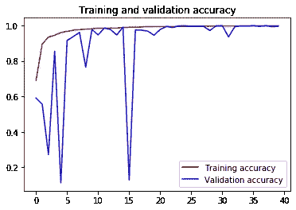
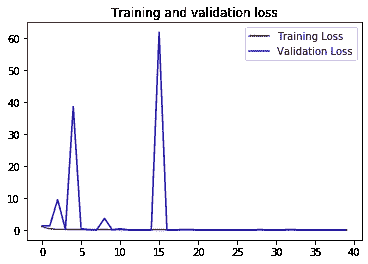

# 美国手语识别

> 原文：<https://towardsdatascience.com/american-sign-language-recognition-using-cnn-36910b86d651?source=collection_archive---------21----------------------->

## 一篇关于使用 CNN 识别美国手语并在数据集上比较 CNN 的各种架构的性能的详细文章。

国家耳聋和其他交流障碍研究所(NIDCD)指出，有 200 年历史的美国手语是一种完整、复杂的语言(字母手势只是其中的一部分)，但却是许多失聪的北美人的主要语言。因此，建立一个可以识别手语的系统将有助于聋人和重听人利用现代技术更好地交流。在这篇文章中，我们将通过 CNN 的不同架构，看看它如何对手语进行分类。

美国手语手势([https://www . ka ggle . com/data munge/Sign-Language-mnist # Amer _ Sign 2 . png](https://www.kaggle.com/datamunge/sign-language-mnist#amer_sign2.png))

# 关于数据集:

数据集可以从 [*Kaggle 的网站*](https://www.kaggle.com/datamunge/sign-language-mnist) *访问。*训练数据集包含 27455 幅图像和 785 列，而测试数据集包含 7172 幅图像和 785 列。数据集的第一列包含图像的标签，而其余的 784 列表示展平的 28，28 图像。

数据中的随机样本。

让我们看看数据集的分布:

来自训练数据集的不同字母的计数。请注意，字母 J (9)和 Z(25)不在数据集中。可以看出，数据的分布是均匀的。

# 开发神经网络模型:

模型的输入层将获取大小为(28，28，1)的图像，其中 28，28 分别是图像的高度和宽度，而 1 表示图像的灰度颜色通道。

模型的输出层将具有用于 26 个不同字母的 26 个神经元，并且激活函数将是 softmax，因为它是多类分类问题。

美国手语识别的基本 CNN 结构。

# 编译和训练模型:

编译和训练模型

模型的训练精度为 100%，而模型的测试精度为 91%。这显然是一个过度拟合的情况。下一步，我们将使用数据扩充来解决过拟合问题。

# 数据扩充:

测试数据集中可能存在一些在训练数据集中不可用的图像特征/方向。因此，我们的模型无法识别这些模式。这可以通过增加数据来解决。数据扩充是训练神经网络的重要步骤。例如，在训练数据集中，我们有右手的手势，但在现实世界中，我们可以从右手和左手都获得图像。数据扩充允许我们通过旋转、翻转、缩放、裁剪、标准化等方式创建不可预见的数据。

Tensorflow 提供了 ImageDataGenerator 函数，该函数在流上增加内存中的数据，而无需修改本地数据。这也给了我们尝试不同增强参数的空间。我们将扩充数据，并将其分为 80%的训练和 20%的验证。

扩亚分裂。

扩充数据后，100 个周期后的训练准确率为 93.5%，测试准确率在 97.8 %左右。

这当然解决了过度拟合的问题，但是花费了更多的时间。有没有一种方法可以在更少的时期内训练我们的模型？是的，批量标准化是我们问题的答案。

# 批量标准化:

批量标准化允许标准化隐藏层的输入。从上面的模型中，我们可以看到，通过数据扩充，我们可以解决过度拟合训练数据的问题，但需要更多的时间进行训练。批量规格化通过规格化隐藏层的权重解决了这个问题。你可以在这里阅读更多关于它如何影响一个模型的性能[。](https://medium.com/analytics-vidhya/getting-it-to-top-6-in-kaggles-mnist-digit-recognizer-from-scratch-3-8b11b79958a2)

批量标准化的准确性

包含批量归一化后的训练准确率为 99.27，测试准确率为 99.81。这仅需要 40 个历元，几乎一半的时间没有批量归一化。

批量标准化模型的损失图

如果我们仔细观察图表，在 15 个历元之后，损失没有显著减少。因此，我们可以在 15/20 周期后使用早期停止来停止训练。这几乎是不进行批量标准化时的 1/5。

**问题:**验证精度波动很大，根据停止训练的型号，测试精度可能会更高或更低。这是由于较大的学习率导致模型超过最优值。这可以使用在每个时期后下降某个值的衰减学习率来解决。

## 衰减学习率

我们可以在 Tensorflow 中实现衰减学习率，如下所示:

衰减学习率

使用学习率衰减的模型的准确性

准确性以及训练和验证准确性的损失在 20 个时期结束时已经收敛。这让我们对我们的结果更有信心，因为与之前的图相比，这些图更平滑。使用相同配置的训练准确率为 99.88，测试准确率也为 99.88。

使用学习率衰减的模型丢失

使用学习率衰减和不使用学习率衰减的模型之间的准确性没有太大差别，但是与不使用学习率衰减的模型相比，使用学习率衰减的模型有更高的机会达到最优。因此对结果更有信心。

# CNN 的不同架构及其准确性:

可以找到关于本文的 Kaggle 内核:[https://www . ka ggle . com/rushikesh 0203/mnist-sign-language-recognition-CNN-99-94-accuracy](https://www.kaggle.com/rushikesh0203/mnist-sign-language-recognition-cnn-99-94-accuracy)

你可以在 GitHub repo 中找到完整的项目以及不同型号的 Jupiter 笔记本:[https://GitHub . com/Heisenberg 0203/AmericanSignLanguage-Recognizer](https://github.com/Heisenberg0203/AmericanSignLanguage-Recognizer)

> 如果你喜欢这篇文章，请随时与他人分享。