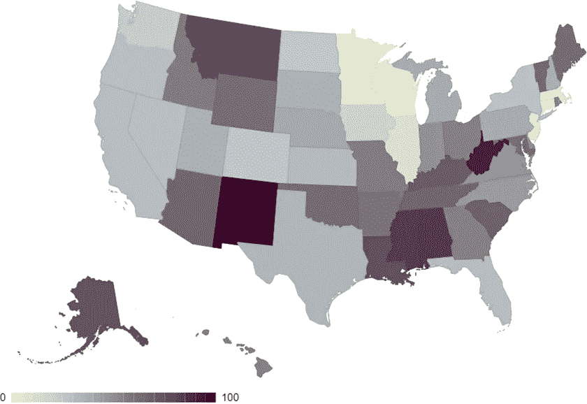
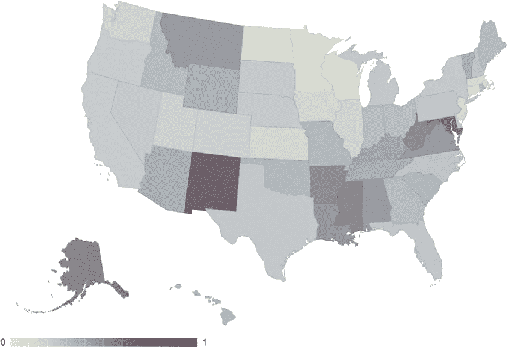
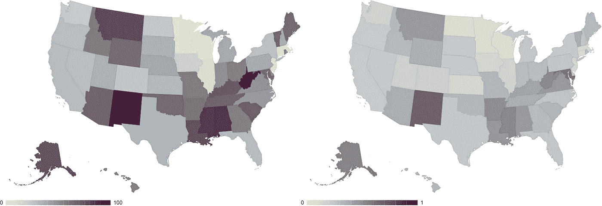
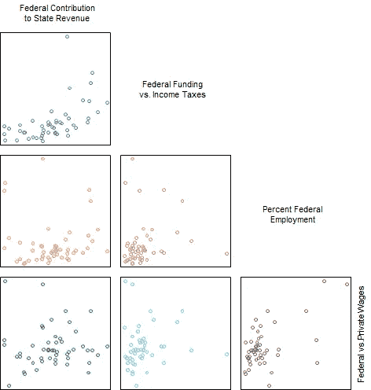
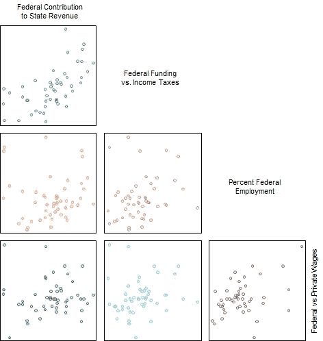
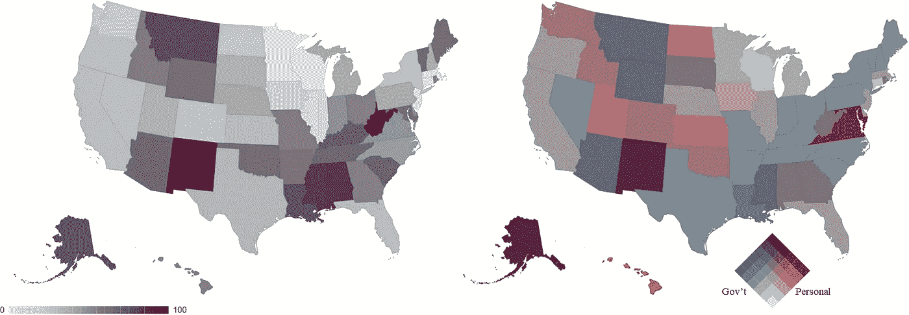

# 美国各州、联邦政府和属地

> 原文：<https://towardsdatascience.com/american-states-the-federal-government-and-dependency-1d799f9425e?source=collection_archive---------77----------------------->

## 如何添加更多的信息到地图，并停止使用等级，请。

这不是一篇关于最新尖端数据科学的文章。大多数人看到的与数字直接相关的东西很少不是前沿数据科学。事实上，它通常根本不是任何类型的数据科学或有价值的数据分析。这就是我所说的“数据吸入”。数据混杂是指你随意地将数据混杂在一起，就像几种颜色的玩具一样，并称之为“雕塑”。这个特殊的例子中有几个“可以做得更好”的元素。这种不分析是许多悲剧的根源。在我们的特殊案例中，它是基于一份清单，该清单旨在显示美国哪些州更依赖于联邦政府。

其中的数据是基于四个变量的列表:1)州政府收入的联邦份额；2)联邦对州的资助与从州征收的联邦所得税的比率；3)联邦政府雇用的州劳动力的百分比；以及 4)该州联邦雇员的工资中位数与私营部门雇员的工资中位数的比率。我将不再挑选变量的具体选择和定义，并假设它们是可以接受的。无论如何，本·盖尔先生，“一位经验丰富的金融作家，目前在 SmartAsset 担任退休和投资专家”选择了它们，所以他可能有一些理由支持定义。事实上，盖尔先生“已经出现在《财富》、《Mic.com》和 CNNMoney 上”。

# 他们做了什么

那么，对这些数字做了什么来提供一个结果。首先，每个变量都被分成等级(多么可爱)。然后，对每个州的排名进行平均(哦，平均排名，哦我的)。然后，*然后*，无畏的作者认为重新调整平均排名(50 个州)到 0 到 100 是合适的。当我把脸撞到墙上的时候，我得到了两只福里斯特·惠特克的眼睛。我们至少得到一个图表或图形来总结这个结果了吗？嗯，我们*有没有*拍到一张上面有数字的桌子的照片！对，一张*表*的一张*图*。我确信盖尔先生非常了解金融。但是他真的不应该放弃他的日常工作去做数据分析和演示。

他的流程有什么问题？毕竟，排名可以使数字变得平滑，因此更容易跟踪。平均可能是合并数字的有效方法。重新调整有它的用处。再说了，谁需要一张图片呢？表格不呈现“真实数据”吗？让我这样回答这些问题:我可以有一只可爱的小狗，一些好的表土，和一瓶绿色的 Meanie 清洁剂。每一种都有其用途，但这并不意味着你可以把它们都扔进搅拌机，然后得到更好的东西。

# 能做些什么？

从最后一点开始，表格是附录。除非你有很少(大概 5 个)点，否则表格是无法被人脑整体处理的。我们天生喜欢*图片*，一张桌子的图片不算。既然我们讨论的是州，那么用颜色编码或“choropleth”地图来展示最终的索引将是一种很好的方式，就像这样:



联邦属地的单一索引簇

我是怎么做的？我使用了谷歌地理地图 API。这个图表的具体代码在文章的最后。由于 Medium 对现代数据可视化的支持非常出色，因此我在自己的 scratch HTML 页面上截取了一张图表的图片，并将其作为图片加载，如上所示。颜色越深，国家的依赖性越强，在令人困惑的 0-100 范围内。

# 痛苦地滥用数字

为什么我说“莫名其妙”？这就引出了数据发布的下一个问题。在现实世界中，零通常意味着零，或者至少是正值和负值的中间值。给任何一个州打零分*应该意味着这个州完全不依赖联邦政府。没有一个州完全不依赖联邦政府。尽管如此，规模从零开始。就好像说零度，华氏有什么实际意义。*

不仅如此，规模在 100 结束。为什么是 100？我们通常将 0-100 的范围与“百分比”联系起来，0 表示没有，100 表示有总数。那么，我们有一个排名 100 的州(新墨西哥州)。这是否意味着它 100%依赖于联邦政府？不，这只是意味着这是最高的平均排名。我要去把我的头伸进泡菜汁的大桶里，直到我感觉好些。

我回来了。我闻起来像莳萝和醋，但我加强解决下一个问题。预先定标的指数是通过平均排名而创建的。求平均值。行列。取等级，然后平均。事情不是这样的，就是不是这样的。等级不是数量。军衔有*目*和有*无数量*。你不能把 5 级加到 4 级，得到 9 级。那是因为“5 级”的意思是“第 5”，而不是“5 级东西”。此外，由等级表示的变量的基本“大小”在每个等级步骤中可能不相同。等级 5 和等级 4 之间的距离可能是 3 个单位，但是等级 4 和等级 3 之间的距离可能是 14 个单位！不会加法就不会平均。

# 局部修复

然而，我确实暗示了正确的解决方案:如果你有几个变量，你想创建一个总排名，你相加或平均(算术平均只是一个除以常数的总和，所以它是加法的一个变种)的*底层变量*被排序*，然后*对结果进行排名！我们该如何处理这些数据呢？一分钟后。

最后，第一个问题，在对数据做任何其他事情之前，数据被立即归入等级。这是一个很好的方式来表达“我根本不理解这些数据。”等级很容易表示，但是它们丢弃了数据中几乎所有的信息，只留下顺序。这是提供一种*幻觉*分析的好方法。

我不会让你无所适从，如果(我说*如果*)你想在一个单一的索引中呈现这些关于各州的数据，有什么不那么糟糕的方法呢？首先，您需要为每个州创建一个单独的数字。一个简单的方法是对四个数据点进行平均。哦，等等，它们都有不同的音阶！这将意味着一个更大规模的数据点将主导所有其他数据点。我们可以通过将所有数据重新调整到相同的范围来解决这个问题。然后我们可以对重新调整后的数据进行平均。

然后，我将数据映射到相同的配色方案，但没有应用等级或重新缩放。我没有对平均值进行排名，因为它产生了一个微不足道的 1-50 范围。相反，由于 choropleth 可以根据数据进行调整，所以我将平均值应用于从 0(最小理论可能值)到 1(最大理论可能值)的色标。将它们放在一起比较，你会发现一些显著的差异。



它在两个方面更准确:它没有过分强调几个州表面上的“纯度”，这实际上只是平均排名的一个假象。它显示了一个“更模糊”的结果，可能会更准确地描绘一些潜在的现实。这是因为我没有诉诸排名。等级引入了虚假的清晰。这是一个不说谎的好方法。他们让你假装差异是均匀分布和明显的。现实几乎从来都不是均匀分布和赤裸裸的。结案了？



左边是旧地图，右边是新地图

不，不是案子结了，案子是跟我*从来不*结的。记住，我们从四个变量开始，将它们合并成一个指数。我们的指数比原来的好了一点，但仍然是不合理的。不理智？假设它有很多假设，其中之一是数据中没有结构。

# 寻找结构

数据中的结构是什么？每当你有多个变量时，就有可能它们并不都测量同一个“东西”。这些“东西”是什么？有时，有些事件或情况不会立即显现出来。然而，它们可以部分显现。如果你收集数据，你也许能够描述底层“事物”的点点滴滴，然后利用这些点点滴滴获得底层“事物”的概念。这些“事物”也被称为“潜在变量”。

有很多方法可以尝试发现潜在变量。一种常用的方法叫做探索性因素分析。这是基于在一对一的基础上观察不同的变量如何相互关联。让我举例说明:



正如你所看到的，一个简单的图表(谢谢，基数为 R)显示了四个变量之间的关系，显示了可能存在一些关系，但是很混乱。幸运的是，还有一件事我可以帮忙澄清。众所周知，当你有“散乱”的数据时，对数可以产生更多的清晰度。当我画对数时，我得到了这个:



远非完美，但更容易看出联邦对州收入的贡献和联邦资金与所得税的对数之间的线性关系。因此，将使用数据日志进行进一步的分析。但是这有什么用呢？我们如何找到那个“结构”？就像我说的，一种方法是使用探索性因素分析。这总是从所有数据的相关矩阵开始，就像这样:

```
Fed to    Funding vs    Percent Fed    Fed vs 
State     Taxes         Employment     Private Wage
1.000     0.616         0.038          0.055
0.616     1.000         0.214          0.117
0.038     0.214         1.000          0.491
0.055     0.117         0.491          1.000
```

抱歉，桌子看起来像垃圾，但是灵媒不相信现代的东西，比如合适的桌子。有一些好的相关性，一些中等的相关性，和一些非常弱的相关性。基本上，前两个变量相互关联很好，后两个相互关联很好。这是一个非常简单和容易看到的结构(幸运的是)。我们可以绕过花里胡哨的方式来挑选我们想要提取多少因子。我告诉你一个秘密。花里胡哨的裤子方式(像平行分析)也说了两个因素。所以，如果我拿出 R psych 包，用两个因素做因素分析，我会得到一堆东西。

我得到的东西之一就是所谓的“因子分”。我可以为你复制它们，但它们毫无意义。这是因为因子得分是输入变量在不同程度上的线性组合，不再直接代表输入。相反，它们应该反映我很久以前谈到的那些“潜在”的东西。这种方法也使得单位难以理解。它们以零为中心，单位大致是标准差，有点像，组合，看书。

无论如何，我们也得到了“负荷”，它们可以帮助我们解释因素的含义。在我们的分析中，我们得到了一个因子，联邦对州收入的贡献为 1.00，联邦资金对所得税的贡献为 0.61。另一个因素是联邦就业率为 1.00，联邦相对于私人工资为 0.49。超过 0.40 的负载通常被认为是非常好的，所以我们可以将我们的因素命名为“政府依赖性”和“个人依赖性”。我们可以在 choropleth 上展示这些，但这非常棘手。我们有两个必须用颜色同时显示的变量。看配色，可以做到。我们得到的看起来像这样:


两个因素州对联邦政府的依赖

我们有什么？一个州越红，对该州联邦政府的个人依赖性(就业、更好的工资)就越大。一个州越蓝，该州政府就越依赖联邦政府的资助。较浅或较深的灰色代表较低或较高的综合依赖性。当我们根据原始的一维、基于排名的索引，将其与原始地图进行比较时，会发生什么呢？



如果你眯着眼睛看，你可以看到两张地图之间的一些对应关系，但也有一些有趣的差异。例如，弗吉尼亚和马里兰对联邦政府有很高的个人依赖性。这是有道理的，因为 DC 的华盛顿州正好位于两者之间。另一方面，看起来那些只有低度到中度“指数”依赖的州有明显的个人依赖因素。一大群个人和政府的依赖者从德克萨斯州开始，在缅因州结束。有趣的是，加州、俄勒冈州和伊利诺伊州的情况并不太糟，但威斯康星州和康涅狄格州在这两个类别中都保持了相当低的依赖度。换句话说，如果人们认为对联邦政府的“依赖”是不可取的，新地图有助于了解哪种依赖可能在一个州占主导地位，减少地方政府的依赖需要与减少个人依赖完全不同的手段。

# 还有什么？

那么，有没有一种方法可以同时分析所有四个变量并考虑数据结构呢？我们可以尝试查看许多方法，但是它们变得很难呈现和解释。在这种情况下，它需要一个四维表示。

当然，这一切都很好，但是如果单独呈现的话，除了隐式地比较状态之外，还需要额外的工作。你必须认识一个州的形状，比较不同的颜色，等等。这些地图很好，一目了然，但是如果您想知道哪些州与其他哪些州真正相似呢？一种方法是聚类分析。有 k-means，k-medoids，不可计数的层次聚类方法。这次我不打算谈这个了。我只是想展示你如何通过使用正式的数据分析技术来讲述一个更丰富的故事，而不仅仅是通过吸食数据。