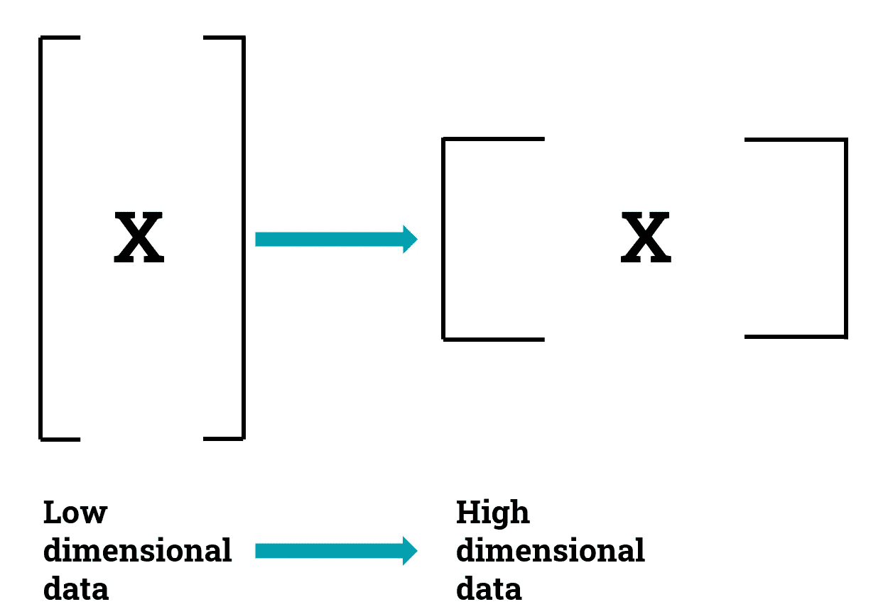
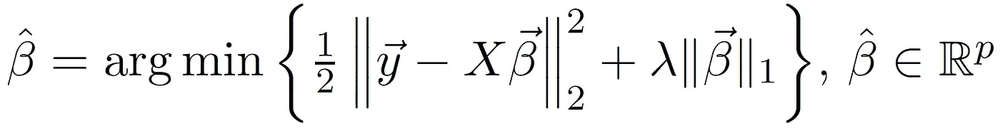
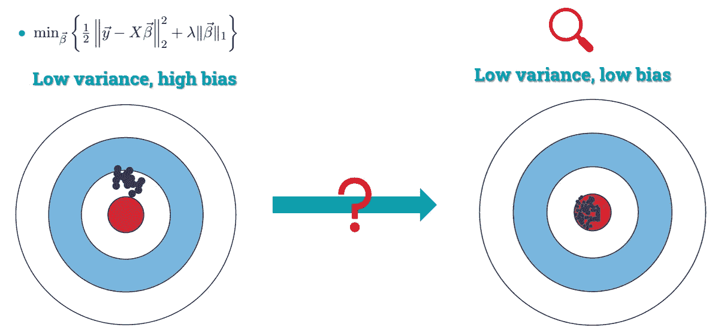
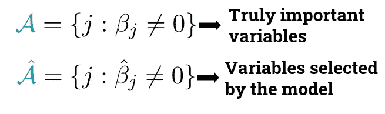
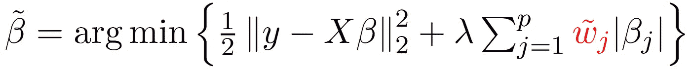
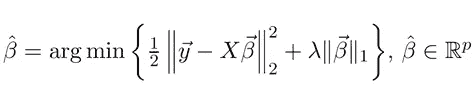
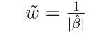
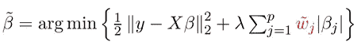

# python 的自适应套索

> 原文：<https://towardsdatascience.com/an-adaptive-lasso-63afca54b80d?source=collection_archive---------20----------------------->

## 如何构建一个了解真相的 oracle 估算器(带代码！)


Pierre Bamin 在 [Unsplash](https://unsplash.com?utm_source=medium&utm_medium=referral) 上拍摄的照片

这是我关于惩罚回归系列的第二篇文章。在第一篇文章中，我们讨论了如何在 python 中实现[稀疏组套索，这是当今回归模型可用的最佳变量选择替代方案之一，但今天我想更进一步，介绍一下**自适应思想**，它可以将您的回归估计器转换为 **oracle** ，了解数据集的真相。](/sparse-group-lasso-in-python-255e379ab892)

今天我们将看到:

*   **拉索**(和其他非自适应估计器)面临的**问题**是什么
*   什么是 **oracle 属性**以及为什么您应该使用 **oracle 估计器**
*   如何获得**自适应套索**估计器
*   如何用 python 实现一个**自适应估计器**

# 套索惩罚的问题

先简单介绍一下**套索回归**。假设您正在处理一个数据集，其中您知道只有几个变量真正与响应变量相关，但您不知道是哪些变量。也许你正在处理一个**高维数据集**，它的变量比观测值**、**多，其中一个简单的线性回归模型无法求解。例如，一个由数千个基因组成的基因数据集，但其中只有少数基因与疾病相关。



作者制作的图像。

因此，您决定使用 lasso，这是一种向回归模型的β系数添加 L1 约束的惩罚方法。



线性回归中的套索公式。

这样，您将获得**稀疏的解决方案，**意味着许多β系数将被发送到 0，并且您的模型将基于少数不为 0 的系数进行预测。

通过降低**模型复杂性**(不等于 0 的变量数量)，您已经潜在地**降低了您的模型的预测误差**。但是作为一个副作用，你已经**增加了β估计的偏差**(这被称为方差偏差权衡)。

> Lasso 提供稀疏的**解决方案，这些解决方案是有偏差的**，因此 lasso 选择的有意义的变量可能与真正有意义的变量不同。



作者制作的图像。

其他惩罚如岭回归和稀疏群套索面临同样的问题:它们提供了有偏见的解决方案，因此无法识别我们模型中真正有意义的变量。

# oracle 属性

我们的目标很明确:**我们想要一个没有偏见的解决方案**，这样我们就可以从数据集中选择变量，就好像我们事先知道哪些是真正重要的变量一样。就像我们的评估者是知道真相的先知一样。

我知道，将“oracle”称为回归估计量听起来像是我想出来的，但它实际上有一个数学形式的定义，由范和李(2001)提出。如果一个估计量能够以收敛到 1 的概率正确地选择模型中的非零系数，并且非零系数是渐近正态分布的，那么这个估计量就是预测的。

这意味着给定一组 *p* 变量{β1，…，βp}，如果我们考虑两个子集，



> oracle 估计器选择概率趋于 1 的真正重要的变量。渐近地，两个子集重合。

# 适应性套索

那么……我们如何获得我们的 oracle estimator 呢？例如，我们可以使用**自适应套索**估计器。这个估计量最初是由邹(2006)提出的，其背后的思想非常简单:**增加一些权重** *w* 来校正 lasso 中的偏差。



如果一个变量很重要，它应该有一个小的权重。这样，它会受到轻微的惩罚，并保留在模型中。如果它不重要，通过使用一个大的权重，我们可以确保去掉它并把它发送到 0。

但这就引出了我们今天要讨论的最后一个问题:

# 如何计算这些重量

计算这些权重的方法有很多，但今天我将采用最简单的一种:

1.  求解一个简单的套索模型



2.计算重量如下:



3.插入权重并求解自适应套索



仅此而已。现在，您的估计器是一个先知，您将获得比使用简单套索更好的预测(在预测误差和子集选择方面)。

但是不要相信我，**让我们使用`asgl`包在 Python** 中测试一下。

# 转向 Python 代码

我们从安装`asgl`包开始，这个包在`pip`和 GitHub 库中都有。

```
pip install asgl
```

# 导入库并生成数据

首先，让我们导入将要使用的库。我们将在使用来自`sklearn`的`make_regression()`函数生成的合成数据集上测试使用自适应 lasso 估计器的好处。我们的数据集将有 100 个观察值和 200 个变量。但是在 200 个变量中，只有 10 个与响应相关，其余 190 个都是噪声。

`x`是形状为(100，200)的回归量矩阵，`y`是响应变量(长度为 100 的向量)，而`true_beta`是包含贝塔系数真实值的向量。这样，我们就能够将真实的 betass 与 lasso 和 adaptive lasso 提供的 beta 进行比较。

# 训练模型

我们将比较一个简单的套索模型和一个自适应套索模型，看看自适应套索是否真的减少了预测误差，并提供了一个更好的有意义变量的选择。

为此，我们考虑对数据集进行**训练/验证/测试分割**。我们使用训练集来训练不同参数值的模型。然后，我们使用验证集选择最佳模型，最后，我们使用测试集计算模型误差(这不包括在模型训练和选择中)。这可以在`asgl`包中使用`TVT`类和`train_validate_test()`函数直接完成。

***拉索模型***

我们将用一个`penalization=lasso`解一个线性模型`model=lm`，并定义`lambda1`的值，它是与套索惩罚相关的参数λ。我们将根据最小均方误差(MSE)找到最佳模型，并将使用 50 个观察值来训练模型，25 个用于验证，剩余的(25 个)用于测试。所有这些都由`train_validate_test()`功能自动执行。

最佳套索模型的预测误差(根据 MSE)存储在`lasso_prediction_error`中，与模型相关的系数存储在`lasso_betas`中

***自适应套索模型***

现在我们解决自适应套索模型。为此，我们指定`penalization=alasso`(代表自适应套索)，并选择用于计算权重的技术作为`weight_technique=lasso`。如上所述，这样我们将解决一个初始套索模型，计算权重，然后将这个权重插入第二个套索模型，这将是我们的最终模型。

# 决赛成绩

最后，我们来对比一下结果。我们将比较两个指标:

*   **预测误差**。每个模型实现的 MSE。越小越好。
*   C **正确选择率**:被正确选择的变量的百分比(被模型认为无意义的无意义变量的数量和被认为有意义的有意义变量的数量)。此指标代表模型执行的变量选择的质量。越大越好，最大值为 1，最小值为 0。

在下面的代码片段中，`bool_something`变量用于计算正确的选择率。

自适应套索得到的结果比简单套索得到的结果好得多。我们看到**自适应套索误差几乎比套索** **误差**小 8 倍(套索误差为 1.4，套索误差为 11.8)。在变量选择方面，lasso 只正确选择了 200 个变量中的 13%，而**自适应 lasso 正确选择了 100%的变量**。这意味着自适应套索能够正确识别所有有意义的变量为有意义的，所有有噪声的变量为有噪声的。

这就是这篇关于适应性套索的文章。请记住，尽量使用 oracle 评估工具，因为他们知道您的数据集的真实情况。我希望你喜欢这篇文章，并发现它很有用。如果您有任何问题/建议，请联系我。

要更深入地了解`asgl`包提供了什么，我推荐阅读 Github 存储库中提供的 [jupyter 笔记本](https://github.com/alvaromc317/asgl/blob/master/user_guide.ipynb)，要了解 oracle 估计器，我推荐最近发表的一篇论文，作为我博士论文的一部分:[分位数回归中的自适应稀疏组套索。](https://doi.org/10.1007/s11634-020-00413-8)

祝你今天开心！玩的开心！

# 参考

[范军，李锐(2001)非凹惩罚似然变量选择及其预言性质。美国统计协会 96(456):1348–1360](https://doi.org/10.1198/016214501753382273)

邹宏(2006)自适应套索及其甲骨文性质。美国统计协会 101(476):1418–1429

[门德斯-奇维埃塔，a .，阿吉莱拉-莫里洛，M. C .，利略，R. E. (2020)。分位数回归中的自适应稀疏群套索。数据分析和分类的进展。](https://doi.org/10.1007/s11634-020-00413-8)