# AWS DeepRacer 高级指南

> 原文：<https://towardsdatascience.com/an-advanced-guide-to-aws-deepracer-2b462c37eea?source=collection_archive---------3----------------------->

## 使用强化学习的自主 f1 赛车

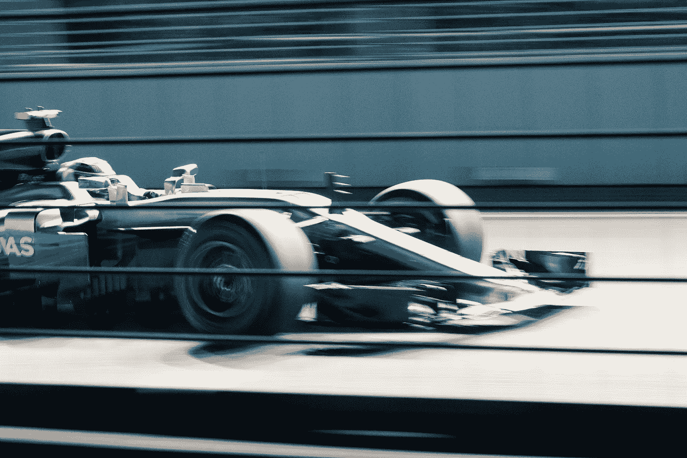

由 [Unsplash](https://unsplash.com?utm_source=medium&utm_medium=referral) 上的 [chuttersnap](https://unsplash.com/@chuttersnap?utm_source=medium&utm_medium=referral) 拍摄

近年来，自动驾驶汽车已经成为一个热门领域，特斯拉等公司每天都在推进技术的边界。AWS 的 DeepRacer 正在利用这种炒作，变得越来越受欢迎，甚至组织了一个联赛来参赛。

2020 年 5 月，AWS 组织了一场特别活动，与一级方程式赛车合作。这项赛事的赛道是高度复杂的巴塞罗那-加泰罗尼亚赛道。在计时赛类别中，我们的团队在近 1300 名参与者中获得了第 12 名。

在这篇文章中，我们将看看我们的大学团队在 AWS DeepRacer F1 计时赛中获得前 1%排名的因素。因此，如果您有兴趣了解在 AWS DeepRacer 中培训强化学习模型的高级技术，这是适合您的文章。

我们将讨论以下几点:

1.  AWS DeepRacer 和我们的设置的简短介绍
2.  计算最佳比赛路线和速度
3.  优化行动空间
4.  奖励函数
5.  超参数
6.  日志分析的持续改进
7.  使用 Selenium 自动提交比赛
8.  总结和后续步骤

要阅读本文，您不需要广泛的数据科学背景。事实上，我们的团队有商业背景，在西班牙巴塞罗那的 ESADE 商学院学习商业分析。但是，理解本文需要 Python 的基础知识。

AWS F1 推广视频

 [## dgnzlz/Capstone_AWS_DeepRacer

### “AWS DeepRacer 高级指南”一文中使用的代码

github.com](https://github.com/dgnzlz/Capstone_AWS_DeepRacer) 

# 1.AWS DeepRacer 和我们的设置的简短介绍

AWS DeepRacer 是一款 1/18 比例的自主赛车，可以通过强化学习进行训练。可以使用虚拟汽车和轨道在 AWS 控制台中训练和管理该模型。当使用 AWS 控制台时，整个基础设施，包括模型的训练和赛道的虚拟化，都由 AWS 管理。

与经典的机器学习相反，当你没有数据，但有一个代理可以学习的环境时，使用强化学习。在我们的例子中，代理是汽车，环境是虚拟的赛车道。通过对代理人期望的行动给予奖励，代理人随着时间的推移学会在给定的环境中解决问题。要了解更多关于强化学习的知识，请阅读我的团队成员马克·塞尔韦拉的这篇文章:

 [## 基于 AWS DeepRacer 为初学者讲解强化学习

### 强化学习如何在自主赛车中与神经网络一起工作的高级解释

towardsdatascience.com](/explaining-reinforcement-learning-for-beginners-based-on-aws-deepracer-efcefff65a9b) 

DeepRacer 是专门为人们学习机器学习而打造的学习产品。3 个组成部分在使其任务成功中发挥了重要作用:虚拟训练环境、实体汽车和联盟。如果你想了解更多关于 DeepRacer 的信息，欢迎访问[官网](https://aws.amazon.com/deepracer/)。

在本文中，我们将重点关注 AWS DeepRacer 控制台的使用，因此不涉及 AWS SageMaker 的定制。此外，只有虚拟比赛将被审查，因为物理比赛需要一个不同的方法。最后，我们将只考虑计时赛的形式。然而，所描述的大多数方法也可以用于其他比赛形式。

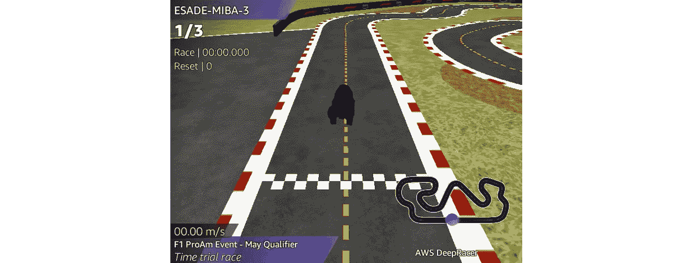

DeepRacer 的虚拟环境(图片由作者提供)

# 2.计算最佳比赛路线和速度

在虚拟比赛中，使模型过度适应特定的赛道是一种通过可接受的训练量获得良好模型的方法。因此，为了获得更好的时间，更快地向更高的速度收敛，更可靠，我们将使用一种规定的方法，在这种方法中，我们将使赛车沿着那条赛道的最佳赛道行驶。

为了计算赛车线，我们将使用在[雷米库隆博士论文](https://www.remi-coulom.fr/Publications/Thesis.pdf)中描述的 K1999 路径优化算法。该算法已经在[这个 GitHub Repo](https://github.com/cdthompson/deepracer-k1999-race-lines) 中实现。它的工作原理是反复减小线路的曲率，引导汽车转弯，减少总的路径长度。所有 DeepRacer 的曲目都可以在 [DeepRacer 社区的 GitHub Repo](https://github.com/aws-deepracer-community/deepracer-simapp/tree/master/bundle/deepracer_simulation_environment/share/deepracer_simulation_environment/routes) 下载。

对于 F1 赛道，结果是一个由 258 个非等间距坐标点组成的数组，这些坐标点代表赛车线。

与其他 DeepRacer 赛道相比，F1 赛道相当长。因此，要有一个能可靠完成 3 圈的模型，我们需要一个比短赛道模型更能规避风险的模型。实现这一点的一个方法是阻止赛车过于靠近赛道边缘。此外，F1 赛道的边界处有减速带，当驾驶过于靠近边缘时，会导致抓地力和控制力的丧失。因此，为了平衡这条赛道上的可靠性和速度，我们将比赛线限制在赛道宽度的 80%以内。

下图显示了在有和没有仅使用赛道内侧 80%的限制的情况下，结合不同的迭代次数的赛车线。

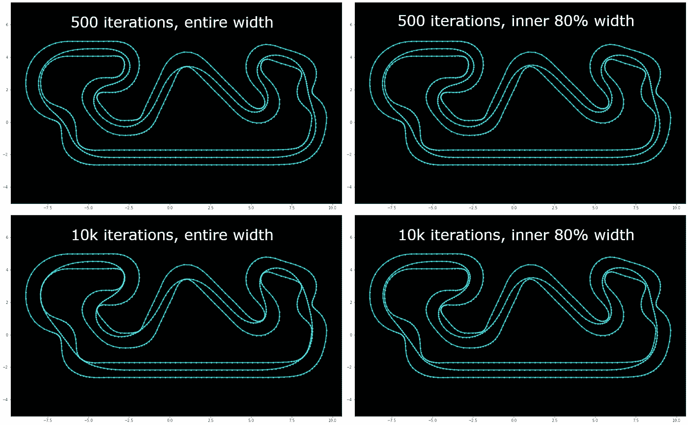

不同迭代次数和赛道宽度的计算赛车线(图片由作者提供)

接下来，我们要计算最佳速度。使用一种简化的方法，我们可以计算赛车线上每个点的最大速度

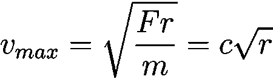

其中𝐹为横向抓地力， *𝑚* 为汽车质量， *𝑟* 为弯道半径。由于我们不知道𝐹或𝑚，我们可以通过给这些未知值分配一个常数来简化这个方程。

赛车线上每个点的半径可以通过在我们之前计算的赛车线上的 3 个点上画一个圆来计算:当前点和它前面和后面的点。求解半径，我们可以使用以下 python 函数计算半径:

虽然赛车线的点不是等间距的，但由于点的密度很高，计算出的半径仍然是准确的。因此，任何不准确之处都不应该大到足以造成差异。

一旦我们有了所有的半径，我们必须通过实验来计算𝑐。我们通过寻找模型可以完成最急转弯的最高可能速度来做到这一点。对于 F1 赛道，该最大速度约为 1.3 米/秒。我们稍后将使用该速度作为动作空间的最小速度。

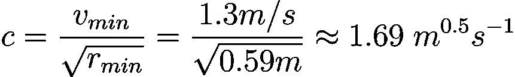

𝑐的值是在不同的轨道上计算的，并且始终在 1.6 到 1.75 的范围内。

为了找到最终的最佳速度，我们将速度限制在赛车的最大速度，我们的团队在这条赛道上将其设置为 4 米/秒。此外，我们引入了一个前瞻因子，将其设置为 5。这意味着最佳速度是接下来 5 个点的最大速度中的最小值。前瞻值越大，汽车在转弯前越早刹车。

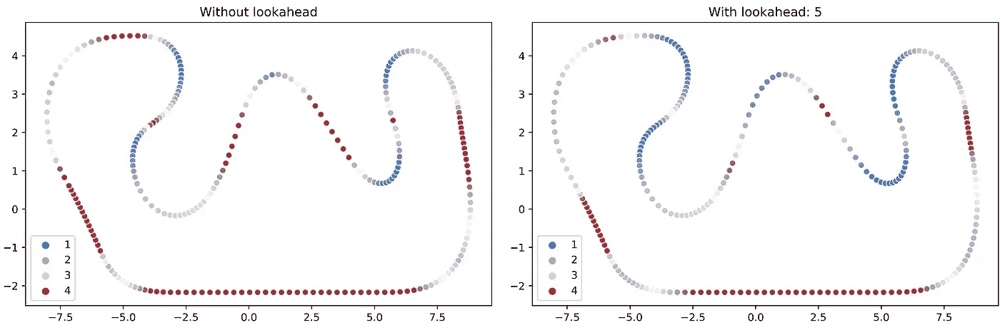

使用不同的前视值计算赛车线上的最佳速度(图片由作者提供)

与最佳比赛路线相比，最佳速度只是一个粗略的近似值，因为许多因素都没有考虑在内。为了获得精确的最佳速度，我们必须考虑精确的质量、质心、惯性矩、摩擦系数、转弯刚度以及最大加速和减速率。在设计奖励函数时，我们必须牢记这种不确定性。

# 3.优化行动空间

由于 DeepRacer 的动作空间是离散的，动作空间中的一些点将永远不会被使用，例如，4 米/秒的速度和 30 度的转向角。此外，所有轨道在曲线方向上都不对称。例如，F1 赛道是顺时针行驶的，导致右转比左转多。出于这两个原因，优化行动空间是有益的。我们可以通过删除不使用的动作来选择更快的收敛，或者如果我们保持相同数量的动作但更智能地分配它们，则可以选择更精确的驱动。我们选择后者。对于赛车设置，我们使用单个摄像机和一个 3 层卷积神经网络，因为任何更复杂的东西都不会提高计时赛的性能，只会增加收敛的时间。

我们遵循 5 个步骤的方法:

1.  计算转向角度
2.  添加高斯噪声
3.  应用 K 均值聚类
4.  手动添加操作
5.  出口到 S3

## 3.1 计算转向角

到目前为止，我们只有赛车线上每个点的半径。该转弯半径必须转换为转向角，其值为

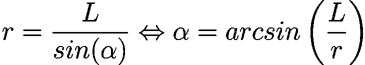

其中𝛼为转向角， *𝐿* =0.165 *𝑚* 为轴距， *𝑟* 为曲线半径。

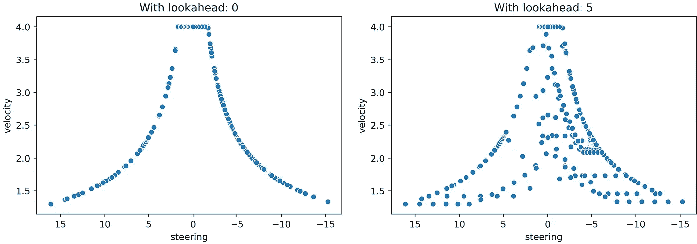

最佳比赛路线和最佳速度上的所有动作，针对不同的前瞻值(图片由作者提供)

## 3.2 添加高斯噪声

在一个完美的世界里，模型总是遵循最佳的比赛路线和速度。然而，这种情况从来没有发生过，尤其是在模型的训练刚刚开始的时候。因此，为了表示驾驶中的不确定性，并给汽车更多的灵活性来纠正以前的决定，我们给每个动作添加高斯噪声。我们只将高斯噪声应用于转向，而不是速度，因为修正先前的决定主要是通过转向来驱动的，而不是速度。

首先，我们必须确定高斯噪声的期望标准偏差。然后，我们生成一组高斯噪声，这些噪声稍后将被添加到现有的数据点中。

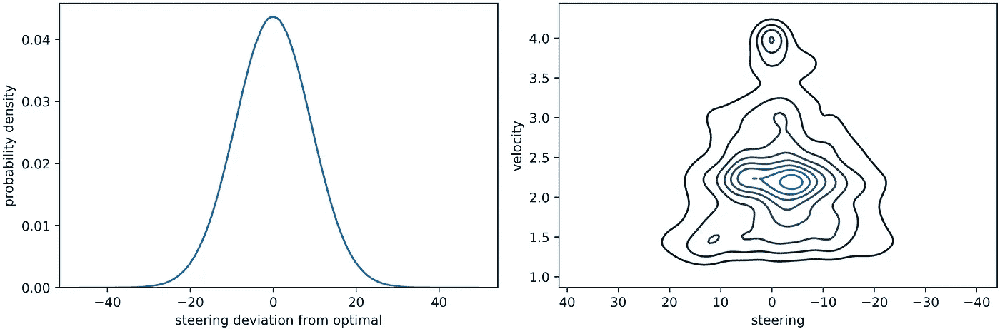

转向的高斯噪声分布+注入高斯噪声的动作的 KDE 图(图片由作者提供)

## 3.3 应用 K 均值聚类

使用 DeepRacer 控制台时，最大动作数量为 21。我们对注入高斯噪声的动作使用 K 均值聚类来计算 19 个动作。最后 2 个操作将在下一步中手动添加。我们使用 K-Means，因为这允许我们将欧几里德距离用于二维速度和转向——点彼此越接近，它们就越相似。群集的质心将代表一个动作。如果你不熟悉 K-Means，[这篇](/understanding-k-means-clustering-in-machine-learning-6a6e67336aa1)文章很好地解释了它。

要查看我们对初始数据点应用了哪些额外的预处理步骤，请参考我们的 [GitHub Repo](https://github.com/dgnzlz/Capstone_AWS_DeepRacer) 。

## 3.4 手动添加操作

在模型的每次更新之间，进行多个情节。例如，如果该值设置为 20，与前一集相比，汽车将在赛道上向前行驶 5%时开始每一集。因此，赛车很少会准确地在赛车线或其方向上起步。为了让汽车有可能在每集开始时转向想要的方向，我们想增加两个额外的动作:(分钟。速度，30)和(最小。速度，-30)。

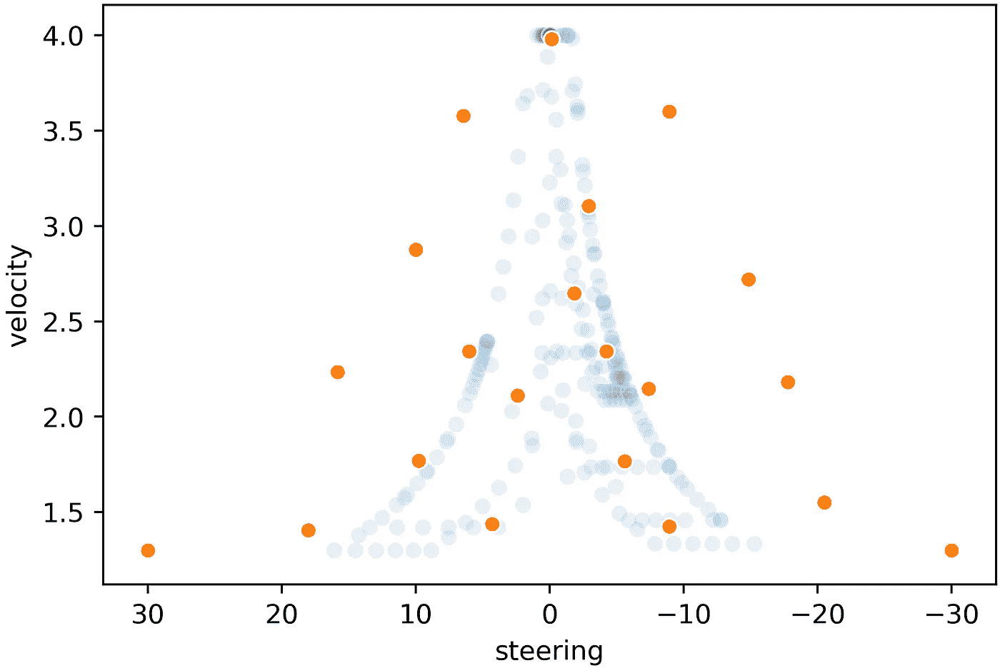

最终行动空间大小 21(图片由作者提供)

总之，第 3 章中描述的方法是第一种方法，比预先定义的动作更好。然而，不对称的动作可能会迫使汽车在转弯和高速之间做出决定。例如，看上面的动作空间图，汽车不能以 4m/s 的速度行驶，同时转向 3。如果它想高速驾驶，就必须降低速度。因此，对动作空间的进一步实验可能会产生更好的结果。

## 3.5 向 S3 出口

找到我们想要的动作空间后，我们必须将它导出到 S3，其中保存了 DeepRacer 的模型元数据。我们遵循这些简单的步骤:

1.  在控制台用 21 个动作创建一个模型，训练这个模型 5 分钟。请注意，我们不能改变动作的数量，只能改变每个动作的速度和方向
2.  打开 S3 文件夹 AWS-deep racer-XXX/model-metadata/model name
3.  下载 model_metadata.json 并用所需的操作替换现有的操作
4.  在 S3，用新文件替换旧的 model_metadata.json
5.  在 AWS DeepRacer 控制台中克隆先前创建的模型。这个克隆体将使用我们想要的动作空间进行训练

# 4.奖励函数

## 4.1 设计奖励功能的挑战

设计奖励函数可以被视为强化学习中最具挑战性的部分。这是由于奖励函数具有很大的复杂性。一方面，一个包含 5 行代码的奖励函数可以让我们最终绕过赛道，尽管速度很慢，而且有很多曲折。另一方面，有数百行代码的奖励函数，例如当具体告诉模型赛车线在哪里时。

为 DeepRacer 编写一个好的奖励函数的主要目的是这样的:对于给定的进度，时间越短，赛车应该获得的奖励就越多。例如，如果 2 集都取得了 50%的进展，但其中一集比另一集快，则快一集应该获得更多奖励。但是，我们也想奖励其他方面，比如接近最佳赛车线。因此，平衡不同的目标是设计奖励函数最具挑战性的部分。现在让我们来探索如何应对这些挑战，并设计一个有效的奖励函数。

## 4.2 我们奖励功能的各个方面

我们曾经排在第 12 位的奖励函数有 5 个主要方面:

1.  默认奖励
2.  靠近赛马场
3.  最佳速度的速度差
4.  用更少的步数跑完一圈
5.  对明显错误决定的惩罚

首先，我们定义了一个默认奖励，也就是说，除了当汽车做出一个明显错误的决定时，它总是得到一个最低的奖励。由于偏离轨道导致零奖励，默认奖励越高，撞车对汽车的伤害越大，因此汽车将更加厌恶风险。然而，将默认奖励设置得太高违背了我们的目标，即更少的步数等于更多的奖励。所以默认奖励不要太高。

第二，我们增加了一个接近赛车线的奖励。计算这个奖励依赖于我们在第 2 章中计算的赛车线。增加这个奖励可以减少曲折，当一个新的模型刚刚开始训练时特别有用。然而，如果这个奖励太高，汽车只会乏味地沿着赛道行驶，而不会在乎速度。

第三，我们在最佳速度的基础上增加了一个奖励。我们没有使用“更快的速度等于更多的奖励”,因为如果我们有一个错误的奖励比例，赛车将主要关心快速行驶，永远无法通过训练中的第一个弯道。因此，更容易定义一个最佳速度，尽管我们知道它只是一个近似值。

第四，当赛车完成一圈时，我们会增加一个显著的奖励，所以当它达到 100%的进度时。它使用的步数越少，奖励越高。我们可以把奖励建立在步数的基础上，因为这个模型每秒走 15±0.5 步。一旦模型可以轻松完成，我们就开始给予奖励，同时我们会在与排行榜上最快时间相等的时间设置奖励上限。我们尝试不仅在完成一圈时给予奖励，而且间隔更频繁。然而，这导致了一个过于关注速度的模型。

最后，对于明显错误的决策，我们将总奖励设置为几乎为零，即:

*   偏离轨道，
*   航向偏离赛车线的方向超过 30 度，或
*   具有比最佳速度慢 0.7 米/秒的速度。

30 度和 0.7 米/秒的截止值对我们来说效果很好，但是进一步的实验可能会得到更好的结果。此外，这种几乎为零的惩罚使得我们的奖励函数变得离散。理论上，连续的奖励功能使模型学习得更快，因为即使汽车正在做一些可怕的事情，稍微不那么可怕的状态应该得分略高。至于截止值，进一步的实验也可能导致更好的结果。

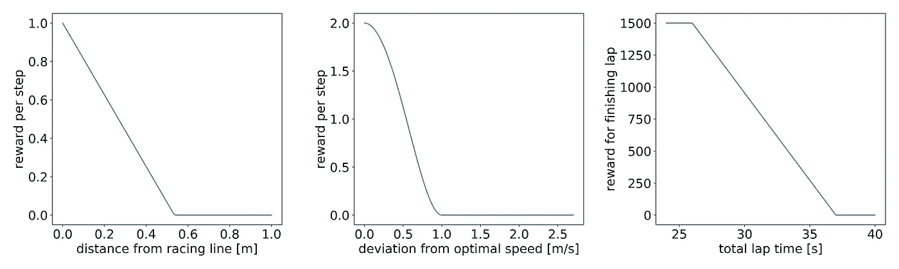

我们的奖励函数的第 2、3 和 4 个方面(图片由作者提供)

要查看我们的整个奖励功能，请参考我们的 [GitHub Repo](https://github.com/dgnzlz/Capstone_AWS_DeepRacer) 。

## 4.3 子奖励相加与相乘

我们将子奖励定义为奖励函数的一个方面，比如对接近赛车线的奖励。在奖励功能中，有两种主要的方法将子奖励合并到总奖励中:相加或相乘。

根据我们的经验，子奖励相加比子奖励相乘效果更好。我们认为情况是这样的，因为如果一个子奖励接近于零，当使用乘法方法时，该模型将不会关心改善其他子奖励。

例如，我们测试了两个子奖励的乘法方法:接近赛道和接近最佳速度。如果赛车远离比赛线，但在速度方面做出了正确的决定，赛车仍将获得零奖励，即使它做出了正确的决定。因此，在我们的实验中，采用乘法方法的模型永远无法完成一整圈，更不用说快速完成一圈了。由此，我们了解到，即使赛车不在最佳赛道上，我们也必须奖励赛车的好速度。

下面的图显示了这两种方法。在乘法方法中，我们可以看到，如果汽车远离赛道，提高速度就不再那么重要了。

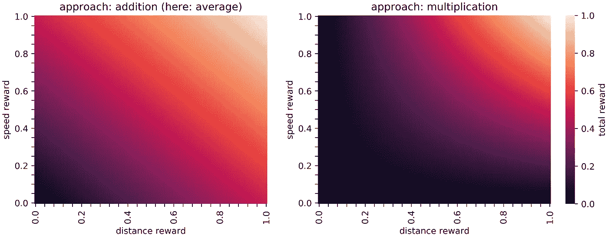

可视化两种结合次级奖励的方法(图片由作者提供)

# 5.超参数

超参数有一个相当陡峭的学习曲线，所以掌握它们需要很多时间。因此，我们建议在试验超参数之前，先了解一下动作空间和奖励函数。

在我们的实验中，我们了解到，从默认的超参数开始，但由于轨道较长，批量较大，在最初几个小时的训练中效果很好。一旦模型开始收敛，我们就降低熵和学习速率。然而，超参数高度依赖于奖励函数、动作空间和轨迹，所以我们鼓励你多做实验。

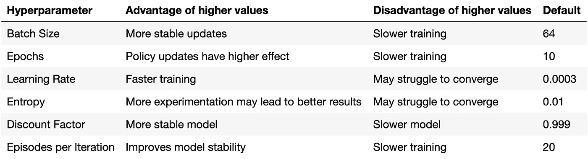

关于熵的一个注意事项:有时，一个模型在克隆后表现更差。其原因是，随着模型对其决策变得更有信心，熵在训练期间随着时间的推移而降低。但是，当克隆模型时，熵被重置为超参数值，该值是在设置训练时定义的。

# 6.日志分析的持续改进

我们到目前为止所涉及的方面应该只是您的一个起点。每个轨迹、动作空间和模型的行为都不同。这就是每次训练后分析日志如此重要的原因。

幸运的是，DeepRacer 社区在 GitHub 上写了一个[日志分析工具，用它可以分析训练课程、评估和行动空间。我们强烈建议使用它们。有多种资源，比如](https://github.com/aws-deepracer-community/deepracer-analysis)[这篇博客文章](https://blog.deepracing.io/2020/03/30/introducing-aws-deepracer-log-analysis/)，它解释了你需要知道的关于日志分析工具的一切。

日志分析的总体目标是尝试不同的回报函数、超参数和行动空间的变化，并查看哪些变化导致最佳时间、进度、改进或收敛。这种迭代方法需要时间。所以，你应该考虑你的时间和预算限制来计划你的实验。例如，我们的 3 人团队在 4 月和 5 月进行了 477 次不同的培训，累计培训时间达 2950 小时。

为了决定我们想要进一步追求的变化，我们看时间和进度。与类似的实验相比，在这两个方面表现良好的模型将被进一步研究。创建新模型时，我们遵循 3 步流程:

1.  确保模型在赛道上取得进展。在早期，排除那些难以完成一整圈的车型
2.  一旦至少完成了几圈，就把注意力放在更短的时间上。这一步的进度不必很高，只要至少完成了几圈
3.  一旦圈速趋于一致，就要为更高的进度进行优化。虽然优化进度通常会增加单圈时间，因为模型变得更加规避风险，但这一部分对于获得可以连续完成 3 圈的可靠模型非常重要

关于训练成本的健康警告:我们作为学生只能训练这么多小时，因为 2020 年 5 月的 F1 赛事是免费的。因此，请密切关注账单仪表板，因为很容易产生大额账单。

# 7.使用 Selenium 自动提交比赛

在训练了一个我们满意的模型之后，我们将它提交给比赛。一个好的模型会在速度和可靠性之间取得平衡。因此，它不会完成 100%的圈数或有一致的圈数。因为只有所有提交中的最佳时间才是最终时间，所以我们可以多次提交我们的模型，以提高我们在比赛中的排名。这可以手动完成，也可以通过网页抓取工具自动完成。

python 有多个 web 抓取包可用。这篇文章描述了 3 种最受欢迎的食物:羊瘙痒、硒和美味的汤。

使用 Selenium，我们编写了一个函数，它在指定的时间内自动向比赛提交模型。这样做的好处是，我们只使用控制台，而不是 SageMaker 或 AWS CLI。另外，我们还编写了一个函数，它可以自动进行超参数实验。这可用于整夜进行多个实验，而不必每隔几个小时手动设置它们。

要查看我们 Selenium 函数的代码，请参考我们的 [GitHub Repo](https://github.com/dgnzlz/Capstone_AWS_DeepRacer) 。

# 8.总结和后续步骤

仅使用 AWS DeepRacer 控制台训练模型，我们展示了如何计算最佳比赛路线和速度，使用 K-Means 聚类优化行动空间，设计良好的奖励函数，分析日志以不断改进模型，并自动将模型提交给比赛。使用所有这些工具，花一点时间让它们适应你的情况，你很快就能提高你的 DeepRacer 排名。总的来说，我们能够证明平衡不同的目标是应用强化学习的主要挑战。对于 DeepRacer，这些目标是速度、可靠性和快速学习。

下一步，一旦你对 DeepRacer 有了足够的了解，你可以尝试在 AWS SageMaker 甚至本地设置中训练模型。这两个选项将为您提供更高的灵活性，并可能比使用 DeepRacer 控制台成本更低。所有必要的资源都在 [DeepRacer 社区的 GitHub](https://github.com/aws-deepracer-community) 中。此外，请随时查看社区的[网站](https://deepracing.io/)或 [YouTube 频道](https://www.youtube.com/c/AWSDeepRacerCommunity)。如果你遇到困难，需要一些建议，或者只是想了解更多关于 DeepRacer 的知识，社区总是愿意提供帮助。

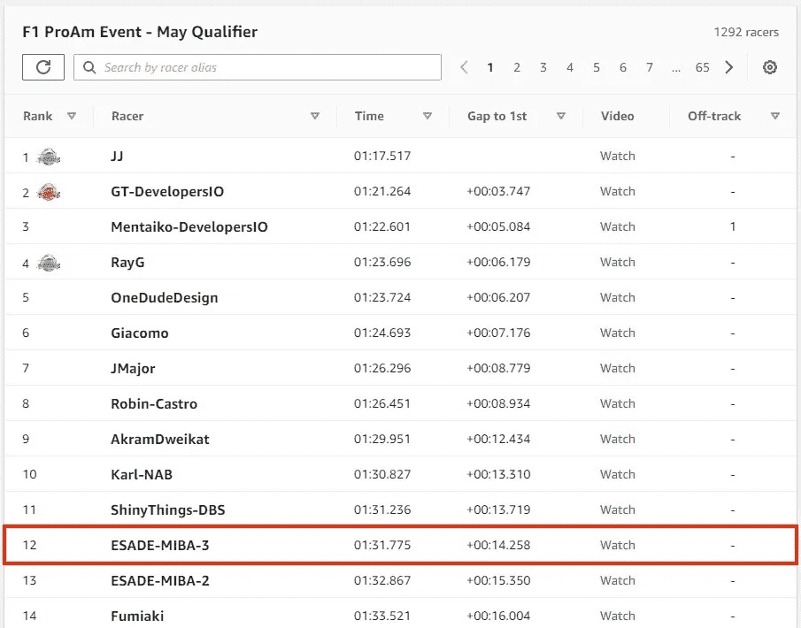

2020 年 5 月 F1 赛事计时赛的最终名次(图片由作者提供)

非常感谢我的团队成员[娜塔莉亚·科尔查吉娜](https://www.linkedin.com/in/natalia-korchagina/)和[马克·塞尔韦拉](https://www.linkedin.com/in/marc-cervera-castro/)，没有他们，我们的团队永远不会取得今天的成绩。此外，感谢来自 DeepRacer 社区的 Lyndon Leggate 和 Tomasz Ptak，感谢他们令人惊叹的帮助。最后，感谢我们的 ESADE 教授，他们允许我们作为一个大学项目参与 DeepRacer 我们在这个过程中学到了很多关于强化学习的知识！