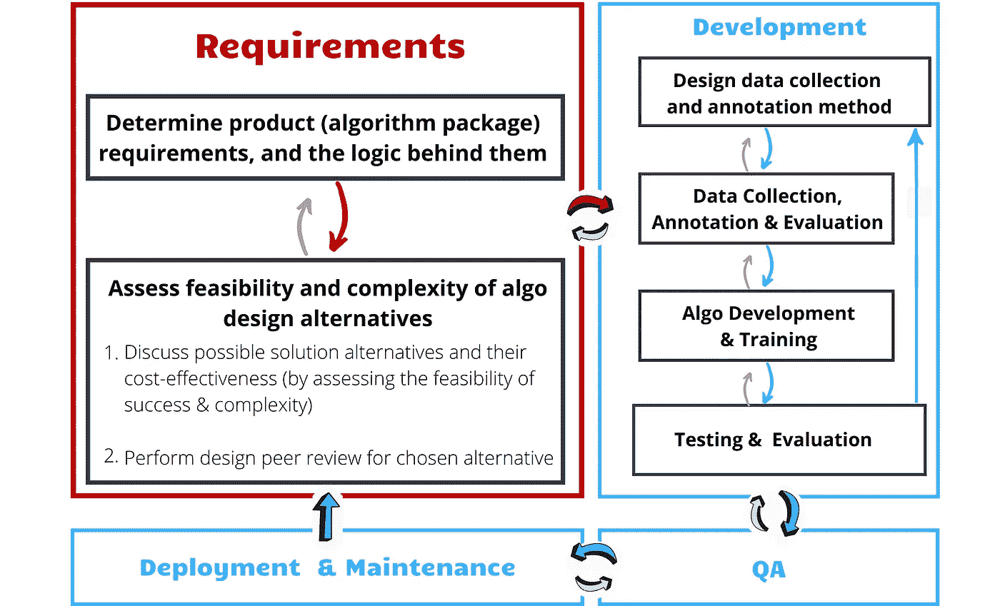
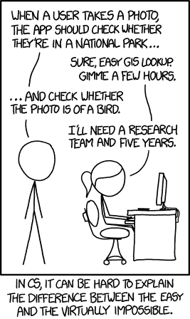
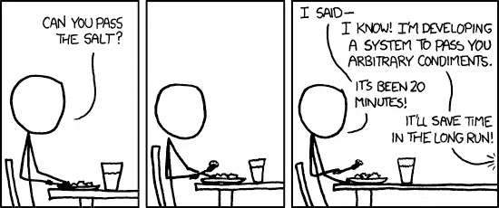

# 人工智能项目的敏捷框架——需求

> 原文：<https://towardsdatascience.com/an-agile-framework-for-ai-projects-requirements-2d40d6a4fd4c?source=collection_archive---------25----------------------->

多年来，软件开发社区已经达成了广泛的共识，即软件开发应该有一个**迭代的生命周期**——根据用户反馈不断改进产品。

今天，许多人工智能团队在采用迭代生命周期之前，面临着与传统软件团队相似的困难。虽然**人工智能并没有改变构建符合产品市场的优秀产品的本质**，但它确实有细微差别和复杂性，使得应用现有的方法很困难。这一系列文章的目标是提出一个**迭代生命周期框架，它适应于以人工智能为中心的软件**。

**这篇文章是独立的，不需要阅读系列**中的前一篇文章。在[上一篇文章](/an-agile-framework-for-ai-projects-6b5a1bb41ce4?source=friends_link&sk=97ada921887f416c88eb1f79b6660be8)中，我们已经讨论了这个框架的动机，并提供了一个概述，为很好地执行它打下了基础。在这篇文章中，我们将讨论框架的需求阶段。

# 端到端思考

现实世界问题的人工智能解决方案——往往不仅仅是一个“端到端”解决问题的单一机器学习模型。它们是许多不同算法的组合——机器学习、经典算法(例如“后处理”)和“胶水代码”。

虽然机器学习模型可能解决大多数“最棘手”的问题— **但只有所有这些组件的组合才能产生用户体验到的“下游”结果**。

许多产品经理和决策者陷入了定义“核心”算法组件(例如，核心深度学习模块)的需求的陷阱，而在实践中，它通常与用户体验没有足够强的关联。这是定义需求和附加步骤中的常见错误。我们已经看到工程经理要求他们的团队“报告算法的性能”。工程师报告核心模型的准确性超过 95%，而实际上，与用户体验最相关的“下游”指标要低得多。

我们将把这种不同算法组件的组合称为“算法包”，以将其与单一模型明确区分开来:

> 影响用户在生产中体验到的算法性能的所有代码、模型、二进制文件(例如神经网络权重)和配置。即使在单个文件中的改变也定义了算法的新版本。

**作为“算法包”整体的结果，是用户体验到的结果——它们是对业务有意义的结果**——远远超过任何单个模型或组件的结果。算法的努力应该是为了优化这个整体包的需求。

**在许多情况下,“核心模型”的性能可能看似很低，但优化软件包的其他组件仍然更有好处**(反之亦然——模型看似极高的性能仍然会导致下游性能低下)。这个例子证明了在执行管理人工智能项目的过程中，将软件包作为一个整体来考虑是很重要的。大部分过程应该集中在那个抽象层次上。

# 要求

跳过这一部分，直接进入“看看模型能做什么”可能很有诱惑力。然而，如果你想在终点线达到预期的结果，这些要求是至关重要的。

请注意，本系列的目的是通过几个核心示例来指定流程中的步骤——即“什么”(例如评估算法设计的可行性)。我们将不描述“如何”(例如，为算法执行有效 POC 的原理)。

下面，我们将描述**组成需求定义阶段**(见上图)的两个步骤以及执行它们的指导方针。这两个步骤应该以交替的方式执行— **在这两个步骤之间来回循环，作为能够确定最具成本效益的需求的过程**。

# 1.确定产品(算法包)需求及其背后的逻辑

需要记住的事项:

**产品经理应该在算法包**的层次上定义需求，因为它下面的模型和子算法是实现细节。通常他们的性能对用户感觉的准确性的影响(这是产品应该关心的)是非常不直观的。

线性增加需求会成倍增加模型的复杂性。来源:[https://xkcd.com/1425/](https://xkcd.com/1425/)

**力求简单**——线性地增加需求可以指数地增加模型的复杂性。通常，需求并不严格，通过对需求稍作妥协(通过删除整个特性或降低性能目标)可以获得很多，这使得能够更快地获得用户反馈，并重新评估需求。

比定义准确的需求集更重要的是向工程师传达这些需求背后的逻辑。在接下来的步骤中，工程师将提出执行这些要求的替代方案，理解其中的逻辑，可以帮助他们通过做出合理的妥协找到更具成本效益的替代方案。

工程师应该努力获得这些知识，因为这可以提高他们的效率，即使这些知识不是由产品引发的，也要提出要求。

# 2.评估算法设计方案的可行性和复杂性

来源:https://xkcd.com/974/

# 2.1.讨论可能的解决方案备选方案及其成本效益(通过评估成功的可行性和复杂性)

**算法包的需求被定义(或更改)后，需要提出几个技术方案来执行这些需求**。

每个选择实际上为包的每个子算法定义了一组不同的需求，以一种满足整体需求的方式。

每个备选方案可以在包的子算法之间不同地分布权重，例如，单个备选方案可能对模型要求更多，而另一个备选方案可能仅要求后处理，甚至不改变模型。

**也提出替代方案，在需求上做出合理的妥协，同时显著降低执行成本。**如果相关工程师不精通产品逻辑，发起与产品的讨论以理解合理的妥协。

**评估每个备选方案的成本效益**:相关工程师应首先**彻底评估**每个备选方案成功实现需求范围的可行性，以及资源(时间、人力、数据注释等)。)是该备选项所必需的。

**一旦对所有备选方案进行了评估** —评估将被完整地呈现给相关决策者，因为他/她决定了所选备选方案中的“冒险”程度(包括性能风险\折衷和浪费资源的机会成本风险)。如果相关决策者不是产品经理，则项目经理应意识到绩效风险承担\妥协。

# 评估替代品成本效益的技巧:

## 1.算法的简单性

**经过验证、可用(见下文)和\或简单的首选解决方案**，按重要性排序

**记住，尝试高级模型\算法**是很容易的，但是在实践中，一个简单得多的模型可以给出一个非常有效和可部署的基线，以后可以根据产品优先级进行改进。

**关于类似问题的(已证实的)工作的可用性**(更高的可用性增加了成本效益)。使用以下问题确定可用性，问题按预期重要性排序:

*   替代方案是否可以基于公司已经开发和验证的现有管道？(利用资产)
*   类似的问题在大规模的产品中解决过吗？
*   替代方案可以基于流行的开源库吗？
*   关于类似的问题，有哪些(多少)可靠的文献？
*   对于市场上没有类似技术的算法，作为产品需求阶段的一部分，执行可行性评估的复杂性是什么？
*   算法在生产中会有哪些计算约束？

## 2.数据采集成本(较高的成本降低了成本效益)

*   我们有不同/相似项目的数据吗？
*   获取原始数据有多难？
*   数据标注有多耗时和昂贵(考虑到可以加速标注的工具和简单/较慢的模型)？
*   需要多少数据？

# 2.2.对选择的备选方案进行设计同行评审

同行评审确定了可以在生命周期早期解决的问题。在许多情况下，在生命周期的早期发现的问题，修复成本要低得多。例如，在以兼容的方式对数据进行注释之前，或者在执行大量开发工作之前，理解算法设计是不够的。

来源:grmarc 创建的技术向量—【www.freepik.com 

这个帖子系列是与 [Idan Bassuk](https://medium.com/u/1c7ec28c4b50?source=post_page-----6b5a1bb41ce4----------------------) 合著的。

我将很高兴听到你的想法和经验。在下面的帖子中，我们将[讨论开发阶段](https://medium.com/@jennyabramov/an-agile-framework-for-ai-projects-development-cbe115ba86a2?source=friends_link&sk=b5f0a9a008ac37d3f42d988444df46b9)。