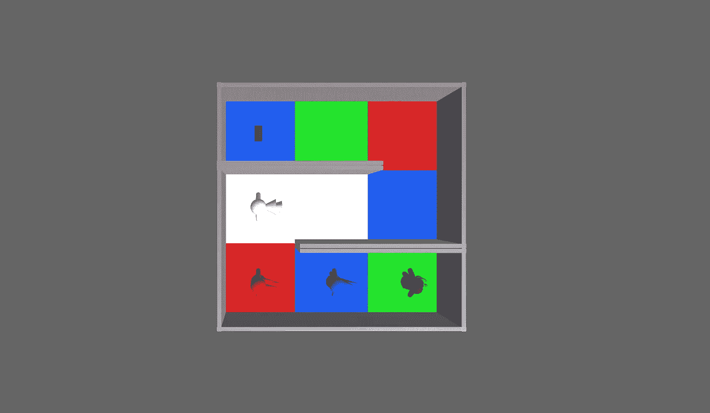
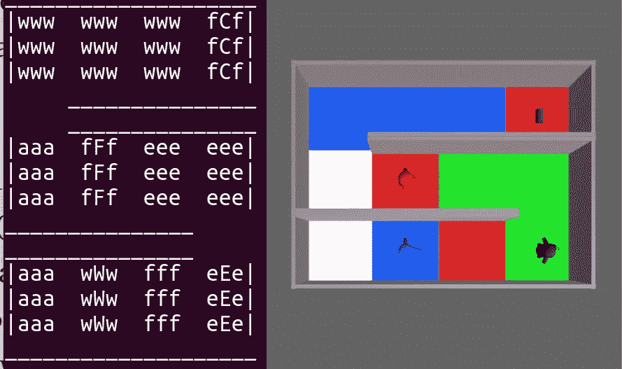
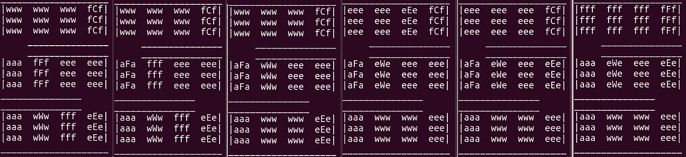
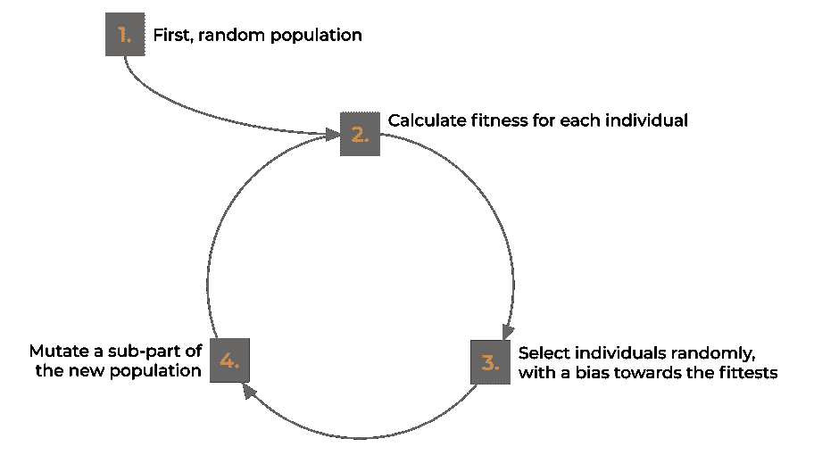
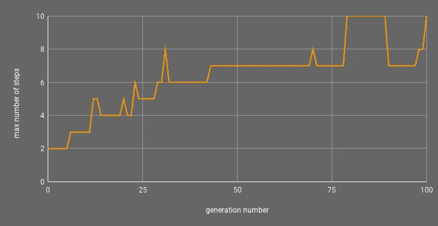
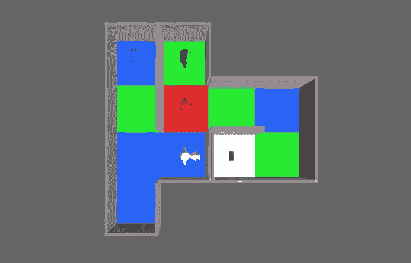

# 设计游戏关卡的人工智能

> 原文：<https://towardsdatascience.com/an-ai-to-design-game-levels-1d3ac84897e9?source=collection_archive---------37----------------------->

## 我们如何为我们的益智游戏开发遗传算法

几个月前，我的儿子雨果(12 岁)和我决定学习用 Unity 开发游戏。我们会做一个。我们想出了一个名为 **Elemaze** 的益智游戏，代表四种元素的小家伙必须合作才能在迷宫中找到通往箱子的路径。我们学到了很多关于编码、图形、游戏机制等方面的知识。Hugo 继续创作他自己的游戏“人工智能将生存”，作为对自己的挑战(见 i [tch.io](https://hairygamedev.itch.io/ai-will-survive) 和 [Google Play](https://play.google.com/store/apps/details?id=com.dAquinGames.AIWillSurvive&hl=en) )，我们参加了两次游戏堵塞(我们真的没有做得很好，但这都是为了体验和乐趣)。然而，我们真正学到的是，一旦有了基础，花时间的不是编码、机械、音乐或图形，而是制造关卡。

Elemaze 的菜单屏幕。

所以，这是一个关于我们如何创造一个遗传算法来为 Elemaze 设计关卡的故事。这也是一个关于更传统的人工智能方法如何仍然令人难以置信地相关，更容易实施，并且，特别是在遗传算法的情况下，可以提出全新的，创造性的和令人印象深刻的解决方案来解决那些会让我们无休止地挠头的问题的故事。

# Elemaze:游戏

我们创作的游戏比较简单，重点是*相对*。每一关都是一个网格中的迷宫，每个格子/瓷砖都有四种颜色的地板:白色代表空气，蓝色代表水，红色代表火，绿色代表土。在迷宫的某个地方有一个箱子，目标是让四个角色中的一个——飞行员、船工、消防员和地球人——到达箱子。每个角色都可以被告知去迷宫中任何其他未被占据的单元，并会沿着最短的路径到达那里。到目前为止足够简单，但显然还有更多。每个角色都可能被某一种颜色杀死，并且可以从一种颜色变成另一种颜色。即:

*   飞行员在地球上行走会死
*   水人在空中行走会死亡，并把火变成水
*   消防员在水上行走会死，并把泥土变成火
*   地球人在火上行走会死，会把水变成土

埃勒梅兹的一个关卡。没有一个角色能直击胸膛。消防队员必须离开，这样沃特曼就可以给地球人腾出一条上去的路。然后地球人必须回去，这样消防员就可以为飞行员打开通向胸腔的路。这是一个 6 步解决方案的水平。

这创造了很多有趣的可能性，其中一个角色将不得不在某个地方改变颜色，以便另一个角色可以移动，但不是在另一个角色离开之前。关卡可以很简单(移动一个角色为另一个角色开路)，也可以更复杂(几次来回移动，直到一个角色最终到达胸部)。然而，想出那些更复杂的层次是非常困难的。在决定我们需要帮助之前，我们手工创建了 18 个级别，其中大多数很简单(2 到 4 步)，有些稍微难一点(5 到 6 步)。

# 准备好基础

花费几个小时来创造足够的关卡以使游戏可以发行的观点并没有让我们充满快乐。我们经常想出一个我们认为很难的水平，直到我们测试它，并意识到它有一个简单的解决方案或根本没有解决方案。懒惰是创新的驱动力，那时我们想:“也许我们可以解决这个问题！”。很长一段时间以来，我一直在从事人工智能方面的研究，并教授了许多不同的人工智能技术。我知道我们拥有的成分(一个具有相对可测量的成功标准的“设计”问题:关卡应该很难解决)，以及我们没有的成分(数千个好关卡的例子，如何制作关卡的规则，等等)。遗传算法似乎非常适合这一点，但在开始之前，我们必须将许多事情落实到位，包括一种表示级别的方法和一种自动(最好是快速)解决它们的方法。

跳过大约一百万个细节，我们创建了一个基本的 JSON 格式来表示层次(每个角色的胸部位置，以及一个包含每个角色颜色和方向信息的单元格矩阵)。我们还想出了一个在终端显示关卡的方法(见下文)，因为每次我们想看结果的时候都加载 Unity 是行不通的。

基于 ASCII 的表示终端中的关卡，以及游戏中相应的关卡。

给定任何水平，然后我们需要能够解决它，所以我们可以知道，首先，它有一个解决方案，其次，它有多难解决(它需要多少步骤)。跳过更多细节，我们实现了 [A*](https://en.wikipedia.org/wiki/A*_search_algorithm) 搜索算法，其中搜索的每一步都对应于将一个字符移动到该层中的给定单元格。对要尝试的下一步的评估是基于已经完成的步数(*【g(n)】*)以及作为对延长路径的成本的估计(*【h(n)】*)，角色和胸部之间的最小距离，忽略墙壁。因为这总是低估了从给定位置到达胸部的成本，所以根据 A*算法的特性，我们保证找到的解是最优的。它总是用最少的步骤找到解决方案。

一个 5 步解决方案:消防员移动，然后是水兵，地球人，地球人，最后，消防员到达胸部。

# 遗传算法

你可能会认为，解决一个关卡并不能让我们离发明一个关卡更近一步，对吗？实际上，这就是遗传算法的全部意义:你需要做的一件事就是用一种可以测试的方式知道你在寻找什么。遗传算法基于进化论:由于自然选择(“适者生存”)和随着时间的推移对基因库的小修改(突变)，物种变得更适应它们的环境。所以我们首先需要的是能够知道一个级别有多“适合”。我们需要一个适应度函数来告诉我们一个级别是否是一个好级别。

## 健康

那么我们怎么知道一个水平好不好呢？我们想要不太容易解决的级别，因此解决方案需要一定数量的步骤。因此，我们可以说，如果一个级别接近需要解决的理想的大量步骤 *S* ，那么这个级别就更合适。就这么简单。假设我们的求解器不仅返回给定级别 *l* 的解，还返回该解中的步骤数 *nsol(l)* 。我们对于级别 *l* 的适应度函数可以像

> 适合度(l) =最小值(S，nsol(l))/最大值(S，nsol(l))

例如，如果 *S* 是 12，并且当前级别需要 7 步解，则该级别的适应度值是 7/12，或 0.583。请注意，在代码中，我们使用了稍微复杂一些的东西，因为我们在函数中添加了一个组件，使级别更加紧凑(占用更少的空间)，但这通常可以忽略。

## 变化

假设我们有一个级别，下一个问题是，可以对它进行哪些非常小的改变，以便它可能走向更好的解决方案(或者，更有可能的是，成为该物种中无法解决、无法生存的成员)。在这里，我们可以随机改变 3 件事:一个角色的位置，一个房间的地板颜色或者一个房间的墙壁颜色。所以我们所做的是随机选择其中一个变化，并应用到随机的角色或细胞上。

## **生成人口 0**

我们有适应性，我们有突变。为了完整，我们通常还会添加交叉，即混合成对的选定个体，以创建新的解决方案。我们把它留在这里有两个原因:简化一个已经很长的故事，因为我们的第一次测试没有交叉，结果很好。有了这两个元素，遗传算法的一般过程如下:

我还没有谈到的一点是第一步:生成初始群体。事实证明，创建一个可以生成随机但有效的级别的过程是最乏味的工作。给角色赋予随机的位置，给单元赋予随机的颜色，放置随机的墙壁，这些都不是问题，重要的是确保关卡“有意义”。字符应该放置在非空的单元格上，而不是一个在另一个的上面(或者在箱子的上面)。墙壁的放置应该确保你不会从水平面上掉下来，或者掉到一个空的房间里，等等。为了避免不必要的无聊的细节，让我们假设我们已经做了，所以对选择！

## 新一代的选择和创造

使用“[轮盘赌选择](https://en.wikipedia.org/wiki/Fitness_proportionate_selection)”(或“健康比例选择”)为下一代选择个体。简而言之，这是一种在群体中“不完全随机”选择个体的方式，这样，一个健康状况是另一个健康状况两倍的个体被选中的可能性会增加一倍。换句话说，这是一种实现“适者生存”的方式，而不是像短语听起来那样二进制(应该是“适者生存概率最高”)。这就像投掷一个装满的骰子，只要群体中有多少个人，骰子每个面上的重量就与相应个人的适合度成比例。然后，我们选择骰子提示我们应该选择的人，不太适合的人可能不会继续下去，而真正适合的人可能会被选择不止一次。

既然我们已经选择了一个新的种群，我们只需要改变其中的一些。正如你现在可能已经意识到的，随机性是这个过程的一个重要部分，所以这就是我们再次做的:我们随机选择人口的一个子部分(其大小由*突变率*给出),我们对其应用上面描述的随机突变。

# **那么，这行得通吗？**

就是这样。我们在一个有足够多个体的群体中运行了许多代的适应度、选择和突变，理论上，应该会发生一些事情。

但是什么？遗传算法最让我惊讶的是，如果你这样描述它，作为一个过程，完全随机的事情通过几乎随机选择的个体的“代”被完全随机地改变，它怎么可能给你除了随机结果之外的任何东西？

答案就在“几乎随机”中的“几乎”一词里:适应度驱动的选择概率。因为更健康的人更有可能前进，平均来说，每一代人都应该更健康。由于随机突变的发生，新种类的个体(“突变体”)出现，它们要么更适合(因此更有可能将突变传递给后代)，要么不适合(因此更有可能因未被选择而消失)。

这就是它的美妙之处。你唯一需要的是知道如何识别某样东西是好的，它会让你最初随机的解决方案变得越来越好。最终的结果看起来像是已经设计好的，但是过程中没有关于*如何设计*好的解决方案的信息，只有关于什么*是*好的解决方案。看到这样的东西被创造出来是令人难以置信的兴奋，它看起来很聪明，看起来很有设计感，但它实际上只是在经过几代选择后才出现的突变。

当我们在 Elemaze 关卡中尝试这个魔法时，我们看到了吗？绝对的！

我们最初多次运行该过程，寻找 4x4 细胞的迷宫，每个溶液的理想步骤数为 9，群体为 30 个个体，突变率为 30%，极限为 100 代。因为解决这么多层次的问题需要时间，所以每次运行都需要几个小时(我们在多台计算机上多次运行)。自然，第一代并不是很有前途:大多数生成的关卡没有解决方案，有时，我们会有一个一步解决方案(即移动一个角色到胸部)。然而，在大多数过程中，它最终找到了需要 4 步甚至 5 步的层次。有几次跑到了 7 步，有几个人甚至在 8、9 和 10 步中找到了解决问题的方法。下图显示了一个有效的、可玩的 8 步关卡的最佳解决方案的步数。

遗传算法运行的每一代中求解级别的最大步骤数。

正如你所看到的，这符合预期:随着世代的进化，种群大多会变得更好。问题中的八步关卡是我们在游戏中测试的第一个关卡。看起来是这样的:

一个需要 8 个步骤来解决的关卡，是根据遗传算法生成的关卡创建的。

这可能不会给你留下深刻的印象，但我们花了几个小时试图找出如何为这个游戏制造关卡，以及如何构建它们，使它们具有足够的挑战性和趣味性。这个人工智能过程*发明了*一个关卡——实际上是几十个关卡——不仅可玩，而且复杂、有趣和困难。它唯一要做的事情是:“我们想要需要很多步骤才能解决的水平”。每次运行在笔记本电脑上(没有并行处理，所以只使用一个内核)几个小时内，从数百行 Python(使用 Python2.7 附带的模块)生成了不止一个有效级别(上面的一个也有有趣的 6 步、5 步，甚至 10 步级别)。

这种“智能”过程的*优雅*让我更感兴趣，尤其是如果你将它与需要多个 GPU 和数千个训练样本才能实现的东西相比较的话。正是这种优雅，也让它更适用，更易懂，更可教。Hugo 12 岁，在过去的几天里，我们一直在讨论什么样的人口规模是最好的，我们应该让这个过程运行多少代，我们的笔记本电脑应该根据其 CPU 的强度进行配置，等等。我们还分享了我们对水平如何发展的惊讶，当其中一个过程达到 7 步以上的水平时，我们会在屋子里大喊，并对测试它的想法充满了不耐烦。

我们的游戏结束了:你可以从 [Google Play](https://play.google.com/store/apps/details?id=com.HairyGameDev.Elemaze&gl=GB) 或 [itch.io](https://hairygamedev.itch.io/elemaze) 下载。其中 18 层是手工制作的。其他 34 个是由遗传算法设计的。你能认出他们是谁吗？