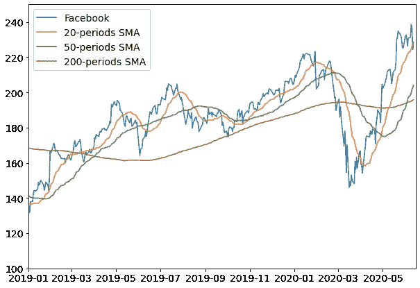
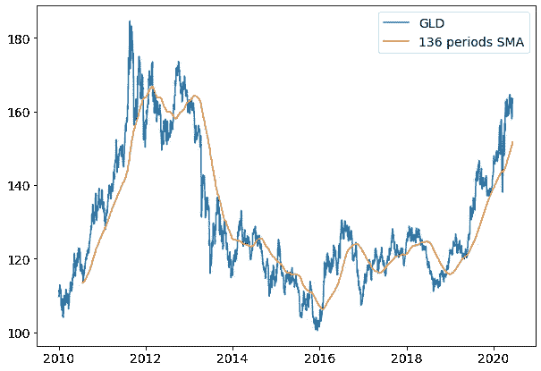

# 寻找股票交易最佳移动平均线的算法

> 原文：<https://towardsdatascience.com/an-algorithm-to-find-the-best-moving-average-for-stock-trading-1b024672299c?source=collection_archive---------5----------------------->

## 一个简单的算法，为每只股票或 ETF 寻找最佳移动平均线


均线是股票交易中最常用的工具之一。许多交易者实际上只使用他们投资工具箱中的这个工具。让我们看看它们是什么，以及我们如何使用 Python 来微调它们的特性。

# 什么是均线？

在一个时间序列中，某一时刻 *t，*的周期 *N* 的移动平均是 *t* 之前的 *N* 个值的平均值(含)。它是为每个时刻定义的，不包括第一个 *N 个*时刻。在这种特殊情况下，我们谈论的是简单移动平均线(SMA ),因为平均线的每个点都具有相同的权重。有几种移动平均线以不同的方式衡量每一点，给最近的数据更多的权重。这就是指数移动平均线(EMA)或线性加权移动平均线(LWMA)的情况。

在交易中，用来计算平均值的先前时间序列观察值的数量称为*周期。*所以，周期为 20 的 SMA 表示最近 20 个周期的移动平均线。


具有 20 周期简单移动平均线的时间序列

如你所见，SMA 遵循时间序列，它有助于去除信号中的噪声，保留趋势的相关信息。

移动平均线常用于时间序列分析，例如 ARIMA 模型，一般来说，当我们想要将时间序列值与过去的平均值进行比较时。

# 均线在股票交易中是如何使用的？

移动平均线经常被用来检测趋势。很常见的假设是，如果股价高于其移动平均线，它可能会继续上升。

SMA 的周期越长，趋势的时间跨度越长。



脸书股票价格和不同的 SMAs

正如你所看到的，短均线对于捕捉短期运动很有用，而 200 周期的 SMA 能够检测长期趋势。

一般来说，交易中最常用的 SMA 周期有:

*   20 用于摇摆交易
*   中期交易 50
*   200 用于长期交易

交易员的一般经验是，如果股价高于 200 天移动平均线，趋势是看涨的(即价格上涨)。所以他们经常寻找价格高于 200 周期均线的股票。

# 如何选择 SMA 时期？

为了找到 SMA 的最佳周期，我们首先需要知道我们要在投资组合中持有该股票多长时间。如果我们是波段交易者，我们可能希望保持 5-10 个工作日。如果我们是仓位交易者，也许我们必须把这个门槛提高到 40-60 天。如果我们是投资组合交易者，在我们的股票筛选计划中使用移动平均线作为技术过滤器，也许我们可以专注于 200-300 天。

选择投资期限是交易者的自由选择。一旦我们确定了它，我们必须设法设置一个合适的 SMA 周期。我们见过 20 期，50 期，200 期，但都是好的吗？不完全是。

市场在这段时间变化很大，他们经常让交易者微调他们的指标和移动平均线，以便跟随波动爆发，黑天鹅等等。所以对于移动平均线周期并没有正确的选择，但是我们可以建立一个模型，它可以自我适应市场变化，自我调整，以便找到最佳的移动平均线周期。

# 最佳移动平均的算法

我这里提出的算法，是根据我们选择的投资期限，寻找最佳移动平均线的一种尝试。在我们选择这个周期后，我们将尝试不同的移动平均线长度，并找到最大化我们投资的预期回报的长度(即，如果我们在 100 买入，在选择的周期后价格上涨到 105，我们有 5%的回报)。

使用 *N* 天后的平均回报作为目标函数的原因非常简单:我们希望我们的移动平均线根据我们希望在投资组合中保留股票的时间为我们提供最好的趋势预测，因此我们希望在这样的时间内最大化我们投资的平均回报。

在实践中，我们将执行以下操作:

*   取我们股票几年的每日数据(例如 10 年)
*   将此数据集拆分为训练集和测试集
*   对训练集应用不同的移动平均线，对于每一个，当收盘价高于移动平均线时，计算 *N* 天后的平均回报值(本例中我们不考虑空头头寸)
*   选择最大化平均回报的均线长度
*   使用此移动平均值计算测试集的平均回报
*   验证测试集的平均回报与定型集的平均回报在统计上相似

最后一点是最重要的一点，因为它执行交叉验证，帮助我们避免优化阶段后的过度拟合。如果这个检查是满意的，我们可以使用我们找到的移动平均长度。

对于这个例子，我们将使用不同的股票和投资期限。平均值的统计显著性将使用韦尔奇检验来完成。

# Python 中的一个例子

## 短期投资

首先，我们必须安装 *yfinance* 库。这对于下载股票数据非常有用。

```
!pip install yfinance
```

然后我们可以导入一些有用的包:

```
import yfinance
import pandas as pd
import numpy as np
import matplotlib.pyplot as plt
from scipy.stats import ttest_ind
```

让我们假设我们希望将标准普尔 500 指数的 SPY ETF 保留 2 天，并且我们希望分析 10 年的数据。

```
n_forward = 2
name = 'SPY'
start_date = "2010-01-01"
end_date = "2020-06-15"
```

现在我们可以下载我们的数据，并计算 2 天后的回报。

```
ticker = yfinance.Ticker(name)
data = ticker.history(interval="1d",start=start_date,end=end_date)
data['Forward Close'] = data['Close'].shift(-n_forward)data['Forward Return'] = (data['Forward Close'] - data['Close'])/data['Close']
```

现在，我们可以执行优化来搜索最佳移动平均线。我们将为跨越 20 周期移动平均线和 500 周期移动平均线的循环做一个*。对于每个时期，我们将数据集分为训练集和测试集，然后我们只查看收盘价高于 SMA 的那些日子，并计算远期回报。最后，我们将计算训练集和测试集中的平均前向回报，使用韦尔奇测试对它们进行比较。*

```
result = []
train_size = 0.6for sma_length in range(20,500):

  data['SMA'] = data['Close'].rolling(sma_length).mean()
  data['input'] = [int(x) for x in data['Close'] > data['SMA']]

  df = data.dropna() training = df.head(int(train_size * df.shape[0]))
  test = df.tail(int((1 - train_size) * df.shape[0]))

  tr_returns = training[training['input'] == 1]['Forward Return']
  test_returns = test[test['input'] == 1]['Forward Return'] mean_forward_return_training = tr_returns.mean()
  mean_forward_return_test = test_returns.mean() pvalue = ttest_ind(tr_returns,test_returns,equal_var=False)[1]

  result.append({
      'sma_length':sma_length,
      'training_forward_return': mean_forward_return_training,
      'test_forward_return': mean_forward_return_test,
      'p-value':pvalue
  })
```

我们将通过训练平均未来回报对所有结果进行排序，以获得最佳移动平均。

```
result.sort(key = lambda x : -x['training_forward_return'])
```

得分最高的第一项是:


如您所见，p 值高于 5%，因此我们可以假设测试集中的平均回报率与训练集中的平均回报率相当，因此我们没有遭受过拟合。

让我们根据找到的最佳移动平均线(即 479 周期移动平均线)来看价格图。


很明显，价格通常高于 SMA。

## 长期投资

现在，让我们看看如果我们设置 *n_forward = 40* (也就是说，我们保持我们的头寸开放 40 天)会发生什么。

最佳移动平均线会产生以下结果:


正如你所看到的，p 值低于 5%，所以我们可以假设训练阶段引入了某种过拟合，所以我们不能在现实世界中使用这种 SMA。另一个原因可能是，波动性变化太大，在让我们投资之前，市场需要稳定下来。

最后，让我们看看投资 40 天的黄金 ETF(股票代码:GLD)会发生什么。


p 值相当高，所以没有过度拟合。

最好的移动平均线周期是 136，我们可以在下面的图表中看到。



# 结论

在本文中，我们看到了一个简单的算法来寻找股票和 ETF 交易的最佳简单移动平均线。它可以很容易地应用于每个交易日，以便日复一日地找到最好的均线。这样，交易者可以很容易地适应市场变化和波动。

本文展示的所有计算都可以在 GitHub 上找到这里:[https://GitHub . com/gianlucamalato/machine learning/blob/master/Find _ the _ best _ moving _ average . ipynb](https://github.com/gianlucamalato/machinelearning/blob/master/Find_the_best_moving_average.ipynb)。

***来自《走向数据科学》编辑的提示:*** *虽然我们允许独立作者根据我们的* [*规则和指南*](/questions-96667b06af5) *发表文章，但我们并不认可每个作者的贡献。你不应该在没有寻求专业建议的情况下依赖一个作者的作品。详见我们的* [*读者术语*](/readers-terms-b5d780a700a4) *。*