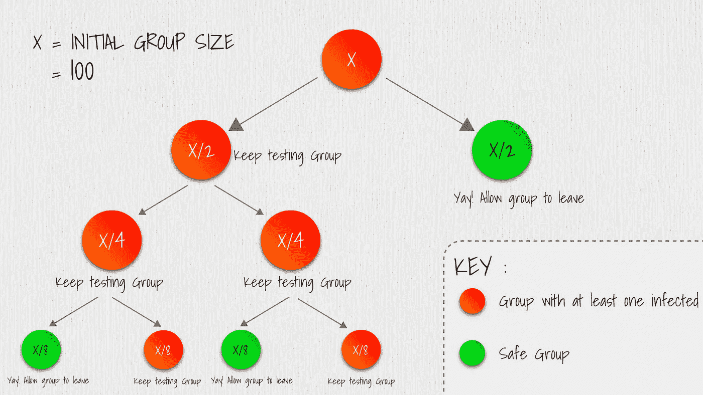

# 新冠肺炎测试的算法方法

> 原文：<https://towardsdatascience.com/an-algorithmic-approach-to-covid-19-testing-825815e46170?source=collection_archive---------38----------------------->

## 算法新冠肺炎测试

## 本文讨论了一种二分搜索法算法来测试印度潜在的新冠肺炎患者，以便有效地增加每天测试的患者数量。

印度有超过 13 亿人口，潜在冠状病毒携带者的数量每天都在呈指数增长。

照片由 Unsplash 上的 Fusion 医疗动画提供

# 问题是

随着每天潜在冠状病毒患者数量的增加，采用快速检测方法是当务之急，并且以经济的方式做到这一点极其重要。

该国正面临着检测试剂盒的巨大短缺，目前的情况是这样的-对于每一个潜在的携带者，都要进行一次测试，以测试该人对病毒是阴性还是阳性。这意味着，为了能够将 100 人中的每一个人归类为病毒阳性或阴性，我们最终要使用 100 个检测试剂盒。考虑到每天需要检测的患者数量远远高于可用的检测试剂盒数量，这种方法效率不高。

# 二分搜索法来了

这里有一个提议的二分搜索法算法，用不到 100 个测试套件测试 100 个人。

考虑一组 100 个被隔离的人，其中 5 人被感染(当前情况——在印度，每 100 个被检测的人中有 5 人检测为阳性)。

假设我们能够将 100 个人的样本混合成一个大样本(比如样本 X ),然后测试这个样本 X 的病毒。如果检测结果为阴性，我们可以宣布该群体中没有感染者。如果样本检测呈阳性，我们可以说这个群体中至少有一个感染者。

由于我们的示例假设有 5 名受感染的患者，因此样本 X 测试为阳性。

现在，我们将这一组 100 人分成两组，每组 50 人，测试样本 Y(第 1 组 50 人)和 Z(第 2 组 50 人)的病毒。如果样本测试呈阳性，我们会再次分解该组继续测试，如果测试呈阴性，我们会让该组退出，并宣布其为*安全组。*

该图帮助我们直观地了解了在一个 100 人的小组中检查每个人的病毒所需的测试次数。红色圆圈表示至少有一名感染者的群体，绿色圆圈表示健康和安全的个体群体。

将一组人分类为安全或不安全的二叉树。

在第 1 级，我们测试 1 组 100 人。在第 2 级，我们测试两组，每组 50 人。在第 3 级，我们测试 4 组，每组 25 个，对于随后的级别，我们只需测试最多 5 组仍然是红色的(因为假设总共只有 5 人被感染，所以在任何给定的级别，将显示被感染的确定性的组的最大数量是 5)。对于我们在每个级别测试的每个组，我们需要每个组一个测试套件。

对于每一个新级别的人，我们开始关闭包含受感染患者的群体，并开始消除不包含受感染患者的群体。

我们最多深入 7-8 层，才能在 100 人的群体中准确定位感染者。总共使用了多少套测试工具？

总结每一关使用的套件，1+2+4+5+5+5+5 =**32**。

我们只需要**32 套装备。这与使用多达 100 套工具相比是一个巨大的退步。**

# 结论

许多非程序员医生可能不知道这样的算法，如果我们当前的设备可以被修改以进行如上所述的池测试，它将使每天进行更多数量的测试成为可能。

德国的研究人员已经开始使用这种方法，并成功地大幅提高了检测新冠肺炎的能力。