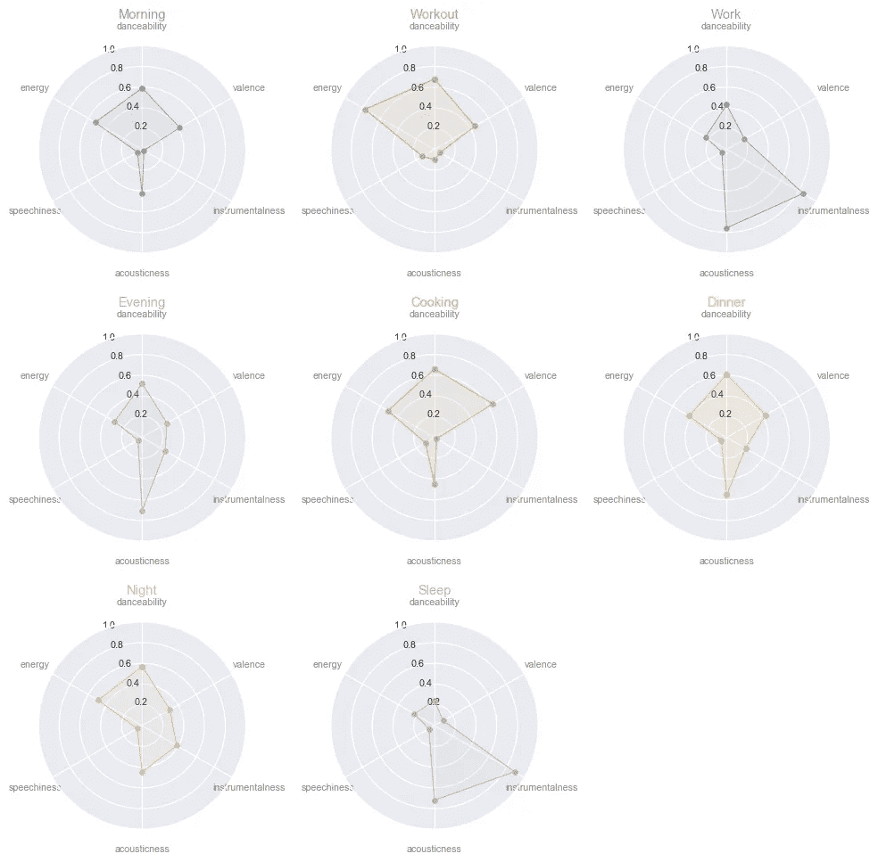
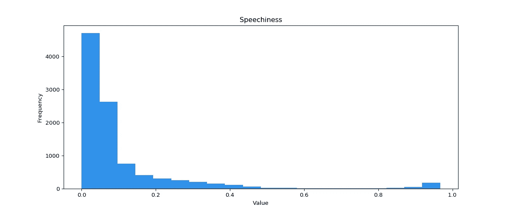
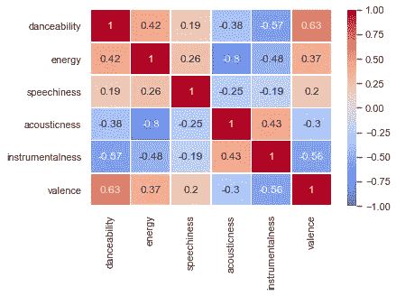
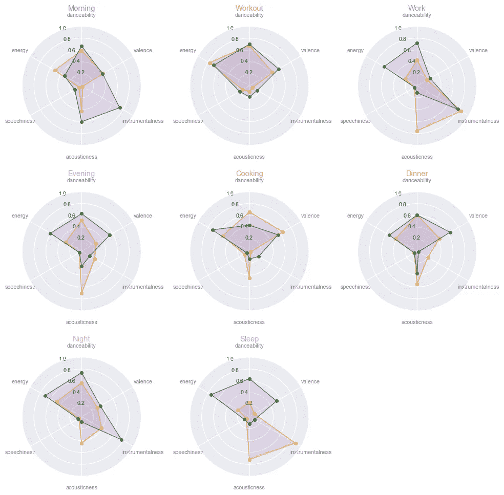

# 典型工作日的音乐收听分析

> 原文：<https://towardsdatascience.com/an-analysis-of-music-listening-on-a-typical-workday-643318929e11?source=collection_archive---------51----------------------->

## 使用 Python 和 Spotify API 探索音乐属性如何在一天中演变

斯蒂芬·尼梅尔通过[像素](https://www.pexels.com/photo/table-music-power-sound-63703/)拍摄的照片

## 音乐是语言的一种形式

我每天醒着的时候有超过 60%的时间在听音乐。我早上一醒来就放一个播放列表。当我早餐煮鸡蛋时，当我上下班时，当我全神贯注于工作时，当我试图用跑步代替健身房锻炼时，我都会听音乐。我花更多的时间选择和排队我想在淋浴时听的歌曲，而不是真正淋浴。可以肯定地说，我的音乐流媒体游戏比我的疯狂观看游戏更强。

如此多的音乐让我思考:我们听的音乐类型取决于一天中的时间吗？如果有，如何量化？一天中的音乐是否讲述了一个准确反映这一天的故事？

这一分析是试图找到上述问题的答案。

## 方法和数据收集

出于分析的目的，我将一个工作日分为以下几个部分。假设在这些部分中的每一部分播放的音乐具有不同的属性。

1.  早晨
2.  练习
3.  工作
4.  晚上
5.  烹饪
6.  主餐
7.  夜晚
8.  睡眠

Spotify 忠实于其出色的广告，其口号是*适合每种情绪的音乐*，Spotify 有几个全天服务的播放列表。对于上面的每个部分，我只是搜索了那个关键词( *morning* 代表 morning)，并根据每个部分的点赞数整理了 Spotify 创建的前五个播放列表(不包括用户生成的播放列表)。对于每个播放列表，我使用播放列表 ID 获取曲目 ID，然后使用曲目 ID 从 Spotify 的 API 获取音频特性。

Spotify 开发者 API 为单首曲目提供了以下有趣的功能。

*   **Acousticness:** 从 0.0 到 1.0 的音轨是否声学的置信度度量。1.0 表示音轨是声学的高置信度。
*   **可跳舞性:**根据音乐元素的组合，包括速度、节奏稳定性、节拍强度和整体规律性，描述一首曲目适合跳舞的程度。值 0.0 最不适合跳舞，1.0 最适合跳舞。
*   **能量:**从 0.0 到 1.0 的度量，代表强度和活动的感知度量。通常，高能轨道感觉起来很快，很响，很嘈杂。
*   **乐器性:**预测音轨是否不包含人声。乐器度值越接近 1.0，轨道不包含人声内容的可能性就越大。
*   **语音:**检测音轨中是否存在语音。高于 0.66 的值描述可能完全由口语单词组成的轨道。介于 0.33 和 0.66 之间的值描述可能包含音乐和语音的轨道，可以是分段的，也可以是分层的，包括说唱音乐。
*   **效价:**从 0.0 到 1.0 的一个量度，描述一个音轨所传达的音乐积极性。高价曲目听起来更积极(例如，快乐、愉快、欣快)，而低价曲目听起来更消极(例如，悲伤、沮丧、愤怒)。

更多的特性，每个特性的详细定义和分布可以在[这个](https://developer.spotify.com/documentation/web-api/reference/tracks/get-audio-features/)链接中找到，上面的定义都是从这里剪裁、复制和粘贴的。

使用 API 的 Python 实现[*spot ipy*](https://spotipy.readthedocs.io/en/2.12.0/)*，我检索了之前选择的 40 个播放列表的所有歌曲的音频特征。*

## *雷达图是很棒的工具！*

*这里的想法是查看(I)音乐属性在一天中的任何时间如何相互比较，以及(ii)它们在一天中如何变化。最简单的显示方式通常是时间序列图，但是有这么多的属性，这是不可理解的。下一个逻辑选项是为不同的属性绘制一个时间序列图表网格，但是它不允许我将不同的属性彼此并列。*

*我决定把重点放在上面的(I)上，并绘制了一个[雷达图](https://en.wikipedia.org/wiki/Radar_chart)的网格，这是一个可视化多元数据的好方法。下面显示了六个变量，每个变量的值在 0 到 1 之间。对于网格中的每个单独的图表，针对每个特征绘制的值是一天中相应时间的前五个所选播放列表中所有歌曲的该特征的平均值。*

*在本文的其余部分，让我们假设存在一个人，比如说*乔*，他拥有如下图所示的平均音乐属性。*

## *乔的一天看起来怎么样？*

***早晨:**(希望)睡了一夜好觉后，乔醒来听着欢快的原声(0.43)歌曲。他的能量(0.52)还不是最高的，但他仍然在跳舞(0.59)，同时梳洗打扮，准备进行大强度的锻炼。*

**播放列表:晨间音响、晨间漫步、晨间通勤、晨间动力、清晨之巅**

***锻炼:**乔以早晨的快乐状态(0.45)继续他的一天，并达到一天中的最高能量水平(0.77)。他毫不犹豫地释放内心的兽性，全力以赴，让他在接下来的一天里充满活力。*

**播放列表:野兽模式、混合动力、健身程序、力量健身程序、有氧运动**

***工作:**在工作时，乔戴上耳机，进入一种[的心流状态](https://www.headspace.com/articles/flow-state)听着高度声学(0.76)和器乐(0.85)的音乐。*

**播放列表:健脑食品、深度聚焦、专注音乐、完美专注、Workday Lounge**

***晚上:**在漫长而辛苦的一天工作之后，乔听着音乐(0.71)，每听一首，他的头可能会摆动一次(0.52)，同时决定他是想叫外卖还是做饭。*

**播放列表:晚间原声、晚间酷乐、晚间通勤、晚间爵士、晚间音乐**

***烹饪:**乔决定穿上围裙，他对自己的决定非常满意(0.65)。他喜欢精力充沛地(0.52)切蔬菜，并在锅里翻动它们。*

**播放列表:厨房霸气，你的厨房音响，蓝调厨房，用灵魂烹饪，用摇摆烹饪**

**

***晚餐:**晚餐准备好了！Joe 仍然骑在来自烹饪的能量(0.42)波上，并且继续听类似的音乐。*

*播放列表:与朋友共进晚餐、晚餐音乐、感觉良好晚餐、爵士晚餐、晚餐休息室*

***夜晚 *:*** 在一顿有益健康的晚餐后，是时候改变一下风格，听一些充满能量(0.49)的器乐(0.38)和原声(0.45)音乐了。*

**播放列表:深夜爵士乐、夜骑士、深夜音乐、Spotify & Chill、午夜时光**

*睡眠:乔觉得这一天永远不会结束。他穿上睡衣，带着计时器上床睡觉，30 分钟后停止音乐，放一些平和的低能量(0.22)、高声(0.72)和器乐(0.89)的音乐。*

**播放列表:睡眠、夜雨、睡眠爵士乐、自然噪音、梦幻氛围**

## *乔不喜欢说唱吗？*

*乔所有音乐的平均语速是 0.065，根据以下分布，Spotify 上的大多数音乐都是如此。所以可以说乔对说唱音乐不感冒。*

**

*Spotify 上所有歌曲的语音功能分布*

## *属性相关吗？*

*为了绘制下面的相关性矩阵，我考虑了为该分析选择的 40 个播放列表中的所有 3，519 首歌曲。*

**

*相关矩阵*

*   *快乐的歌是可以跳舞的歌；0.63 的正相关*
*   *原声歌曲一点也没有活力；负相关 0.8*
*   *器乐歌曲并不总是积极向上的；负相关 0.56*

## *与乔的音乐日相比，我的音乐日看起来如何？*

*虽然我在一天的每个时段都没有不同的播放列表，但我有一堆反复播放的播放列表。为了进行比较，我尝试将播放列表与本次讨论中考虑的一天中的部分时间对齐。*

*   *我以比乔更低的能量(0.33)开始了我的一天，听着来自 [Lo-Fi Beats](https://open.spotify.com/playlist/37i9dQZF1DWWQRwui0ExPn) 的高度器乐化(0.74)的歌曲。*
*   *我的锻炼，这是不存在的往往不是，或多或少类似于乔的。我听 [MKBHD 视频](https://open.spotify.com/playlist/0ZXVX604hmghJgqWCMsqcU)，里面有我最喜欢的 YouTube[MKBHD](https://www.youtube.com/mkbhd)之一的视频介绍中使用的歌曲。*
*   *我工作中的心流状态，自带高能(0.64)器乐(0.78)歌曲。我喜欢坐在椅子上从一张桌子转到另一张桌子，耳机里放着低调的科技音乐。*
*   *我的晚间播放列表 [Ultimate Indie](https://open.spotify.com/playlist/37i9dQZF1DX2Nc3B70tvx0) 类似于我的锻炼播放列表，充满了积极(0.55)和活力(0.61)。*
*   *我不经常做饭，但当我做的时候，我会即兴演奏传奇吉他独奏。顾名思义，声音(0.13)和能量(0.72)的空间很小。*

**

*绿线代表我的播放列表，橙色线代表乔的播放列表。*

*   *晚餐时，我通常是网飞，但有时我喜欢调暗灯光，坐在餐桌旁而不是沙发上，享受一顿美好而深情的晚餐。乔的晚餐播放列表和我的几乎相似，除了乔喜欢在他的歌曲中多一点乐器感(0.21)。*
*   *晚上，我喜欢到阳台上看星星和云，进行一场充满活力的(0.71)表演，让自己放松。不像乔的夜晚播放列表，房子音乐有更高的乐器性(0.77)。*
*   *在探索了一整天的新音乐后，我回到了过去一年中我听过的一些最喜欢的歌曲。看起来我的能量(0.74)一整天都很高，甚至当我想睡觉的时候。*

## *结论*

*在 Spotify 的音频功能的帮助下，我能够量化不同的歌曲，并为一个人的日常音乐之旅整理出一个故事。我看到使用雷达图作为比较工具，我一整天都在听很多充满活力的音乐。*

*巧的是，朋友们也经常说我是个活泼的人。活泼和我的其他性格特征会影响我听的音乐和最终添加到我的播放列表中的内容吗？或许，有了丰富的数据在手，就有可能根据一个人的播放列表来预测他的情绪和性格。我猜是改天的项目。*

*所有代码都可以在 [Github](https://github.com/sanketwani/music_analysis) 上获得。如有任何问题、建议或反馈，请通过 [LinkedIn](https://www.linkedin.com/in/wanisanket/) 联系我。*

## *参考*

*   *雷达图
    [https://python-graph-gallery . com/392-use-faceting-for-radar-chart/](https://python-graph-gallery.com/392-use-faceting-for-radar-chart/)*
*   *Spotify 开发者 API[https://Developer . Spotify . com/documentation/we b-API/reference/tracks/get-audio-features/](https://developer.spotify.com/documentation/web-api/reference/tracks/get-audio-features/)*