# 美国警察致命枪击案分析

> 原文：<https://towardsdatascience.com/an-analysis-of-the-fatal-police-shootings-in-the-us-ed3259391008?source=collection_archive---------34----------------------->

## 2015 年至 2020 年间的致命警察枪击事件。


[Gabriel](https://unsplash.com/@natural?utm_source=unsplash&utm_medium=referral&utm_content=creditCopyText) 在 [Unsplash](https://unsplash.com/s/photos/sad?utm_source=unsplash&utm_medium=referral&utm_content=creditCopyText) 上拍摄的照片

《华盛顿邮报》发布了一份包含 2015 年至 2020 年间美国警察致命枪击案的[数据集](https://github.com/washingtonpost/data-police-shootings)。在关于种族主义的讨论中，这个数据集可能有助于了解当前的情况。

我们将使用数据分析工具和技术来揭示一些概括数据集的数字。这篇文章旨在成为数据分析的实用指南，并从多个角度讨论美国警察枪击事件。

华盛顿邮报的这份报告提供了该数据集。我将使用 python 数据分析和可视化库。让我们从导入这些库开始。

```
# Data analysis
import numpy as np
import pandas as pd# Data visualization
import matplotlib.pyplot as plt
import seaborn as sns
sns.set(style='darkgrid')
%matplotlib inline
```

我们现在可以将数据集读入熊猫数据帧。

```
df = pd.read_csv("/content/fatal_police_shootings.csv")print("Dataset has {}".format(df.shape[0]),
"rows and {}".format(df.shape[1]), "columns")
```


每一行代表一次枪击事件，而每一列给出了枪击事件的详细信息。让我们看看这 14 列中有什么样的数据。

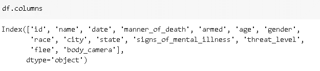

这些名字过于个人化，不能使用，可能会侵犯个人权利。id 列是多余的。因此，我将删除这些列。

```
df.drop(['id','name'], axis=1, inplace=True)
```

剩余的 12 列是:

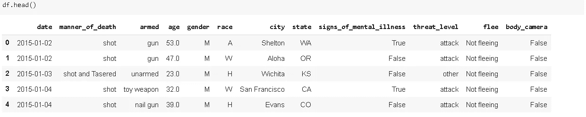

我们有关于被枪击者、枪击地点和枪击行为本身的数据。下一步是检查缺失值并处理它们。

# **缺失值**

```
df.isna().sum()
```

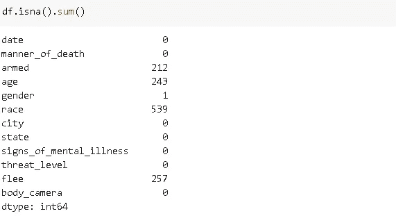

“武装”、“年龄”、“性别”、“种族”和“逃离”列缺少值。missingno library 提供的缺失值矩阵是一个关于缺失值的更具信息性的工具。它给出了数据帧中缺失值分布的概念。

```
import missingno as msnomsno.matrix(df)
```

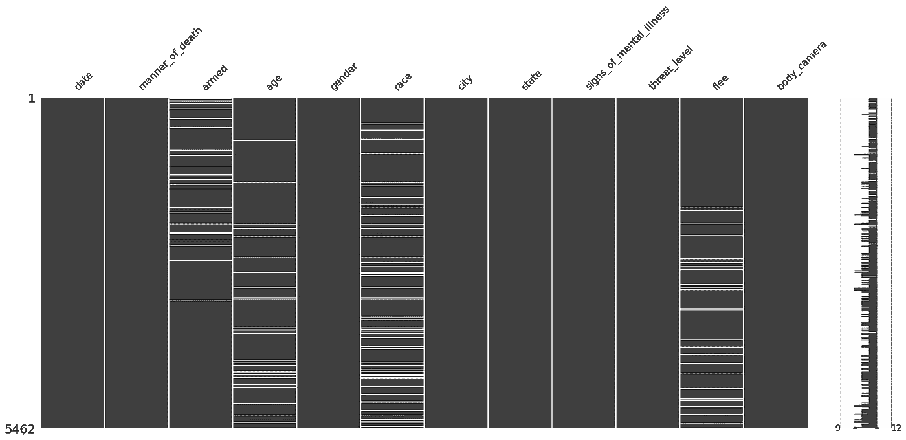

“性别”和“种族”列上的缺失值似乎在某种程度上重叠(即它们可能在同一行)。我们可以检查缺失值的热图来确认:

```
msno.heatmap(df, figsize=(10,6))
```

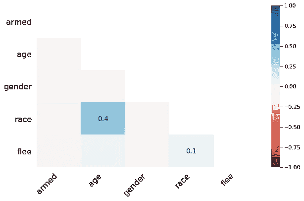

“种族”和“年龄”列中缺少的值是相关的。

“逃离”和“武装”栏描述了被枪击者的行为。

```
df.flee.value_counts()
```

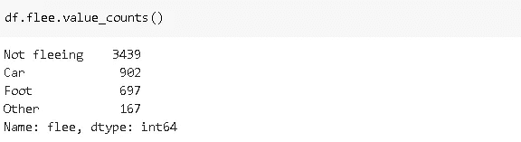

“不逃”的动作支配着“逃”栏。我们可以用“不逃”来填补缺失的值。请注意，这不是处理缺失值的严格规则。您可以选择不同的方式来处理它们(例如，丢弃它们)。

```
df.flee.fillna('Not fleeing', inplace=True)
```

让我们检查“武装”一栏。

```
df.armed.value_counts()
```

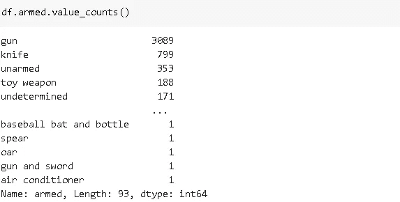

“Gun”是最常见的值，因此我将使用它来填充缺失的值。我们可以使用从 value_counts 函数返回的序列的索引:

```
df.armed.fillna(df.armed.value_counts().index[0], inplace=True)
```

我将删除“种族”、“年龄”和“性别”列中缺少值的行，因为它们描述了被枪击的人，因此在没有准确信息的情况下做出假设可能会产生误导。

```
df.dropna(axis=0, how='any', inplace=True)print("There are {}".format(df.isna().sum().sum()), "missing values left in the dataframe")There are 0 missing values left in the dataframe
```

数据帧没有任何缺失值。

# **数据类型**

数据类型在数据分析过程中非常重要，因为它们决定了如何处理某些操作和计算。

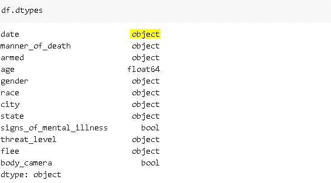

分类变量可以用“对象”或“类别”数据类型来表示。年龄可以用“整数”或“浮点”数据类型表示，真/假数据类型用“布尔”处理。除了日期列之外，所有的数据类型似乎都合适。

我将把它转换成 datetime，这是 pandas 处理日期的数据类型。转换后，我将从日期中提取“年”和“月”,并创建新列。我们可以用它们来查看年或月的投篮命中率。

```
df['date'] = pd.to_datetime(df['date'])
df['year'] = pd.to_datetime(df['date']).dt.year
df['month'] = pd.to_datetime(df['date']).dt.month
```

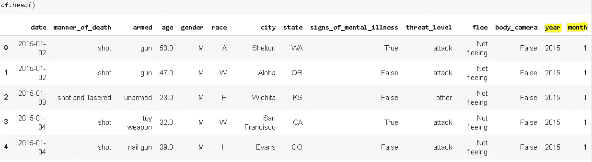

# 【2015 年至 2020 年

我们来看看 2015 年到 2020 年每天的枪击案数量有没有持续上升或者下降的趋势。

一种方法是分组日期和每天拍摄的次数。

```
df_date = df[['date','armed']].groupby('date').count().sort_values(by='date')
df_date.rename(columns={'armed':'count'}, inplace=True)
df_date.head()
```

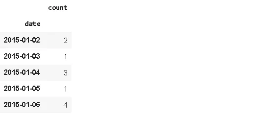

“武装”列是随机选择的，只是为了计算每天的行数。我们现在可以创建一个时间序列图。

```
plt.figure(figsize=(12,6))
plt.title('Daily Fatal Shootings', fontsize=15)
sns.lineplot(x=df_date.index, y='count', data=df_date)
```

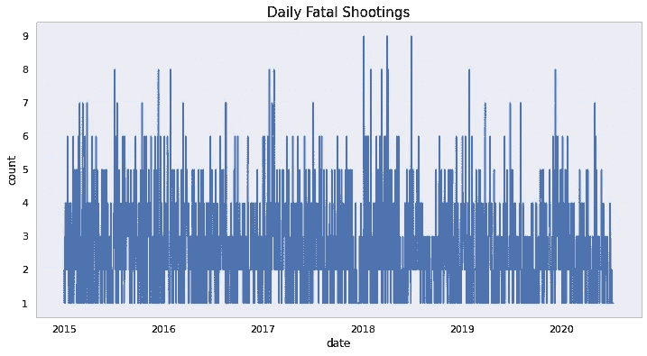

这说明不了什么。如果我们绘制 10 日平均线，效果会更好。

```
df_date.resample('10D').mean().plot(figsize=(12,6))
plt.title('Fatal Shootings - 10 day average', fontsize=15)
```

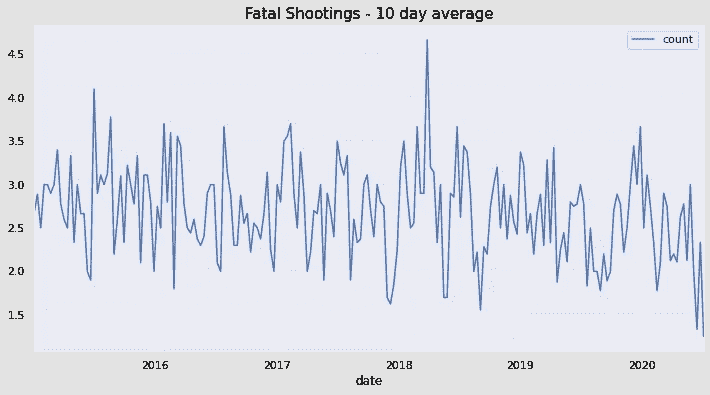

我们可以观察到一些峰值，但没有连续的趋势。

# **地点和年代**

让我们来看看数字在不同的状态下是如何变化的。我将使用**侧表**，这是熊猫实用程序库。它就像是 value_counts 的高级版本。

```
!pip install sidetable
import sidetabledf.stb.freq(['state'], thresh=50)
```

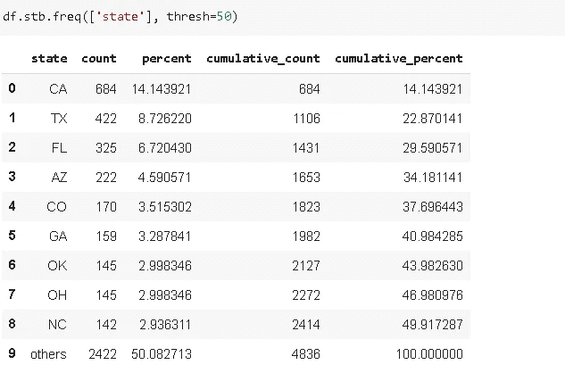

加州发生了 684 起致命枪击事件，约占所有枪击事件的 14%。枪击事件总数排名前 3 的州是加利福尼亚州、德克萨斯州和佛罗里达州。当考虑到各州的人口时，这并不奇怪。

我认为“年龄”是一个重要的考虑因素。可以根据不同的年龄组设计预防措施。

```
plt.figure(figsize=(12,8))
plt.title('Age Distribution of Deaths', fontsize=15)
sns.distplot(df.age)
```

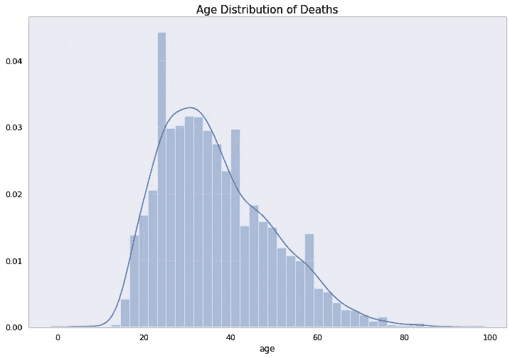

大多数被枪杀的人都不到 40 岁。每个人的生命都同样重要，但当一个年轻人死去时，对家庭来说就更难了。

# **种族**

种族主义是人类历史上最严重的疾病。它比冠状病毒或人们一直与之斗争的任何其他流行病都更危险。不幸的是，不同种族的致命枪击数量有所不同。

我们将首先创建一个新的 dataframe，其中包含每个种族每年的射击次数。数据集由 6 个不同的种族组成，它们是:


```
df_race = df[['race','year','armed']].groupby(['race','year']).count().reset_index()df_race.rename(columns={'armed':'number_of_deaths'}, inplace=True)
df_race.head()
```

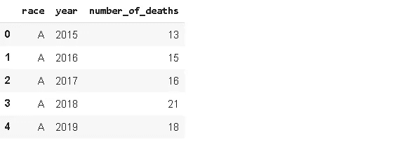

只有死亡人数不能告诉我们太多，因为这些种族在人口方面没有按比例代表。因此，我将使用每 100 万人的死亡人数作为基线。

我将使用 2019 年的人口数据，这些数据可以在美国人口普查网站上找到。尽管从 2015 年到 2020 年，这一比例有所变化，但并不像 10-15%那样剧烈。我认为比率保持在几个百分点的范围内。但是，您可以使用每年的确切人口数来提高准确性。

```
df_pop = pd.DataFrame({'race':['W','B','A','H','N','O'],
'population':[0.601, 0.134, 0.059, 0.185, 0.013, 0.008]})df_pop['population'] = df_pop['population']*328
df_pop
```

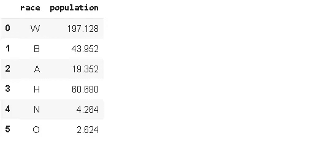

人口栏代表每个种族的人口，以百万计。我们现在可以合并 df_race 和 df_pop 数据帧。

```
df_race = pd.merge(df_race, df_pop, on='race')
df_race['deaths_per_million'] = df_race['number_of_deaths'] / df_race['population']df_race.head()
```

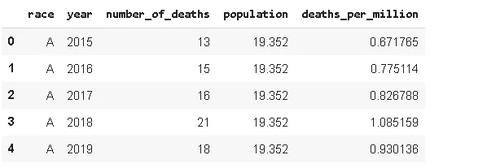

我们可以创建一个柱状图，显示从 2015 年到 2020 年每场比赛中警察枪击的百万分之死亡人数。

```
plt.figure(figsize=(12,8))
plt.title("Fatal Shootings by Police", fontsize=15)
sns.barplot(x='year', y='deaths_per_million', hue='race', data=df_race )
```

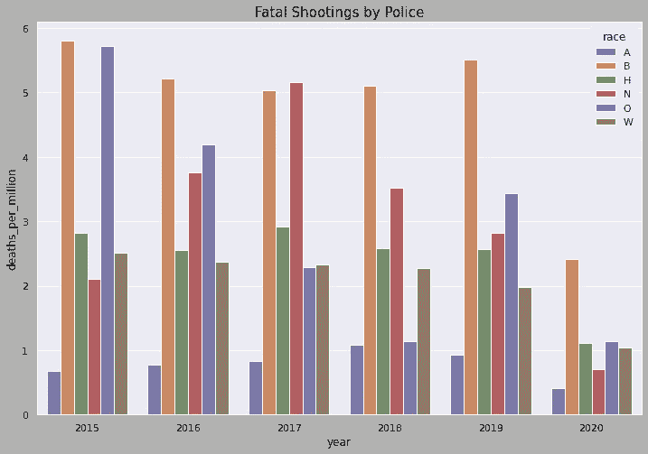

黑人(B)的比率明显高于其他种族。土著人(N)和其他人(O)人口很少，所以更合理的比较应该是在黑人(B)、白人(W)、西班牙人(H)和亚洲人(A)种族之间。

每百万人死亡的总比率:

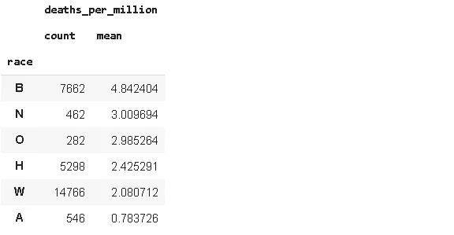

如果黑人的百万分之死亡率是西班牙人的两倍。黑人(B)和白人(W)的差别就更大了。

# **最后的想法**

种族主义是我们甚至不应该讨论的东西。不应该存在。当一个孩子听到“种族主义”这个词时，他的反应应该是“这是什么意思？”。世界上任何地方的任何类型的种族主义都需要消失。遗憾的是，现在的世界并非如此。但是，我们可以用一种方式教育我们的孩子，让“种族主义”这个词不复存在。

感谢您的阅读。如果你有反馈，请告诉我。

# **参考文献**

*   [https://github.com/washingtonpost/data-police-shootings](https://github.com/washingtonpost/data-police-shootings)
*   [https://www.census.gov/quickfacts/fact/table/US/PST045219](https://www.census.gov/quickfacts/fact/table/US/PST045219)