# 一种利用人工智能检测 DDoS 攻击的方法

> 原文：<https://towardsdatascience.com/an-approach-to-detect-ddos-attack-with-a-i-15a768998cf7?source=collection_archive---------16----------------------->

## 这是一个研究实验，解释了如何利用机器学习以及数据科学的不同方面来检测 DDoS 攻击。

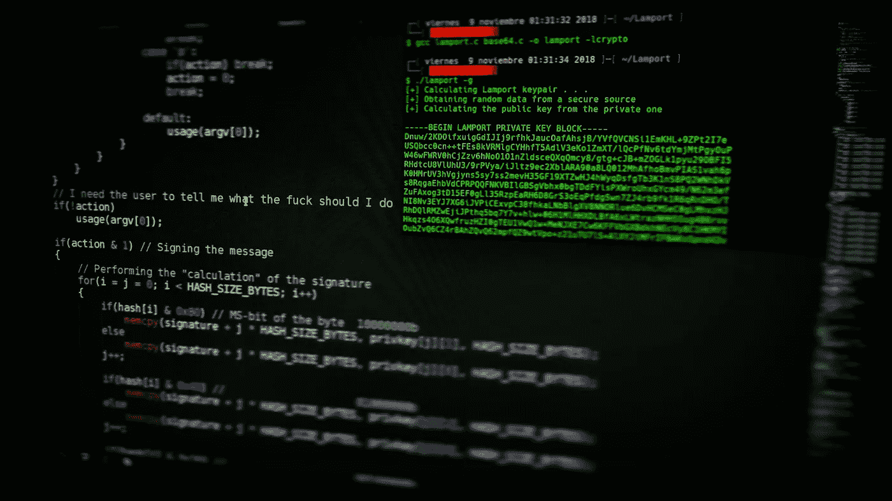

照片由[阿吉特](https://unsplash.com/@arget)从 [Unsplash](https://unsplash.com/) 拍摄

**摘要**

DDoS 攻击是互联网上最强大的黑客技术之一。黑客在这些类型的攻击中使用的基本武器是网络流量，用来关闭或瘫痪网站。这种攻击有各种子类别，每一个类别都定义了黑客试图入侵网络的方式。在这项研究中，我们讨论了一种通过人工智能模型检测 DDoS 攻击威胁的方法，准确率超过 96%。我们将 DDoS 威胁以及安全或健康的网络分为 7 个不同的子类别。

**简介**

分布式拒绝服务(DDoS)攻击的目标是网站和在线服务。这种攻击的目的是用压倒性的流量堵塞网络或服务器。它通过利用多个受损系统作为攻击流量的来源来实现有效性。相对于 OSI 模型，根据 DDoS 攻击试图攻击的网络连接层，DDoS 攻击有不同的子类别。我们通过研究划分的一些子类别有 SYN Flood、UDP Flood、MSSQL、LDAP、Portmap、NetBIOS。

机器学习和深度学习是迄今为止人工智能最常见的支柱之一。我们使用这些方法来解决不同领域的问题，精确度接近人类的表现。通过这项研究，我们再次测试了人工智能在检测网络安全领域的威胁方面的极限。在这项研究中，我们对 DDoS 攻击期间生成的日志进行了彻底的分析，使用监督和非监督技术来检测威胁，并最终使用深度学习来实现不同类型 DDOS 威胁分类的 96%以上的准确率以及安全连接。

**数据预处理**

处理数据是我们面临的首要挑战之一。这些数据有 88 个属性或特征。在有限的 RAM 内存中处理如此庞大的数据对我们来说确实是一项具有挑战性的任务。因此，我们降低了属性的数据类型，从而减少了数据帧的内存使用。float64 的数据类型降级为 float32，int64 降级为 int32，int32 降级为 uint32，依此类推。我们成功地将初始大小减少了将近 42%。我们的数据框仍然具有最大值接近无穷大的属性或要素，因此我们也在预处理阶段处理这些数据。

**目标特征分布**

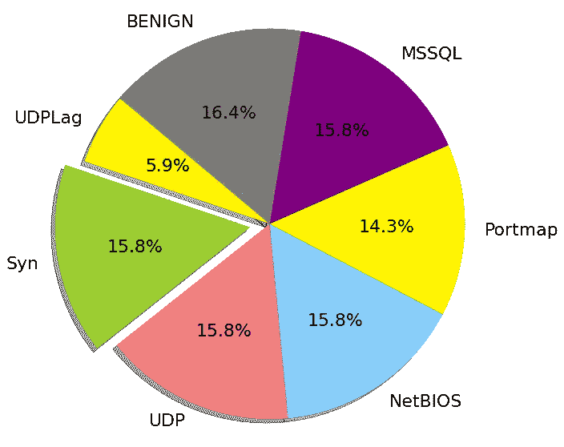

图片由 [Victor Basu](https://www.linkedin.com/in/victor-basu-520958147) 用 Matplotlib 绘制

可以看出，我们试图保持目标特征与数据集的均匀分布。

尽管 UDPLag 相对于其他的分布有点不均匀，但我们仍然在研究的后期处理了这个案例。

**探索性数据分析**

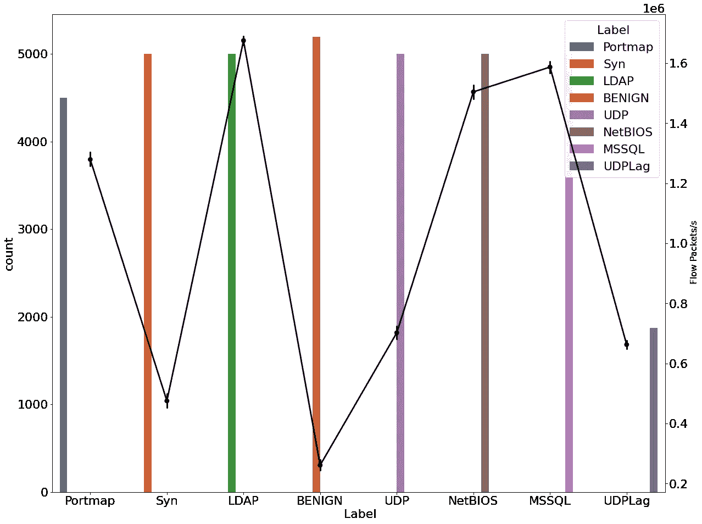

图像由[维克多·巴苏](https://www.linkedin.com/in/victor-basu-520958147)与西博恩一起绘制

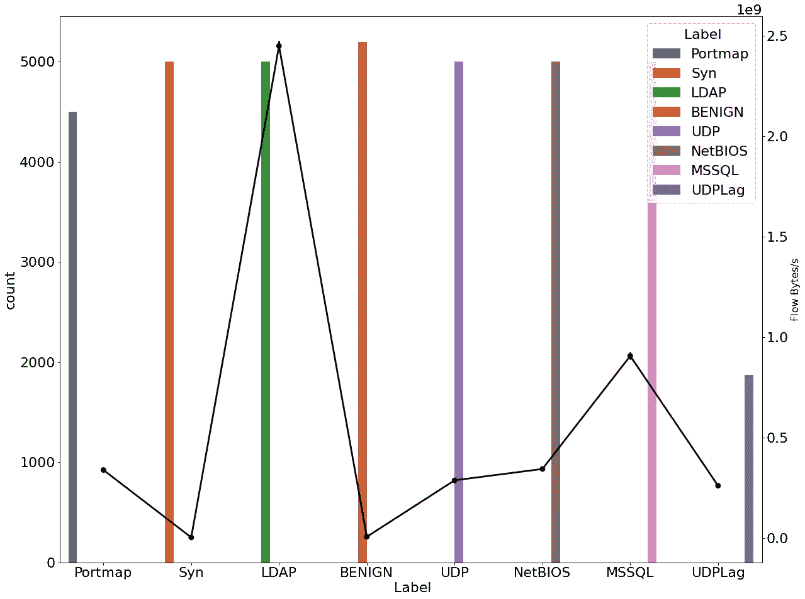

维克多·巴苏与海博恩一起绘制的图片

在上述两个分析中，我们可以清楚地观察到，与良性或安全连接相比，DDoS 攻击期间的比特流和分组流存在漂移。

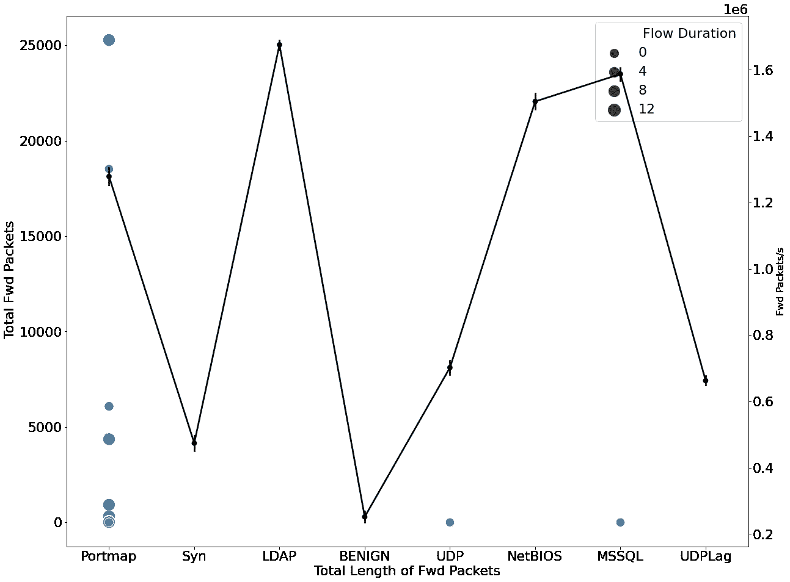

维克多·巴苏与西博恩一起绘制的图片

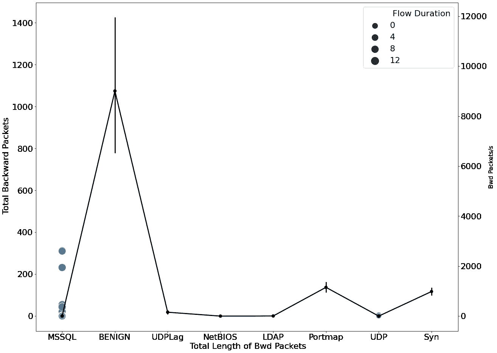

维克多·巴苏与海博恩一起绘制的图像

我们还分析了每种类型的威胁在每种类型的协议和入站中的分布。下面是显示分析的图表。

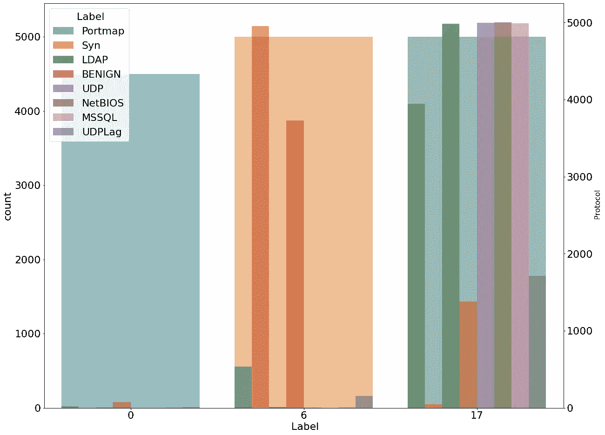

维克多·巴苏[与西博恩](https://www.linkedin.com/in/victor-basu-520958147)一起绘制的图像

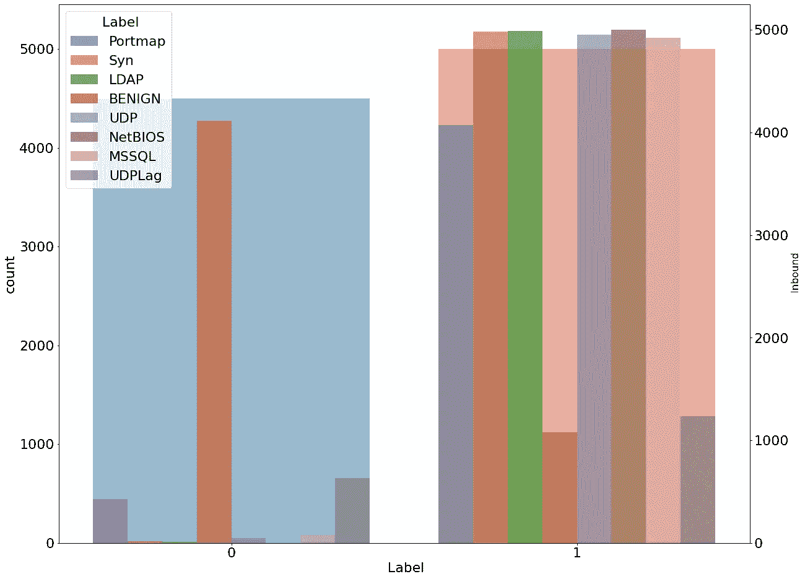

维克多·巴苏与西博恩一起绘制的图像

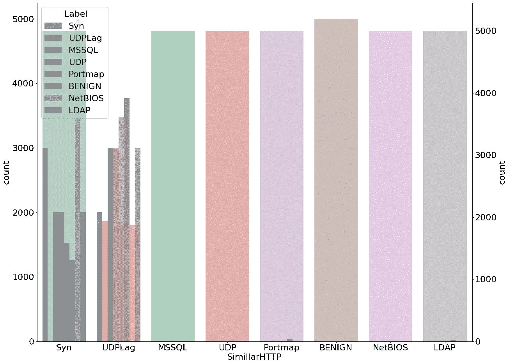

维克多·巴苏与西博恩一起绘制的图像

维克多·巴苏与西博恩一起绘制的图片

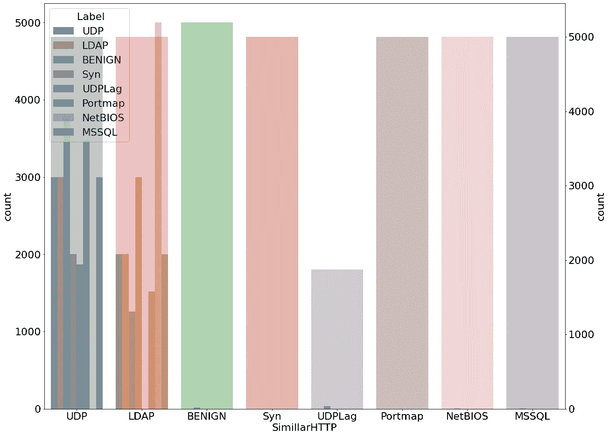

维克多·巴苏与西博恩密谋的图像

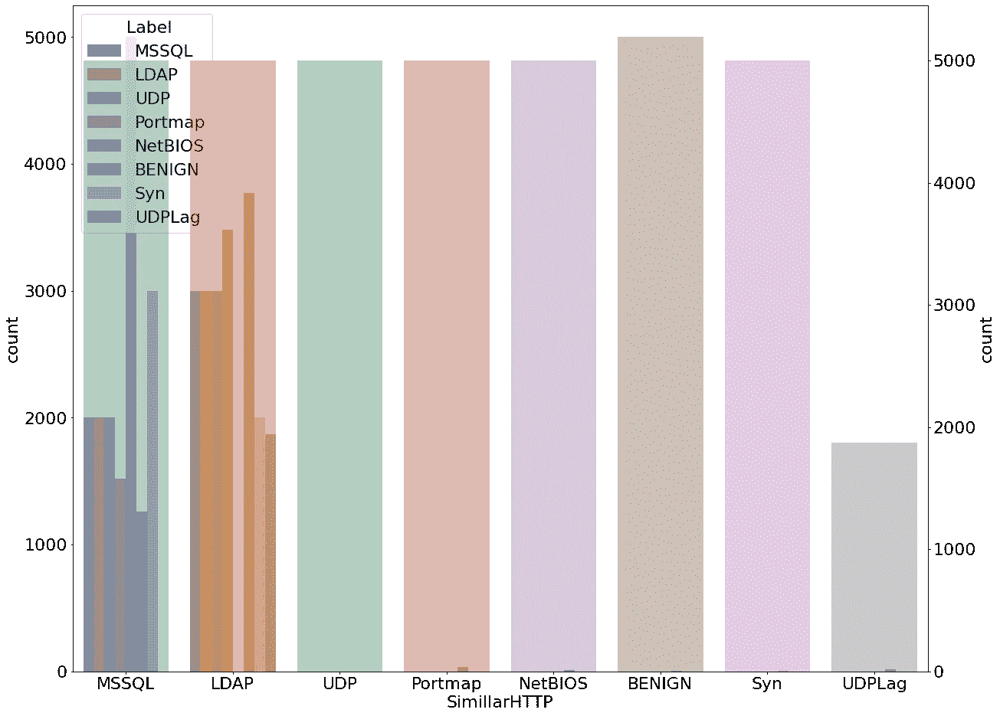

图像由[维克托·巴苏](https://www.linkedin.com/in/victor-basu-520958147)与西伯恩一起绘制

**威胁检测的无监督方法**

在无监督的方法中，我们不让我们的模型通过目标变量学习，而是迫使我们的算法从输入数据本身学习，并自己发现模式和信息。

训练前的预处理。我们已经从数据中删除了一些功能，如流 ID、源 IP、源端口、目的 IP、目的端口、时间戳、流数据包、流字节。“流量门襟/秒”和“流量字节/秒”已被删除，因为在标准缩放后，这些功能转换为对于 float64 和 NaN 值来说太大的值。

我们通过标准缩放来缩放数据，然后进行归一化。利用主成分分析进行降维，将维度降维为二维数据。

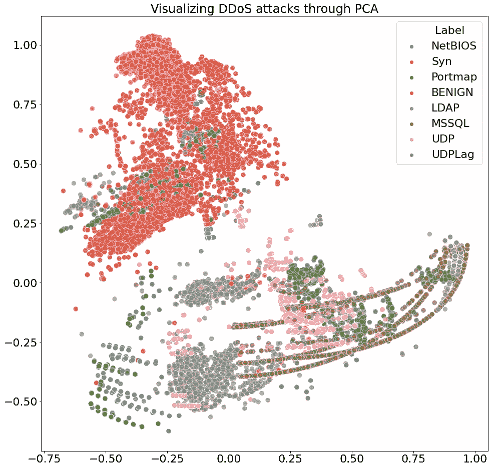

图片由 [Victor Basu](https://www.linkedin.com/in/victor-basu-520958147) 用 Matplotlib 绘制

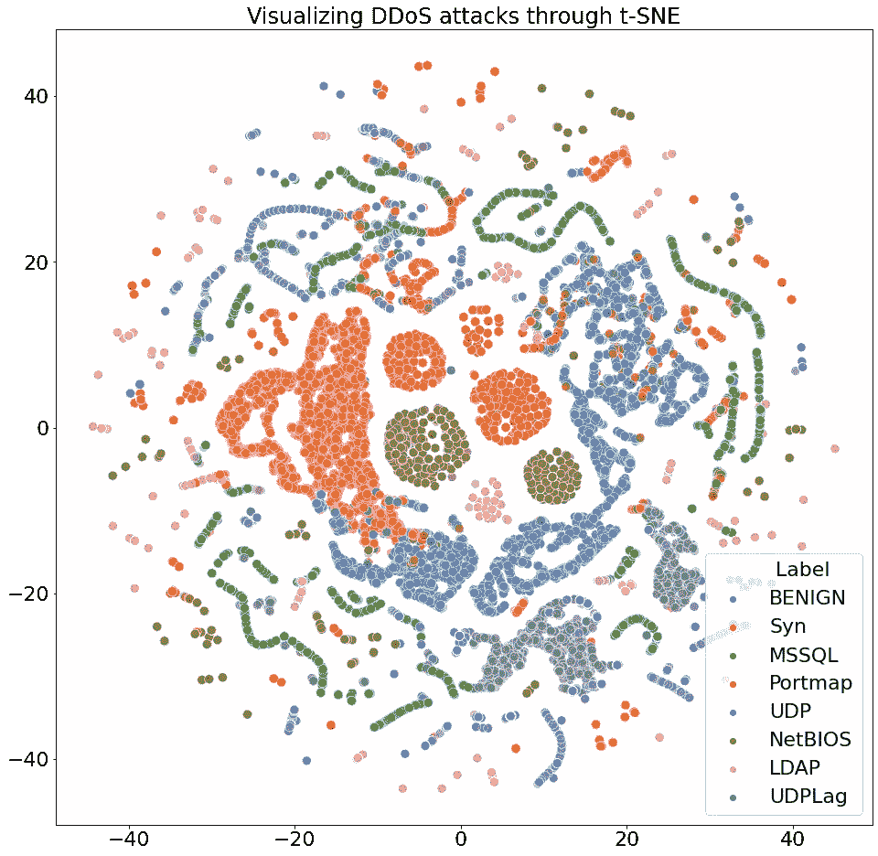

图片由[维克多·巴苏](https://www.linkedin.com/in/victor-basu-520958147)用 Matplotlib 绘制

因此，从上面的两个可视化中，可以清楚地观察到，我们的算法可以在一定程度上成功地从数据中聚类出不同的威胁。

让我们看看我们的无监督模型如何标记生成的聚类。

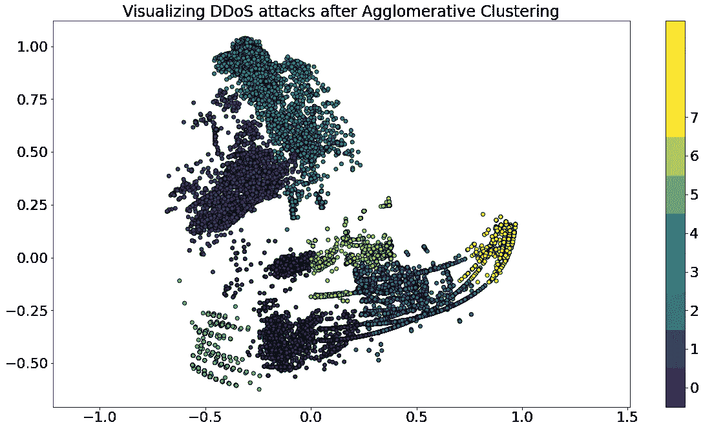

图片由[维克多·巴苏](https://www.linkedin.com/in/victor-basu-520958147)用 Matplotlib 绘制

嗯，看起来我们的无监督模型已经成功地找到了数据中的模式，并可以在某种程度上单独分割出我们的目标变量。

**注意—** 无监督学习为您提供了关于数据形状和结构的详细分析见解。当数据的形状和结构改变时，来自数据的无监督聚类和目标标签预测会改变，因为它不知道目标数据可能是什么。没有办法确定它们有多准确，这使得有监督的机器学习更适用于现实世界的问题。这也是无监督训练模型不适合在生产中部署的原因之一。

**检测威胁的监督方法**

这与无监督方法正好相反，这里我们让我们的模型通过目标变量学习，这进一步帮助我们的模型通过目标标签从数据中学习模式。我们应用了与无监督方法相同的数据预处理。在这种情况下，我们已经使用深度学习来训练我们的模型。

**我们 DL 模型的结构**

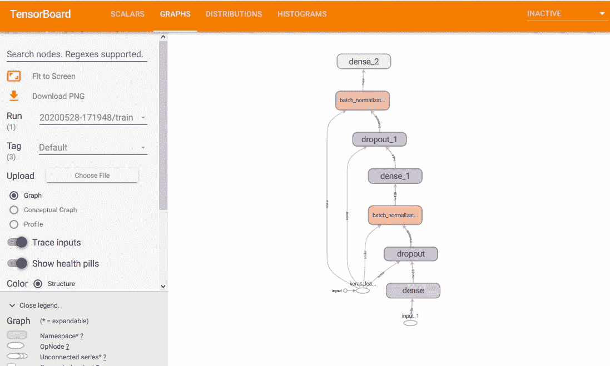

图片由 [Victor Basu](https://www.linkedin.com/in/victor-basu-520958147) 提供，截图来自 Jupyter 笔记本，同时运行 tensorboard

由于我们的目标变量是不平衡，所以我们使用分层 K 折叠来训练和验证每个折叠的数据。它相对于期望的不平衡特征来平衡训练和验证的分布。

我们使用 Adam 作为我们的基本优化器和 ROC_AUC 分数来评估模型的性能。ROC_AUC 得分根据预测得分计算受试者工作特征曲线下的面积(ROC AUC)。

我们已经对我们的模型进行了 10 次以上的训练和验证，并且我们已经获得了超过威胁检测平均值 96%的 ROC_AUC 分数，并且获得了 97%以上的最高准确度。

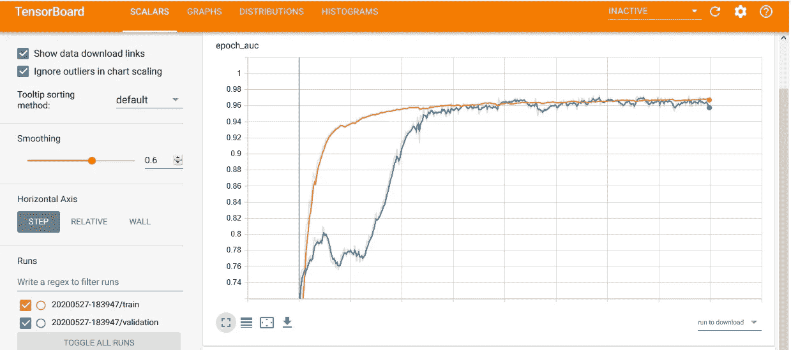

图片由 [Victor Basu](https://www.linkedin.com/in/victor-basu-520958147) 提供，截图取自 Jupyter 笔记本，同时运行 tensorboard

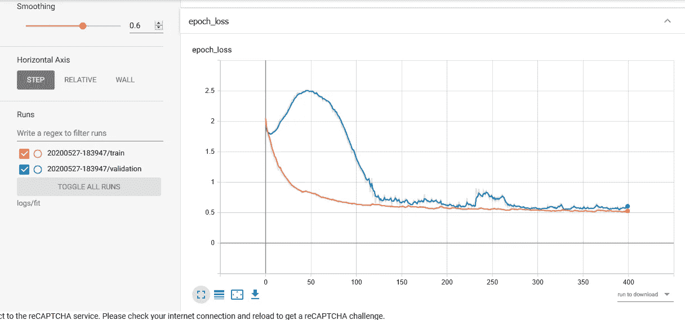

图片由 [Victor Basu](https://www.linkedin.com/in/victor-basu-520958147) 提供，截图来自 Jupyter 笔记本，当时正在运行 tensorboard

**10 折之一的分类报告**

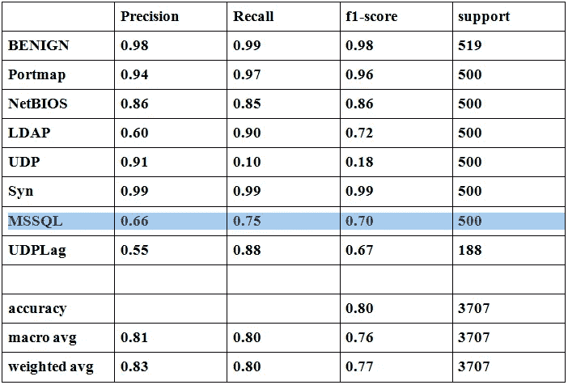

图片由 [Victor Basu](https://www.linkedin.com/in/victor-basu-520958147) 提供，截图取自 Ms-Excel

**从 10 个折叠中的一个分类每个类别的准确度**

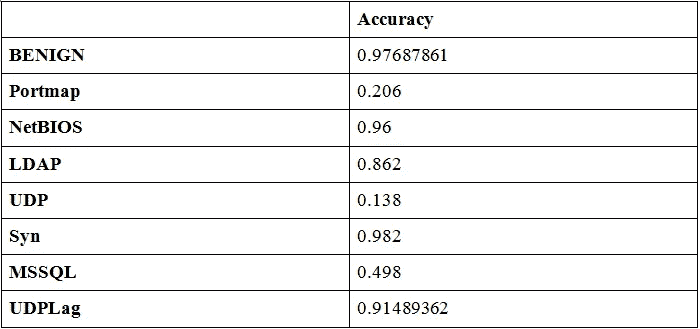

图片由 [Victor Basu](https://www.linkedin.com/in/victor-basu-520958147) 提供，截图取自 Ms-Excel

**结论**

即使与现实生活中的未标记数据相比，您只有非常少的标记数据，也有像半监督学习和自监督学习这样的技术来实现显著的性能。

模型公平性指标也是 TensorFlow 工具之一，可用于更好的模型评估和性能扩展。

**使用的工具和数据集**

新不伦瑞克大学提供了这个数据集。

TensorFlow、Scikit Learn、Matplotlib、Seaborn，以获取整个研究中使用的工具。