# 商品价格预测中 ARIMA 模型和 NNAR 模型的比较

> 原文：<https://towardsdatascience.com/an-approach-to-make-comparison-of-arima-and-nnar-models-for-forecasting-price-of-commodities-f80491aeb400?source=collection_archive---------24----------------------->

## 本文对两种广泛使用的预测商品价格的机器学习模型进行了全面的比较。

D.库拉大学数学学科

凯文·Ku 在 [Unsplash](https://unsplash.com?utm_source=medium&utm_medium=referral) 上的照片

**简介:**

一个可靠的预测模型，预测我们日常生活中最常用的两种商品价格的未来情景:小麦(零售)和大米(粗粮)。本研究采用季节自回归移动平均(ARIMA)和神经网络自回归(NNAR)对商品价格涨跌的时间序列特征进行了分析。容格盒检验证实，这两个模型都有很好的拟合和预测性能，NNAR 模型比 ARIMA 模型拟合得更好，因为 NNAR 模型的 p 值远高于 ARIMA 模型。RMSE、MAPE、MAE 和 MASE 值足够低，表明这两个模型都能够给出良好的预测，但相对而言，NNAR 模型显示的值低于 ARIMA 模型。NNAR 模型再次显示出比 ARIMA 模型更好的预测性能。在 NNAR 模型中，R 平方值为 0.98，而在 ARIMA 模型中，两种情况下的 R 平方值均为 0.95。手动计算这个值需要相当大的训练集。因此，基于所有这些测试，NNAR 模型适用于上述序列的预测任务。

在孟加拉国，小麦和大米是两种最常用的商品。近年来，这些商品的价格变化非常神秘，很难预测未来几年将会发生什么，因为天气变化和全球疫情袭击可能会对价格变化产生巨大影响。在本研究中，价格变化的未来行为是根据以前的行为预测的。一些有用的预测方法用来通过做时间序列分析来预测未来的状态。这些方法从可用的观察中分析模式，并对未来的结果做出很好的预测。

自回归移动平均(ARIMA)是由电气工程师在 20 世纪 30-40 年代发展起来的一种时间滤波方法。20 世纪 70 年代后期，两位统计学家乔治·博克斯和格温里姆·詹金斯开发了一种系统的方法，将它们应用于商业和经济数据。该模型假设时间序列是由一个线性过程产生的。但是在现实世界中，系统通常是非线性的。人工神经网络(ANN)是一种能够分析输入变量和响应之间这种非线性关系的技术。神经网络自回归(NNAR)是一种人工神经网络，其中时间序列的滞后值可以用作神经网络的输入。

在这项研究中，ARIMA 和 NNAR 被用来预测价格变化的未来行为。在本研究中，使用这两种模型进行了长期预测(根据现有数据，未来 36 个月)。在本研究中，小麦(零售)和大米—粗粮(零售)被纳入测试范围。

**数据收集:**

数据从互联网(data.humdata.org)收集，并在拟合模型前进行分析和重新排列。商品的价格因站而异。就像达卡市某一天 1 公斤小麦的零售价格不会和库尔纳市一样。这项研究的目的不是预测每个电视台的价格，而是预测全国的价格。为了解决这个问题，考虑了每个月商品的中间价格。

**分析:**

**a)选择 ARIMA:**

小麦和水稻的 ACF 图和 PACF 图分别如图所示。在这两种情况下，我们看到对 ACF 和 PACF 的几何影响，这表明选择 ARIMA 模型。

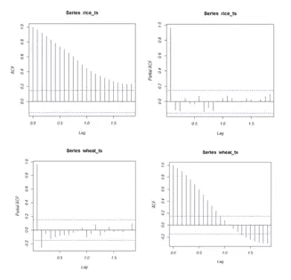

ACF 和 PACF 的大米和大米时间序列

**b)平稳性:**

首先对大米和小麦数据进行测试，以检查时间序列数据是否平稳。为了做到这一点，我们分解了水稻和小麦的时间序列数据。正如我们从这两个图中看到的，右边的条形很小，这意味着价格成分以很小的平均值变化。因此，这对全球并不重要。

图中的季节性成分表明时间序列包含季节性行为，并保证随机成分对季节性行为有显著影响。因此，时间序列的平稳性被图形拒绝。为了得到更多的证实，我们对两个数据集都进行了增强的 Dickey Fuller (ADF)测试。结果如图 4 所示。从结果中我们可以看到 p 值高于 0.05，这意味着我们不能拒绝 ADF 检验的零假设。这个测试证实了我们的两个时间序列数据都不是平稳的。

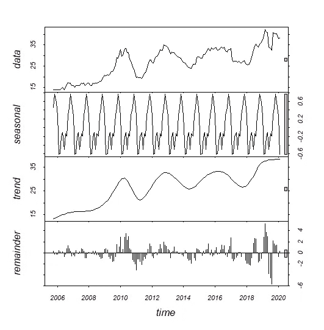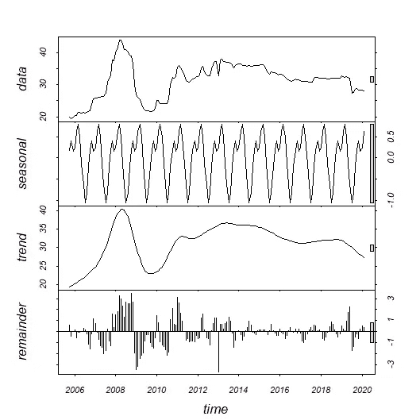

分解大米和小麦时间序列

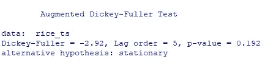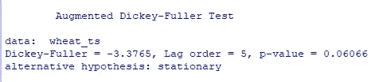

ADF 测试的结果

**c)型号选择:**

在平稳性检验确定后，我们不得不选择具有季节成分的 ARIMA 模型，即 SARIMA 模型。对不同阶次和季节的 SARIMA 模型进行了研究，最终根据最低的 AIC、AICc 和 BIC 值分别选择 SARIMA(1，1，3)(1，1，1)[12]和 SARIMA(3，1，3)(1，1，1)[12]作为小麦和水稻的数据。

根据最小 sigma 平方值和 RMSE 分别为小麦和水稻选择 NNAR(5，1，10)[12]和 NNAR(3，1，10)[12]。

**模型验证:**

Ljung-Box 测试已经在所有训练数据集上执行，以验证它们的性能。每个模型都给出了大于 0.05 的 p 值，以确保残留物呈正态分布，并且不会影响拟合。因此，通过容格检验可以降低数据过拟合的可能性。两个模型都测试了 TSCV。

箱式测试的结果

**预测方法:**

**a) ARIMA:**

在 ARIMA 模型中，通过应用数据点的有限差分，使非平稳时间序列变得平稳。使用 ARIMA(p，d，q)的标准符号，其中参数用整数值代替，以指示要使用的特定 ARIMA 模型。这里，p =滞后阶，d =差分阶，q =移动平均的阶。这个模型的过程说任何时间序列都可以用下面的等式来描述，

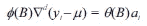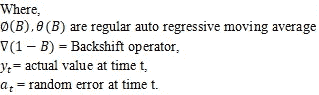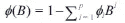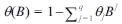

**i)季节性 ARIMA:**

季节性 ARIMA 模型是通过在 ARIMA 模型中引入一个附加项而形成的。它由 ARIMA(p，D，q) (P，D，Q)[m]描述，其中部分(P，D，Q)[m]描述季节性部分。ARIMA(1，1，1)(1，1，1)[4]被定义为

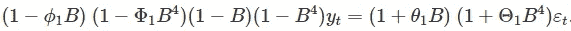

**b) NNAR:**

神经网络用于复杂的非线性预测。NNAR 通常用 NNAR (p，k)来描述，其中 p =滞后输入，k =隐藏层数。NNAR(p，P，k)是季节性 NNAR 的一般表示。

NNAR 模型是一个前馈神经网络，它包括一个线性组合函数和一个激活函数。这些函数的形式被定义为，

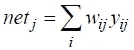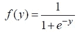

**a)萨里玛:**

SARIMA(1，1，3)(1，1，1)[12]和 SARIMA(3，1，3)(1，1，1)[12]模型分别应用于小麦和水稻数据，并给出以下图表:

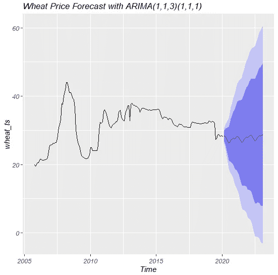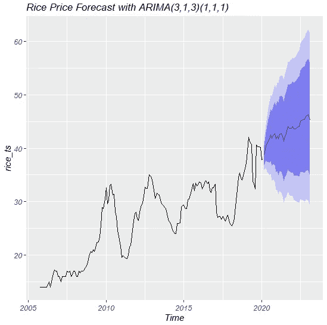

用 ARIMA 模型预测价格

残差分布图显示残差呈正态分布，这证实了该模型不存在过拟合问题。

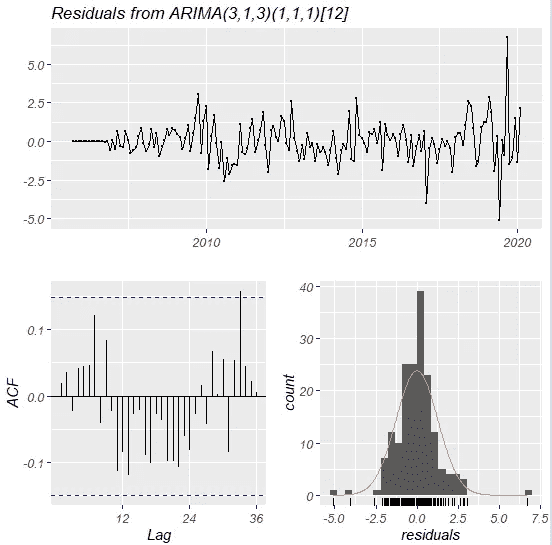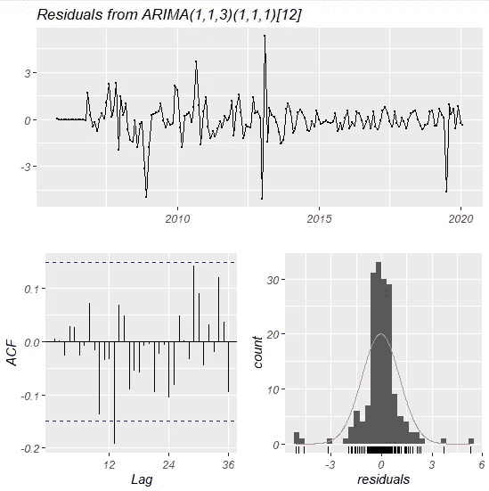

ARIMA 模型的残差

**b) NNAR:**

NNAR(5，1，10)[12]和 NNAR(3，1，10)[12]分别应用了小麦和水稻数据，并提供了以下图表:

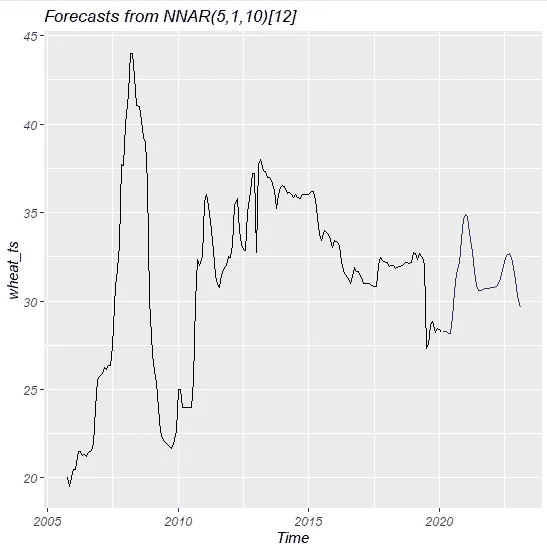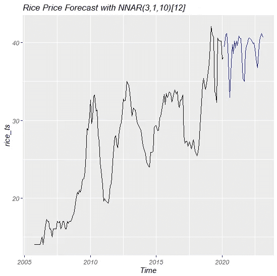

用 NNAR 模型预测价格

残差分布图显示残差呈正态分布，这证实了该模型不存在过拟合问题。

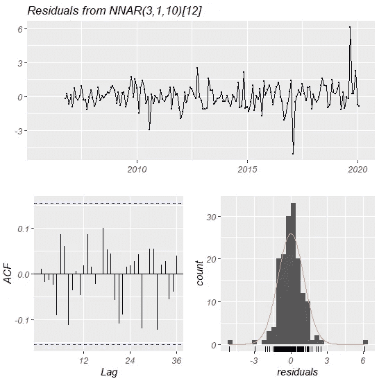

NNAR 模型的残差

**精度评价方法:**

评估准确度最常用的方法有 RMSE 法、MAE 法、MAPE 法和 MASE 法。这些方法的一般公式是:

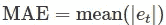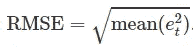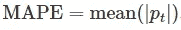

**精度测量:**

这两种方法的预测能力可以通过 ME、RMSE、MAE、MPE、MAPE 和 MASE 等指标进行比较。对于两个不同的时间序列，结果如下表所示:

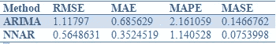

拟合模型上小麦时间序列的精度度量

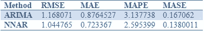

水稻时间序列在拟合模型上的精度度量

如表所示，在这两种情况下，NNAR 方法与 ARIMA 相比显示出非常好的度量，因为所有值都低得多。

**结论:**

根据上述研究，近期商品(小麦和大米(粗粮))的价格正在上涨，这可能是孟加拉国经济状况的一个警示信号，因为这两种商品是孟加拉国最常用的商品。

在这项研究中，对 NNAR 和 ARIMA 两个模型进行了测试和比较，其中 NNAR 在 R 平方统计的预测能力和预测能力方面都表现出了更好的性能。在预报过程中，NNAR 模式的误差比 ARIMA 模式低得多。

其他故事:
1) [用 R 动手做流失预测，比较不同的流失预测模型](/hands-on-churn-prediction-with-r-and-comparison-of-different-models-for-churn-prediction-4b79011a082a)

2)[R 中的时间序列预测](https://medium.com/@aashiqreza/time-series-forecasting-in-r-80a0e5834a4f?source=friends_link&sk=317b90e40789464ba9651de10910efca)

3)[R 市场份额预测](https://medium.com/@aashiqreza/market-share-prediction-with-r-57d9145ac97b)