# 一个人工智能学会玩战舰

> 原文：<https://towardsdatascience.com/an-artificial-intelligence-learns-to-play-battleship-ebd2cf9adb01?source=collection_archive---------16----------------------->

在你训练计算机玩游戏之后，看它玩游戏可能比使用机器学习模型来进行预测更有价值。在强化学习的背景下，我们可以训练一个人工智能(一台笔记本电脑)来做决定，并赋予它能力，使其成为适应不断变化的情况的“终身学习者”。在这篇文章中，我分享了我在强化学习领域的早期步骤，其中包括从头开始编码，以理解使用 OpenAI Gym 进行更高级和标准化的强化学习方法的基本概念。

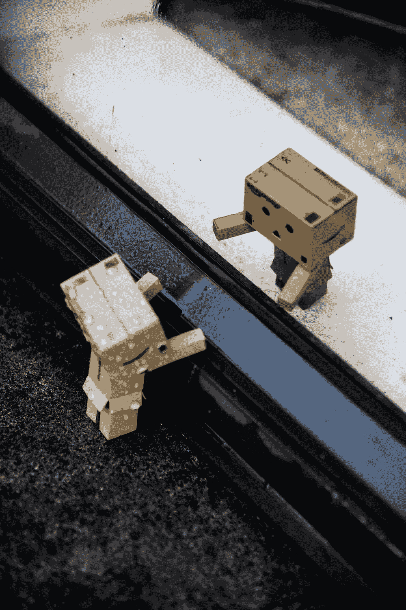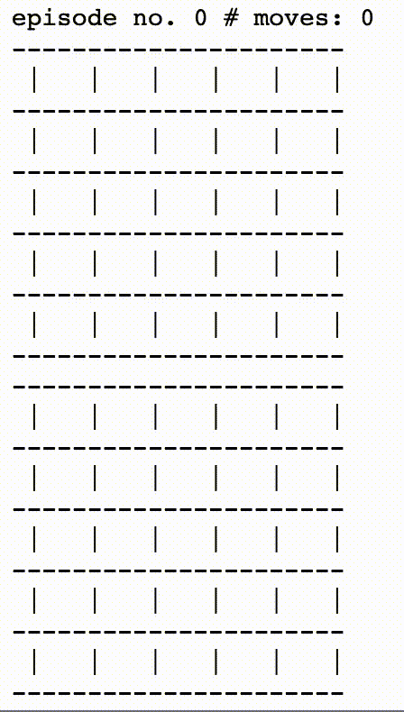

一台电脑在一个简化的 5x5 网格上玩战舰游戏，其中一艘隐藏的船占据 3 个单元。顶部网格是计算机的计分板。底部的格子对电脑来说是隐藏的，它显示了船在每场游戏开始时被随机放置的位置。“X”代表得分板上的命中，而“O”代表未命中。

在这个前所未有的生活在冠状病毒统治下的时期，我被困在家里，这给了我完成这篇文章的机会。这篇文章是关于我学习和编码强化学习(RL)元素的经验，这是教一台机器如何玩[战舰](https://en.wikipedia.org/wiki/Battleship_(game))所需要的。我选择战舰的原因是因为在我看来，编写它的框架很好地解决了第一次尝试 RL 时可能遇到的挑战。此外，编写人类可能用来赢得游戏的策略代码，然后将这个策略与机器提出的策略进行比较，也相对容易。当我第一次开始阅读强化学习时，我并不期望它与机器学习有那么大的不同，但事实是，设置教机器在特定情况下行动需要不同的方法和一些编程工作。事实上，用于预测建模的机器学习总会有一个库来帮助。相反，机器“教学”需要你思考如何适当地奖励你的机器，以便未来采取的任何行动都更像人类。此外，在大多数情况下，你没有任何数据可以开始，你设计机器所处“情况”的方式和机器采取的行动将在尽可能快地教会机器时产生重大影响。

我将遵循两种方法:

*   从头开始编码并使用线性模型来近似代理学习；
*   使用 OpenAI 健身房库和更先进的近似模型。

我在这里保留了第一种方法，因为它是我学习经验的一部分，理解任何更高级的 RL 方法的基础是很重要的。读者可以随意跳过它。同样，对于 RL 更详细的回顾，读者可以看[这里](/reinforcement-learning-101-e24b50e1d292)或者[这里](https://www.amazon.com/Reinforcement-Learning-Introduction-Adaptive-Computation-dp-0262039249/dp/0262039249/ref=mt_hardcover?_encoding=UTF8&me=&qid=)。在本文中，我将只涉及几个关键术语和方程。最后，我没有花太多时间来改进本文发布的代码，而是把它作为我在 RL 的学习经历。

## 目录。

*   [战舰快速强化学习。](#0fbd)
*   类人策略与完全随机策略。
*   [问——学习最佳行动。](#4331)
*   [使用 Q 学习和线性模型的代理训练。](#99a4)
*   [使用 OpenAI Gym 通过神经网络进行 Q 学习。](#673a)
*   [结论。](#3080)
*   [代码。](#89b2)

# 战舰快速强化学习。

在每场比赛或**一集**的开始和比赛期间，每个球员或**经纪人**看到自己的计分板。计分板代表玩家的**环境**。在任何时候，具有给定数量的命中、未命中和空单元的板配置代表代理“感知”的**状态**。当所有船单元被击中时，代理处于**终止状态**。代理从当前状态做出的任何可能的移动都是一个**动作**。代理因采取任何行动而获得**奖励**。这可以是一个正数或负数，它的定义需要在算法上使代理学习。在我的第一个方法中，我使用了下面的定义来分配奖励。当我使用第二种方法时，我将改变这个奖励方案。

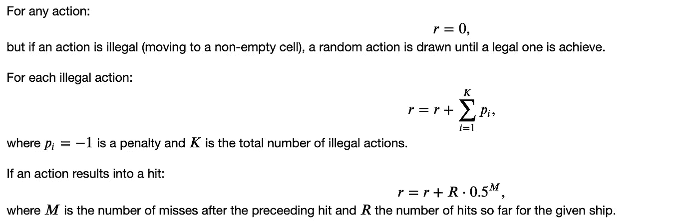

为了避免懒惰的学习者，代理人在进行非法移动时利用的每个随机动作都会被分配一个惩罚。对于一次击中，会分配一个正的奖励，但会根据自上次击中以来这次击中所花费的数量进行折扣。事实上，这个想法是让代理人学会在击中目标后关注哪里，并防止它四处游荡。

**行动价值函数** Q(s，a)是代理人通过执行行动𝑎从𝑠.获得的预期收益(或未来报酬)q 用于学习代理赢得游戏所需遵循的最佳**政策**或策略。最好的(真正的)政策是未知的*先验*。实际上，近似方法是用来获得一个最优策略的，它可能离最优策略很远。近似 Q 的模型可以被认为是代理“大脑”。

# 类人策略与完全随机策略。

为了简单起见，我们先问一个问题:“在一艘船(叫做巡洋舰)占据一个棋盘上三个格子的情况下，我会怎么玩战舰？”我随机呼叫一些位置，直到我击中一个船细胞或缩小位置的数量，这样我就可以比随机移动更聪明。

我们可以对这种方法进行编码，并为训练有素的代理创建一个基准:

*   循环遍历所有空单元，并制作一个计数矩阵，描述在每个位置有效装运单元可能出现的次数。具有最高计数的单元将是下一个动作。
*   如果命中已经存在，只考虑它周围的非空单元格。

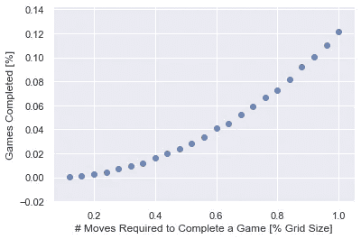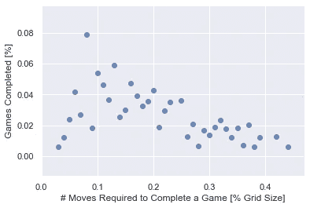

(左)一个完全随机的代理人需要在 5x5 的棋盘上走 25 步才能在 12%的游戏中完成一个游戏(击中一艘有 3 个单元的船)(在这个例子中是 100，000)。(右)一个类似人类的代理人平均需要在 10x10 的棋盘上走 18 步才能完成一场游戏(击中 3 个细胞的船)6-8%的时间。代理将从不需要超过大约 40 次移动(0.4 个网格大小)。

根据经验，一个类似人类的策略平均需要大约 0.2 倍的网格单元数量来完成一个游戏:10x10 的网格需要 20 步，8x8 的网格需要 13 步等等。

# q-学习最佳行动。

一个代理从它与环境的交互历史中学习最优策略。代理学习需要在算法中实现。在本文中，我们将使用 Q-learning，这是一种基于值的学习算法。Q 值是假设代理处于状态 *s* 并执行动作 *a.* 的整体预期回报的度量

Q-learning 是*非策略*，即代理评估并改进一个*估计* *策略*，同时使用一个*行为* *策略*(例如ε-贪婪)来驱动进一步的学习，从而从当前策略之外的动作中学习。估计策略的核心是逼近 Q 的函数，该函数使用下一状态的 Q 值来更新。这个下一个状态是通过做出有最大回报的(贪婪)行为而达到的。如果我们回忆一下 Q 学习方程式

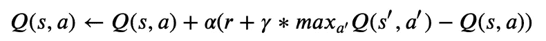

该术语

𝑠′州的𝑎′行动是 q(𝑠′最大化吗？正如我们所看到的，我们下一步采取什么行动并不重要，目标是一样的:采取使 q 最大化的行动。

像 SARSA 这样的*基于策略的*学习方法意味着在更新 Q 函数之后继续遵循当前策略。如果我们回忆一下萨尔萨方程

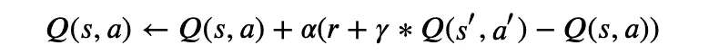

𝑎′下一步的行动将遵循目前的政策。

根据 Q-learning 训练代理的伪代码是

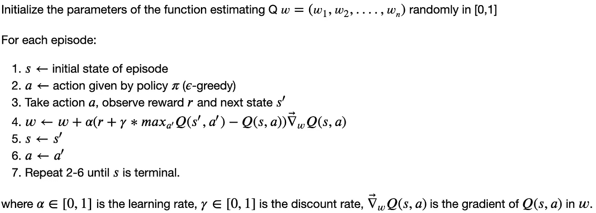

# 使用 Q 学习和线性模型的智能体训练。

一个经过最佳训练的代理人将遵循一个估计的策略，同时受行为(ε贪婪)策略的“残余贪婪”的驱动，这是保证足够的探索和缩小产生最大回报的可能行动所需要的。ε-贪婪策略允许以固定速率ε对下一个动作进行随机猜测。遵循估计策略的行动预计会产生最高的回报。在训练代理时为 epsilon 找到合适的值有助于代理在训练结束后获得最佳策略。

当用ε-贪婪策略训练代理时，有两种选择:

1.  将ε固定为所有训练集的值；
2.  使ε随时间衰减，直到达到最小值。

在第一种情况下，当训练结束时，代理将优化其策略，保持探索的速率ε。因此，即使它的估计策略可能是完美的，代理也将以速率 1-ε使用它，同时以速率ε维持随机选择。

在第二个场景中，我们依赖于这样一个事实，即随着时间的推移，代理将已经学习到足够多的知识，以便它可以做出越来越好的估计移动，以有限次数的随机猜测击中敌船(获得更高的总奖励)，其概率保持在最小ε值。需要这个最小ε来保证对代理的足够探索。事实上，随机移动有助于缩小敌舰的可能位置。有人可能会说，未经训练的代理人的估计移动也可以被认为是随机移动，那么为什么不让代理人从错误的估计移动中学习呢？随着时间的推移，这些动作会变得更好，对吗？现实是，如果我们让代理在每场比赛中从自己的错误中学习，而不让它进行足够的探索，它的策略永远不会是最好的。换句话说，估计策略的损失函数最终将被最小化，但是更低的最小值可以通过更好的策略来定位。此外，也有可能完全错过最小值。

重现下面结果所需的代码可以在[这里](https://gist.github.com/alessiot/0a3ec05a1bc4ec499a5a837beaceb1ff)找到。我用 10 万集的时间训练了一个代理，让他在 5x5 的棋盘上玩战舰，并把战舰的数量限制为一个由三个单元组成。我使用线性模型来近似 Q 函数，并且随机梯度下降，学习速率为 0.001，动量为 0.9，以最小化损失，这是 Q 值的均方误差函数。我让 epsilon 在前半集衰减，直到它达到 0.01 的值。

为了确保算法按预期运行，我做了一个初步测试，在每集开始时保持飞船位置不变。

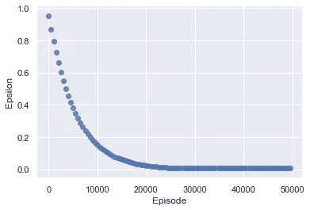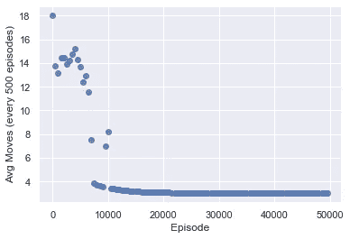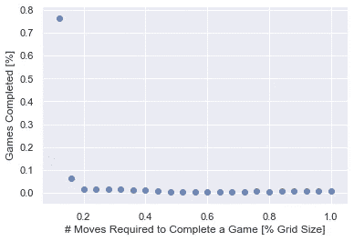

正如预期的那样，估计策略线性模型在大约 10，000 集之后过度拟合:代理了解了船的位置。

在这个初始测试之后，我做了一个更真实的实验，让隐藏的飞船在每集开始时随机重新定位。

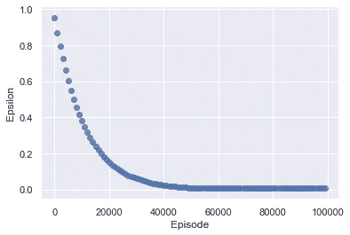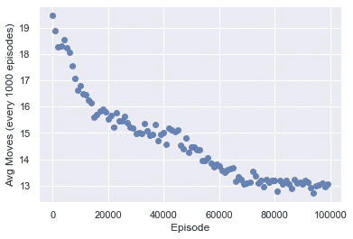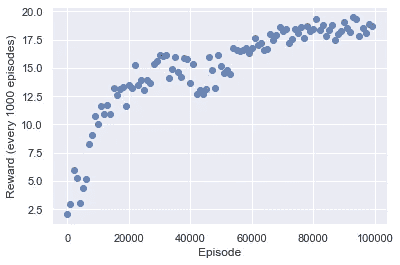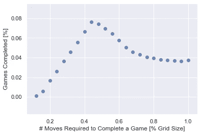

在 100，000 集的情况下，代理平均需要大约 13 步才能赢得一场游戏(0.5 个棋盘大小)。我们能做得更好吗？

# 使用 OpenAI Gym 的神经网络进行 q 学习。

学习如何为战舰游戏实现目标的代理的先前实现可以被修改以使用最新的 RL 算法，这些算法可以通过 OpenAI [稳定基线](https://stable-baselines.readthedocs.io/en/master/)库获得。使用这些库的主要改变是让战舰环境与开放的[体育馆](http://gym.openai.com/docs/)库环境兼容。OpenAI gym 标准化了任何 RL 项目中需要的所有步骤。OpenAI 健身房所需的基本组件如下图。

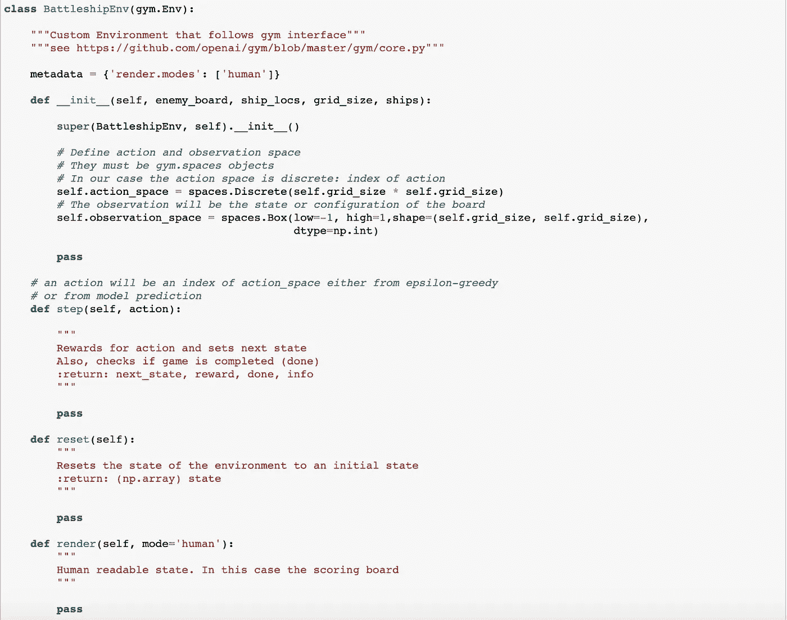

完整的战舰环境在这里[可用](#89b2)以及重现本文中描述的所有结果所需的代码。

对于我用 OpenAI 库执行的实验，我修改了奖励方案，如下所示

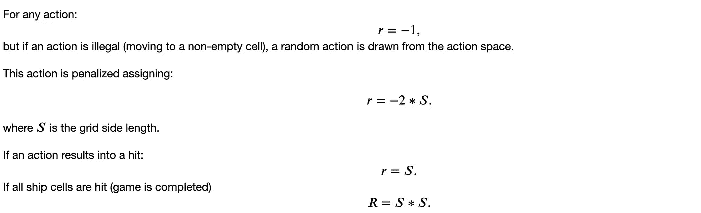

这转化为下面的代码。

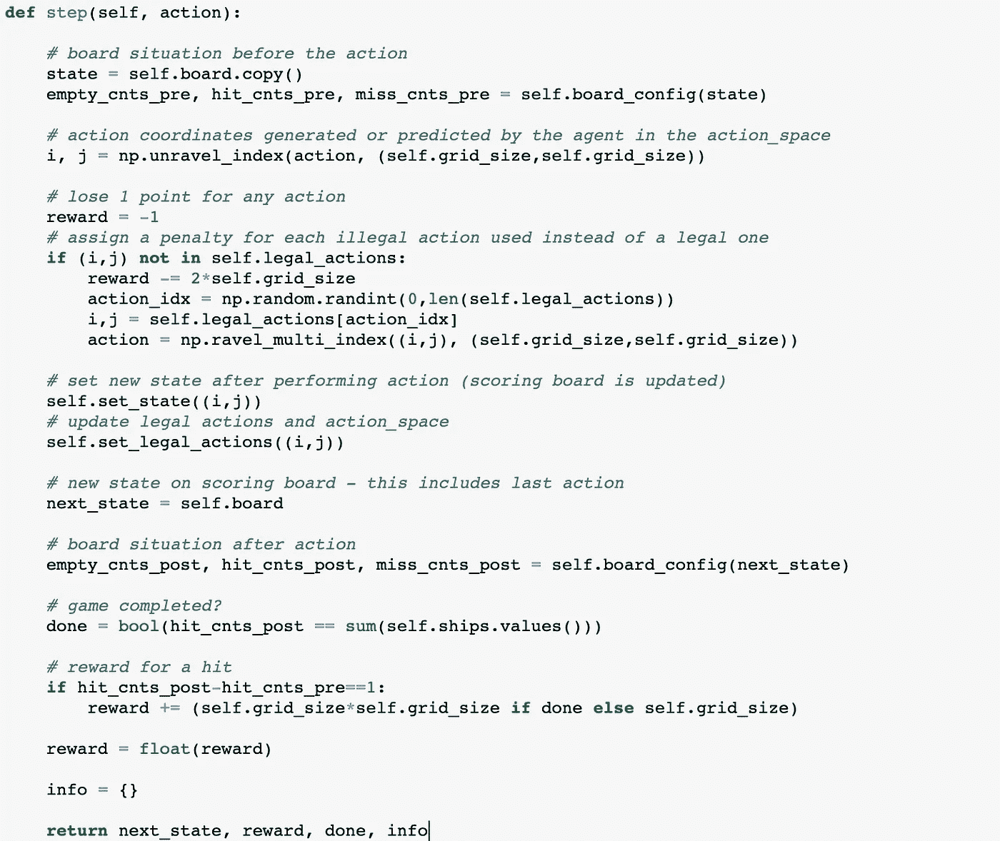

修改奖励方案的原因是使其适应于处理重复的非法行为(移至非空牢房)。我尝试了许多版本，然后提出了这个简化版本，只取决于网格边长。在 OpenAI 健身房，我发现处理非法动作并不简单。事实上，非法移动需要随着时间的推移改变动作空间，这是我没有找到一个很好的解决方案。

一旦实现了环境，我们就可以使用稳定基线提供的环境检查器来检查它。我的实现允许在每个游戏开始时随机生成敌人的棋盘或者用户定义的敌人的棋盘。

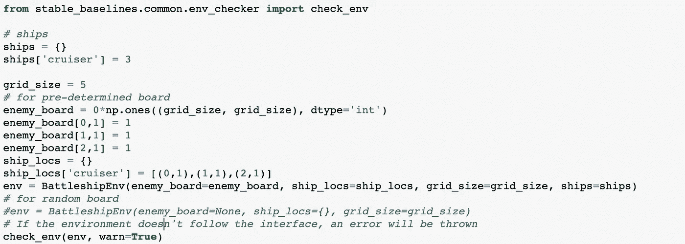

最后，我们可以观察游戏是如何进行的，并查看奖励、动作和下一个状态，以确保一切按预期进行。

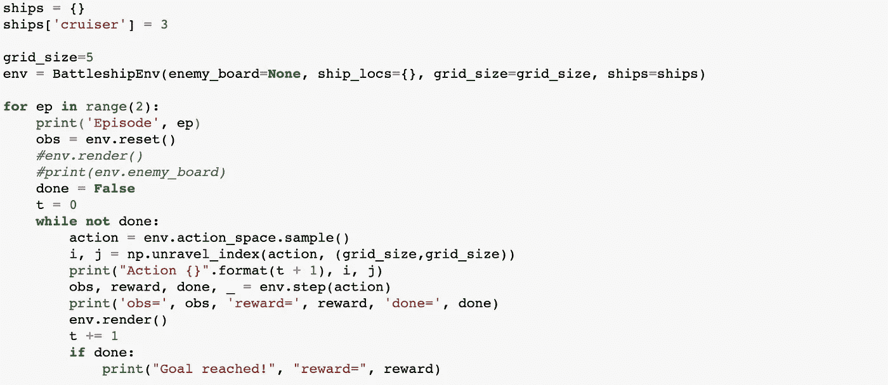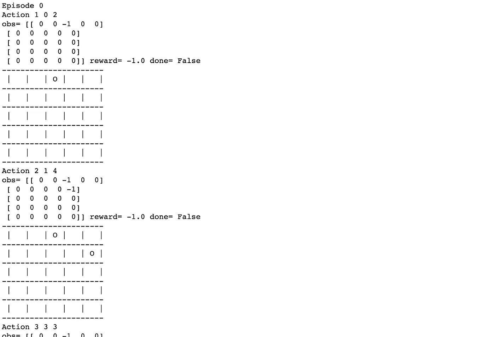

上面的例子显示了一个完全随机的代理在工作。

我做的第一个实验是训练一个代理人在一个 5x5 的板子和一艘巡洋舰上玩 1，000，000 集的战舰，它只由三个单元组成。代理人使用同步的、确定性的[异步优势行动者评论家(A3C)](https://arxiv.org/abs/1602.01783) 算法变体进行训练，称为 [A2C](https://stable-baselines.readthedocs.io/en/master/modules/a2c.html) 。我选择了使用一个 2 层 64 节点的多层感知器网络(称为“MlpPolicy”)来实现。[演员评论方法](/understanding-actor-critic-methods-931b97b6df3f)背后的主要思想是使用两个神经网络，称为评论家和演员。评论家估计 Q 值；参与者按照评论家建议的方向更新策略分布。A2C 是 A3C 的变体，但是没有异步部分。经验表明，A2C 的性能与 A3C 相当，但效率更高。

训练一个有稳定基线的代理很简单。一旦实现了有效的环境，策略训练就可以无缝处理，我们只需要担心选择算法和优化其超参数。

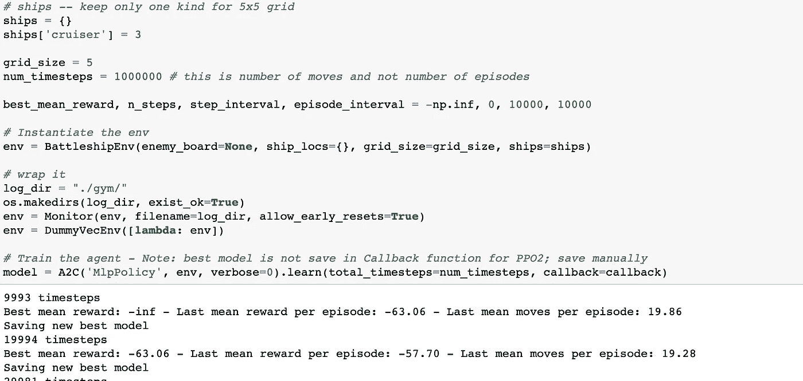

我创建了回调函数来监控训练并保存最佳策略。他们可以在我的代码完整版[这里](#89b2)找到。

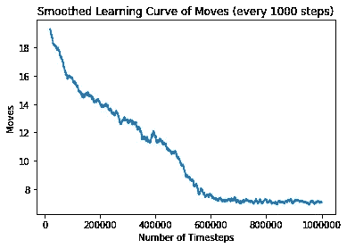

代理人在 5x5 棋盘上用一艘巡洋舰玩战舰游戏的学习曲线。1000 集的滑动窗口用于平滑曲线。

在步骤 900，000 保存了最佳模型。该策略平均需要 7 步左右才能完成一局。

第二个实验，我用的是 6x6 的板，500 万集。

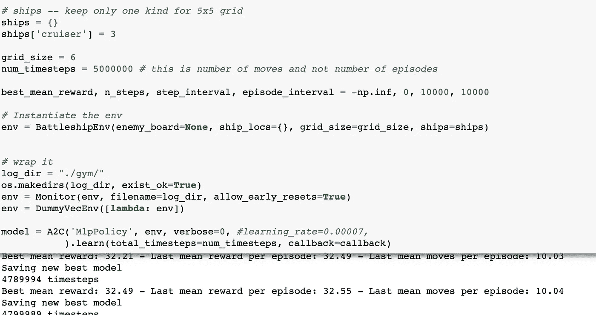

最佳模型保存在第 4，789，994 步。该策略平均需要 10 步左右才能完成一局。如果我们考虑到一个类似人类的策略平均需要大约 8 步，那么这肯定不是一个完全优化的策略。这也可以在下图中看到，其中曲线没有达到饱和。

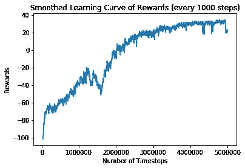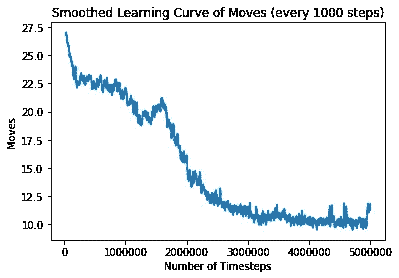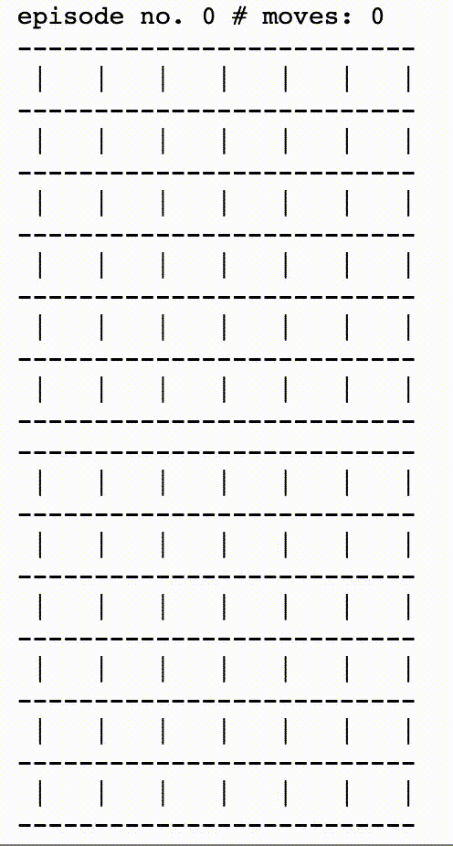

代理人在 6x6 的棋盘上用一艘巡洋舰玩战舰游戏的学习曲线。1000 集的滑动窗口用于平滑曲线。训练有素的代理人演奏也显示在渲染板上。顶部网格是代理的计分板。底部的格子对代理是隐藏的，它显示了巡洋舰在每个游戏开始时被随机放置的位置。在一个案例中(第三集)，代理人的行为出乎意料。

增加董事会规模会让学习变得更加困难，或者至少需要更长时间的培训。我的目标是看看代理是否能在第一次击中后学习下一步该做什么，以及在稍大的网格中学习正确的动作需要多长时间。

因此，在我的第二个实验中，我使用了 7x7 板和 10，000，000 集。然而，这一次，在为这许多集进行训练之前，我使用 Python 库 [hyperopt](https://github.com/hyperopt/hyperopt) 优化了模型超参数。事实上，像以前一样使用默认的超参数会使模型难以收敛。我只优化了与神经网络相关的超参数，特别是批量大小(n_steps)、学习速率、学习速率调度程序类型、学习速率衰减(alpha)、RMSProp 的ε因子，将所有其他超参数保留为默认值。优化空间如下所示。更多细节可以在代码中看到。

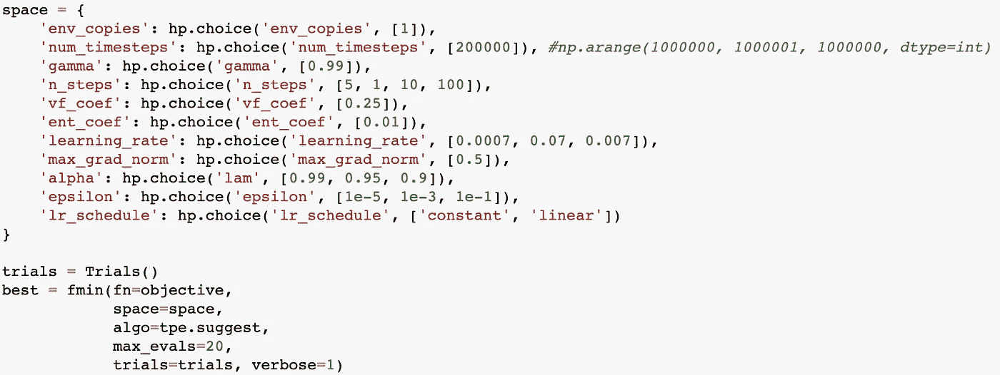

发现超参数的最佳值是α= 0.99，n_steps=10，learning_rate=0.007，lr _ schedule =‘常数’，
ε= 0.001。然而，我只有耐心等待 20 次试验，每一次都训练代理人 20 万集。根据想要尝试的试验次数(超参数组合)，找到最佳超参数可能需要很长时间。我把这个留给读者去玩。

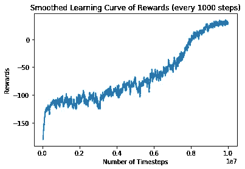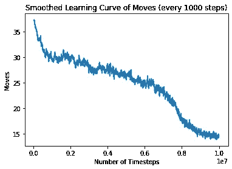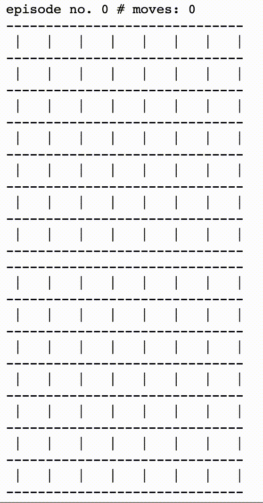

代理人在 7x7 棋盘上用一艘巡洋舰玩战舰游戏的学习曲线。1000 集的滑动窗口用于平滑曲线。训练有素的代理人演奏也显示在渲染板上。顶部网格是代理的计分板。底部的格子对代理是隐藏的，它显示了巡洋舰在每个游戏开始时被随机放置的位置。如前所述，在某些情况下，由于策略没有完全优化，代理的行为会出乎意料。

训练有素的特工平均需要 14 步才能完成一局游戏。对代理人进行更长时间的培训可能会带来更好的政策。

在 8x8、9x9 或 10x10 的网格上训练一个代理需要多少集？使用来自 5x5、6x6 和 7x7 网格的结果进行粗略的外推表明，我们可能很容易需要数亿个，并且可能永远不会达到近似模型的损失函数的最小值。同样，我的目标是学习 RL，我没有花时间来解决这个特殊的问题。

为了更快地收敛到最优策略，可以尝试的事情很少:

*   修改奖励方案；
*   使用不同的算法；
*   优化算法超参数。

在这三者中，找到一个更好的奖励方案将使收敛到最优政策的速度明显加快。

# 结论。

在这篇文章中，我描述了我使用战舰游戏进行强化学习的经历。对于任何愿意学习 RL 的人，我会建议同样的方法:选择一个游戏，编写它的框架，让它准备好应用 RL 技术，用它来实验 RL 的美丽和局限性。

我要感谢 [Sundar Krishnan](https://medium.com/u/b61b6673cdce?source=post_page-----ebd2cf9adb01--------------------------------) 所有有益的讨论。

# 代码。