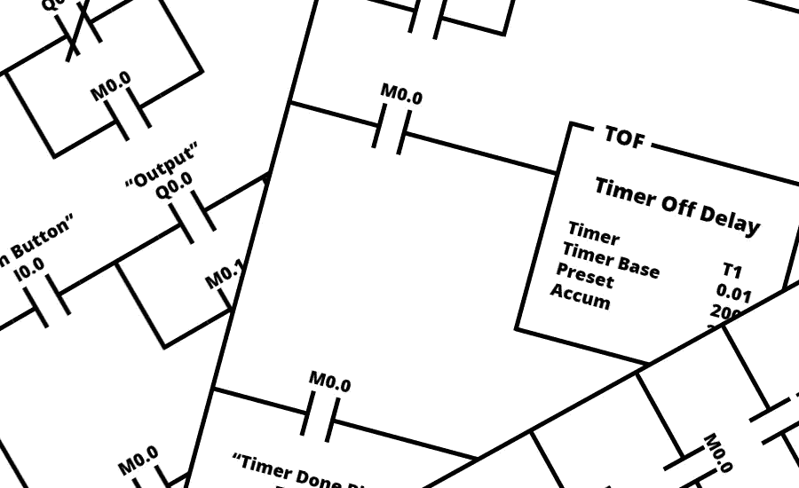
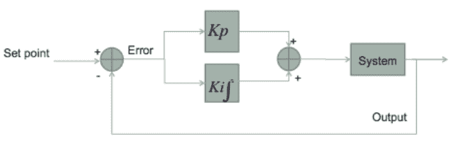
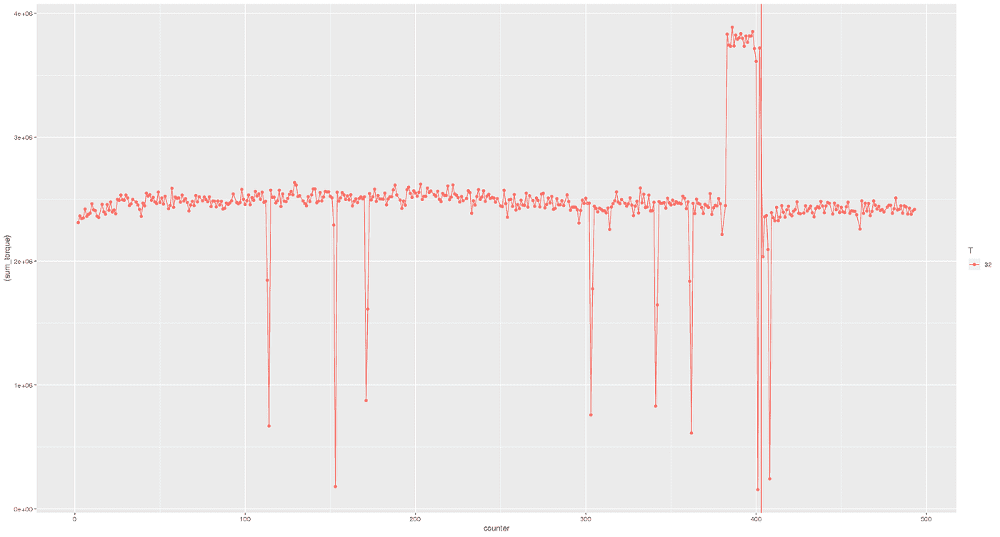
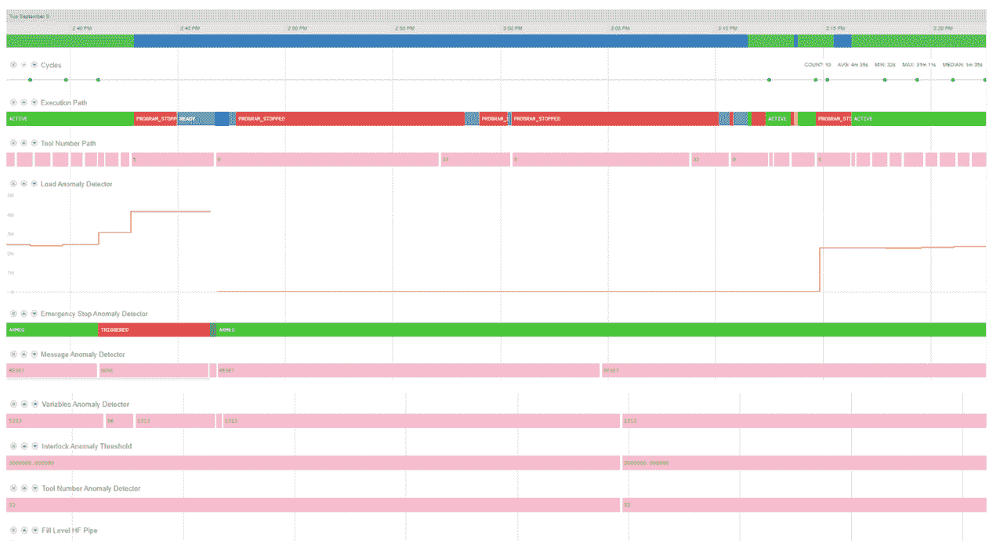
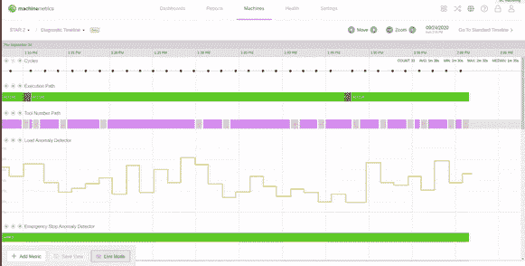
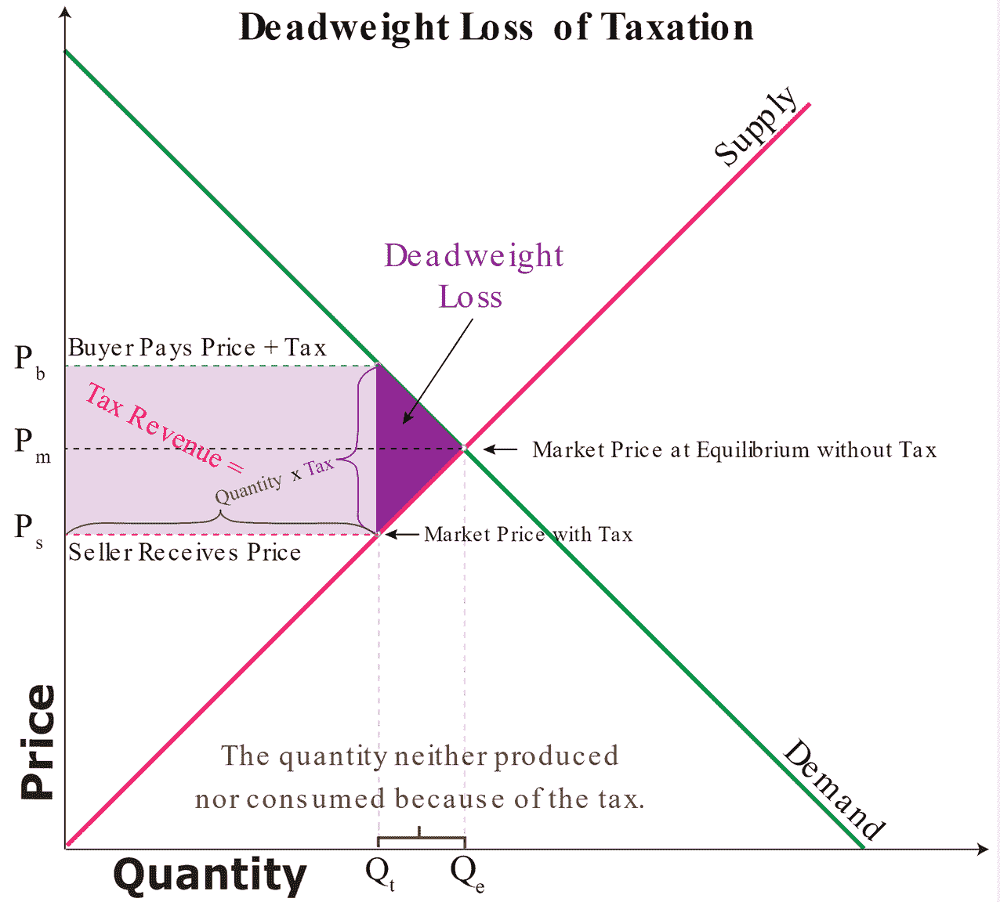
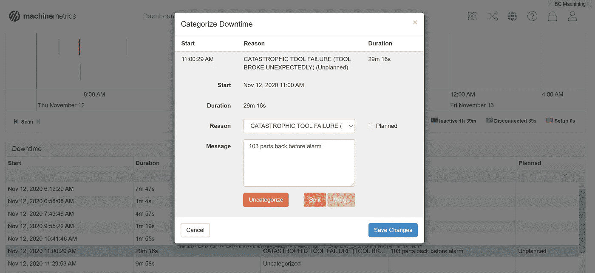

# 利用自主加工系统优化工厂产量

> 原文：<https://towardsdatascience.com/an-autonomous-machining-system-for-optimizing-factory-output-using-21st-century-techniques-to-a6e8a6660bc0?source=collection_archive---------47----------------------->

## ***用 21 世纪的技术对抗 20 世纪的思维定势***

来源: [PLC 学院](https://www.plcacademy.com/ladder-logic-examples/)

**简介**

在 MachineMetrics，我们选择将公司标志变成绿色，作为一种生产力的闪烁信号。绿色表示“开始”，在机器度量系统中，它还表示生产目标“达到目标”。

但是环保意义上的绿色呢？我们提高车间效率和减少浪费的具体方法是什么？从另一种绿色环保的角度来看，这又如何惠及我们的客户:金钱？

最近发布的 MachineMetrics 软件提供了一个生动的例子，它使我们能够部署一个解决方案，为我们的一个客户减少 90%以上的废弃零件。部署完全是远程的，不需要运输任何额外的物理硬件或安装售后传感器。在新冠肺炎疫情期间，我们完整地实施了这个解决方案；不需要任何人出差，我们从来没有踏进客户的机器车间，我们的客户也不需要安装任何额外的东西。我们为该客户节省了大约 5000 美元/年**每台部署了该解决方案的机器**的成本，并且只有一台边缘(物联网)设备为他们的整个工厂提供服务。

本质上，我们采取了一种纯粹基于算法和信息的方法来产生积极的物理影响，既有利于我们客户的底线，也有利于整个环境。为什么最大限度减少浪费和保护环境很重要？简单的答案是，低浪费和高效率是密不可分的一对——最大限度减少浪费的公司必然拥有更高效的运营。想象一下工业革命时期污染、肮脏的工厂，并把它们与今天时髦、现代的机器车间相比较。

我们对其他客户进行了调查，以了解该产品的潜力，并确定了多个可以远程部署该产品的其他站点，以使我们的客户和环境受益。这项技术的可伸缩性和最少监督的特性是其成功的关键。

**技术的核心**

在我们之前的[博客文章](https://medium.com/machinemetrics-techblog/unlocking-the-power-of-high-frequency-control-data-ad2608aac10f)中可以找到对该技术更深入的剖析，但简单地说，我们正在使用控制制造商现有的 API 从机器的主轴电机中提取加工物理数据。如果你想一想，主轴和刀具是机器的最后两个部件，在完成之前接触到正在制造的零件。机器的所有问题，无论是松动的滚珠轴承，任性的夹头，还是过度振动，最终都会影响到主轴，在主轴上产生零件的光洁度问题。

某些指标必须以非常高的频率可用，以启用机器中的反馈系统。反馈在机床控制中是强制性的，因为它们需要根据与制造零件相关的变化的外部(物理)条件不断调整它们消耗的功率量。例如，当刀具和材料相互接触时，主轴突然需要更大的功率来保持高速运转。反馈机制持续监控速度和扭矩等指标，以便正确执行这些调整。我们只是出于自己的目的提取这些指标，以优化机器操作、降低废品率和预测工具故障。

我们能够从高频控制数据中获得各种物理力和机器属性，无需传感器。来源:[数控车床加工](https://www.cnclathing.com/guide/5-common-cnc-machining-problems-errors-and-solutions-cnclathing)

事实证明，用于保持主轴以正确速度运行的相同指标也非常适合评估零件质量和刀具健康状况(惊讶吧！).我们可以从这些指标中精确测量加速度、摩擦力，甚至工具锋利度、材料硬度和零件几何形状。这实际上有一个非常优雅和美丽的原因。

现代机床使用一种称为 PI(比例积分)控制器的东西，这种控制器通常用于各种需要闭环反馈机制、需要自动控制的系统。你的汽车的巡航控制使用相同的机制——当你下坡时，汽车会由于外部环境而自然加快速度，从期望的设定点(比如 60 英里/小时)产生一个*误差*。PI 控制器检测到该误差，并改变进油量和应用的制动，以最小化该误差并回到期望的设定点。当你上坡时，误差在另一个方向，因此燃料和刹车在另一个方向上按比例使用。

PI 控制系统的简图，这是一个闭环系统，它不断尝试将外部刺激干扰引起的设定点误差降至最低。来源:[联合学院 ECE 系](https://muse.union.edu/seniorproject-menesese/implementation/)

我们中的一些人有过巡航控制期间检查发动机灯亮起的经历。这可能会发生，因为 PI 系统是特别征税，并可能有助于暴露潜在的问题与您的汽车。机床总是*运行 PI 系统，但是所涉及的度量标准通常不会以非常复杂或灵活的方式被监控。当为时已晚并且您的机器由于严重故障已经停止生产时，预设的安全阈值可能会启动并向您发出警报。*

MachineMetrics 在其边缘设备上收集这些信息，也可以批量发送到云端进行离线分析。这使我们能够使用基本上任意复杂和定制的算法来监控 PI 控制器指标，可能会将特定机器的行为信息追溯到几个月或几年前，以及我们监控的所有商店中类似机器的行为。

当检测到问题时，出现问题的一种方式是通过机器度量系统向操作员或车间经理发出警报。但是，正如我们将很快看到的，问题也可以直接反馈给机器控制，允许它几乎立即采取适当的预编程动作。

回顾一下，PI 控制器的本质是来自设定点的误差被不断地测量和最小化。在机床的情况下，设定点是机器的每个主轴和轴的指令速度和位置。当刀具接触金属时，设定点的误差增加，使得机器有必要调整用于旋转主轴和移动刀具的功率量，以实现期望的位置和速度。我们无需在常用的边缘设备上添加任何额外的硬件，就可以提取该流程中使用的指标来衡量机器的健康状况。

**部署**

*算法*

正如你可能想象的那样，当工具变钝或以其他方式受损时，制造相同的零件会消耗更多的能量。当你用铅笔写字时，如果铅笔变钝或笔尖折断，你必须更用力才能做出同样的记号。因此，当我们客户的一些机器上的功率消耗超过某个点时，我们在历史上看到了与工具受损的 100%相关性。过了这一步，机器可能表面上看起来运行正常，但它生产的零件实际上是不合格的，注定要成为废品。在车间有人发现问题并更换工具之前，我们的客户通常会收到 10 到 50 个废弃零件。这些废弃零件每隔几天就会出现一次。

这个问题的性质使得它可以有一个相当简单和健壮的解决方案。我们观察特定加工操作过程中消耗的总主轴能量，并根据过去“正常”零件与过去报废零件的比较来设置阈值。在下图中，垂直红线代表操作员干预和机器度量中的相应注释，而每个点代表连续零件消耗的能量。

在工具失效之前，能量的跳跃大约是 10 个部分。周期性下降来自于被截断的周期。

作为一个基于状态的(物理)模型，我们用这种方法在 O(100)次出现上实现了 100%的精确度和 100%的召回率。也就是说，这种类型(立铣刀故障)的所有实例都被捕获，每次我们触发进给保持时，它都适合这种情况，并停止机器制造废料零件。物理学不会说谎。

*驱动机构*

当我们的 edge 软件检测到这种能量跳跃时，仅仅提醒操作者已经发生了这种跳跃是不够的。尤其是现在，当工作人员被保持在最低限度时，在操作员有时间干预之前可能会有很长的延迟。相反，我们已经想出了一种方法，在观察到*的第一个*废料部分后，我们自己也可以远程停止机器。

我们这样做的机制使用了我们所谓的“握手”我们不直接控制机器，而是 MachineMetrics 命令改变控制器上的特定宏变量，*只有当该变量已经被客户预先设置为特殊值，表明他们准备好接收我们的警报。然后，我们自己对这个宏变量的特殊更改会使客户的 g 代码程序执行一些不同于其通常路径的操作。这种机制的目的是与客户分担责任——是他们的*程序使我们的系统能够传达警报，也是他们的程序根据我们的警报信号决定做什么。在这种情况下，我们已经安排他们触发程序停止。**

在这个特定的实现中，我们选择了未使用的宏变量寄存器#600 来传递我们的信号。客户有责任将该变量保持在特殊值 1313，以使我们的警报系统起作用。如果观察到这种情况，并且随后观察到特征能量跳跃，表明生产有缺陷，我们将该值重置为 86。程序在特定点检查#600 的值。在#600=1313 的正常操作条件下，这里没有任何有趣的事情发生，它只是返回到开始。但是如果它观察到#600 由于 MachineMetrics 而变成了 86，它会执行一组额外的命令。下面是这种形式的一个简化程序的动画，其中额外的命令改变一个内部信号变量(改变 ENDMILL)并将#600 重置为其“等待”值 1313。

能量的跳跃导致我们的程序将#600 变量从 1313 改为 86。其随后将 g 代码程序分叉到另一个路径。

*现在都在一起了！*

那么这在我们的产品中是什么样子的呢？如下图所示,“负载异常检测器”值上升，我们停止机器，操作员重置机器，操作继续正常进行，在更换工具后，我们的能量敏感变量再次降至正常水平。整个过程花费了我们的客户一个零件。

该时间线还显示，在“变量异常检测器”下，宏变量从 1313 切换到 86，然后在客户的 g 代码程序中收到信号后切换回 1313。

负载跳跃，程序停止，操作员更换工具，负载恢复正常。

我们的系统会持续实时监控这一情况，坚定耐心地等待故障条件出现，并在产生大量废料之前停止机器。

一个加速的“实时视图”展示了我们系统的神奇之处。

**自主加工系统的技术案例**

我们之所以认为这家制造商具有 20 世纪的思维模式，是因为他们的制造过程有利润动机。简而言之，所有者明确指出，以两倍于其额定能力的速度运行机器更有利可图，可以生产更多的零件，但也会损坏更多的工具并产生更多的废料。该所有者完全有理由采用这种策略，因为零件数量几乎翻倍所带来的利润远远超过了与额外的加工、报废和停工相关的业务成本。在资本主义社会中，公司被激励去最大化他们的利润——任何不这样做的公司都是对他们的股东不公平，并且由于未能利用他们的资本获得最大的货币收益而造成*无谓损失*。

然而，我们相信有一种方法既能最大化利润，又能最小化有害的外部性。这不是政策的转变，而是技术的转变。简单的经济学告诉我们，监管、税收和关税为企业和个人参与某些行为创造了负面激励。烟酒税抑制了这些商品的消费，就像碳税抑制了化石燃料的生产一样。经济学 101 还告诉我们，任何税收、关税或监管都必然会造成无谓损失，或因资源配置不当而导致的市场无效率。

这是因为我们破坏了供需的微妙平衡——消费者仍然需要天然气来为他们的汽车提供燃料，但生产者不再有动力以满足需求的水平生产，从而导致价格低效率。消费者现在为燃料支付更高的价格，而生产商获得的利润更少，这使得双方在未来机会上花费的现金更少，并阻碍了经济增长。在一个利用银行来增加资本的现代经济中，任何来自税收的收入都远远超过经济中自由资产流动的损失。消费者不再有那么多钱花在房屋、家庭和教育投资上，而制造商也不再有那么多钱花在更多的机器、技术改进或雇佣更多的工人上。

税收降低了生产者的利润，也增加了购买者的成本，导致生产和需求的损失。来源:[此事](https://thismatter.com/economics/deadweight-loss-of-taxation.htm)

答案在于政策和技术进步的结合。我们的技术使我们的客户能够在传统资本主义的框架内运营，使他们能够最大限度地增加利润，同时最大限度地减少这些决策带来的负面外部性，而不会造成市场效率低下。

**一场关于废弃零件的曝光**

那么我们下一步该怎么做？这项技术的真正价值在于防止零件报废。对于我们的客户来说，废弃零件代表了三个方面的改进。它们如下:

1.  制造废弃零件需要资金，当被扔进垃圾箱时，就意味着制造零件所涉及的可变成本的全部损失。这不仅包括材料的成本，还包括与零件相关的任何人工以及公用设施的使用(如电力、冷却剂和润滑剂)。
2.  废弃零件不能出售，因此也代表了制造商的机会成本。在制造这些废弃零件的过程中，机器本可以制造出可以出售获利的好零件。一台机器花费时间制造废弃零件构成了永久损失的时间，这些时间本可以用来制造有利可图的零件。
3.  废弃零件是一个质量问题，通常由 QA 发现。然而，零件检测是一个手动过程，通常需要借助计量仪器和取样方法。这容易出现人为错误。当本应报废的零件被出售给最终客户时，这将损害双方的关系，如果在零件成为最终产品时没有发现缺陷，甚至可能成为一个安全问题。

还有其他与废弃零件相关的“隐性成本”——不应该忽视产生不必要废物的环境影响。

1.  对于我们的大多数客户来说，废料相当于废物。制造商通常看不到足够的经济收益来尝试回收与废弃零件相关的金属，也看不到返工零件所涉及的劳动力和机器时间。这位顾客只是把它们扔进了垃圾堆，随后被倾倒到了垃圾填埋场。你可以想象每个制造商每月废弃数千个零件对我们地球的全球环境影响。
2.  废弃零件不仅不必要地填满了垃圾填埋场，还会将有毒物质吸到地下水和土壤中，给社区带来公共健康危害。例如，Inconel 718，一种用于航空部件的普通金属，被 OSHA 归类为已知的致癌物。制造业中常用的其他物质也是已知的对人类健康的刺激物，适当的处理，尤其是小夫妻店，并没有严格执行。

在宏观层面上，报废零件到底是个多大的问题？让我们来看看气候变化专家索尔·格里菲斯的一项研究。他试图量化美国能源使用的来源和产出。与我们相关的一点是，60%的能源被浪费掉了。我们对此的第一个倾向是，这主要是生产过程中作为热能损失的能量(这是一个纯粹基于物理学的问题)。事实上，并非如此。

这实际上是我们在这里讨论的那种浪费。这是由不受利润动机抑制的负外部性造成的。化学公司向河流中倾倒污泥，因为这不需要他们付出任何代价，采矿公司在自然资源耗尽后建造和废弃矿山，机械工厂制造数百万废弃零件，只是为了倾倒到垃圾填埋场，这些都是造成这种浪费的原因。我们正在采取措施在制造业中解决这一问题——利用 21 世纪的算法和技术解决一个古老的问题。

来源:[弗雷明汉打捞公司](https://www.framinghamsalvage.com/machine-shop-scrap-buyers.html)

**有感而发**

在我们作为一个社会为自己建立的经济框架内工作，对浪费的最好补救是技术进步。减少产生的污泥量，允许为采矿基础设施制造和快速部署解决方案，并使用算法来检测何时会出现废弃零件/在发生之前停止机器——不仅对底线，而且对应对废物和气候变化这两大祸害都至关重要。不浪费的工厂也更有效率。

如果有任何环境政策的改变可以加快这一进程，这是一个完全不同的话题，但我们在 MachineMetrics 感到幸运的是，我们能够将这些创新带到市场上，不是不顾而是*由于*我们所生活的当前系统。我们从风险投资*资本*看到的充足资金和持续兴趣使我们能够以极快的速度创新，资助变革性技术，同时让我们的客户获得更高水平的利润，并优化他们的运营以减少浪费和过剩。

我们热衷于使美国制造业在 21 世纪具有竞争力，并坚信我们实现这一目标的方式是通过增加收入和降低成本，赋予制造商更具竞争力的工具，而不是通过限制他们的生产能力或通过繁重的税收和监管使他们更难做生意。

我们很高兴迎来一个新的制造时代，一个能够利用云技术、可快速部署和扩展的数据科学算法以及机器远程管理的时代。未来的自动化工厂近在咫尺，我们渴望成为其中的一员。

*11/18/20 回顾:自这篇博文发表以来，已经发布了 28 个远程 feed-hold，召回率为 100%，假阳性 1 个(准确率为 96.4%)。假阳性是由于阈值设置过低造成的，阈值设置提高了约 10%。从那以后没有假阳性。一次进给暂停是在工具故障期间发出的，原因是适配器在机器故障过程中崩溃并在此后不久启动。当适配器关闭时，在机器停止之前，产生了 103 个废弃零件。适配器错误已被修补。*

*根据保守估计，我们每次停止机器可防止大约 25 个废弃零件，在过去的两个月里，我们已经防止了大约 750 个废弃零件，而且从未涉足工厂车间。*

当我们偶然重启我们的适配器时，机器正处于故障模式中。

**参考文献**

格里菲斯索尔。能源知识，2020 年。[http://energyliteracy.com/](http://energyliteracy.com/)

格里菲斯索尔。重新布线美国现场手册，2020。[https://static 1 . squarespace . com/static/5e 540 e 7 FB 9d 1816038 da 0314/t/5 f 21 edad 94 f 7832d 9 B1 a 31 BF/1596059082636/Rewiring _ America _ Field _ manual . pdf](https://static1.squarespace.com/static/5e540e7fb9d1816038da0314/t/5f21edad94f7832d9b1a31bf/1596059082636/Rewiring_America_Field_Manual.pdf)