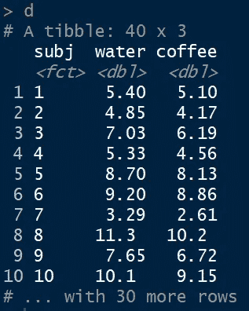
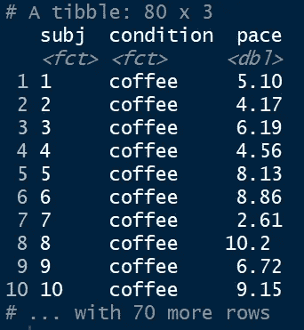
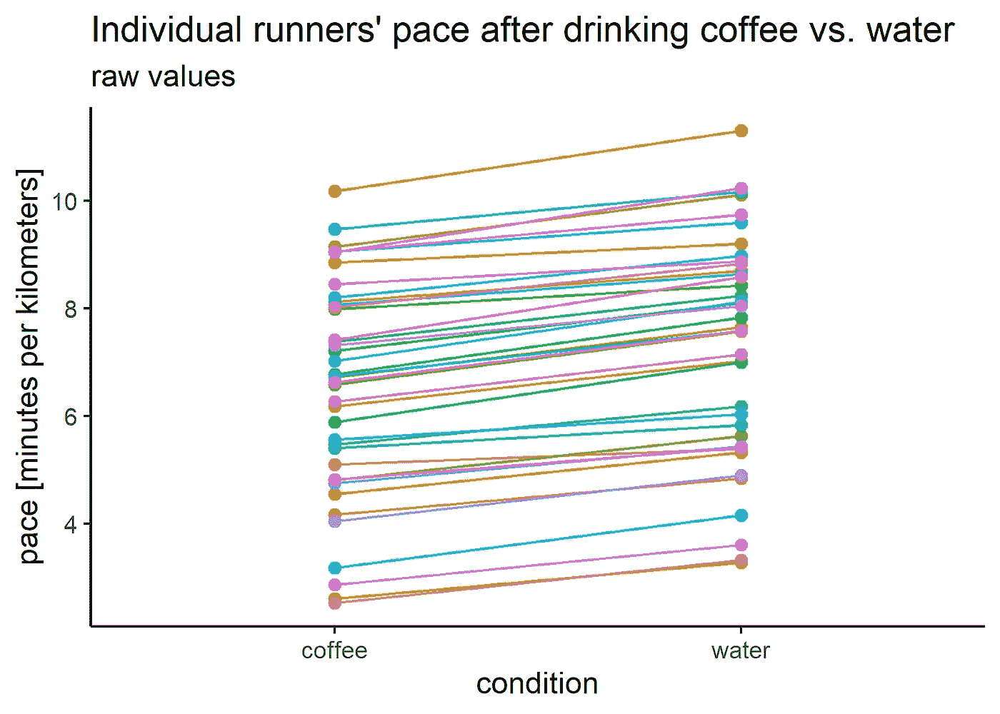
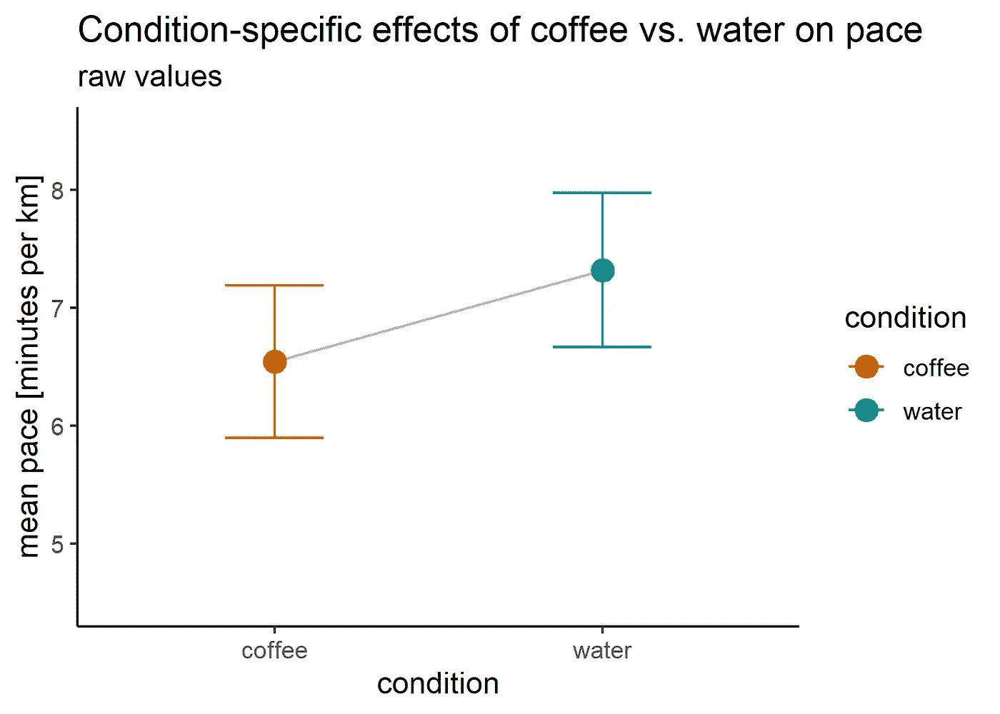
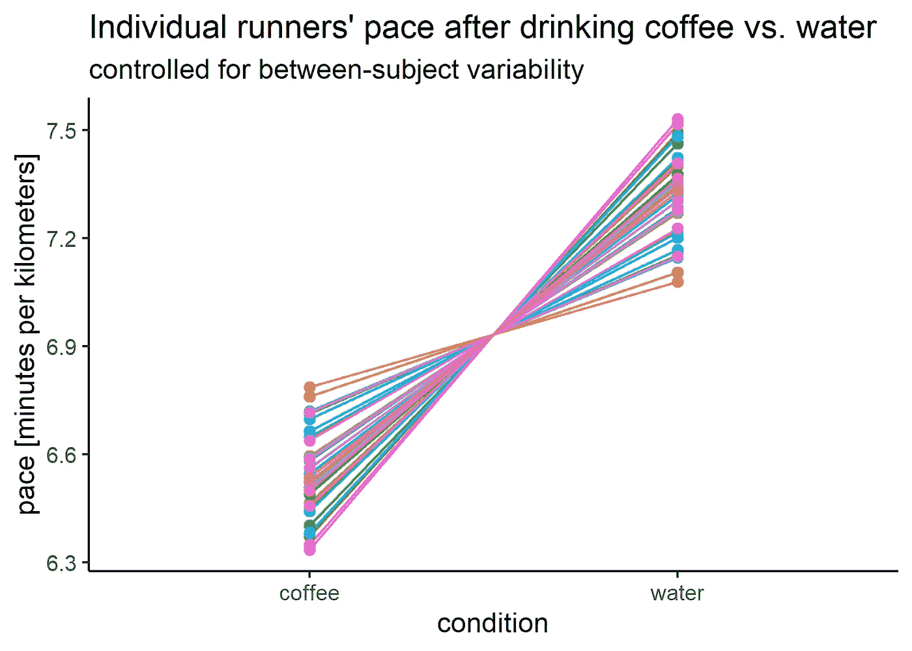
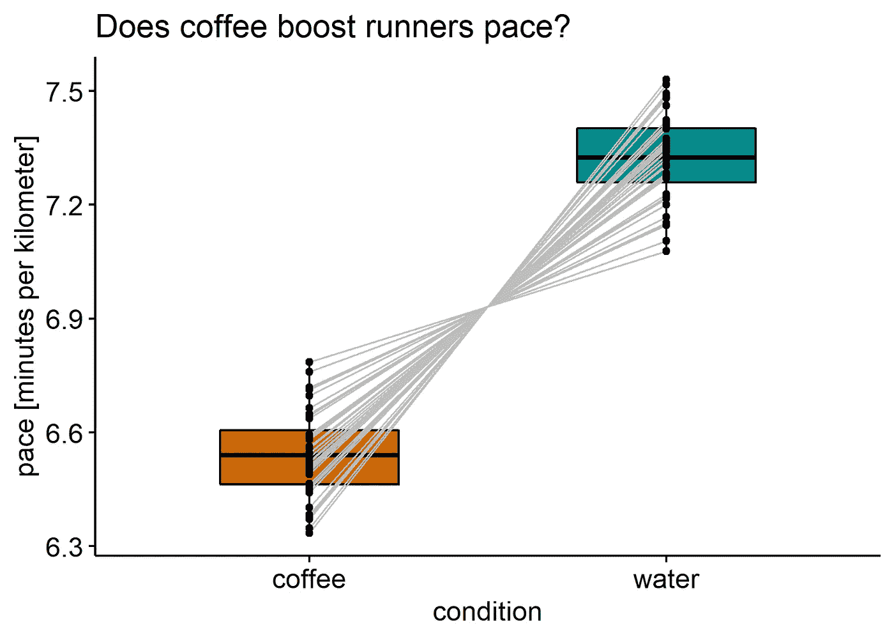
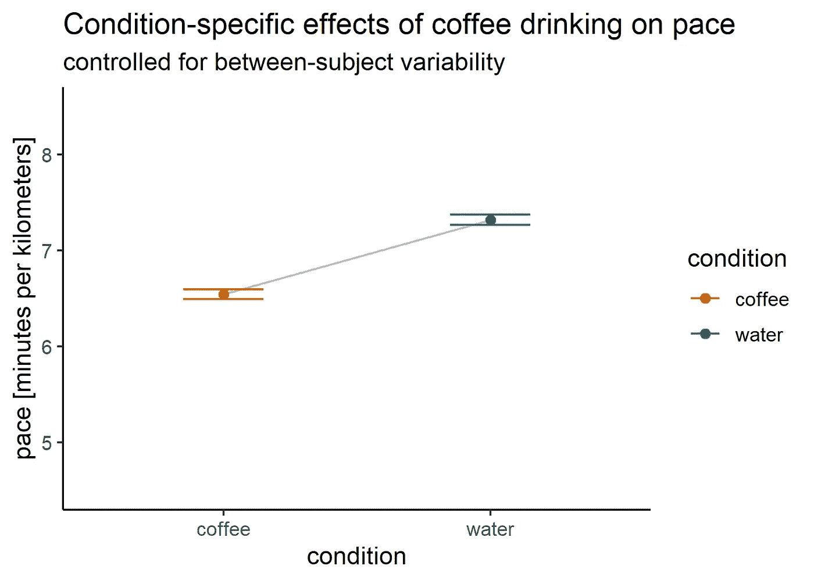

# R 中人的可变性对实验结果的影响

> 原文：<https://towardsdatascience.com/an-easy-approach-to-visualize-within-subject-data-meaningfully-4da065d9bfe5?source=collection_archive---------34----------------------->

## 一种简单的方法，有意义地可视化您的主题内数据。

照片由[mārtiņš·泽姆利克斯](https://unsplash.com/@mzemlickis?utm_source=unsplash&utm_medium=referral&utm_content=creditCopyText)在 [Unsplash](https://unsplash.com/s/photos/race?utm_source=unsplash&utm_medium=referral&utm_content=creditCopyText) 上拍摄

一旦相同的个人或事物被测量了不止一次，我们就处理重复测量的数据，这种情况在数据科学和实验研究中非常常见。在这些情况下，您有机会估计个体差异在多大程度上导致了数据的可变性——以及观察到的数据在多大程度上可能是由于实验操纵(这是大多数人感兴趣的！).然而，与受试者之间的设计相比，重复测量数据的探索和呈现并不直接，因此您的受试者内数据可视化可能比您想象的更有偏见。这个循序渐进的代码教程将为您提供一个简单的方法

*   使用适当的视觉效果探索重复测量数据
*   计算受试者内的误差棒，以理清个体间差异的实验影响。

为了这个目的，让我们想象一下下面的实验:你对咖啡因对运动表现的影响感兴趣，因此想知道与只喝水相比，咖啡是否能让跑步者跑得更快。幸运的是，你有机会研究 40 名参与者，并在 10 公里跑中测量他们的个人速度两次:在第一次跑步中，一些参与者在第二次跑步前喝了双份浓缩咖啡和一瓶水——反之亦然。有理由认为，不同的人代谢咖啡因的方式不同，天生就有不同的跑步能力。

首先，这段代码模拟了一个随机的主题数据，包括每个参与者喝完咖啡和喝完水后的平均跑步速度。我们假设饮水后的真实跑步配速约为每公里 7 分钟，标准差为 2 分钟/公里。假设跑步者在喝咖啡的情况下稍微快一点，我们故意从每个跑步者在喝水的情况下的配速中减去 0.8 分钟/公里，并包含一点随机噪音。

模拟运行数据。

正如你在这个例子中看到的，跑步者在他们的速度上有很大的不同，并且在只喝水后似乎有点慢。然而，即使在相同的条件下，个体的价值观在每一个主体中比在不同的主体中更加一致。尽管这些是模拟数据，但这在本质上并不罕见，因为您可以假设个人有一个“真实”值(例如，跑步速度)，该值仅部分地被观察到的数据捕获，而这些数据在环境真空下无法测量，因此通常非常嘈杂。现在我们有了运行数据，让我们使用 Dowle 等人(2019)的 [data.table 包](https://cran.r-project.org/web/packages/data.table/data.table.pdf)将它们转换成长数据格式，这对于我们以后的数据可视化至关重要。

每个主题在这个数据框中出现两次:一次是咖啡条件，一次是水条件。

> 免责声明:这些是用于说明目的的模拟数据，不以任何方式反映真实的运行数据。我不知道在这种情况下平均跑步速度会是什么样子。

# 可视化受试者内部数据——错误的方式

那么每个参与者的数据是什么样的呢？一些跑步者比其他人从咖啡中获益更多吗？一些跑步者与对照组相比没有表现出任何差异吗？或者更令人惊讶的是——是不是有些跑步者不能忍受咖啡因，因此可能跑得更慢？现在我们的数据已经准备好绘制了，让我们创建一个图表，通过按条件绘制每个参与者的跑步速度来找出答案。

## 第 1 级—单个原始数据

每条线代表同一个运动员。y 轴代表跑步者的速度，x 轴代表你的实验条件。

嘣！你可以看到，在咖啡和水的情况下，速度似乎略有增加。因此，你可以假设这种影响不会向相反的方向发展(例如，咖啡对一些人的跑步速度有害)，但似乎一些人从喝咖啡中获益很少。但是你能回答咖啡在多大程度上让跑步者跑得更快吗**平均来说**？嗯——我不能通过看这个图表。因此，让我们用 [ggpubr 软件包](https://mran.microsoft.com/snapshot/2017-04-22/web/packages/ggpubr/ggpubr.pdf)创建一个图——它将显示单个斜率，但也显示两个条件之间的总体趋势。

## 第 2 级—单个原始数据+总体趋势

好的，现在看来，平均来说，跑步者喝完咖啡后跑一公里需要的时间比喝水少。既然我们已经意识到了跑步者之间的差异，让我们忽略它们，试着只画出总的趋势。在出版物中，您可能经常会看到显示误差线的点图，误差线代表置信区间或平均值的标准误差。这是平均值不确定性的图形表示。通过 Ryan Hope 创建的 [Rmisc 包](https://mran.microsoft.com/snapshot/2017-07-10/web/packages/Rmisc/Rmisc.pdf),我们将计算平均值周围 95%的置信区间，然后使用结果来包含平均值周围的图形不确定性，这是由于实验的采样性质。请注意，在 frequentist 统计中，一个常见的误解是 95%置信区间误差线将代表包含具有 95%概率的真实平均值的值的范围。相比之下，我们的想法是，如果我们多次重复这项研究，CI 误差线将包含 95%情况下的真实平均值(Greenland 等人，2016)。

## 3 级——原始数据的总体趋势

好的——看起来误差线有轻微的重叠，这表明影响不显著(Cumming & Finch，2005)。**但是我们还没有完成。**

我们真的可以相信这个情节吗？这是否表明咖啡没有系统性地加快跑步者的速度？不完全是。我们现在还不知道。如果我告诉你，一个配对样本 t 检验揭示了喝咖啡和喝水条件之间的显著差异(p < .001)? How can that be, given that the plot suggests something different?

# Remove between-subject variability

The answer is: we have used techniques to visualize between-subjects data on a repeated measures design. But we are actually not interested in the fact how fast runners are per se and how they differ from each other independently from our experimental manipulation. More specifically, we are interested in the extent each runner’s pace compares to his or her own pace in the other condition. Basically, we have done something similar like using an unpaired t-test for independent samples on a within-subjects study. As we know that this is obviously wrong for statistical inference, we should similarly account for the interindividual variability while plotting the data. In our previous plots we have done just that — the fact that individuals vary by nature (independently from conditions) was not controlled for. Again, we are interested in *将每个跑步者与他或她自己进行比较*，但是我们已经绘制了反映跑步者之间差异*的误差线*，会怎么样？

## **根据 cosineau 的标准化程序**

幸运的是，这个问题有一个非常简单直接的解决方案，由 [Cosineau](http://www.tqmp.org/Content/vol01-1/p042/p042.pdf) (2005)描述。按照这种方法，我们将对每位跑步者的基线配速进行修正——这样我们就可以最终看到配速的差异，这种差异主要是分别归因于咖啡和水的条件。使用快速而强大的 [data.table](https://cran.r-project.org/web/packages/data.table/index.html) 语法，我们将控制受试者之间的可变性(在这种情况下——跑步速度的自然差异)。我们只需从每次观察中减去受试者的平均配速，然后加上总体平均配速。通过这种方式，我们可以将观察到的数据中特定于条件的部分与特定于受试者的部分区分开来。这并不意味着我们的数据不受其他系统效应的影响(如血糖水平、心血管健康等)。)或非系统性的影响(例如，日常表现)，但至少我们有机会了解咖啡对跑步是否有好处。

> 新值=原始值-个体基线+总体平均值

如您所见，每个人在不同条件下的平均值相同(由变量“check”表示)，这与受试者和条件下的总体平均值相同。

# 可视化受试者内的数据——这次是以正确的方式

现在，我们将使用修正值(配速范围)来重新绘制图表，显示受试者在每种情况下的跑步者配速。

## 1 级—个人标准化数据

哇！看看这个！现在我们已经掌握了不同跑步者喝咖啡的好处(斜率)的不同程度。例如，与水相比，饮用咖啡的益处对于橙色显示的个体来说是最差的(根据相对平坦的斜率)。尽管这种影响看起来比实际要大(看 y 轴:与我们之前的可视化相比，这个范围相当小)，但似乎一些人在喝咖啡后的速度比其他人快。

…如果我们想同时查看单个数据和总体趋势，该怎么办？

## 第 2 级—单个标准化数据+总体趋势

现在，显示 75%分布的方框受到了相当大的挤压——当我们考虑个体差异并查看咖啡与水之间的速度变化时，之前由自然速度差异导致的差异消失了。虽然我总是会选择展示数据分布的图，但我不建议将这样的图用于出版目的，因为在控制了受试者之间的差异后，它的解释并不真正简单。

最后，如果我们现在绘制校正数据的总体趋势，我们可以看到误差线不再重叠，变得非常小，这让我们有理由相信咖啡因可能影响了跑步者的速度。在我们虚构的例子中，也许咖啡消费应该被禁止，以确保跑步者之间的公平，并允许更合理的比较。

为了得出这一结论，我们将使用 Rmisc 包中的 summarySEwithin 函数——这允许我们计算误差条，这些误差条说明了数据的重复测量性质，因为我们指定了我们感兴趣的测量(例如 pace)、指定受试者内条件的变量(例如 condition ),以及最重要的表示测量来自同一参与者(例如 subj)的变量。如果你对其背后的统计基础感兴趣，一定要看看奥布赖恩和科西诺(2014)的论文。

## 3 级——标准化数据的一般趋势

注意:如果您想将图表与原始数据示例进行比较，使用相同的比例非常重要。

# 那又怎样？

人们是不同的，这很好。但是，如果我们对同一个人有多种衡量标准，我们应该充分利用这些标准，以便以更有意义的方式探索所研究的现象。

# 参考

[1] M .道尔，a .斯里尼瓦桑，j .戈雷基，m .基里科，p .斯捷岑科，t .肖特，…和 x .谭，[《包》资料。表'](https://cran.r-project.org/web/packages/data.table/data.table.pdf) (2019)，*'数据延伸。框架'*

[2]阿·卡桑巴拉，[包‘gg pubr’](https://mran.microsoft.com/snapshot/2017-04-22/web/packages/ggpubr/ggpubr.pdf)，(2020)*R 包*

[3] S. Greenland，S. J. Senn，K. J. Rothman，J. B. Carlin，C. Poole，S. N. Goodman & D. G. Altman，[统计检验、P 值、置信区间和功效:误解指南](https://link.springer.com/article/10.1007/s10654-016-0149-3)，(2016)，*《欧洲流行病学杂志》*， *31* (4)，337–350

[4] G. Cumming & S. Finch，[目测推断—置信区间和如何阅读数据图片](https://psycnet.apa.org/record/2005-01817-003) (2005)，*美国心理学家*，60(2)，170–180。doi:10.1037/0003–066 x . 60 . 2 . 170

[5] D. Cousineau，[受试者内设计的置信区间:Loftus 和 Masson 方法的更简单解决方案](https://www.researchgate.net/profile/Denis_Cousineau/publication/49619408_Confidence_intervals_in_within-subject_designs_A_simpler_solution_to_Loftus_and_Masson's_method/links/54e4c9300cf22703d5bf6023.pdf) (2005)，*心理学定量方法教程，1* (1)，4–45

[6] F. O'Brien & D. Cousineau，[在典型软件包中表示受试者内设计的误差条](https://core.ac.uk/download/pdf/25771913.pdf) (2014)，*心理学的定量方法*， *10* (1)，56–67