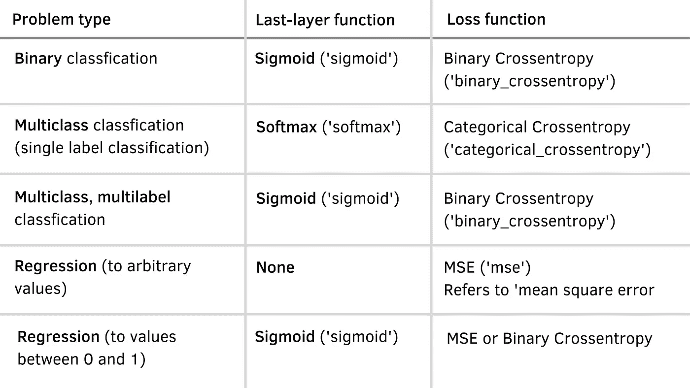

# 关于深度学习和 Keras 的情感分析的简单教程

> 原文：<https://towardsdatascience.com/an-easy-tutorial-about-sentiment-analysis-with-deep-learning-and-keras-2bf52b9cba91?source=collection_archive---------2----------------------->

## 了解如何轻松构建、训练和验证递归神经网络


艾莉娜·格鲁布尼亚克在 [Unsplash](https://unsplash.com/s/photos/network?utm_source=unsplash&utm_medium=referral&utm_content=creditCopyText) 上的照片

放松点，这将会花你几分钟的时间来阅读，但是希望你能坚持看完整篇文章。我将带您完成一项基础任务，作为数据科学家/机器学习工程师，您必须知道如何执行这项任务，因为在您职业生涯的某个阶段，您会被要求这样做。在本文的上下文中，我假设您对我接下来要讲的内容有一个基本的理解。我会在前进的过程中不断积累概念，保持一种非常低级的语言——如果你在字里行间感到有些困惑，不要担心，稍后我可能会澄清你的疑问。主要意思是让你明白我将要解释的内容。话虽如此，还是动手吧(顺便说一句，不要错过任何细节，从[我的回购](https://github.com/sergiovirahonda/TweetsSentimentAnalysis)下载整个项目。)

我将首先定义标题中的第一个不常见的术语:**情感分析**是文本分类中非常常见的术语，本质上是使用自然语言处理(通常简称为 NLP)+机器学习来解释和分类文本信息中的情感。想象一下确定一个产品的评论是正面还是负面的任务；你可以自己通过阅读来完成，对吗？但是当你工作的公司每天销售 2k 产品时会发生什么呢？你是不是假装看完所有的评论，手动分类？老实说，你的工作会是有史以来最糟糕的。这就是情绪分析的用武之地，它让你的生活和工作变得更加轻松。

# 让我们进入这个问题

有几种方法可以实现情感分析，每个数据科学家都有他/她自己喜欢的方法，我将通过一个非常简单的方法来指导你，这样你就可以理解它涉及的内容，但也可以建议你一些其他的方法来研究它们。让我们先把重要的事情放在第一位:如果你不熟悉机器学习，你必须知道所有的算法只能理解和处理数字数据(尤其是浮点数据)，因此你不能给它们输入文本，然后等着它们来解决你的问题；相反，您必须对数据进行几次转换，直到它达到一个有代表性的数字形状。常见且最基本的步骤是:

*   从每个样本中删除网址和电子邮件地址——因为它们不会增加有意义的价值。
*   去掉标点符号——否则你的模型不会理解“好！”和“好”其实是一个意思。
*   全部文本小写——因为您希望输入文本尽可能通用，并避免出现这种情况，例如，短语开头的“good”与另一个示例中的“Good”理解不同。
*   删除停用词——因为它们只会增加噪音，不会让数据更有意义。顺便说一下，停用词指的是一种语言中最常见的词，如“我”、“有”、“是”等。我希望你明白这一点，因为没有一个官方的停用词列表。
*   词干化/词汇化:这一步是可选的，但是对于大多数数据科学家来说是至关重要的。我会告诉你，取得好的结果并不重要。词干化和词汇化是非常相似的任务，都期望从语料库数据的句子的每个单词中提取词根。词汇化通常返回有效的单词(存在的)，而词干技术返回(大多数情况下)缩短的单词，这就是为什么词汇化在现实世界的实现中使用得更多。lemmatizers vs. stemmers 的工作方式是这样的:假设你想找到“caring”的词根:“Caring”->*lemmatizer*->“Care”。另一方面:‘牵挂’->*词干*->‘车’；你明白了吗？如果业务需要，您可以研究这两种方法并实施其中任何一种。
*   将数据集(文本)转换成数字张量——通常称为*矢量化*。如果你记得上面的一些行，我解释过，像所有其他神经网络一样，深度学习模型不接受原始文本作为输入:它们只对数字张量起作用，这就是为什么这一步没有商量的余地。有多种方法可以做到这一点；例如，如果你要使用一个经典的 ML 模型(不是 DL ),那么你肯定应该使用 CountVectorizer、TFIDF Vectorizer 或者只是基本的但不太好的方法:单词袋。这取决于你。然而，如果你打算实现深度学习，你可能知道最好的方法是将你的文本数据(可以理解为单词序列或字符序列)转化为低维浮点向量——不要担心，我稍后会解释这一点。

这是一个非常基本的文本清理 Python 函数的样子(这是一个非常简单的方法，您可以实现一个最适合您的目的的方法—外面有非常完整的库，如 Gensim 或 NLTK):

```
def depure_data(data):

    *#Removing URLs with a regular expression*
    url_pattern = re.compile(r'https?://\S+|www\.\S+')
    data = url_pattern.sub(r'', data)

    *# Remove Emails*
    data = re.sub('\S*@\S*\s?', '', data)

    *# Remove new line characters*
    data = re.sub('\s+', ' ', data)

    *# Remove distracting single quotes*
    data = re.sub("**\'**", "", data)

    return data
```

根据最短和最长的单词通常没有用的想法，现在有一个非常简单的方法来从数据集中删除重复的单词:

```
def sent_to_words(sentences):
    for sentence **in** sentences:
        yield(gensim.utils.simple_preprocess(str(sentence),     deacc=True))
```

最后，一个去除所有句子标记的函数(这是因为我将使用单词嵌入，而不是这种老式的标记方法):

```
def detokenize(text):
    return TreebankWordDetokenizer().detokenize(text)
```

要以正确的顺序运行一切，您只需运行以下命令:

```
temp = []
*#Splitting pd.Series to list*
data_to_list = train['selected_text'].values.tolist()
for i **in** range(len(data_to_list)):
    temp.append(depure_data(data_to_list[i]))
data_words = list(sent_to_words(temp))
data = []
for i **in** range(len(data_words)):
    data.append(detokenize(data_words[i]))
print(data[:5])
```

此时，您已经将嘈杂的文本数据集转换成了一个非常简单的文本数据集。在这个特殊的例子中，你会从这个:

```
['I`d have responded, if I were going',
 'Sooo SAD',
 'bullying me',
 'leave me alone',
 'Sons of ****,']
```

对此:

```
['have responded if were going', 'sooo sad', 'bullying me', 'leave me alone', 'sons of']
```

如果你想更进一步，那么走词干化或词尾化的道路，你会得到更好的结果。在这个具体的操作方法中，将保持这种方式，只有你可以跳过这一步，完全有可能取得伟大的成果(如果你在商业环境中建立你的模型，那么你将 100%有义务这样做，不要跳过它！)

# 从句子到单词嵌入

好了，是时候理解在处理文本数据时必须处理的一个极其重要的步骤了。一旦您的文本数据完全清除了噪声，就该将它转换成浮点张量了。为了完成这个任务，我们将使用*单词嵌入。*

**单词嵌入**(或有时称为*单词向量*)从数据中学习，本质上是低维浮点向量(密集向量，与从诸如 one-hot-encoding 等过程中获得的稀疏向量相反)，其在几个维度中打包信息。为什么你会使用这种方法而不是其他不同的更简单的方法呢？因为深度学习模型用密集向量比用稀疏向量更容易收敛。同样，它总是取决于数据集的性质和业务需求。

有两种方法可以获得单词嵌入:

*   在模型上使用预训练的单词嵌入堆栈，就像使用预训练的 NN 层(或层组)一样——这是一种非常少见的方法。
*   从头开始学习单词嵌入。为了实现这一点，你可以从随机单词向量开始，逐步学习有意义的单词向量，就像神经网络学习其权重一样。这是我们将使用的选项，实际上，随着每一个新任务学习一个新的嵌入空间是合理的。幸运的是，对于 TensorFlow 或 Keras，这一步非常简单，您可以实现单词嵌入，就像在 NN 堆栈中增加一层一样。

在前进之前，我们需要迈出前一步。我们需要将文本数组转换成 2D 数字数组:

```
from keras.preprocessing.text import Tokenizer
from keras.preprocessing.sequence import pad_sequences
from keras import regularizers

max_words = 5000
max_len = 200

tokenizer = Tokenizer(num_words=max_words)
tokenizer.fit_on_texts(data)
sequences = tokenizer.texts_to_sequences(data)
tweets = pad_sequences(sequences, maxlen=max_len)
print(tweets)
```

您将得到的输出如下所示:

```
[[   0    0    0 ...   68  146   41]
 [   0    0    0 ...    0  397   65]
 [   0    0    0 ...    0    0   11]
 ...
 [   0    0    0 ...  372   10    3]
 [   0    0    0 ...   24  542    4]
 [   0    0    0 ... 2424  199  657]]
```

上一步是什么意思？让我们从官方的 Keras 文档中获取定义，您会更好地理解这一点:

> 这个函数将序列列表(长度为`num_samples`)转换成形状为`(num_samples, num_timesteps)`的 2D Numpy 数组。`num_timesteps`或者是`maxlen`参数(如果提供的话)，或者是列表中最长序列的长度。
> 
> 比`num_timesteps`短的序列用`value`填充，直到它们长到`num_timesteps`。
> 
> 长于`num_timesteps`的序列被截断，以便符合所需的长度

# 嵌入层

非常重要的是你要记住，无论你使用 TensorFlow 还是其他任何*as action API*比如 Keras *、*在你的训练结束时你都应该得到相同的结果。在这次机会中，我们将使用 Keras，原因很明显:它非常容易实现。这是创建嵌入层的方法:

```
from keras.layers import Embedding
embedding_layer = Embedding(1000, 64)
```

上面的层采用形状的 2D 整数张量(样本，sequence_length)和至少两个参数:可能的记号的数量和嵌入的维数(这里分别是 1000 和 64)。更形象地说，只需想象嵌入层是一个将整数索引链接到密集向量的字典。最后，它返回一个形状的 3D 浮点张量(样本，序列长度，嵌入维数)，现在可以由我们的神经网络处理。让我们来谈谈这个话题，特别是当需要处理文本相关序列时，递归神经网络是最好的。

# 递归神经网络变得简单

通常，其他类型的神经网络如密集连接网络或卷积网络没有记忆，这意味着每个输入都是独立处理的，与其他输入无关。这与你阅读一段文字时通常会做的事情相反:当你阅读时，你会在记忆中保留你在前面几行读到的内容，对吗？你有一个整体意义的感觉，这正是 RNNs 采用的原则。它们处理序列的方式是沿着序列元素进行迭代，并保存与迄今为止已处理的内容相关的信息。老实说，在 RNN 引擎盖下的数学是一个你应该自己去理解它的逻辑的话题。我建议你读一读汤姆·霍普的《*学习张量流*》(此处有)，它以一种非常简单的方式解释了所有的过程。

在本文中，我将实现三种 RNN 类型:单一 LSTM(长短期记忆)模型、双向 LSTM 和很少使用的 Conv1D 模型。作为奖励，我展示了如何实现一个 SimpleRNN 模型，但老实说，它并没有在生产中部署，因为它非常简单。

## LSTM 层

回到我们的例子，这是实现单个 LSTM 层模型及其相应的嵌入层时的代码:

```
from keras.models import Sequential
from keras import layers
from keras import regularizers
from keras import backend as K
from keras.callbacks import ModelCheckpointmodel1 = Sequential()
model1.add(layers.Embedding(max_words, 20)) #The embedding layer
model1.add(layers.LSTM(15,dropout=0.5)) #Our LSTM layer
model1.add(layers.Dense(3,activation='softmax'))

model1.compile(optimizer='rmsprop',loss='categorical_crossentropy', metrics=['accuracy'])

checkpoint1 = ModelCheckpoint("best_model1.hdf5", monitor='val_accuracy', verbose=1,save_best_only=True, mode='auto', period=1,save_weights_only=False)history = model1.fit(X_train, y_train, epochs=70,validation_data=(X_test, y_test),callbacks=[checkpoint1])
```

在上面的代码中有几件事情需要强调:当实现一个 Keras 顺序模型时，这都是关于堆叠层的。LSTM 图层(以及所有其他 RNN 图层)可以接受几个参数，但我定义的参数是 *15* ，这是图层中隐藏单元的数量(必须是正整数，表示输出空间的维度)和图层的丢失率。 **Dropout 是 NNs** 最有效和最常用的正则化技术之一，包括在训练期间随机关闭隐藏单元，这样网络就不会 100%依赖于所有的神经元，而是迫使自己在数据中找到更有意义的模式，以增加你试图优化的指标。还有几个其他的参数要传递，你可以在这里找到完整的文档[，但是对于这个特殊的例子，这些设置会达到很好的效果。](https://keras.io/api/layers/recurrent_layers/lstm/)

仅供参考，有时**一个接一个地堆叠几个递归层**是有用的，这样可以增加网络的代表性。如果你想这样做，那么**你必须返回完整的输出序列**。这是一个例子:

```
*model0 = Sequential()*
*model0.add(layers.Embedding(max_words, 15))*
*model0.add(layers.SimpleRNN(15,return_sequences=True))
model0.add(layers.SimpleRNN(15))
model0.add(layers.Dense(3,activation='softmax'))*
```

在我们的 LSTM 示例中，我堆叠了一个具有三个输出单元的密集图层，这三个输出单元将是数据集的 3 个可能的类。为了进行概率输出，最好在最后一层使用“softmax”作为激活函数。构建神经网络时使用下表，您会感到困惑:



神经网络配置和训练的基本参数。

当编译模型时，我使用 RMSprop optimizer 的默认学习速率，但实际上这取决于每个开发人员。有人爱 Adam，有人爱 Adadelta，以此类推。老实说，RMSprop 或 Adam 在大多数情况下应该足够了。如果您不知道优化器是什么，它只是一种不断计算损失梯度并定义如何逆着损失函数移动以找到其全局最小值并因此找到最佳网络参数(模型内核及其偏差权重)的机制。作为损失函数，我使用 categorical _ crossentropy(检查表格),它通常在处理多类分类任务时使用。另一方面，当需要二进制分类时，可以使用 binary_crossentropy。

最后，我使用检查点来保存在训练过程中获得的最佳模型。当您需要获得最能满足您试图优化的指标的模型时，这非常有用。然后是经典的 model.fit 步骤，等待它完成训练迭代。

这是该神经网络体系结构在上一个时期获得的验证分数:

```
Epoch 70/70
645/645 [==============================] - ETA: 0s - loss: 0.3090 - accuracy: 0.8881
Epoch 00070: val_accuracy did not improve from 0.84558
```

让我们用一个更复杂的网络来比较一下。

## 双向层

这是我们示例的 BidRNN 实现的样子:

```
model2 = Sequential()
model2.add(layers.Embedding(max_words, 40, input_length=max_len))
model2.add(layers.Bidirectional(layers.LSTM(20,dropout=0.6)))
model2.add(layers.Dense(3,activation='softmax'))
model2.compile(optimizer='rmsprop',loss='categorical_crossentropy', metrics=['accuracy'])
checkpoint2 = ModelCheckpoint("best_model2.hdf5", monitor='val_accuracy', verbose=1,save_best_only=True, mode='auto', period=1,save_weights_only=False)
history = model2.fit(X_train, y_train, epochs=70,validation_data=(X_test, y_test),callbacks=[checkpoint2])
```

让我们更好地理解双向层是如何工作的。它最大化了 rnn 的顺序敏感性:本质上，它由两个 rnn(lstm 或 gru)组成，这两个 rnn 在一个不同的方向上处理输入序列，以最终合并表示。通过这样做，他们能够捕捉到比单个 RNN 层更复杂的图案。换句话说，其中一层按时间顺序解释序列，第二层按反时间顺序解释，这就是为什么双向 rnn 被广泛使用，因为它们比常规 rnn 提供更好的性能。

它们的实现方式并不复杂，只是一层在另一层之内。如果你仔细阅读，我使用几乎相同的参数，但在其整体训练中实现了大约 0.3%的验证准确性:

```
Epoch 70/70
644/645 [============================>.] - ETA: 0s - loss: 0.2876 - accuracy: 0.8965
Epoch 00070: val_accuracy did not improve from 0.84849
```

这是一个非常好的数字，即使它是一个非常简单的模型，我并没有专注于超参数调整。我确信，如果你致力于调整它们，你会得到一个非常好的结果。不幸的是，没有神奇的公式可以做到这一点，这一切都是关于调整其架构，迫使它每次都学习更复杂的模式，并通过更多的正则化来控制其过度拟合的趋势。要强调的一件重要事情是，如果您看到您的模型精度/损失停留在某个值附近，这可能是因为学习率太小，因此使您的优化器停留在损失函数的局部最小值附近；增大 LR，或者尝试另一个优化器。

现在是时候尝试另一种类型的架构了，尽管它不是文本分类的最佳选择，但众所周知，它在处理文本数据集时会取得非常好的效果。让我们开始吧。

## 更进一步——1D 卷积神经网络

我希望你还和我在一起，因为这是谈论收敛时最快的模型之一——它需要更便宜的计算成本。根据以前的经验，我知道它倾向于在小数据集上非常快地过度拟合。从这个意义上来说，如果你感兴趣的话，我会实现它来告诉你怎么做，并且给你一个关于它如何工作的概述。

它使用与用于图像分类的经典 2D 变换网相同的原理。卷积层从 1D/2D 张量中提取面片(取决于任务和层的类型)，并对每个面片应用相同的卷积变换(得到几个子序列作为输出)。我不会深入解释，因为这超出了本文的范围，但是如果你想完全理解这些层是如何工作的，我建议你查看一下之前推荐的书。这些层最重要的事实是，它们可以识别序列中的模式——在一个句子的某个位置学习的模式可以在后来的不同位置甚至在另一个句子中识别。

1D 通信网是这样实现的:

```
model3.add(layers.Embedding(max_words, 40, input_length=max_len))
model3.add(layers.Conv1D(20, 6, activation='relu',kernel_regularizer=regularizers.l1_l2(l1=2e-3, l2=2e-3),bias_regularizer=regularizers.l2(2e-3)))
model3.add(layers.MaxPooling1D(5))
model3.add(layers.Conv1D(20, 6, activation='relu',kernel_regularizer=regularizers.l1_l2(l1=2e-3, l2=2e-3),bias_regularizer=regularizers.l2(2e-3)))
model3.add(layers.GlobalMaxPooling1D())
model3.add(layers.Dense(3,activation='softmax'))
model3.compile(optimizer='rmsprop',loss='categorical_crossentropy',metrics=['acc'])
history = model3.fit(X_train, y_train, epochs=70,validation_data=(X_test, y_test))
```

其中 **Conv1D** 层负责**计算** **卷积运算**，而 **MaxPooling1D** 层的主要任务是**降低每个卷积输出的维度**。一旦执行了卷积运算，MaxPooling 窗口将提取其中的最大值，并输出最大值的面片。在这种类型的配置中，强调正则化的重要性是很重要的，否则你的网络将会学习无意义的模式，并以极快的速度过度适应——仅供参考。

为了对比之前模型的表现，这是上一个时期达到的指标:

```
Epoch 70/70
645/645 [==============================] - 5s 7ms/step - loss: 0.3096 - acc: 0.9173 - val_loss: 0.5819 - val_acc: 0.8195
```

其最佳验证准确率约为 82%。即使我已经实施了非常激烈的调整，它还是过拟合得非常快。

# 验证我们的最佳模型

在这一点上，迄今为止最好的模型是双向 RNN。请记住，这些指标是通过从很少到零的超参数调整获得的。为了更好地理解它的预测，让我们看看它的混淆矩阵:


最佳模特的困惑矩阵-作者图片。

从上面的图像中，我们可以推断出:81%的正面评级被归类为正面，80%的负面评级被归类为负面，91%的中性评级被归类为中性。这些并不是最好的预测，但却是建立更好模型的良好基础。在商业场景中，在最简单的情况下，您需要接近 95%。

如果您想测试它如何处理您自己的输入，只需计算下面几行:

```
sentiment = ['Neutral','Negative','Positive']sequence = tokenizer.texts_to_sequences(['this data science article is the best ever'])
test = pad_sequences(sequence, maxlen=max_len)
sentiment[np.around(best_model.predict(test), decimals=0).argmax(axis=1)[0]]
```

输出将是:

```
'Positive'
```

# 最后的想法

好了，我们已经到了这篇文章的结尾。我鼓励您自己实现所有模型，并专注于超参数调优，这是需要较长时间的任务之一。一旦你达到一个好的数字，我会在这里见你，指导你通过该模型的部署😊。

有几种方法可以完成这样的任务。你可以使用谷歌云平台，走 Azure 之路，甚至更便宜的 Heroku 之路，但让我们诚实地说:大多数最大的公司都采用 AWS 作为他们的主要公共云提供商，这些家伙有一个奇妙的平台来构建、培训和部署 ML 模型:**AWS SageMaker**；那里有大量的文档。我将会发布另一个逐步讲解的教程，讲述如何在上面轻松地部署模型。我希望在那里见到你！