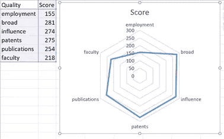
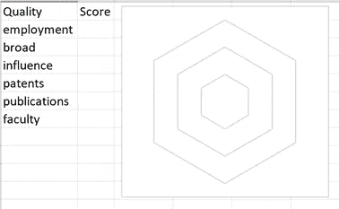
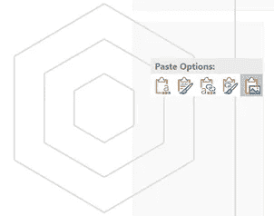
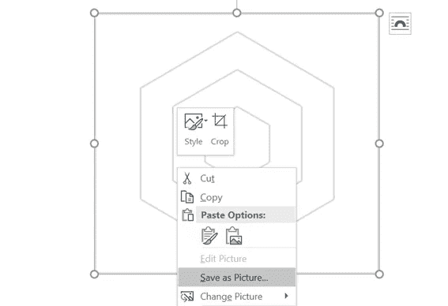
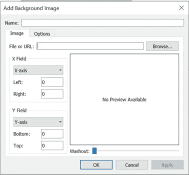
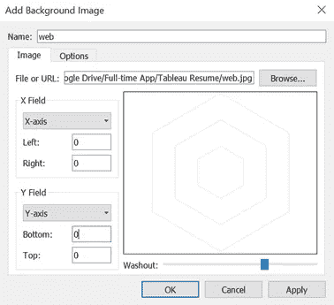
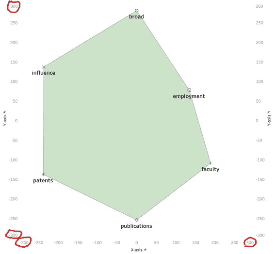
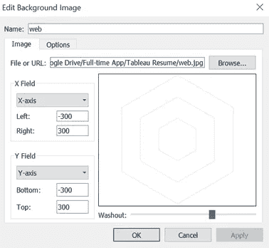
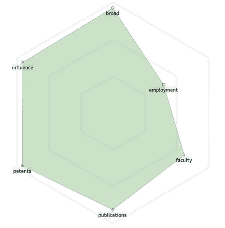

# 在 Tableau 上绘制蜘蛛图的简单方法——第二部分

> 原文：<https://towardsdatascience.com/an-easy-way-to-draw-spider-charts-on-tableau-part-2-377e3a497f39?source=collection_archive---------19----------------------->

## 用 Excel 在 Tableau 上编织蜘蛛图

在上一篇文章[《在 Tableau 上画蜘蛛图的简易方法—第一部分》](https://medium.com/@brant.remember/an-easy-way-to-draw-spider-charts-on-tableau-part-i-6fc75bcaa45a?source=friends_link&sk=d182fa49d91b0c073e49d2d1121122c4)的最后，我们留下了一个问题:如何为我们的“蜘蛛”提供一个“web”背景。

有许多教程文章和视频教人们如何使用 Tableau 上的计算来绘制雷达背景，但我发现它们有点复杂，难以理解。我开发了这个简单的方法来从 Excel 中获取背景“web ”,并将“web”作为图片导入 Tableau。这非常简单明了，所以为什么不试着从现在开始“编织你自己的网”呢？

在本文中，我仍将使用第一部分中相同的大学排名示例来帮助您更好地理解这些步骤。

***> > >第一步:在 Excel*** 绘制一张“网”

既然我们有 6 类**【品质】**，我们也应该在 Excel 中编织一个由 6 个角组成的网。

打开一个 Excel >复制 6 种品质及其分数并粘贴到 Excel > **【插入】** > **【图表】** > **【雷达】**

删除图表上的所有标题、轴和标签>删除所有分数

在 Excel 中复制图表并将其粘贴为图片**在 Microsoft Word 中**将网页图片保存到您的本地设备

***> > >第二步:将“web”导入 Tableau***

在雷达图页中，点击**【地图】** > **【背景图像】** > **【添加图像…】**

在**【浏览】** >中找到你的网页图片，选择合适的级别**【冲洗】**

***> > >第三步:格式化【网页】***

为 X 轴和 Y 轴找到合适的左右边框:

**X 轴左侧**= X 轴最小值，**X 轴右侧**= X 轴最大值

**Y 轴底部**= Y 轴最小值，**Y 轴顶部**= Y 轴最大值

删除所有的标题，标题，轴和边框，你将得到一个网络背景的雷达图！

为了让它更好看更可爱，你可以随心所欲地改变颜色、字体和形状！

如果您对本文有任何疑问，请随时联系我！我期待与您讨论数据科学和数据可视化！🙋‍♂️