# 一种在 Tableau 上绘制蜘蛛图的简单方法——第一部分

> 原文：<https://towardsdatascience.com/an-easy-way-to-draw-spider-charts-on-tableau-part-i-6fc75bcaa45a?source=collection_archive---------5----------------------->

## 你厌倦了饼状图吗？试试蜘蛛图！


蜘蛛图也称为雷达图，它可以用来描述三维或三维以上的定量数据。基本上，每当你想用饼状图分析数据的时候，你都可以考虑是否要尝试更高级的雷达图。

Tableau 是现在最流行的数据可视化工具之一，但它没有内置的蜘蛛图。我读了许多关于如何在 Tableau 上构建雷达图的文章，在尝试了许多其他复杂的方法后，我找到了这个非常简单的方法。

在这篇文章中，我将使用 [Kaggle](https://www.kaggle.com/mylesoneill/world-university-rankings) 上发布的 2015 年加拿大大学排名数据集作为例子，尝试从就业、师资、出版、影响力、广度和专利 6 个维度来比较加拿大的大学。

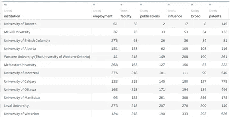

数据集预览

让我们先看看我在 Tableau 上创建的雷达图。你也可以在 [**这里**](https://public.tableau.com/views/HowtodrawaradarchartonTableau-UniversityRankings/RankingScores?:language=en&:display_count=y&publish=yes&:origin=viz_share_link) **找到我在 Tableau 上创建的雷达图。**👈

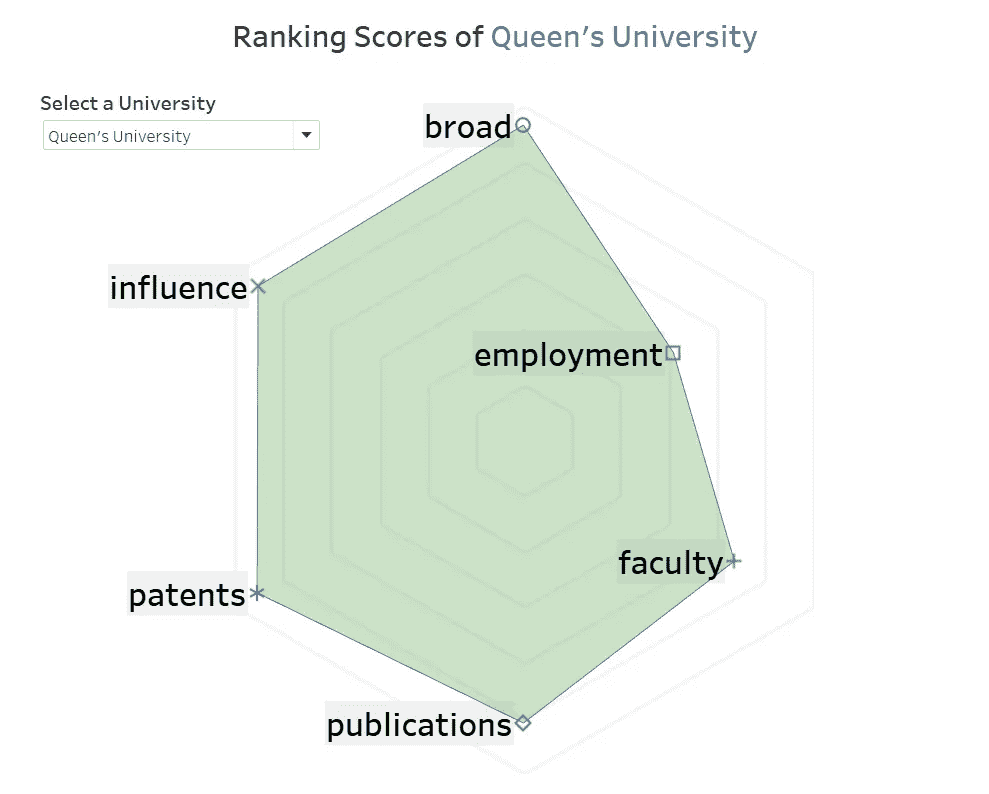

***> > >第一步:透视表数据***

按住**【Ctrl】**选择全部 6 个品质>右键>点击**【支点】**

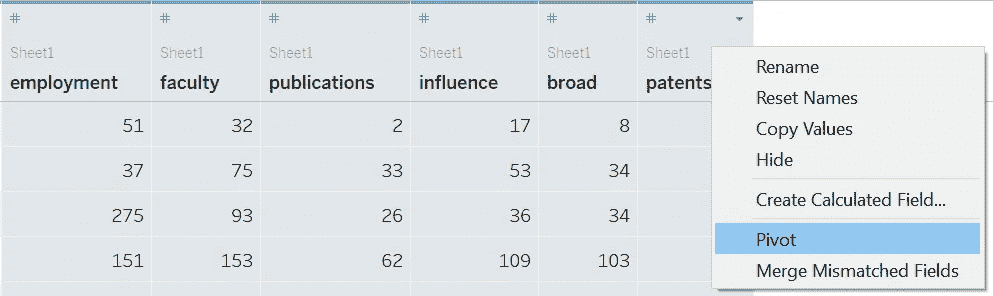

确保维度**【质量】**名称在一列，维度的值**【得分】**在另一列。

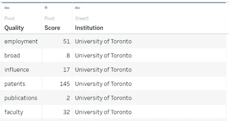

透视后的数据表

***> > >第二步:创建计算字段***

**№1。【路径】**

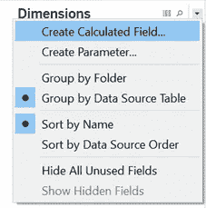

创建计算字段

**【路径】**字段告诉 Tableau“网络”应该走的顺序。

```
CASE [Quality]
WHEN 'employment' THEN 1
WHEN 'broad' THEN 2
WHEN 'influence' THEN 3
WHEN 'patents' THEN 4
WHEN 'publications' THEN 5
WHEN 'faculty' THEN 6
END
```

**№2。【X 轴】**

我们将使用 T [精确测量来指示我们的“蜘蛛网”的每个角](https://www.tableau.com/about/blog/2015/7/use-radar-charts-compare-dimensions-over-several-metrics-41592)的方向，X 轴是角度的 **cos** 值，Y 轴是坐标角度的 **sin** 值。

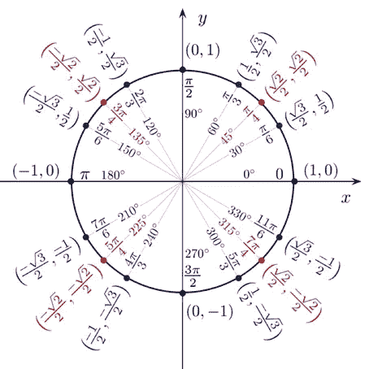

<sin and="" cos="" values="">作者 [*乔纳森·特拉科维奇*](https://twitter.com/j_trajkovic)</sin>

例如，我们希望“就业”位于 30°方向，那么“就业”的 X 轴是[分数]* cos 30 =[分数]*(SQRT(3)/2)，Y 轴将是[分数]* sin 30 =[分数]*(1/2)

因为我们有 6 个维度划分 360 度，所以每个维度将位于 30 度、90 度、150 度、210 度、270 度和 330 度。

```
CASE [Quality]
WHEN 'employment' THEN [Score]*(SQRT(3)/2)
WHEN 'broad' THEN 0
WHEN 'influence' THEN [Score]*(-SQRT(3)/2)
WHEN 'patents' THEN [Score]*(-SQRT(3)/2)
WHEN 'publications' THEN 0
WHEN 'faculty' THEN [Score]*(SQRT(3)/2)
END
```

**№3。【Y 轴】**

```
CASE [Quality]
WHEN 'employment' THEN [Score]*(1/2)
WHEN 'broad' THEN [Score]*1
WHEN 'influence' THEN [Score]*(1/2)
WHEN 'patents' THEN [Score]*(-1/2)
WHEN 'publications' THEN [Score]*(-1)
WHEN 'faculty' THEN [Score]*(-1/2)
END
```

***> > >第三步:筛选一所大学***

将**【大学】**文件拖到“过滤器”框中，例如我选择了“女王大学”。

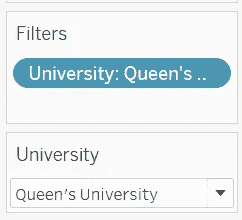

***> > >第四步:构建多边形***

1.  将**【X 轴】**拖动到“列”中
2.  将**【Y 轴】**拖动到“行”中

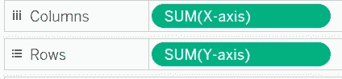

3.将**【质量】**拖到“细节”中

4.将**【路径】**拖动到“路径”中

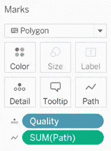

然后我们得到了这个图表，嗯…😒看起来很“蠢”？放心吧！我们会在最后格式化它。

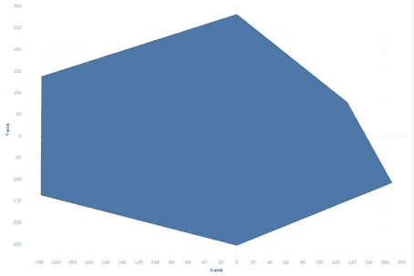

***> > >第五步:绘制点数&标签***

1.  复制一个 Y 轴
2.  将两个图表中的一个更改为“形状”
3.  将**【质量】**拖入“标签”
4.  将**【质量】**拖动成‘形状’

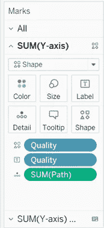

5.右键单击“形状”图>的**【Y 轴】**，单击【双轴】>选择【同步轴】

然后我们会得到这张图表。

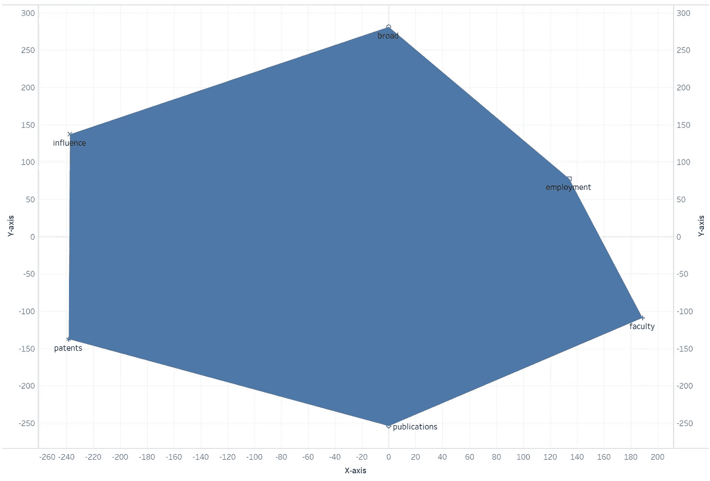

***> > >第六步:格式化***

我们需要进行大量的格式化工作:

1.  改变轴到**固定**和**相同的长度和宽度。*(这里 X: -300，+300，Y: -300，+300)***
2.  为多边形选择一种你喜欢的颜色，使其透明，也许可以给它添加一个边框。
3.  更改标签的字体。
4.  移除所有的**边框**和所有的**线**。
5.  将**【大学】****【质量】****【分数】**添加到‘工具提示’中

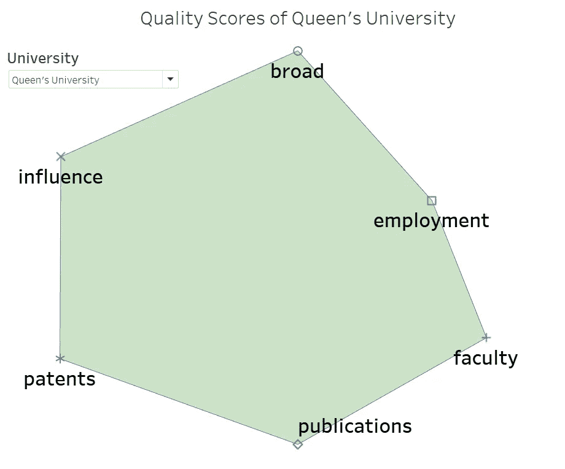

最后，我们得到了雷达图。耶！！！！🥳:但是等等……这似乎和普通的雷达图有点不同？—我们没有为它提供一个“网”！

放心吧！我将在下一篇文章 [**中展示如何为我们的“蜘蛛”手动绘制背景“网”——一种在 Tableau 上绘制蜘蛛图的简单方法——第二部分**](https://medium.com/@brant.remember/an-easy-way-to-draw-spider-charts-on-tableau-part-2-377e3a497f39?source=friends_link&sk=d0d0093e265ecdffba5341881d203518) 。👈与其他展示如何使用 Tableau 编码来绘制它的文章不同，我将使用一点“技巧”来使这个过程更容易和简单。

如果您对本文有任何疑问，请随时联系我！我期待与您讨论数据科学和数据可视化！🙋‍♂️