# 在自己的计算机上开始使用数据库的简单方法

> 原文：<https://towardsdatascience.com/an-easy-way-to-get-started-with-databases-on-your-own-computer-46f01709561?source=collection_archive---------15----------------------->

## 结构化查询语言

## 介绍如何使用 SQLite 浏览器和管理自己的数据库。


由 [djvstock](http://www.freepik.com) 创建的技术向量

根据 [StackOverflow 2020 开发者调查](https://insights.stackoverflow.com/survey/2020#most-popular-technologies)，SQL 是第三大最受开发者欢迎的语言。每个人都知道应该学习使用 SQL，但是实际创建和管理数据库又如何呢？

虽然您可以学习一些课程，让您在带有预定义表的浏览器上使用 SQL(这是一种不错的学习方法)，但体验创建、管理自己的数据库并与之交互也是很有价值的。

SQLite 的 DB 浏览器( **DB4S** )是一个让任何人都可以访问关系数据库的工具。它允许您与 SQLite 数据库进行交互，整个数据库包含在一个文件中。运行它不需要服务器或大量配置。DB4S 和 SQLite 都是免费的！

如果您没有任何使用数据库或 SQL 的经验，这是一个可以帮助您快速掌握基础知识的工具。DB4S 有一个类似于 Excel 的电子表格界面，这意味着您可以在自己的数据库中创建和编辑表格，而无需使用 SQL。您还可以选择编写定制的 SQL 查询并查看结果。

使用 DB4S 是亲手创建和使用关系数据库的好方法。这篇文章将帮助您开始使用该工具。本演练分为 7 个部分:

1.  在您自己的机器上安装和设置
2.  创建数据库文件
3.  使用 CSV 文件导入和导出表格
4.  添加、修改和删除行(记录)和列
5.  搜索和过滤记录
6.  运行 SQL 查询
7.  用图形或 SQL 查询可视化数据

# 1.在您自己的机器上安装和设置

你可以在 DB4S 网站[这里](https://sqlitebrowser.org/dl/)查看安装细节。你可以下载 Windows 和 macOS 的最新版本。它也适用于基于 Linux 的发行版。

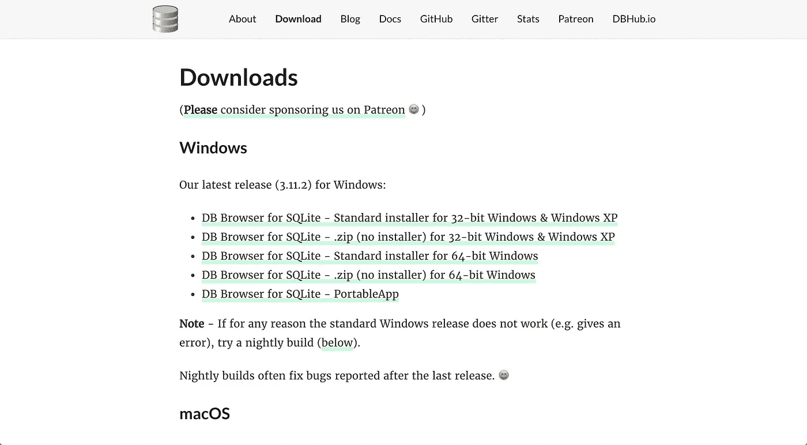

[DB4S 下载链接](https://sqlitebrowser.org/dl/)

如果您在 macOS 上安装了 Homebrew，您也可以使用以下命令行安装最新版本:

```
brew cask install db-browser-for-sqlite
```

一旦在机器上安装了 DB4S，打开应用程序，就可以开始了！

# 2.创建数据库文件

当您打开 DB4S 时，在左上角会看到一个标有“New Database”的按钮。点击它，为你的数据库输入一个名字，然后点击“保存”到你想要的文件夹。

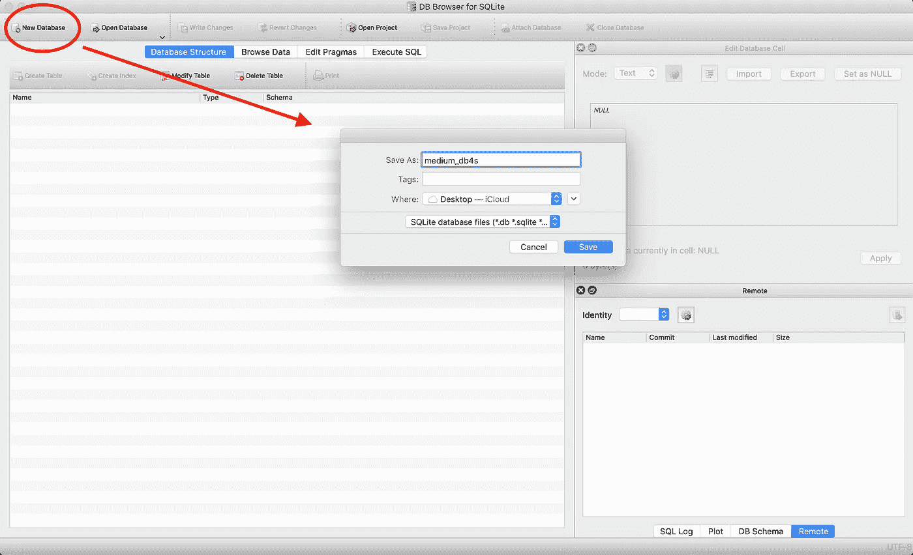

示例 SQLite 数据库创建

就是这样！您已经创建了第一个 SQL 数据库。您现在应该会看到:

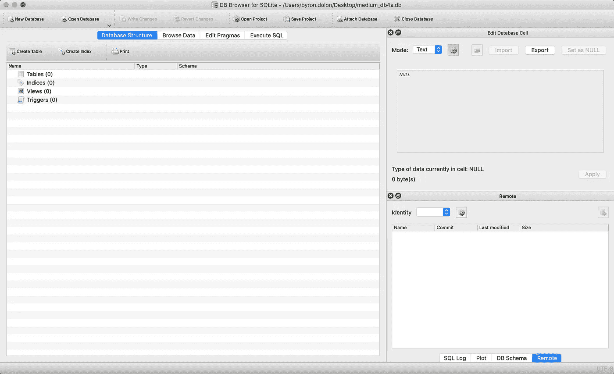

空 SQLite 数据库

# 3.使用 CSV 文件导入和导出表格

现在让我们创建我们的第一个表。为此，我们将导入一个 CSV 文件，其中包含 Medium 热门页面上的部分元数据。我在一个早期的 Python 项目中获得了数据，你可以在这里查看[。](https://medium.com/better-programming/how-i-analyzed-mediums-popular-page-with-python-part-1-8b81e81ae298?source=friends_link&sk=f411807810e5ede4a42761df90b1c923)

CSV 看起来像这样:

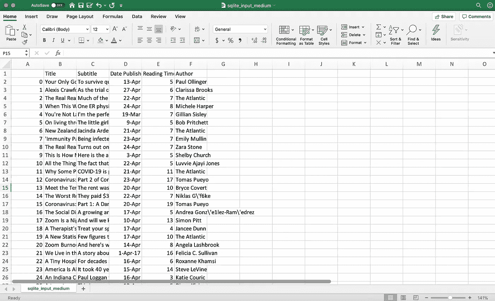

中等流行页面元数据的 CSV 文件

要在 DB4S 上用这个文件创建一个表，您需要:

```
File > Import > Table from CSV file...
```

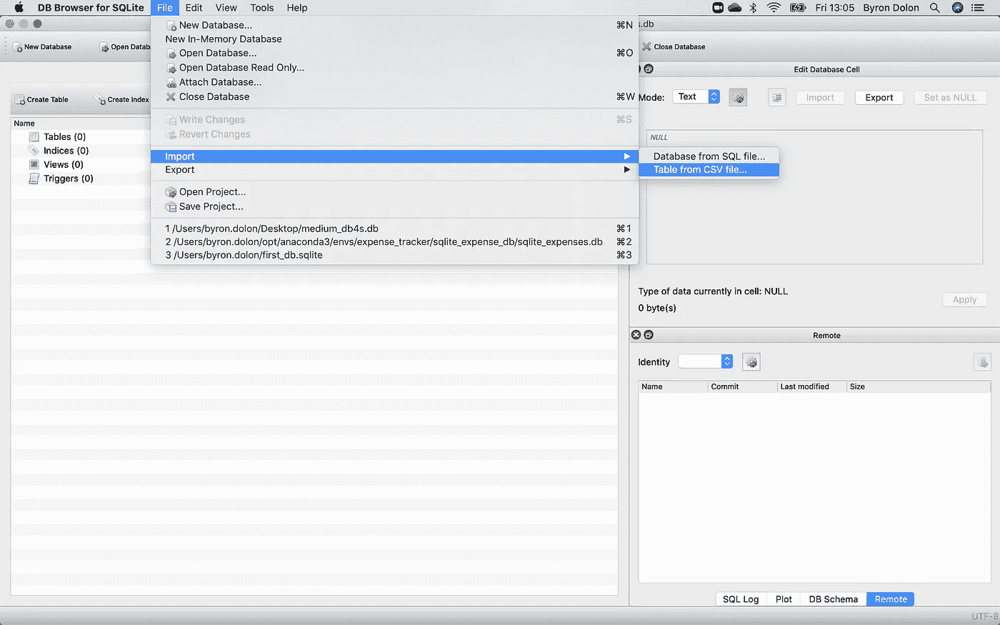

导入 CSV 以创建表格

之后，选择你想要的 CSV 文件并点击“打开”。

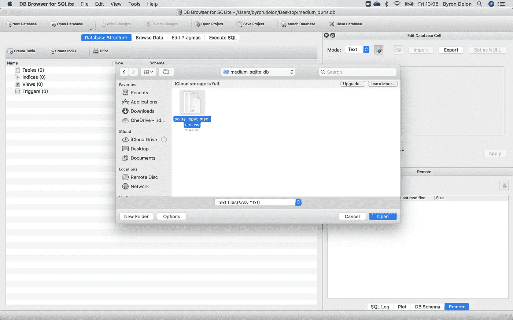

导入 CSV 以创建表格

这将在另一个窗口中提示几个定制选项。把名字改成容易记住的。如果列标题已经在您的 CSV 文件的第一行中，那么勾选复选框以确保 DB4S 能够识别它。它将移动第一行成为列名。然后点击“确定”。

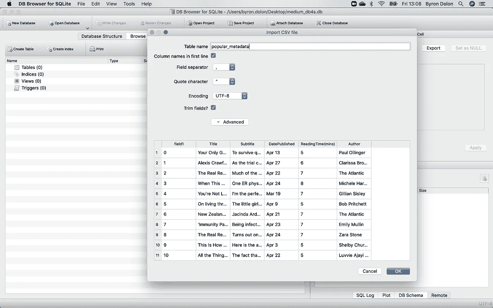

导入 CSV 以创建表格

然后嘣！您已经创建了第一个表格。

将数据库文件导出为 CSV 文件同样简单。你所要做的就是在表格上点击右键，然后点击“导出为 CSV 文件”。

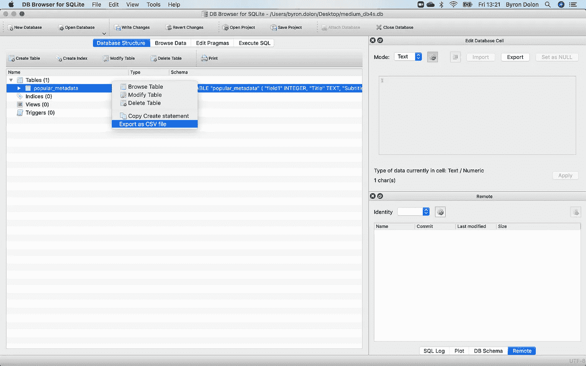

将表格导出到 CSV

或者要批量导出多个表，请执行以下操作:

```
File > Export > Table(s) as CSV file...
```

# 4.添加、修改和删除行(记录)和列

现在来看看我们在 DB4S 上的表。右键单击表格并选择“浏览表格”。

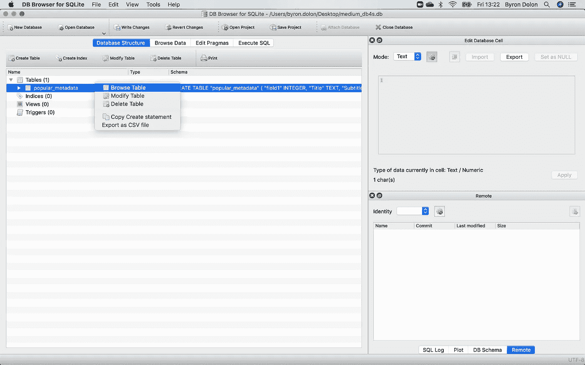

在 DB4S 中查看表

现在，您将看到一个经典的电子表格格式的表格。

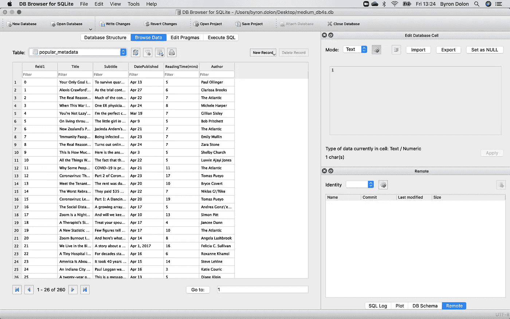

在 DB4S 中查看表

如果您想添加一个新行，只需单击“New Record”，DB4S 就会创建一个新行(已经有了一个主键)供您填入值，就像在 Excel 上一样。在这种情况下，我们可能希望每次在 Medium 的热门页面中添加新内容时都这样做。如果数据库中已经存在值，DB4S 甚至会根据您输入的第一个字母建议一个行值。


在 DB4S 中添加记录

要删除一行，你只需要选择一行(点击最左边一列的主键)，然后点击“删除记录”。

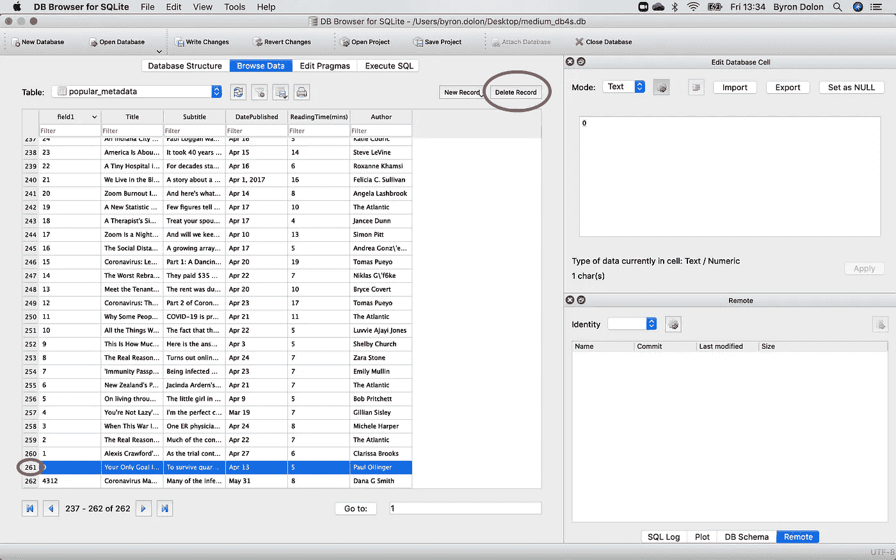

删除 DB4S 中的记录

完成所有更改后，单击“写入更改”保存所有修改并更新数据库中的表格。

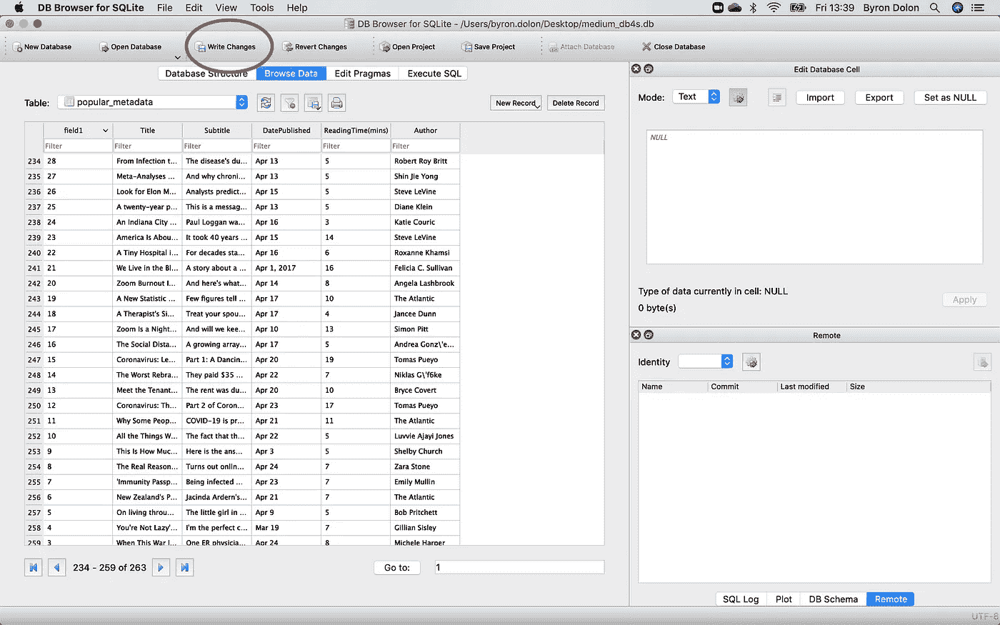

将更改保存到 DB4S 中已编辑的表

现在，在表格上，您可以看到有一个名为“字段 1”的列。这是因为我的 CSV 摘录已经包含了一个索引列。由于 DB4S 会自动创建索引，所以我不再需要这个专栏了。

编写 SQLite 查询将允许您对表模式进行一些更改，但是没有单行的“删除列”功能可用。 [SQLite docs](https://www.sqlite.org/lang_altertable.html) 将为您提供一个如何删除列的变通方法，包括创建一个只包含所需列的新表，将数据从旧表复制到新表，并删除旧表。

在 DB4S 中，删除一列要简单得多。要删除列，请在数据库结构选项卡中，右键单击所需的表，然后单击“修改表”。

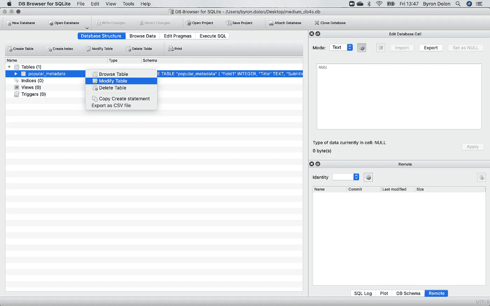

在 DB4S 中修改表

您将看到表中当前列的列表。选择您要删除的列，然后单击“删除字段”和“是”。

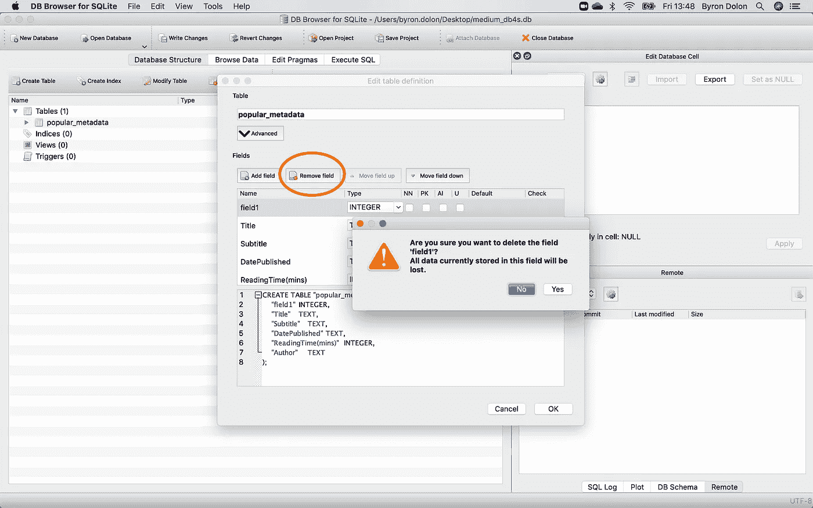

在 DB4S 中修改表

如果我们回到“浏览表”，我们会看到“字段 1”不再在表中。

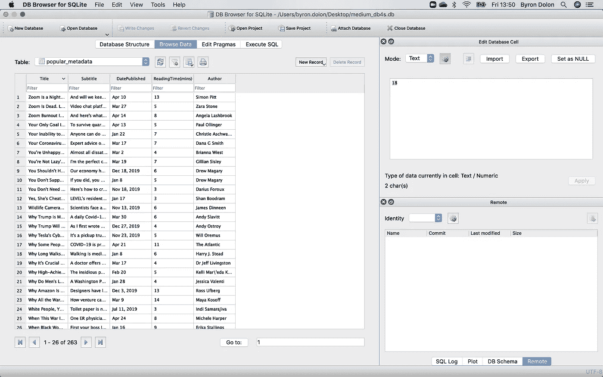

检查表中 DB4S 的变化

# 5.搜索和过滤记录

早些时候，我们添加了作者为“Dana G Smith”的记录。如果我们想在表中查找 Dana 发表的所有文章，我们只需要在“Author”下的“Filter”框中写下名字。

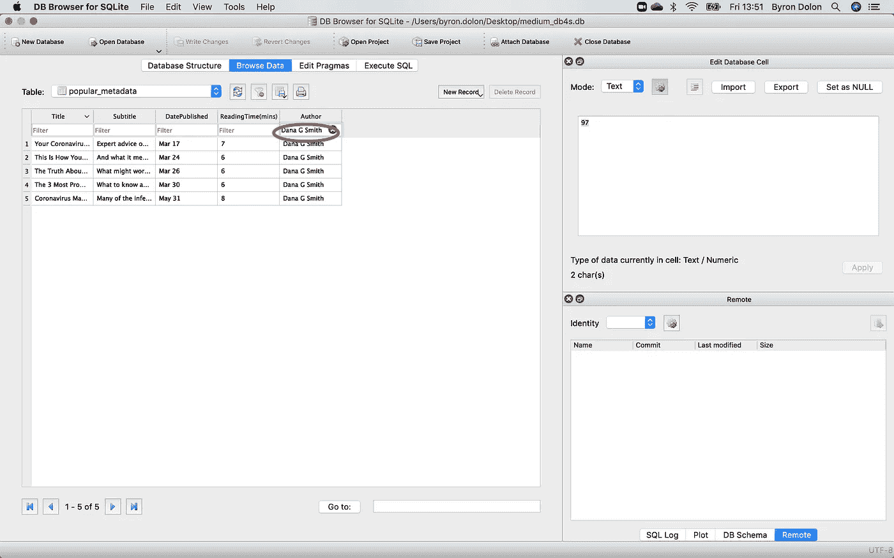

在 DB4S 中过滤表

您也可以一次按多列添加筛选。如果我们想找到 2019 年所有阅读时间为 11 分钟的文章，你只需要填写两个过滤器列。表格会自动刷新，只显示您需要的结果。

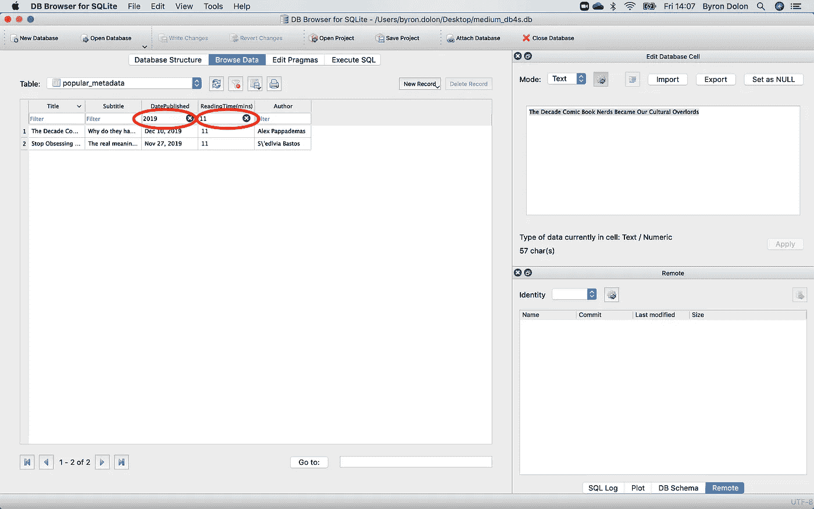

在 DB4S 中过滤表

# 6.运行 SQL 查询

您可以通过“执行 SQL”选项卡运行各种 SQLite 查询。例如，如果我们想要查看阅读时间为 5 的所有文章，只需像前面一样在过滤器列中键入“5”就会显示一些不想要的结果。在这种情况下，我们还会得到阅读时间为“15”的文章。

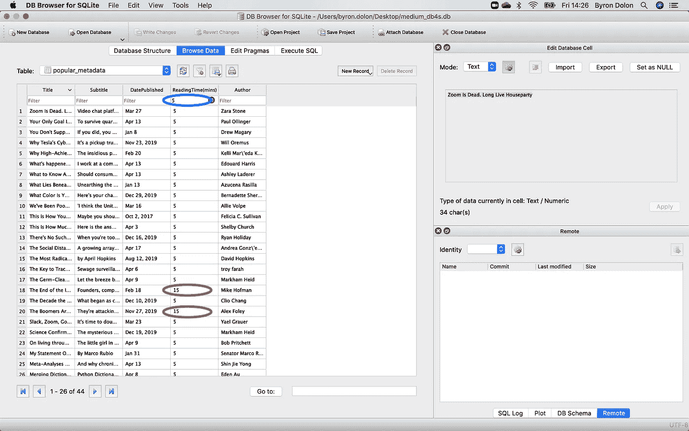

我们不想在过滤器中看到的样本数据

为了解决这个问题，我们将编写一个基本的 SQL 查询来过滤结果，使读取时间仅为 5。

```
SELECT * FROM popular_metadata 
WHERE "ReadingTime(mins)" = '5';
```

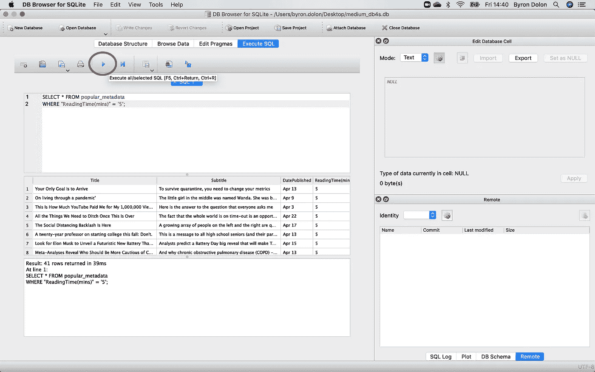

在 DB4S 上运行 SQL 查询

您可以轻松地将过滤后的结果保存到 CSV 文件中。点击下面圈出的按钮，选择“导出到 CSV”。

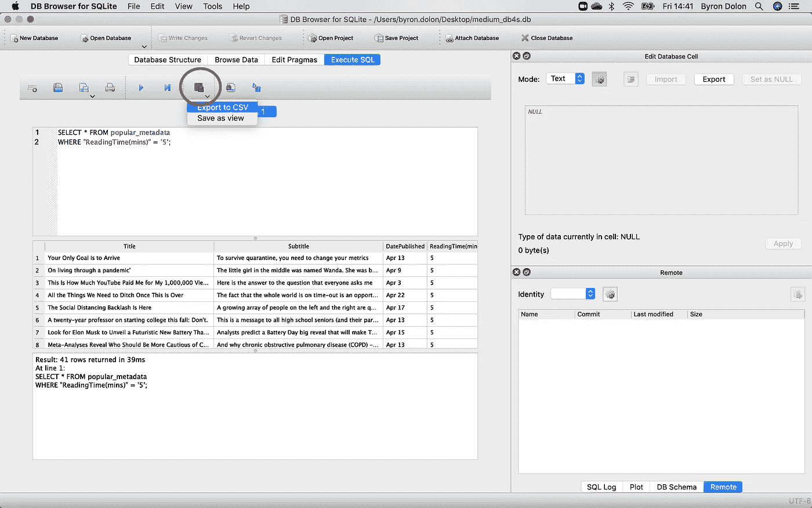

在 DB4S 上保存 SQL 查询

然后，您可以配置 CSV 输出并选择输出文件的位置。

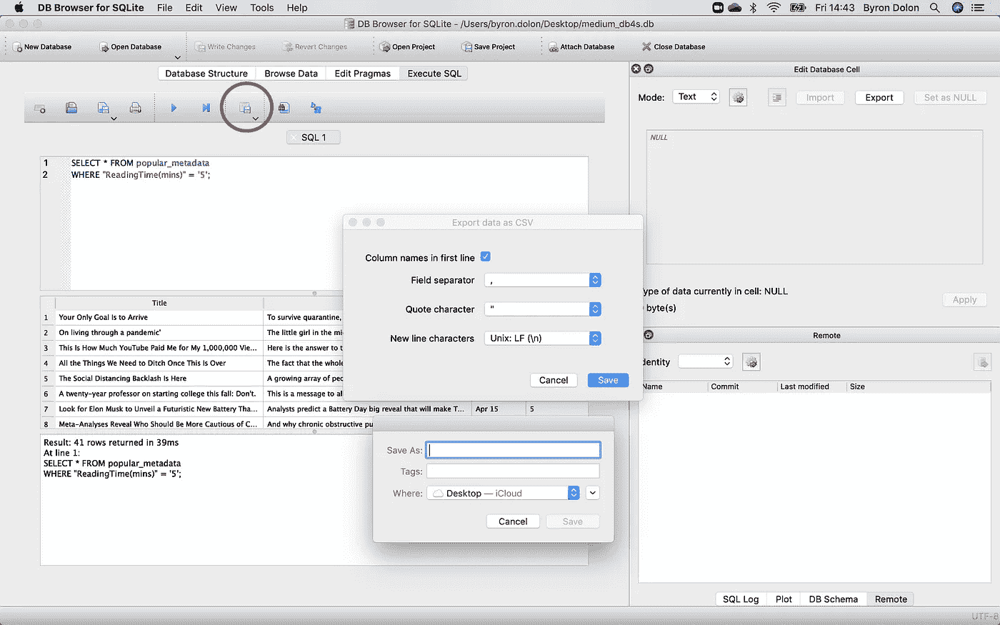

在 DB4S 上保存 SQL 查询

您的结果文件现在将被过滤，只包含阅读时间为“5”的文章。

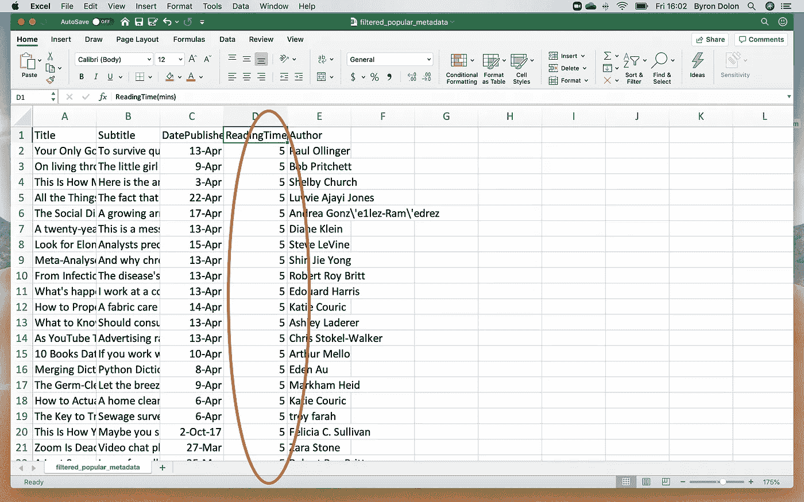

DB4S 中保存的 SQL 查询的 CSV 输出

# 7.用图形或 SQL 查询可视化数据

假设我们想要创建一个图表，查看一段时间内每天文章的总阅读时间。要在不使用任何 SQL 的情况下做到这一点，我们可以使用 DB4S plot 函数。点击“查看”，然后选择“绘图”。

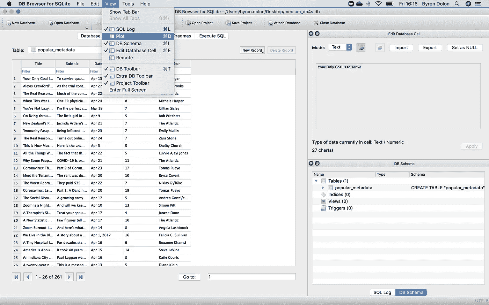

不使用 SQL 在 DB4S 上绘制数据

这将打开一个新的对话框，让您选择要在图形的 X 轴和 Y 轴上显示哪些列。下面，我选择了“出版日期”和“阅读时间(分钟)”。DB4S 生成了一个条形图，向我显示每天以分钟为单位的阅读时间。

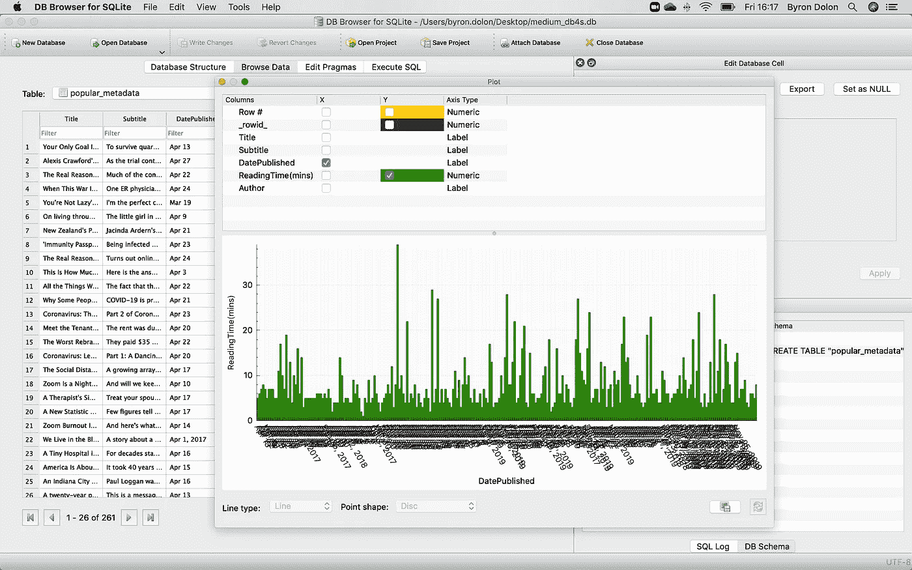

不使用 SQL 在 DB4S 上绘制数据

您还可以从 SQL 查询中生成图表。假设我们想统计每天发表的文章数量。我们可以编写一个简单的“GROUP BY”查询，并用图表显示结果。

首先，回到之前演示的“执行 SQL”窗口。然后填写您的 SQL 查询，运行它，单击“Plot ”,并为您的轴选择列。您将看到 SQL 查询生成的表格的图形版本。

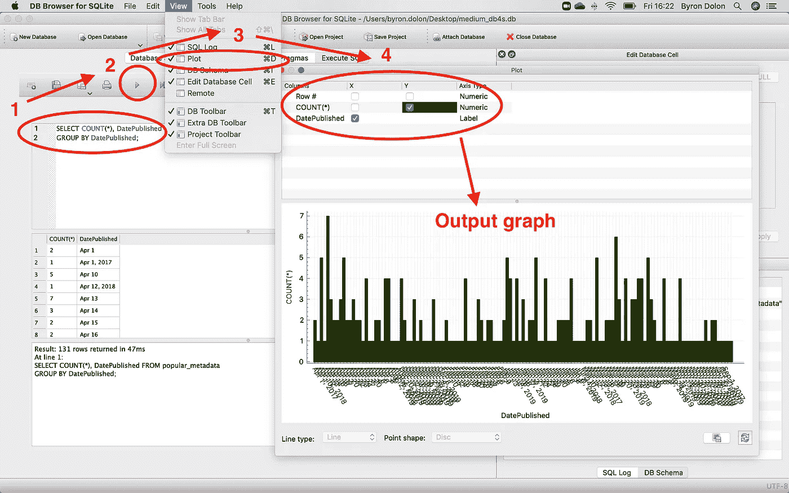

用 SQL 在 DB4S 上绘制数据

到目前为止，我们已经使用 DB4S 完成了您自己的关系数据库的完整设置和使用！该工具简单的可视化界面允许您轻松开始创建和管理 SQLite 数据库。在您熟悉了这一点之后，我们还看了如何实际使用该工具来运行 SQL 查询，甚至用简单的图形来可视化数据。

这篇文章旨在帮助你开始。为了进一步阅读，我强烈推荐查看一下 [SQLite 文档](https://www.sqlite.org/index.html)和 [DB4S 文档](https://sqlitebrowser.org/)。

如果你想看看如何使用 Pandas 向数据库写入数据，请随意查看这篇文章:

[](/using-just-one-line-of-code-to-write-to-a-relational-database-3ed08a643c5f) [## 仅使用一行代码写入关系数据库

### 谁知道您可以在没有任何 SQL 的情况下添加到数据库中呢？

towardsdatascience.com](/using-just-one-line-of-code-to-write-to-a-relational-database-3ed08a643c5f)