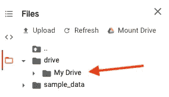

# 使用 Google Colab 构建代码协作

> 原文：<https://towardsdatascience.com/an-effective-way-of-managing-files-on-google-colab-ac37f792690b?source=collection_archive---------28----------------------->

## 了解更多关于 Google Colab 的信息


卢卡斯·布拉塞克在 [Unsplash](https://unsplash.com?utm_source=medium&utm_medium=referral) 上的照片

M 可能我们很多人都很熟悉**谷歌可乐。如果你不知道的话，Colab 是一个完全在云中运行的免费 **Jupyter 笔记本**环境。最重要的是，这不需要设置，您创建的笔记本可以由您的团队成员同时编辑，就像您在 Google Docs 中编辑文档一样。Colab 支持流行的机器学习库，您可以轻松地将其加载到笔记本中。**

其实我在 2018 年大学的时候就开始使用 Google colab 了，但是那时候即使是从 google drive 上访问数据还是很复杂的。最后，出于无奈，我决定使用一个规格低得多的计算机实验室。

但是当我在 2019 年底朋友推荐的时候尝试了一下。从那里，我意识到现在访问数据等。变得更容易了，我将与你分享我的知识。

## 为什么使用 Google Colab

Google Colaboratory 或 Colab 允许您在浏览器中编写和运行 Python，具有:

*   **零配置需求，**使用 colab 的便利之处之一是，你不需要配置/安装系统，因为一切都已经由 Google 完成了。你只需要安装你需要的 python 库。
*   **免费使用 GPU，**另一个好处是你有权限使用 GPU。所以你只需要有一个能打开浏览器，能上网的设备。
*   **轻松分享**，就像其他 Google 服务一样，你可以像使用 Google Docs 一样与他人分享你的工作成果。但是需要注意的是，根据我的经验，不能有一个以上的人同时在一台笔记本上编辑。

还有一点，如果当前 RAM 不够用，Google 会提供额外的 RAM。根据我当时的经验，我正在提取维基百科的数据，然后它因为 RAM 满而崩溃了。然后谷歌提出将 ram 从原来的 12 GB 增加到 25 GB。

在浏览器打开的情况下，Google Colab 运行笔记本的“最长寿命”限制为 12 小时，而“空闲”笔记本实例在 90 分钟后中断。此外，您最多可以同时运行两台笔记本电脑。

如果在实例仍在运行时关闭并打开记事本窗口，输出和单元变量仍将存在。但是如果笔记本实例已经被回收，那么您的输出和单元格变量就不再可用。

然而，如果每次使用 Google Colab 时都必须上传数据集或模型，Google Colab 可能会很烦人。也许你不介意文件大小足够小，但如果你上传的数据集或模型文件足够大加上你有限的互联网连接，这将是一个问题。在这里，我给出了处理这些问题的技巧。

## 使用 Google Drive

第一种方法是用 Google Drive 安装它。所以你将要使用或已经使用的数据都存储在 Google Drive 里。使用 Google Drive 安装 Google Colab 需要使用下面的代码，该代码将提示输入授权代码。

```
from google.colab import drive
drive.mount('/content/drive')
```

代码行将返回获取授权代码的链接。点击链接，你会得到授权码。然后将其复制到提示符下，并按回车键。

您的 Google Drive 中的所有文件和文件夹都可以从名为“My Drive”的文件夹中访问。



驱动安装

如果使用 zip，效率会更高，但因为它可以压缩较小的文件，所以如果文件包含图像集合，它也很有用。您可以使用 Colab 中的 unzip 命令来解压缩以'！'开头的文件(感叹号)。感叹号用于执行来自底层操作系统的命令。

```
!unzip /path/to/file.zip
```

如果你要做长时间的训练，强烈建议使用一个检查点，保存在 google drive 上。

## 使用 Git

如果因为存储驱动器已满而无法使用 Google Drive。也可以使用 git 作为存储。比如你可以使用 [**Github**](https://github.com) 。Github 的限制是每个存储库 100 GB，每个文件 100 MB。相比之下，Google Drive 的免费版本只能提供 15GB 的存储空间。

要克隆 git remote，通常可以使用 git 命令，在开头添加感叹号。例如:

```
!git clone https://github.com/keras-team/keras.git
```

如果想推送到 git remote，有几个配置是必须要做的。

首先，是初始化 git 存储库。

```
!git init
```

然后，设置全局电子邮件和用户名。

```
!git config — global user.email “You@Your.com”
!git config — global user.name “Username”
```

添加文件

```
!git add .
```

*提交*

```
!git commit -m "first commit"
```

这是最重要的一行，当我们添加 git 远程源时，我们必须传递我们的 Github 凭证。

```
!git remote add origin https://<username>:<password>github@github.com/<username>/reponame.git
```

最后，用力。

```
!git push -u origin master
```

## 使用 wget

Google Colab 机器是建立在基于 Debian 的 Linux 上的，因此通过网络下载数据最简单的方法是 wget。您可以将文件上传到某个地方，然后您可以从 cell code notebook 下载并使用这个 shell 命令:wget。

例如，如果你想检索维基百科的数据。您可以使用以下命令将它直接下载到您的 Google colab。

```
!wget https://dumps.wikimedia.org/enwiki/latest/enwiki-latest-pages-articles-multistream-index.txt.bz2
```

如果你想更完整地了解如何在 Google Colab 中处理文件，你可以访问下面的链接。

[](https://bit.ly/37vKYN1) [## 如何在 Google Colab 中处理文件:你需要知道的一切- neptune.ai

### 谷歌合作实验室是一个免费的 Jupyter 笔记本环境，运行在谷歌的云服务器上，让用户…

bit.ly](https://bit.ly/37vKYN1)