# 在 PySpark 上实现 DBSCAN

> 原文：<https://towardsdatascience.com/an-efficient-implementation-of-dbscan-on-pyspark-3e2be646f57d?source=collection_archive---------17----------------------->

## 一种基于三角形不等式的高效距离计算和聚类合并算法

DBSCAN 是一种众所周知的聚类算法，它经受住了时间的考验。虽然算法没有包含在 [Spark MLLib](https://spark.apache.org/docs/latest/ml-clustering.html) 中。有几个实现( [1](https://github.com/alitouka/spark_dbscan) 、 [2](https://github.com/mraad/dbscan-spark) 、 [3](https://github.com/irvingc/dbscan-on-spark) )虽然都是在 scala 中。在 [PySpark](https://github.com/htleeab/DBSCAN-pyspark) 中的实现使用 rdd 与其自身的笛卡儿积，这导致 O(n)复杂度，并且在滤波器之前可能需要 O(n)内存。

```
ptsFullNeighborRDD=rdd.cartesian(rdd)                            .filter(lambda (pt1,pt2): dist(pt1,pt2)<eps)                            .map(lambda (pt1,pt2):(pt1,[pt2]))                            .reduceByKey(lambda pts1,pts2: pts1+pts2)                            .filter(lambda (pt, pts): len(pts)>=minPts)source: [https://github.com/htleeab/DBSCAN-pyspark/blob/master/DBSCAN.py](https://github.com/htleeab/DBSCAN-pyspark/blob/master/DBSCAN.py)
```

关于 DBSCAN 算法复杂性的快速入门:

> [https://en.wikipedia.org/wiki/DBSCAN#Complexity](https://en.wikipedia.org/wiki/DBSCAN#Complexity)
> 
> DBSCAN 可能多次访问数据库的每个点(例如，作为不同聚类的候选)。然而，出于实际考虑，时间复杂度主要由 regionQuery 调用的数量决定。DBSCAN 对每个点只执行一个这样的查询，并且如果使用在 O(log *n* )中执行[邻域查询](https://en.wikipedia.org/wiki/Fixed-radius_near_neighbors)的[索引结构，则获得 O( *n* log *n* )的总体平均运行时间复杂度(如果以有意义的方式选择参数ε，即平均只返回 O(log *n* )个点)。在不使用加速索引结构的情况下，或者在退化数据上(例如，距离小于ε的所有点)，最坏情况运行时间复杂度保持为 O( *n* )。大小为( *n* - *n* )/2 的距离矩阵可以被具体化以避免距离重新计算，但是这需要 O( *n* )存储器，而基于非矩阵的 DBSCAN 实现只需要 O( *n* )存储器。](https://en.wikipedia.org/wiki/Spatial_index)

在本文中，我们将探讨如何通过减少距离计算的次数，在不使用 O(n)运算的情况下，在 PySpark 中高效地实现 DBSCAN。我们将实现一个基于三角形不等式的索引/分区结构来实现这一点。

# 三角形不等式

让我们用来刷新三角形不等式。如果三角形有三个顶点 *a* 、 *b* 和 *c、*以及给定的距离度量 *d.* 那么

*d* ( *a，b*)*≤*d*(*a，c* ) *+ d* ( *c，b* )*

**d* ( *a，c*)*≤*d*(*a，b* ) *+ d* ( *b，c* )**

***d* ( *b，c*)*≤*d*(*b，a* ) *+ d* ( *a，c* )***

**在 DBSCAN 中有一个参数ε，用来寻找点与点之间的联系。现在，让我们用这个参数来看看能否利用三角形不等式来减少运算次数。**

**假设有四个点 *x* 、 *y、z、*c、**

****引理 1** :如果 *d* ( *x，c* ) ≥ ( *k* +1)ε和 *d* ( *y，c* ) < *k* ε那么 *d* ( *x，y***

**根据三角形不等式，**

***d* ( *x，c* ) ≤ *d* ( *x，y* ) + *d* ( *y，c* )**

***d* ( *x，c* )- *d* ( *y，c* )≤ *d* ( *x，y* )**

***d* ( *x，c* )- *d* ( *y，c*)>(*k*+1)ε-*k*ε>ε**

**所以 *d* ( *x，y* ) > ε**

****引理 2** :如果 *d* ( *x，c* ) ≤ *l* ε和 *d* ( *z，c*)>(*l+1)*ε则 *d* ( *x***

**根据三角形不等式，**

***d* ( *z，c* ) ≤ *d* ( *x，z* ) + *d* ( *x，c* )**

***d* ( *z，c* )- *d* ( *x，c* )≤ *d* ( *x，z***

***d* ( *z，c* )- *d* ( *x，c*)>(*l*+1)ε-*l*ε**

***d* ( *z，c* )- *d* ( *x，c* ) > ε**

**所以 *d* ( *x，z* ) > ε**

**从上面我们可以推断出，如果我们计算所有的点到 *c* 的距离，那么我们可以使用上面的标准过滤点 *y* 和 *z* 。我们可以计算从 *c* 到同心环(中心为 *c* )中分割点的距离。**

# **重叠同心环形隔板**

## **隔板的宽度应该是多少？**

**从以上引理可以看出，如果**

***(m+1*)ε≥*d*(*x，c* ) ≥ *m* ε那么我们就可以过滤出点 *y* 和 *z* 如果 *d* ( *y，c* ) < ( *m* -1)ε和 *d***

**由此我们可以推导出，对于*(m+1*)ε≥*d*(*x，c* ) ≥ *m* ε为真的任意一点，我们可以有一个宽度为( *m* +3)ε的分块，从( *m* -1)ε开始，到( *m+* 2)ε结束**

**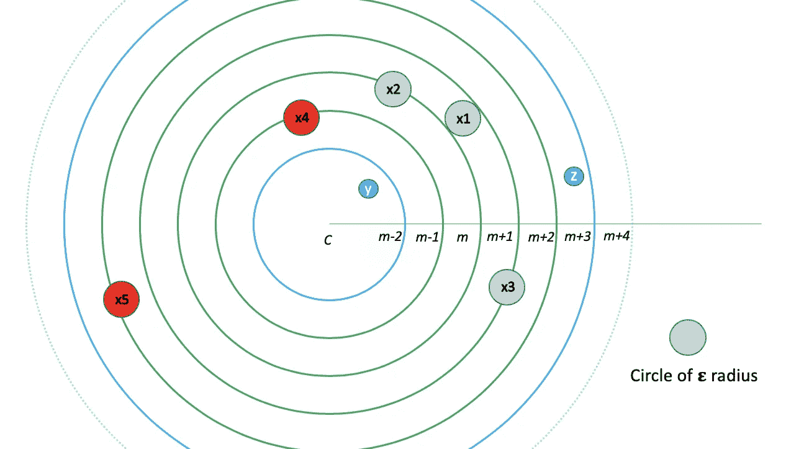**

**图 1:隔板的宽度应该是多少？**

**这是它看起来的样子。二维空间被分成ε欧氏距离的分位数。绿色环表示分区。 *x* 1 在距离*c*(*m-*1*)*ε—(*m*+2)ε隔板的中心)的( *m* +1/2)ε距离处。 *x* 2 和 *x* 3 位于 *m* ε和( *m* +1)ε距离 *c.* 很明显对于 *x* 1、 *x* 2 和 *x* 3 所有相关点(在圆内**

**如果我们创建互斥分区并计算该分区内各点之间的距离，这将是不完整的。比如 *x* 4 和 *x* 5 的范围圈会重叠两个分区。因此需要重叠分区。一种策略是将分区移动ε。尽管在这种情况下，如果分区宽度是 3ε，那么一个点可能出现在三个不同的分区中。相反，分区是以 2ε宽度创建的，并按ε移动它们。在这种情况下，一个点可能只出现在两个分区中。**

**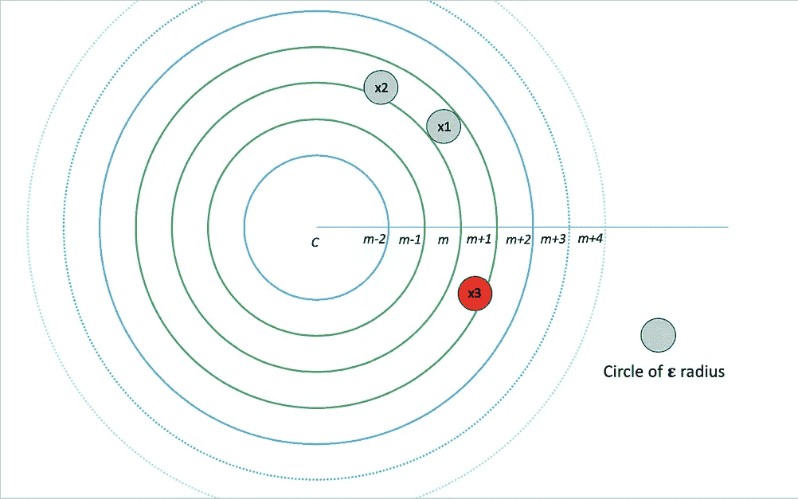****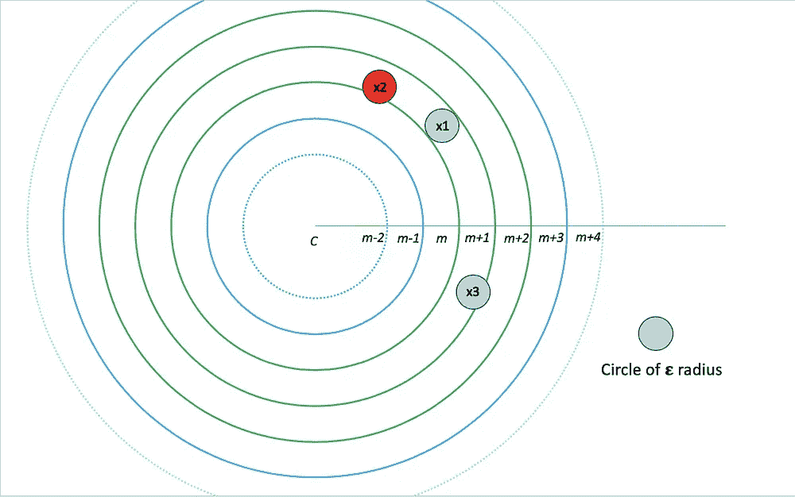**

**图 2:具有ε重叠的 2ε宽度分区**

**上面两张图片展示了这种分区方案的工作原理。两个分区的组合允许对从 *m* ε到( *m+* 1)ε的所有点进行ε半径的范围查询。第一个分区覆盖从 *m* ε到( *m+* 1/2)ε ( *x* 2 被覆盖但 *x* 3 未被覆盖)的所有点，第二个分区覆盖( *m+* 1/2)ε到( *m+* 1)ε ( *x* 3 被覆盖但 3)**

# **分区可视化**

**让我们看看这些分区在一些生成的数据上是什么样子的。**

**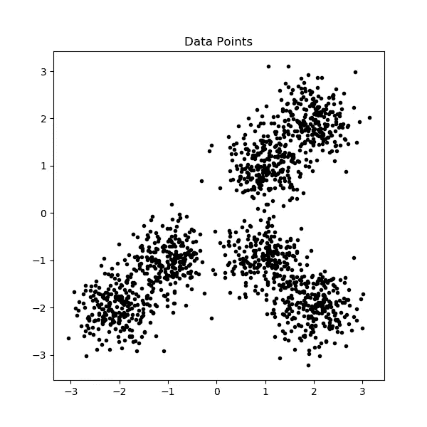**

**图 3:数据点**

**上述数据和图像由以下代码生成:**

**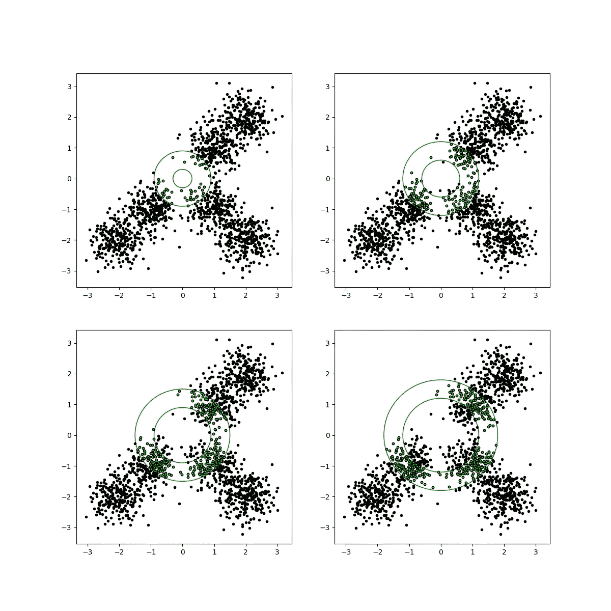**

**图 4:从数据中生成的几个分区**

**上述数据分区由以下代码生成:**

**partition_index 标识每个分区。如前所述，根据从 *c* (枢轴)到ε的距离，每个数据点被放入两个分区。距离方法一次处理一个点。在 PySpark *中，flatMap* 方法用于将每个点映射到元组数组(out)中。**

# **合并分区**

**在生成可视化之前，合并分区内的所有数据点。它们还需要合并，以便在 PySpark 上进一步处理 DBSCAN。**

***reduceByKey* 方法用于将分区数据合并为一个。单词分区的使用可能会与 PySpark 分区混淆，但这是两件不同的事情。虽然 *partitionBy* 方法也可以用来协调这一点。**

**在 *reduceByKey* ，之后，我们将得到 rdd 的每一行，如图 4 所示。正如你所看到的，有一个重叠，所以点将在两行 rdd 中，这是故意的。**

# **距离计算**

**上面的代码计算每个分区内的距离。该方法的输出是一个元组列表。每个元组都有一个点的 id 和它在ε距离内的邻居集。我们知道，该点会出现在两个分区中，因此我们需要组合给定点的集合，以便在整个数据中获得其所有在ε距离内的邻居。 *reduceByKey* 用于通过对集合进行并集运算来合并集合。**

```
**reduceByKey(lambda x, y: x.union(y))**
```

**到目前为止，组合代码如下所示:**

# **核心和边界点标记**

**一旦我们在一个点的ε距离内有了邻居，我们就可以确定它是核心点还是边界点。**

****核心点**:ε距离内至少有*个 min_pts***

****边界点**:ε距离内有少于*个 min_pts* ，但其中一个是核心点。**

**为了识别核心点和边界点，首先，我们将它们分配给一个集群。对于作为核心点的每个点，我们创建一个与其 id 相同的聚类标签(假设 id 是唯一的)。我们为每个核心点及其邻居创建一个元组，其形式为( *id* ，[( *cluster_label* ， *is_core_point* )])。这种情况下的所有邻居都将被标记为基点。让我们举一个例子**

```
***min_pts* = 3
Input: (3, set(4,6,2))
Output: [(3, [(3, True)]), (4, [(3, False)]), (6, [(3, False)]), (2, [(3, False)])]**
```

**输入是一个元组，其中 3 是点的 id，而(4，6，2)是它在ε距离内的邻居。**

**可以看出，所有点都被分配了聚类标签 3。当 3 被指定为*真*时*是核心点*并且所有其他点被认为是基点并且被指定为*假*时*是核心点。***

**对于 4、6 和 2，我们可能有类似的输入元组，它们可能被指定为核心点，也可能不被指定为核心点。想法是最终组合一个点的所有聚类标签，并且如果至少一个对*的赋值是 _ 核心 _ 点*是*真*，那么它是核心点，否则它是边界点。**

**我们使用 *reduceByKey* 方法将一个点的所有( *cluster_label* ， *is_core_point* )元组组合起来，然后在组合该点的所有聚类标签时调查它是否是核心点。如果它是一个边界点，那么我们将只为它留下一个集群标签。**

**上述方法用于组合一个点的所有聚类标签。同样，如果它是边界点，那么我们只返回第一个聚类标签。**

**到目前为止，PySpark 中的代码如下所示:**

# **连接的核心和边界点**

**对于每个点，我们都有聚类标签。如果一个点有多个聚类标签，则意味着这些聚类是相连的。那些相连的聚类是我们需要求解 DBSCAN 的最终聚类。我们通过创建一个图来解决这个问题，如果顶点被分配到同一点，则图中的顶点作为聚类标签，而边位于聚类标签之间。**

**在上面的代码中，combine_cluster_rdd 是行的集合，其中每一行都是一个元组( *point* ， *cluster_labels* )。每个聚类标签是顶点，点的聚类标签的组合是边。该图的连通分量给出了每个聚类标签和一个连通的聚类之间的映射。我们可以将它应用到点上以得到最终的聚类。**

**上面是最终方法的样子，它返回一个 Spark 数据帧，带有点 id、集群组件标签和一个布尔指示符(如果是核心点的话)。**

# **比较**

**现在，我将结果与 DBSCAN 的 [sklearn](https://scikit-learn.org/stable/auto_examples/cluster/plot_dbscan.html) 实现进行比较。**

***make_blobs* 方法在三个输入中心周围创建斑点。使用 sklearn 和我的实现在ε=0.3 和 *min_pts* =10 的情况下运行 DBSCAN 得到以下结果。**

**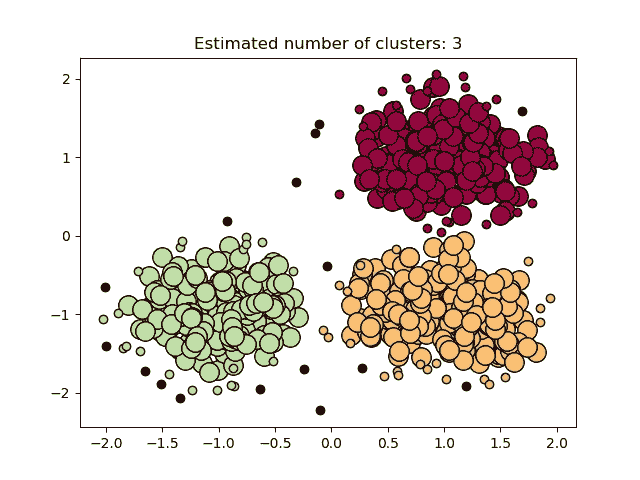****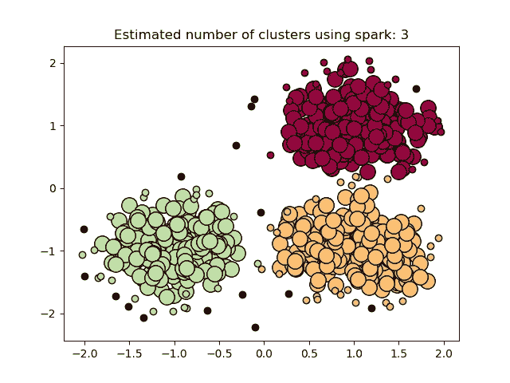**

**左:sklearn vs 右:基于 pyspark 的实现(ε=0.3 且 *min_pts* =10)**

**核心点是较大的圆圈，而边界点是较小的圆圈。噪声点被涂成黑色，这在两种实现中是相同的。突出的一点是边界点被分配了不同的集群，这说明了 DBSCAN 的不确定性。我的另一篇帖子也谈到了这一点。**

**[](https://medium.com/@salilkjain/some-notes-on-dbscan-algorithm-61a2e9acce29) [## 关于 DBSCAN 算法的几点注记

### 在这篇文章中，我想讨论一些关于 DBSCAN 算法的见解。通常，当我看一个算法时，我…

medium.com](https://medium.com/@salilkjain/some-notes-on-dbscan-algorithm-61a2e9acce29) 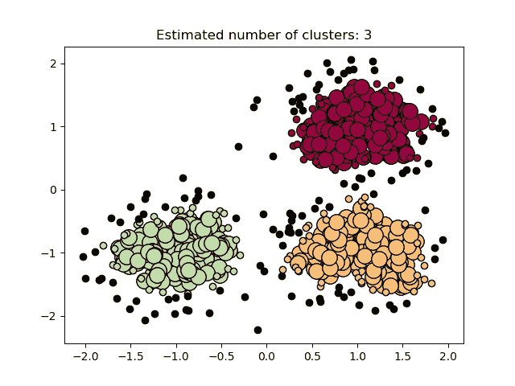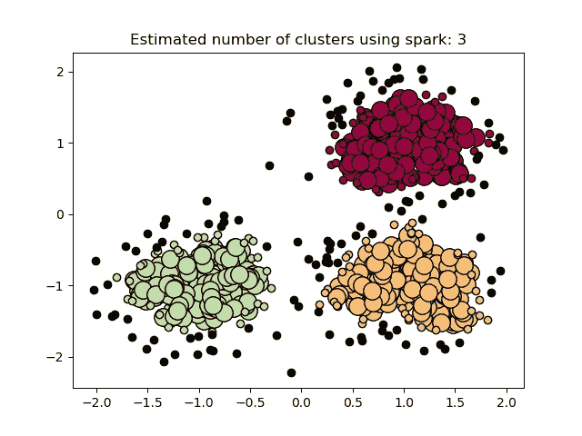

左:sklearn vs 右:基于 pyspark 的实现(ε=0.2 且 *min_pts* =10)

对于ε=0.2，我们得到分配给相同聚类的边界点。下面是环中数据的一些代码和结果。

## **操作次数**

对于 n=750，DBSCAN 的简单实现所需的距离运算的数量将是 n(n-1)/2，即 280875。当我们基于ε创建分区时，ε越小，所需的距离运算次数就越少。在这种情况下，总共需要 149716 次(ε= 0.2)和 217624 次(ε=0.3)运算。

## **环比数据**

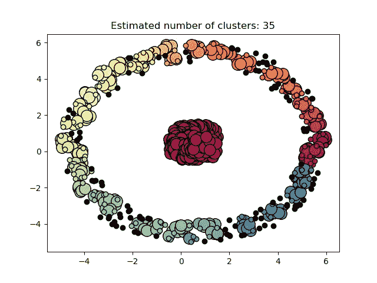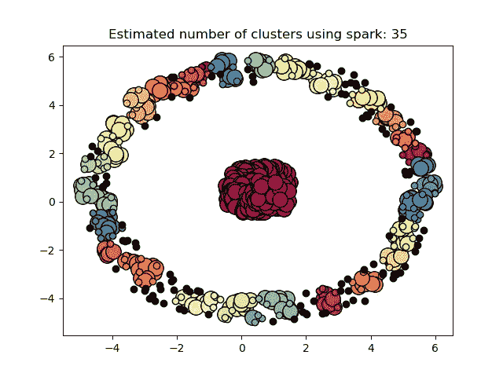

左:sklearn vs 右:基于 pyspark 的实现(ε=0.3 并且 *min_pts* =5)

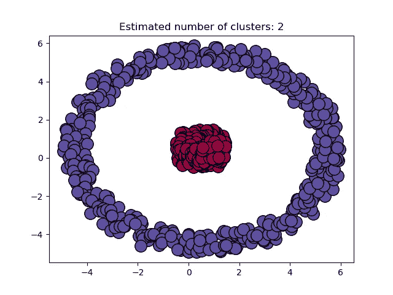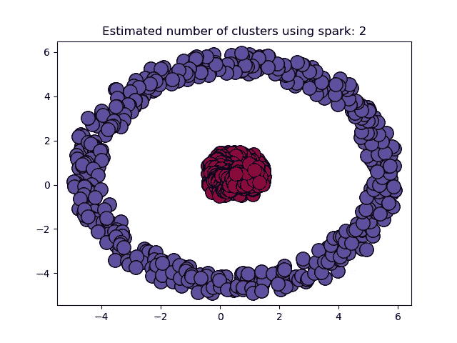

左:sklearn vs 右:基于 pyspark 的实现(ε=1 且 *min_pts* =5)

# 结论

基于ε值的 pyspark 实现是高效的，其步骤如下:

1.  分区数据:用ε移动的 2ε宽的重叠环进行分区。
2.  合并分区数据:这样我们就可以在一条记录中获得所有分区数据。
3.  距离计算:计算同一分区内的距离
4.  点标注:基于相邻点、标注核心和边界点的数量。
5.  连接的簇:使用 Graphframe 连接簇标签以评估最终的 DBSCAN 标签。

与现有实现的比较显示了该算法和该帖子的实现的准确性。

## 是否高效？

在具有驱动程序和工作节点的本地机器上，实现比 sklearn 慢。可能有几个原因需要调查:

1.  对于少量数据，sklearn 可能要快得多，但对于大数据来说是这样吗？
2.  Graphframe 需要相当长的时间来执行，想知道是否可以在驱动程序上使用其他图形库来执行连接组件分析？

# 履行

完整的 PySpark 实施可在以下网址找到:

[](https://github.com/SalilJain/pyspark_dbscan) [## SalilJain/pyspark_dbscan

### 在 py spark-salil Jain/py spark _ DBSCAN 上“高效”实现 DBS can

github.com](https://github.com/SalilJain/pyspark_dbscan)**