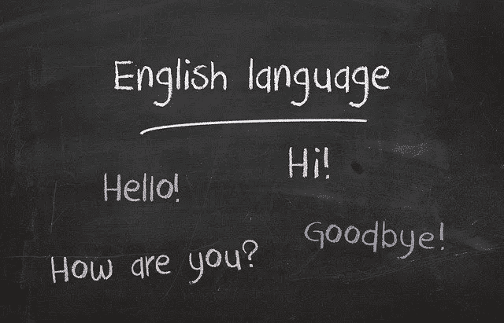
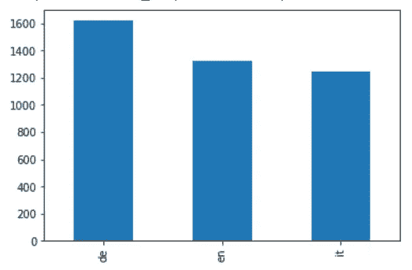
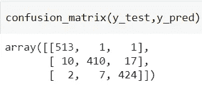
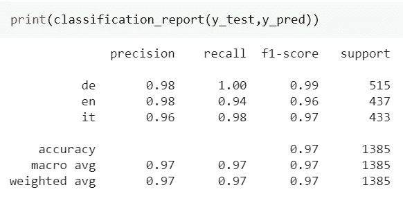

# 一种高效的朴素贝叶斯语言检测模型

> 原文：<https://towardsdatascience.com/an-efficient-language-detection-model-using-naive-bayes-85d02b51cfbd?source=collection_archive---------24----------------------->

## 一个简单的 Python 语言检测模型

比利亚纳·约万诺维奇摄于[皮克斯拜](https://pixabay.com/it/?utm_source=link-attribution&utm_medium=referral&utm_campaign=image&utm_content=2724442)

语言检测(或识别)是自然语言处理的一个迷人的分支。它的目标是创建一个模型，能够检测一个文本是用哪种语言写的。

数据科学家通常采用神经网络模型来实现这一目标。在本文中，我展示了如何使用朴素贝叶斯模型在 Python 中创建一个简单的语言检测模型。

# 问题是

我们要面对的问题是创建一个模型，一旦有了文本，它就能检测出它的语言。文本可以是一个句子、一个单词、一个更复杂的文本等等。例如，输出变量可以是语言代码(如英语的“en”)。

一个好主意是建立一个模型来检测文本的语言，即使该文本包含该模型在训练阶段没有看到的单词。我们想要一个模型，它能够以一种使语言能够正确检测的方式来概括语言的底层结构。

让我们看看如何创建这样一个模型。

# 数据

我要训练这个模型检测三种语言:意大利语、英语和德语。对于意大利语，我将使用我的一个简短的恐怖故事的文本来训练模型， *L'isola del male* 。对于英语，我将使用这个故事的英文翻译，*邪恶之岛*。对于德语，我将使用的文本*也就是查拉图斯特拉*在这里找到的弗里德里希·尼采:[http://www.nietzschesource.org/#eKGWB/Za-I](http://www.nietzschesource.org/#eKGWB/Za-I)。我将把这些文档分割成句子，最终的句子数据集将被分割成训练集和测试集。

# 使用字符二元模型进行矢量化

所以，我们在讨论一个三值类的分类问题，即:it，en，de。这是目标变量。

现在，我们来谈谈特点。我要使用的特性是 char bigrams，它是一个句子中两个连续字符的集合。例如，考虑“行星”这个词。在这种情况下，字符二元组是“pl”，“la”，“an”，“ne”，“et”。

为什么我们应该使用 char 二元模型？因为这样会降维。拉丁字母表由 26 个字母组成。加上这 10 个数字和一些其他特殊的字符或符号，我们得到大约 50 个不同的符号。我们可以拥有的字符二元模型的最大数量是 50*50 = 2500。

如果我们使用经典的单词驱动的矢量化，我们将拥有更高的维度，因为每种语言可能有数十万个单词，我们可能需要将它们全部矢量化，创建一个包含数千个特征的向量，并遭受维度的*诅咒*。使用 char 二元模型，我们最多可以得到 2500 个组件，它们可以在所有使用拉丁字母的语言中共享。这非常令人印象深刻，因为我们可以使用这个语料库作为使用这种字母表的每种语言的通用特征集。此外，我们没有绑定到预定义的单词语料库，因此我们的模型甚至可以处理从未被训练过的单词，只要它们是由原始训练语料库的字符二元组构成的。

在我们的特殊例子中，三个文档的完整词汇由 7062 个不同的单词组成。如果我们使用 chars char 二元模型，我们得到 842 个特征。我们已经将问题的维度减少了近 90%！

所以，这些就是特色。对于每个句子，我们计算字符二元模型，并计算特定二元模型在句子中出现的次数。这个数字将填充表示句子的相应向量分量。

# 模型

我要用的模型是多项式朴素贝叶斯。这是一个非常简单的模型，一般来说，当谈到自然语言处理时，朴素贝叶斯非常强大。它几乎没有超参数，所以我们可以专注于预处理阶段，这是最关键的。

根据 scikit-learn 文档，多项式朴素贝叶斯可以将计数向量作为输入特征，这正是我们需要的。

# 代码

让我们导入一些库:

我们将要使用的语料库由 3 个文本文件组成。我们必须清理文本，将其矢量化，然后我们可以训练模型。

## 数据预处理和矢量化

首先，我们必须清理我们的文本，以便把它分成单句。让我们编写一个函数，它获取一个文本文件，删除双空格、引号和无用的标点符号，返回一个句子列表。

每个文档都存储在单独的 txt 文件中。我们可以加载三个文档的句子，创建一个包含所有句子的数组，另一个包含与每个句子相关的语言。

完整的语料库规模为 4195 个句子。下面是一个例子:

语料库的一个例子。图片由作者提供。

如你所见，每个句子都与其语言相关联。

语言在语料库中的分布相当均匀，所以不存在不平衡的类别。

语料库中语言的分布。图片由作者提供。

现在，我们可以将数据集分为训练集和测试集，并开始处理模型。

首先，我们必须调用 sklearn 的 CountVectorizer 对象，以便为每个 char 二元模型创建它在每个句子中出现的次数。然后，我们可以创建管道，将我们的数据矢量化，并将其提供给模型，这是一个多项式朴素贝叶斯。

现在，我们可以拟合管道，并在测试集上计算预测:

我们终于可以看看混淆矩阵了:

挺斜的。分类误差似乎很低。

让我们看看分类报告:

如你所见，我们达到了 97%的整体准确率。如果我们考虑到我们只处理三个文档和一个少于 5000 条记录的数据集，这是非常令人印象深刻的。

# 让我们强调模型

现在，让我们强调一下我们的模型。

下面是三种不同语言的一组句子。“评论”栏是我的一个评论，解释了这个句子的一些特征，包括它的真实语言。“检测到的语言”列是模型预测的语言的 ISO 代码。

正如我们所看到的，即使对于混合语言的句子，该模型也相当不错。仍然存在一些错误(例如，“超参数”被错误地检测为意大利语)，但是结果看起来健壮且不错。

甚至在意大利文和英文文本中都出现的单词“Harrier”也被正确地认为是一个英文单词。

# 一个简单的 API

我已经将模型嵌入到 pickle 文件中，并使用 Flask 创建了一个简单的 API，将其部署在 Heroku 上。这是一个用于测试目的的开发 API。我善意地鼓励你尝试一下，并给我你的反馈。

终点是:**https://gianlucamalato.herokuapp.com/text/language/detect/**

请求必须是带有“text”键的 JSON 文档，其值是要处理的文本。该方法是 POST。

响应是一个 JSON 文档，包含“文本”字段中的原始文本和“语言”字段中检测到的语言代码。

下面是一个如何调用我的 API 的例子:

我创建了另一个 GET 方法来显示模型修改日期和支持的语言:

# 结论

在本文中，我展示了如何使用朴素贝叶斯创建一个简单的语言检测模型。像往常一样，模型的功能依赖于输入特性，使用 char 二元模型似乎是个好主意。

如果你喜欢这个模型，请使用我的 API 强调它，并给我你的反馈。