# 阿姆斯特丹 Airbnb 数据集:一个端到端的项目

> 原文：<https://towardsdatascience.com/an-end-to-end-data-science-project-that-will-boost-your-portfolio-c53cfe16f0e3?source=collection_archive---------9----------------------->

> 一个数据科学组合项目就像为你的驾驶执照实践考试而学习，你不是在学习驾驶，而是在学习如何通过考试。

准备作品集时，重要的是要有涵盖不同领域、技术并能讲述一个故事的项目。


Chait Goli 在 pexels.com 拍摄的照片

在本文中，我的主要目标是展示我将如何做一个数据科学组合项目，该项目涵盖可视化、数据预处理、建模和最终考虑以及生产建议。

给定一系列预测因素，我使用[阿姆斯特丹 Airbnb 数据集](https://www.kaggle.com/adityadeshpande23/amsterdam-airbnb)预测一套公寓的价格。

# 简介:

数据集一旦导入 Python，就会使用`[pandas_profiling](https://github.com/pandas-profiling/pandas-profiling)`进行分析，这是一个非常有用的工具，它扩展了 pandas 中的`df.info()`功能。

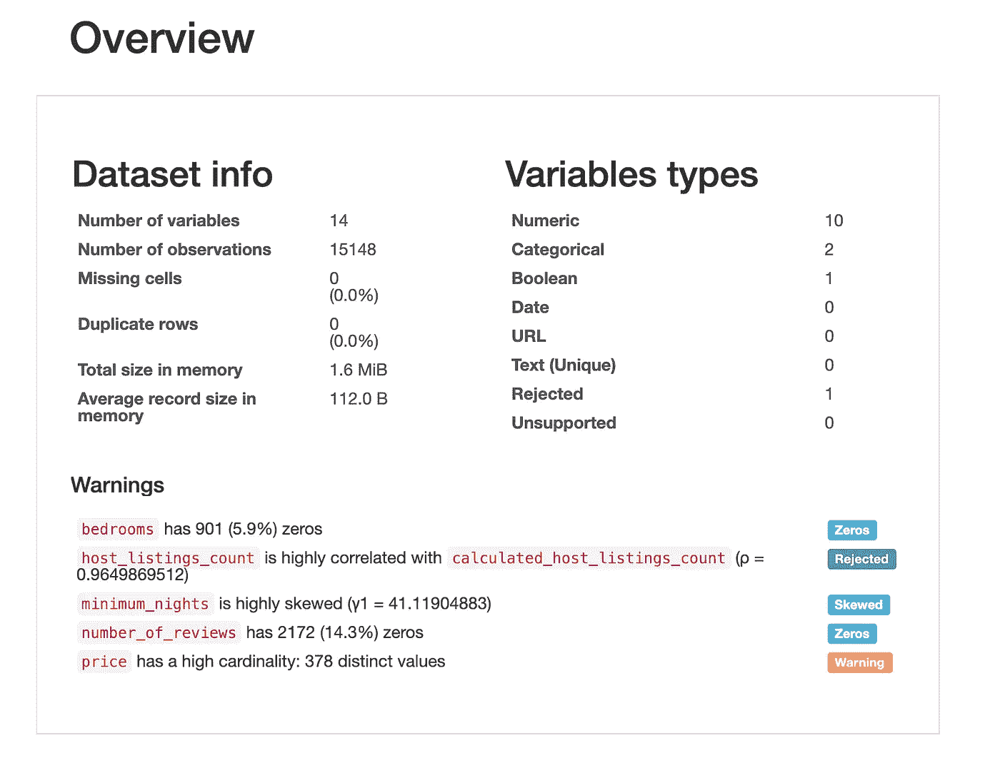

报告的第一部分

如报告中所述，数据集包含 14 个变量，10 个是数字变量，2 个是分类变量(建模时，我们*可能*需要为这些变量获取虚拟变量)。

此外，根据报告变量`host_listings_count`和`calculated_host_listings_count`与 0.94 的皮尔逊分数高度相关，因此我们将放弃前者以避免[多重共线性](https://en.wikipedia.org/wiki/Multicollinearity)问题。

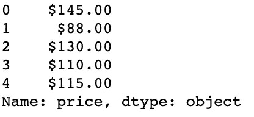

我们可以看到我们的目标变量`price`不是一个数字，让我们看看最长的一个，以便了解是否有任何格式需要在转换前删除:

```
max(df[‘price’].values, key = len)>>> '$1,305.00'
```

首先，我们可以看到我们的目标变量有 2 个不同的字符需要去掉，即符号`$`和识别千位的逗号。让我们用`df.apply()`来摆脱它们。

```
df[‘price’] = df[‘price’].apply(lambda x: x.replace(‘$’, ‘’))
df[‘price’] = df[‘price’].apply(lambda x: x.replace(‘,’, ‘’))df[‘price’] = pd.to_numeric(df[‘price’])
```

# 数据可视化:

数据集有两列，包含公寓所在位置的坐标信息，此外还有我们的目标变量。因此，我们可以创建一个热图，以更好地了解公寓的位置以及价格如何受到位置的影响

为了实现这一点，我们将使用`[gmaps](https://pypi.org/project/gmaps/)`，一个使用谷歌地图创建交互式地图的 python 包。

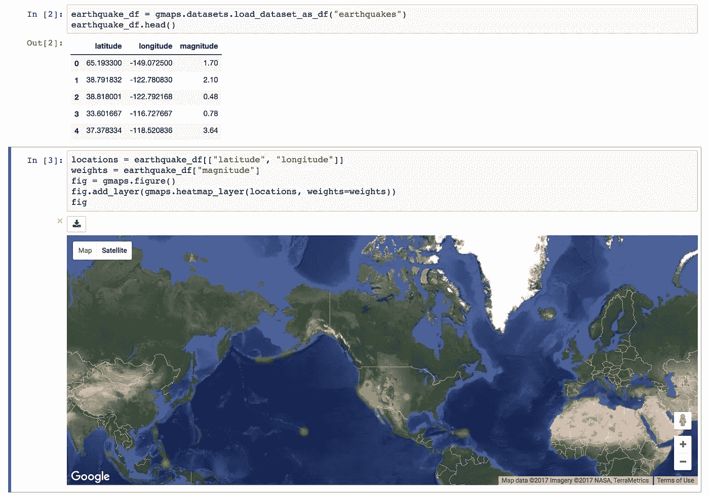

使用 GMaps 的热图示例

你可以使用免费版本，没有 API 密钥，但是，你会得到带有难看的“仅供开发”水印的地图，如果你想消除这些水印，你可以注册(通过添加信用卡)到谷歌云平台，并申请免费积分。点击此处了解更多信息。

> 请小心使用 API 键，尤其是如果你想在线共享你的项目。(在把笔记本推给 GitHub 之前，我禁用了我的键🙃)

您可以在 Jupyter 笔记本上安装`gmaps`,首先通过终端`ipywidgets`扩展启用:

`$ jupyter nbextension enable — py — sys-prefix widgetsnbextension`

然后:

`$ pip install gmaps`

最后，用以下代码加载扩展:

`$ jupyter nbextension enable — py — sys-prefix gmaps`

用`gmaps`创建热图很简单，我们指定一个`Map`对象，然后传递带有坐标和权重的数据帧。

```
fig = gmaps.Map(layout={‘width’: ‘1000px’, ‘height’: ‘500px’, ‘padding’: ‘10px’})fig.add_layer(gmaps.heatmap_layer(df[[‘latitude’, ‘longitude’]],
 weights=df[‘price’]))fig
```

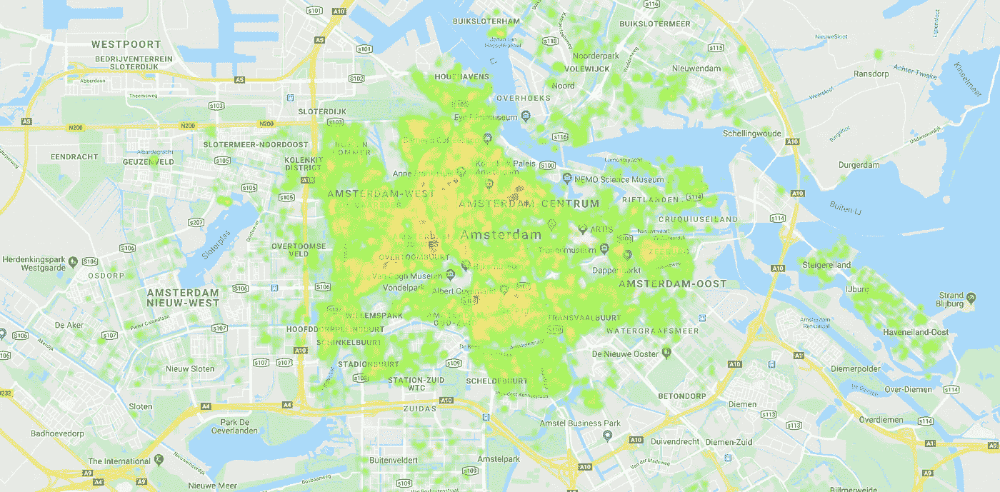

名词（noun 的缩写）如果你安装了 gmaps，并做了所有正确的事情，但地图没有显示，只需重新启动 jupyter 笔记本，它将(很可能)工作！

地图显示，市中心的位置更贵，而郊区更便宜(这种模式可能不仅仅存在于阿姆斯特丹)。另外，市中心似乎也有自己的格局。

为了捕捉一些地理模式，我们需要应用一些特征工程，一个很好的方法是找到一个兴趣点(POI)列表，并计算每个观察值和 POI 之间的距离。

> 如果我们知道一个特定的地点离我们认为很贵的地方很近，很可能整个周边地区都会很贵。

为了计算以千米为单位的距离，我使用了一个函数来检索[哈弗线距离](https://en.wikipedia.org/wiki/Haversine_formula)，也就是球体上两点之间的距离。

这种度量有其利弊:它提供了一种计算两点之间距离的简单方法，但它没有考虑建筑物、湖泊、河流、边界等障碍。

为了得到一个兴趣点的列表，我在谷歌上搜索，我搜索了每个兴趣点的地理坐标。

结果如下:

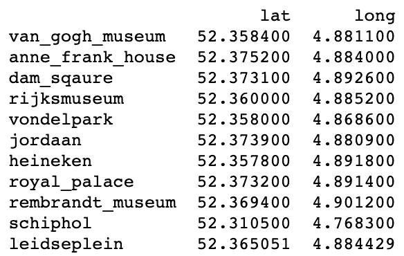

现在可以定义一个函数来计算一个房屋到每个 POI 的距离:

```
from math import radians, cos, sin, asin, sqrtdef haversine(lon1, lat1, lon2, lat2):
 “””
 Calculate the great circle distance between two points 
 on the earth (specified in decimal degrees)
 “””
 # convert decimal degrees to radians 
 lon1, lat1, lon2, lat2 = map(radians, [lon1, lat1, lon2, lat2])
 # haversine formula 
 dlon = lon2 — lon1 
 dlat = lat2 — lat1 
 a = sin(dlat / 2) ** 2 + cos(lat1) * cos(lat2) * sin(dlon / 2)**2
 c = 2 * asin(sqrt(a)) 
 km = 6367 * c
 return km
```

现在，我们可以迭代数据集的每一行，对于每一行，我们迭代我们的 POI 数据帧，并计算每个 POI 的距离(我说了太多次“每个”或“POI”了吗？)

现在让我们用 poi 再次绘制我们的地图，我们可以通过迭代`poi`数据帧的每一行并使用列表理解创建一个元组来做到这一点:

```
fig.add_layer(gmaps.symbol_layer([tuple(x) for x in poi.to_numpy()]
 , fill_color=’green’, stroke_color=’green’))
fig
```

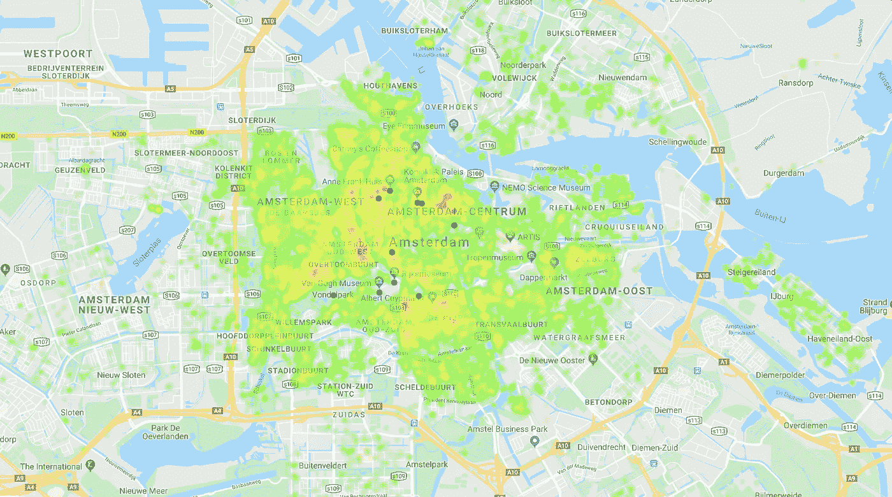

从可视化中可以看出，Willemspark 附近的公寓比周围地区少得多，此外，大多数 poi 都位于“昂贵”区域，尤其是 Dam Square 区域周围。

# 建模:

现在让我们开始建模部分，我们将通过对分类变量`room_type`进行编码并将其分为训练和测试来准备数据集

```
df = pd.get_dummies(df)X = df.drop([‘price’], axis=1)
y = df[‘price’]from sklearn.model_selection import train_test_splitX_train, X_test, y_train, y_test = train_test_split(
 X, y, test_size=0.2, random_state=1)
```

数据集在训练和测试之间分成 80–20%。

# 基线模型📏：

使用的第一个模型将用作基线，因为我们需要一个基准来评估其他模型的性能并比较结果。

它包括一个经典的线性回归，使用`r2`和`MAE`指标上的`GridSearchCV`类进行交叉验证评估。

让我们来适应它:

```
from sklearn.linear_model import LinearRegressionlin_reg = LinearRegression()lin_reg.fit(X_train, y_train)
y_pred = lin_reg.predict(X_test)
```

现在，我们可以通过创建虚拟数据帧来存储每个模型的结果，从而计算 r2 和 MAE 误差:

```
from sklearn import metricsr2 = metrics.r2_score(y_test, y_pred)
mae = metrics.mean_absolute_error(y_test, y_pred)scores = pd.DataFrame({‘Baseline (regression)’ : [r2, mae]}, index=[‘R2’, ‘MAE’])scores
```

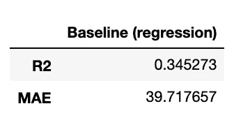

`mae`告诉我们，我们的预测平均相差 40 美元，而 R2 告诉我们，我们的数据相当稀疏。

以图形方式评估回归结果的一个有趣的图是测试集和预测值相对于我们的测试集的差异:

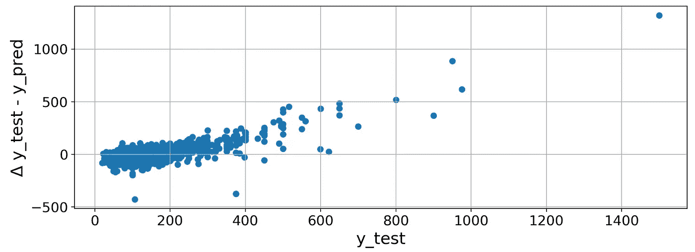

理想情况下，我们希望看到我们的结果越稀疏越好，以 45°穿过图

这些值越接近 0 越好，因为 delta `y_test — y_pred`应该是*理想的是* 0。

## 支持向量机模型📈：

根据 sklearn [地图](https://scikit-learn.org/stable/tutorial/machine_learning_map/index.html)选择了下一个模型，它由一个支持向量机组成。然而，由于使用参数并不总是容易，而且可能需要特定的知识`GridSearchCV`将会有所帮助:

```
if 'svr_gridsearch_cv.pkl' in os.listdir():

    svr_grid_search = joblib.load('svr_gridsearch_cv.pkl')

else:

    from sklearn.svm import SVRsvr = SVR()param_grid = [
      {'C': [1, 10, 100, 1000], 'kernel': ['linear']},
      {'C': [1, 10, 100, 1000], 'gamma': [0.01, 0.001, 0.0001], 'kernel': ['rbf']}]svr_grid_search = GridSearchCV(svr, param_grid=param_grid, 
                                   n_jobs=-1, 
                                   scoring=['r2', 'neg_mean_squared_error'],
                                  refit='neg_mean_squared_error', verbose=100)svr_grid_search.fit(X_train, y_train)joblib.dump(svr_grid_search.best_estimator_, 'svr_gridsearch_cv.pkl')
```

请注意，这项任务可能需要 40 多分钟，这就是为什么在拟合之前，我会检查模型是否已经存在，如果存在，我会加载它。

然后，我们将再次根据来自`GridSearchCV`的最佳参数来预测和计算我们的指标

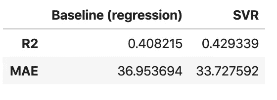

使用支持向量机，我们已经从我们的基本模型进行了改进。

与我们的基准模型相比，`mae`平均降低了近 4 美元。

让我们也为这个模型绘制预测值与误差增量的关系图:

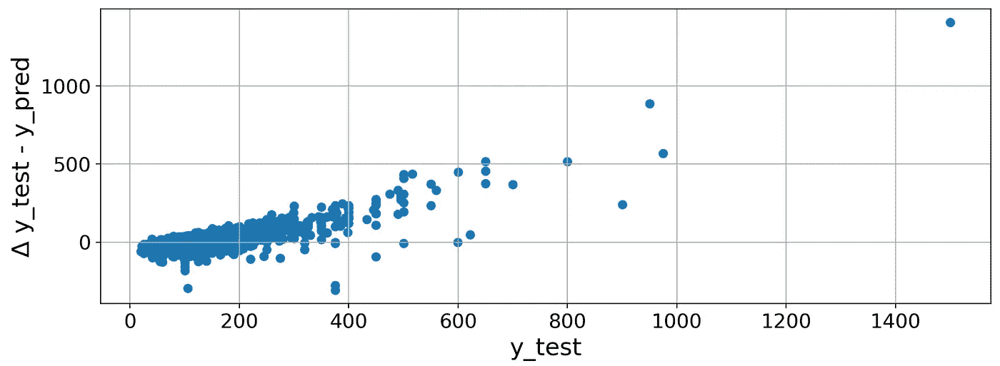

与前一个相比，预测不那么稀疏，这解释了 R2 的小幅增长。

## 梯度推进树模型🌲：

我们将测试的第三个模型是基于随机梯度下降的，我将使用 [**LightGBM**](https://lightgbm.readthedocs.io/en/latest/) ，这是微软的一个库，在行业中广泛使用，是赢得 Kaggle 竞赛最常用的[库之一。](https://www.kaggle.com/milesh1/kaggle-s-most-popular-python-and-r-packages)

```
if 'gbm_gridsearch_cv.pkl' in os.listdir():

    gbm_grid_search = joblib.load('gbm_gridsearch_cv.pkl')

else:

    from lightgbm import LGBMRegressorgbm = LGBMRegressor()param_grid = {
    'learning_rate': [0.01, 0.1, 1],
    'n_estimators': [50, 100, 150],
    'boosting_type': ['gbdt', 'dart'],
    'num_leaves': [15, 31, 50]}gbm_grid_search = GridSearchCV(gbm, param_grid=param_grid, 
                                   n_jobs=-1, 
                                   scoring=['r2', 'neg_mean_squared_error'],
                                  refit='neg_mean_squared_error', verbose=100)gbm_grid_search.fit(X_train, y_train)joblib.dump(gbm_grid_search.best_estimator_, 'gbm_gridsearch_cv.pkl')
```

模型训练相当快，结果一点也不差:

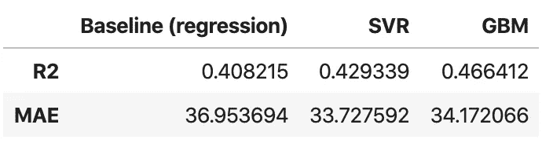

到目前为止，表现最好的模型是 GBM，它将 R2 提高了约 6%,而`mae`略差。

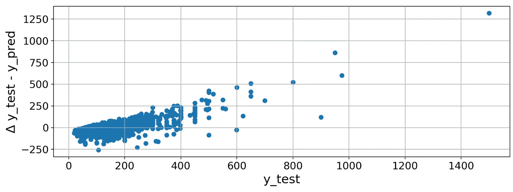

很多差值似乎是负数，这意味着预测值经常高估真实值。

# 神经网络🧠:

在考虑如何进一步改进我们的回归变量时，我首先想到的显然是神经网络！所以我决定实现一个简单的方法:

```
def build_model():
 model = keras.Sequential([
 tf.keras.layers.Dense(64, activation=’relu’, input_shape=(25,)), 
 tf.keras.layers.Dropout(0.2), 
 tf.keras.layers.Dense(128, activation=’relu’),
 tf.keras.layers.Dropout(0.2), 
 tf.keras.layers.Dense(1)
 ])optimizer = tf.keras.optimizers.RMSprop(0.001)model.compile(loss=’mean_squared_error’,
 optimizer=optimizer,
 metrics=[‘mae’, r2_keras])
 return model
```

然而，在玩了一会儿并运行了 100 个纪元后，结果并不特别令人惊讶:

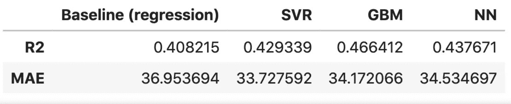

结果基本上是 GBM 和 SVR 之间的平均值，并且绘制误差给出了与之前非常相似的图。

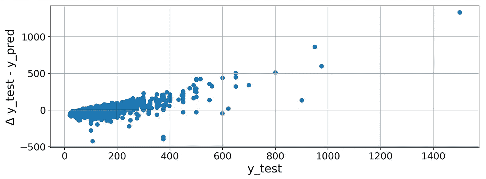

# **那么哪个才是最好的模式呢？**

尽管已经有了模型性能的度量标准，但是为了给出哪个模型被认为是最佳的最终评估，有必要添加其他评估度量标准，例如实现模型所需的资源和训练模型所需的时间。

考虑第二个模型 SVR:它表现异常，实现了最好的 MAE，但是实现网格搜索的训练时间花费了 40 多分钟，这意味着每次想要检查或更改某个东西都至少要花费 40 分钟。

第三个模型(梯度推进树)，花了几秒钟来拟合，结果相当好，实际上达到了整体最好的结果。

考虑到最后一个模型，神经网络，它也没有花太多时间来训练，几分钟，但是，结果并没有从根本上优于以前的模型，实际上，它的表现或多或少是相同的，可能是因为我没有选择正确的超参数，可能是因为数据量，可能是因为其他多种原因，但是，它并没有从根本上优于以前的模型。

此外，这是一个不太容易解释的模型，这意味着我们很难解释预测是如何决定的，而例如，对于线性回归，我们可以拥有所有数据，如截距和系数:

```
coefficients = pd.concat([pd.DataFrame(X.columns, columns=['variable']), 
pd.DataFrame(np.transpose(lin_reg.coef_), columns ['coefficients'])], axis = 1)coefficients
```

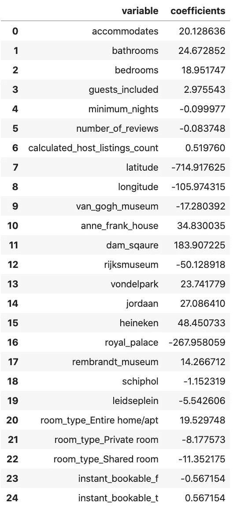

我们基线模型的系数

# 总结一下:

考虑到前面提到的注意事项，并指出妥协通常是一个很好的近似，我们可以得出结论，根据我们的指标，最佳模型是梯度推进树(LightGBM)，它在一眨眼的时间内训练完毕，结果是其他候选模型中最好的。

此外，选择机器学习模型提供了一个优势:决策树是一个可解释的模型，可以分解它，并找到它为什么以及如何计算特定的结果，而不是另一个，在树回归器上调用以下方法，可以查看树的图表:

```
import lightgbmlightgbm.create_tree_digraph(gbm_grid_search.best_estimator_)
```

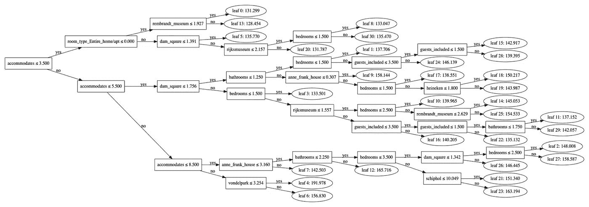

XAI 或可解释的人工智能是现代数据科学的一个非常重要的方面，它专注于如何实现特定的预测，而不是将模型视为黑盒。

引用波恩大学的一篇论文:

> 获得科学成果的先决条件是领域知识，这是获得可解释性以及增强科学一致性所必需的。

[*] Ribana Roscher，Bastian Bohn，Marco F. Duarte 和 Jochen Garcke，[科学见解和发现的可解释机器学习](https://arxiv.org/pdf/1905.08883.pdf) (2019)。

```
**I have a newsletter 📩.**Every week I’ll send you a brief findings of articles, links, tutorials, and cool things that caught my attention. If tis sounds cool to you subscribe.*That means* ***a lot*** *for me.*
```

 [## 米尔斯形式

### 编辑描述

无情-创造者-2481.ck.page](https://relentless-creator-2481.ck.page/68d9def351)