# 一个端到端的时序数据科学项目，将提升您的投资组合

> 原文：<https://towardsdatascience.com/an-end-to-end-time-series-data-science-project-that-will-boost-your-portfolio-6086d0204189?source=collection_archive---------39----------------------->

## *数据科学组合项目就像学习驾照实践考试，你不是在学习驾驶，而是在学习如何通过考试*


照片由 Pixabay 拍摄

在本指南中，我想向您展示如何根据现实生活中的零售数据进行收入时间序列预测，为了完成这些任务，我将使用一个非常常见的库:Prophet，由脸书的科学家开发。

**为什么是先知？**

根据先知 GitHub 页面:

> *“为具有线性或非线性增长的多重季节性时间序列数据生成高质量预测的工具”*

而且，Prophet 被集成到了 [AWS](https://aws.amazon.com/forecast/) 生态系统中，成为时间序列分析最常用的库之一。

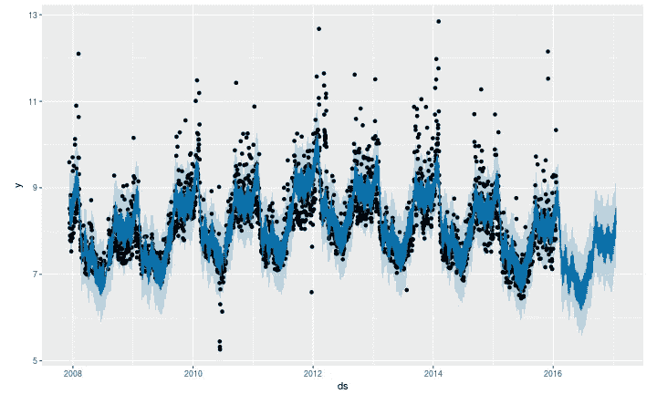

来源:[脸书的 Github](https://facebook.github.io/prophet/docs/quick_start.html)

# 数据

本教程中使用的数据来自一家零售公司，由于数据来源的业务性质，它具有很强的季节性。数据框已经被匿名化，它包含两列:交易的`datetime`和交易的金额。

交易出现在一天的不同时间，为了减少噪音，每天对数据进行重新采样，汇总总收入。

此外，时间戳列已被转换为与 CET 时区相匹配，这样做的主要原因是能够以可理解的格式保存数据，使我们以及最终我们的客户更容易理解。以下是用于实现此目的的函数:

交易是在 2018 年 6 月至 2019 年 10 月期间收集的，它包含 11284 条销售记录。

但是让我们更深入地了解一下 Prophet:根据脸书 Prophet 的文档，要放入 Prophet 的数据必须具有非常严格的格式:一个名为`ds`的列表示时间点，另一个名为`y`的列表示目标。

使用以下代码片段很容易实现这一点:

在这一步，数据**可能**看起来准备好用于拟合模型，但是在绘制数据之后，必须进行一个非常重要的考虑:

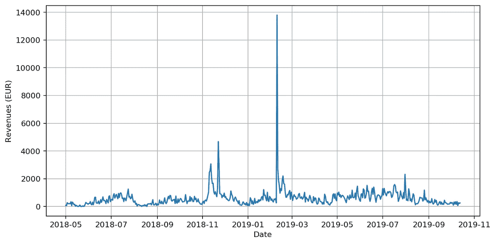

(自己阐述)

数据似乎包含了一些看起来奇怪的值，非常极端的值，这些值会改变平均值:这是什么？

这些观察值被称为异常值，异常值是与其他观察值显著不同的数据点，可能是由于测量中的一些误差造成的。

在数据科学中，必须正确对待异常值，因为它们会严重误导分析和/或降低模型的质量。

剔除异常值的一个很好且非常常用的策略是四分位间距(IQR)规则，通过查看低于 Q1-1.5 IQR 或高于 Q3+ 1.5 * IQR 的观测值，可以找到异常值。这可以用下面的语法在 pandas 中实现:

为了更好地理解发生了什么，方框图会很有帮助:

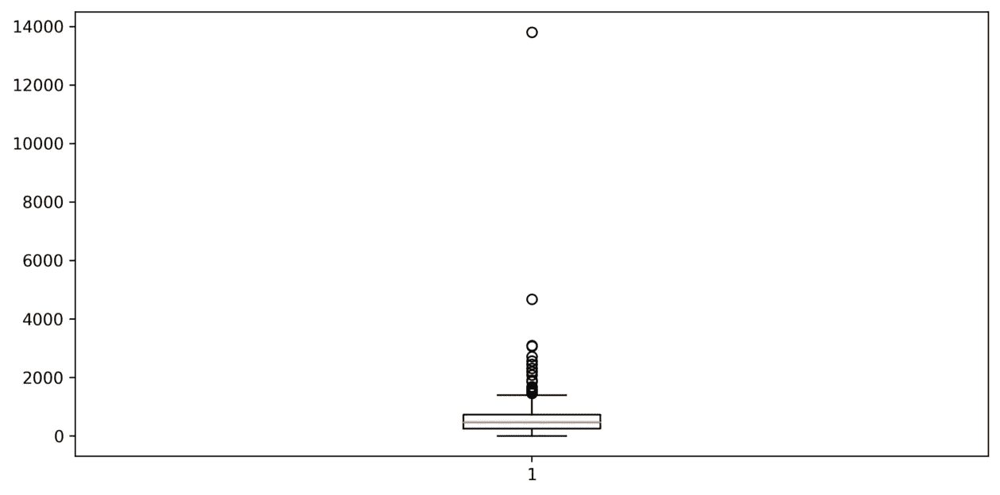

在剔除异常值之前:显然有大量的异常值，这些是从顶部最大值中掉出的观察值。(自己阐述)

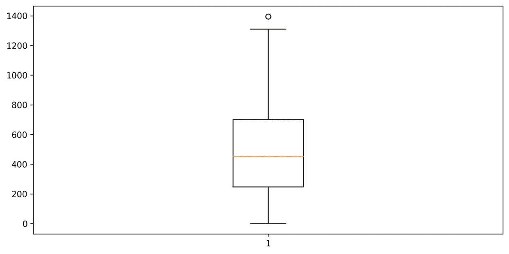

剔除离群值后。(自己阐述)

此时，可以查看“干净”的数据集:

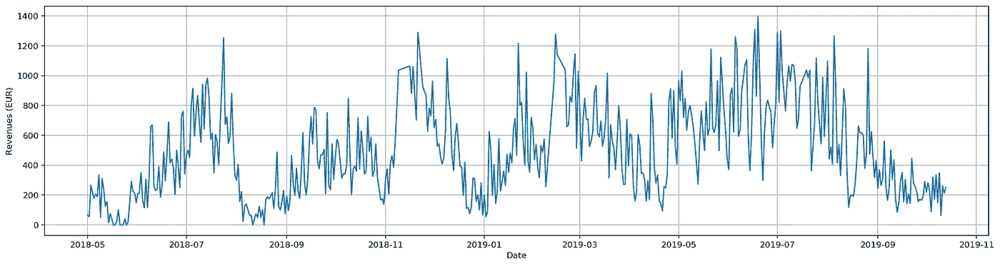

(自己阐述)

在构建机器(和深度)学习模型时，我们希望有一些指标来了解模型的表现，因此第一个拟合的模型是基线模型；该模型由 Prophet 提供的最基本的装配工组成，将用作衡量其他模型之间改进的基线。

该模型被拟合并用于预测 60 天的窗口，并在第 12 天和第 60 天对其性能进行评估，以更好地了解短期和长期预测。

本教程选择的评估模型的度量标准是 MAE:平均绝对误差是一种用于测量预测中误差的平均大小的工具，它不考虑误差的方向，并且实际值和预测值之间的所有差异都具有相同的权重。

MAE 是这类任务的一个非常常见的指标，为了更深入的解释，我想提到这个[帖子](https://medium.com/human-in-a-machine-world/mae-and-rmse-which-metric-is-better-e60ac3bde13d)。

通过绘制预测图可以看出，该模型以一种非常笨拙的方式捕捉了数据的趋势。

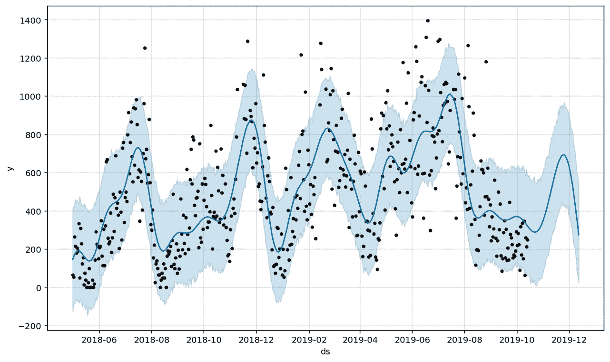

(自己阐述)

但是让我们检查一下 MAE:

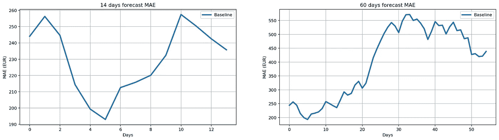

(自己阐述)

第一个模型从第 12 天的 MAE 约为 240 开始，这意味着第 1 天的平均误差为 240 欧元(我们目标值的货币),而与 60 天的预测相比，误差达到 450 欧元。

在这一点上，有可能更进一步，建立第二个模型，最终(并且有希望)能够胜过第一个模型；滚动 prophet [文档](https://facebook.github.io/prophet/docs/quick_start.html)可以看到 prophet 有一个让用户按国家指定假日的方法。

假期是零售数据的一个非常好的预测指标，例如，想想圣诞节有多近，人们就会传统地争相寻找最完美的礼物。

第二个模型显示了一些改进，但是，该模型用拟合线上的一些奇怪尖峰来拟合数据:

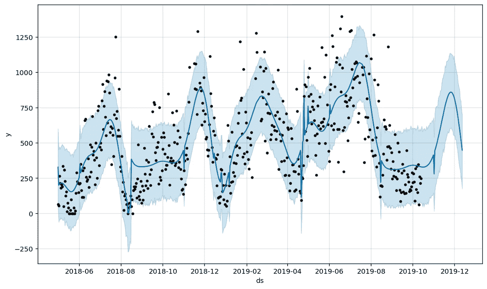

(自己阐述)

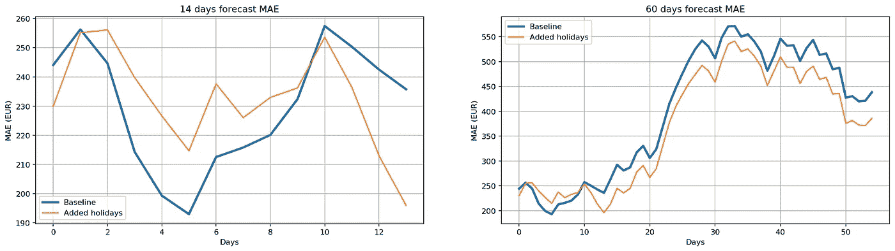

(自己阐述)

从图中可以看出，该模型从大约 230 的 MAE 开始，而在大约第 60 天达到 360-370。因此，从短期来看，它往往是一个更好的模型，而从长期来看，它的表现略好于基线。

深入到 Prophet 文档中可以看到，通过指定周期的持续时间及其傅立叶阶，可以将自定义季节性添加到我们的模型中。

在尝试不同的自定义季节性时，我注意到数据每两个月就有一个增长趋势，这就是为什么我决定添加两个月的季节性成分:

该模型不断更好地拟合数据，捕捉越来越多的季节性成分，这导致短期内的小幅度改善，而从长期来看，这种策略似乎并不奏效，从长期来看，最好的模型仍然是第二种。

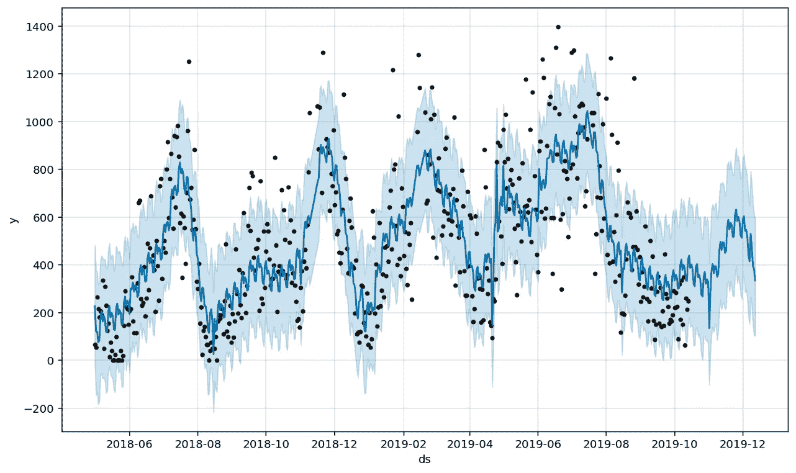

(自己阐述)

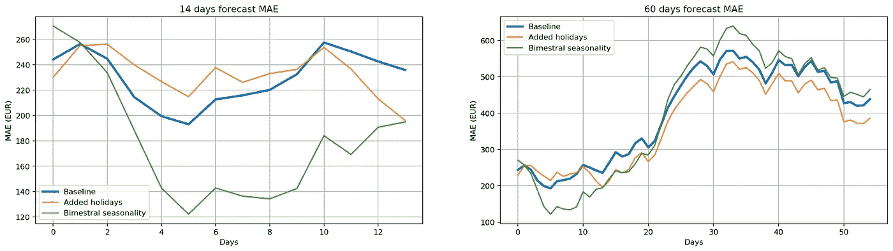

(自己阐述)

但是怎样才能将长期误差降到最低呢？

已经看到添加两个月的季节性项有助于捕捉一些趋势，这可能表明一个好的策略是添加更多的季节性项。它工作，但是…

但是…要小心！添加大量季节性成分可能会导致强烈的过度拟合，这可以通过减少傅立叶项来部分避免，这不需要太深入，就可以使季节性“侵入性更小”。

分别每一个月、两个月和三个月用三个自定义季节性来拟合最后一个模型，从长远来看会导致误差的显著减少，同时拟合线会稍微好一些:

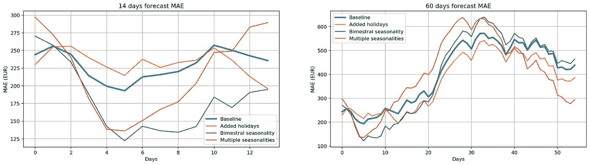

(自己阐述)

# 结论

从这个小指南中，可以推断出一个特定的模型在一个特定的时间范围内表现更好，而在另一个时间范围内可能表现很差。

通常模型是在试错框架下训练的，换句话说:需要多次尝试才能获得可观的结果。这并不意味着只是随机尝试一切，而是更好地理解数据。

在本例中，数据来自时尚零售，时尚零售产品周期短，t 恤(几乎)仅在夏季销售，套头衫仅在冬季销售，这就是为什么添加了不同的定制季节性术语。

拟合时间序列模型可能是一项相当棘手的任务，部署阶段甚至可能更棘手，例如，考虑将模型部署到客户端:每次客户端希望获得一些预测时，模型都需要再次拟合，如果模型托管在一些云提供商上，您可以按需付费，费用可能会快速增长。

```
**I have a newsletter 📩.**Every week I’ll send you a brief findings of articles, links, tutorials, and cool things that caught my attention. If tis sounds cool to you subscribe.*That means* ***a lot*** *for me.*
```

 [## 5-bullet 数据科学与技术📡

### 编辑描述

无情-创造者-2481.ck.page](https://relentless-creator-2481.ck.page/68d9def351)