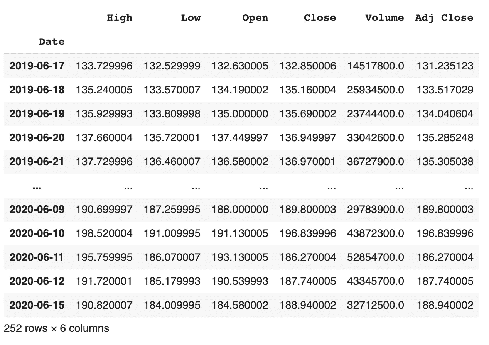
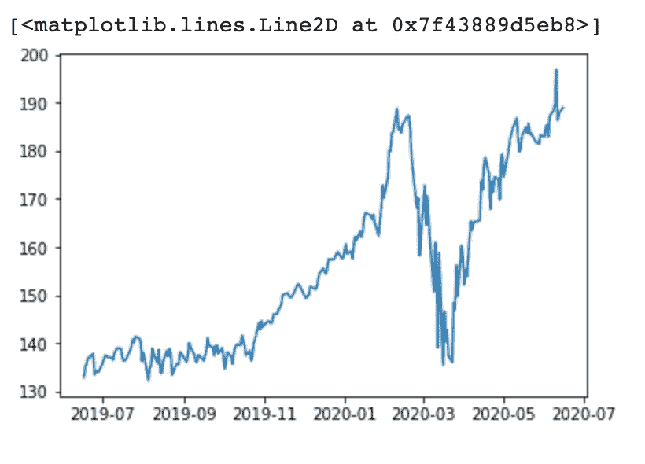

# 使用 Python 获取股票数据的更简单的指南

> 原文：<https://towardsdatascience.com/an-even-easier-guide-to-getting-stock-data-with-python-1a109df6b593?source=collection_archive---------30----------------------->


Jason Briscoe 在 [Unsplash](https://unsplash.com?utm_source=medium&utm_medium=referral) 上的照片

跟着走，在这里访问代码。

我刚刚在我的电子邮件简讯中看到了这篇文章。所以我想用 Python 做一个更简单的获取股票数据的版本。只有我的版本不需要在您的计算机上安装 Python。它完全是使用 Google Colab 运行的。

对于那些不熟悉 Google Colab 的人来说，这是一个免费的基于云的在线 Jupyter 笔记本环境。它使编程变得非常容易，无需在本地机器上安装任何东西。它还能够远程利用 GPU，非常适合热爱编程但没有资源这样做的人。

在文章中，他们提到使用一个名为`yfinance`的库。我将使用`pandas_datareader`。我们不需要在 Google Colab 中安装它，因为它已经是内置的了。因此，我们只需要做一些进口。我们从代码开始:

```
from pandas_datareader import data as web
```

因为我们会处理很多日期，所以另一个方便的库是`datetime`。让我们继续导入它。

```
import datetime
```

为了简单起见，我还将使用与文章相同的股票代码，即 SPDR 标准普尔 500 ETF 信托。翻译成股票代号形式的间谍。所以我们把它设为一个名为`stock`的变量。

```
stock = 'MSFT'
```

在下一段代码中，我获取了这段代码运行前一年的数据。

```
start_date = (datetime.datetime.now() - datetime.timedelta(days=365)).strftime("%m-%d-%Y")
```

我现在将`start_date`插入 DataReader。我将从雅虎获取数据。然后我将输出到一个数据帧中。

```
df = web.DataReader(stock, data_source='yahoo', start=start_date)
```



我们现在可以导入`matplotlib`，如果我们想可视化它，让它看起来更好。

```
import matplotlib.pyplot as plt
```

现在绘图就像取其中一列一样简单。现在让我们用数据框中的 close 列来做这件事。

```
plt.plot(df['Close'])
```



就是这么简单，不需要安装，就可以使用了！请随意分享这篇文章和[代码](https://colab.research.google.com/drive/1m1HcGKdGptP3rr6PEmbkAFu-oH-UL-yb?usp=sharing)！Google Colab 让它变得简单快捷。

也可以随意查看我的其他文章。我还有使用 Python 的技术分析，以及如何使用 Python 连接 Robinhood。

[](/options-trading-technical-analysis-using-python-f403ec2985b4) [## 使用 Python 进行期权交易技术分析

### 我最近发现了今年内的期权交易。这是一次有趣的经历，我学到了一些新东西…

towardsdatascience.com](/options-trading-technical-analysis-using-python-f403ec2985b4) [](/using-python-to-get-robinhood-data-2c95c6e4edc8) [## 使用 Python 获取罗宾汉数据

### 让我们自动化一些股票，可以用来建造一个交易机器人。

towardsdatascience.com](/using-python-to-get-robinhood-data-2c95c6e4edc8)