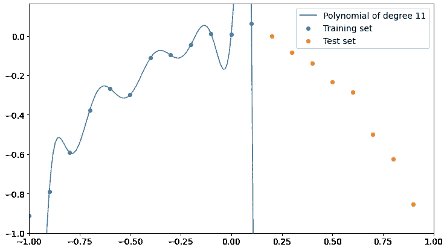
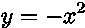
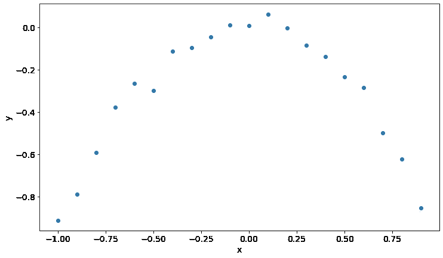
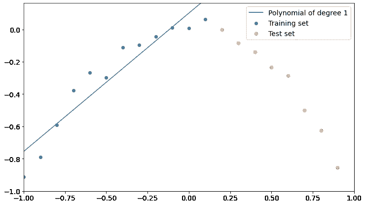
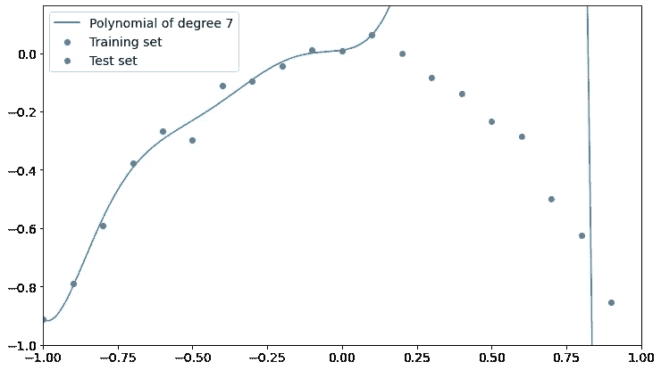
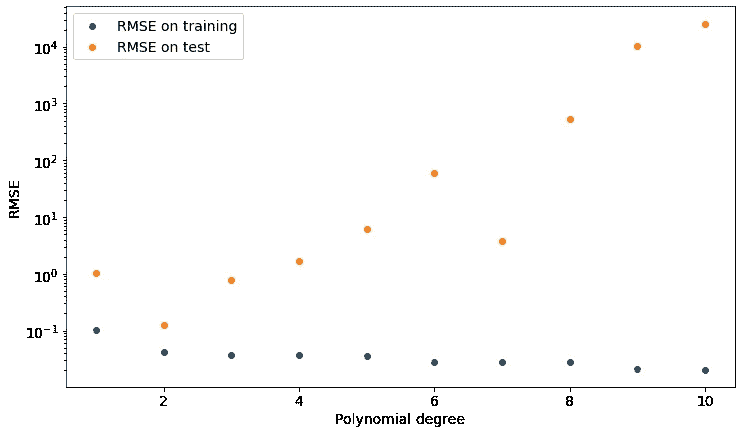
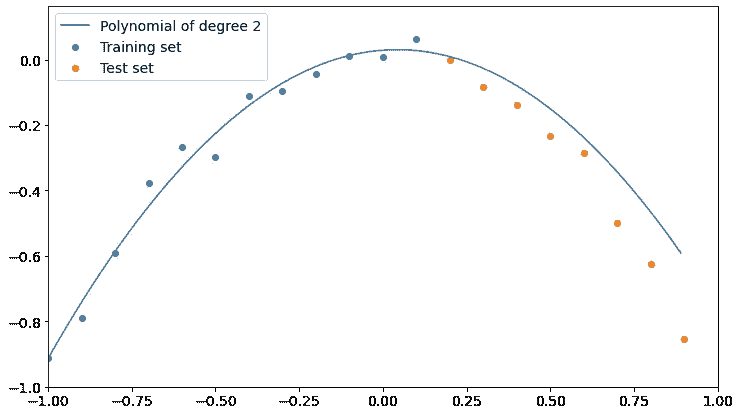

# 过度拟合的一个例子及如何避免

> 原文：<https://towardsdatascience.com/an-example-of-overfitting-and-how-to-avoid-it-f6739e67f394?source=collection_archive---------35----------------------->

## 一个简单的例子展示了过度拟合和交叉验证的重要性



对于试图训练监督模型的数据科学家来说，过度拟合是一个巨大的敌人。这将极大地影响性能，其结果在生产环境中可能非常危险。

但是什么是过度拟合呢？在这篇文章中，我解释了如何识别和避免它。

# 什么是过度拟合？

当您的模型从训练数据中学到了太多东西，并且不能概括底层信息时，就会发生过度拟合。当这种情况发生时，模型能够非常准确地描述训练数据，但是在没有对其进行训练的每个数据集上都失去了精度。这是完全不好的，因为我们希望我们的模型在它从未见过的数据上相当好。

# 为什么会这样？

在机器学习中，简单是关键。我们希望概括从训练数据集中获得的信息，因此我们可以肯定地说，如果我们使用复杂的模型，我们会有过度拟合的风险。

复杂的模型可能会从训练数据中过度学习，并且会*认为*使训练数据偏离基础动态的随机误差实际上值得学习。这正是模型停止概括并开始过度拟合的时候。

复杂性通常用模型在学习过程中使用的参数数量来衡量。比如线性回归中的参数个数，神经网络中的神经元个数等等。

因此，参数的数量越少，简单性越高，并且合理地，过度拟合的风险越低。

# 过度拟合的例子

让我们借助一些 Python 代码来做一个简单的例子。

我将按照公式创建一组 20 个点:



每个点将增加一个平均值为 0、标准偏差为 0.05 的正态分布误差。在现实生活的数据科学中，数据总是由于随机误差而偏离“真实”模型。

一旦我们创建了这个数据集，我们将拟合一个越来越高次的多项式模型，看看在训练集和测试集中会发生什么。在现实生活中，我们不知道数据集内部的真实模型，所以我们必须尝试不同的模型，看看哪一个更适合。

我们将前 12 个点作为训练集，后 8 个点作为测试集。

首先，让我们导入一些有用的库:

```
import numpy as np
import matplotlib.pyplot as plt
from sklearn.metrics import mean_squared_error
```

现在让我们创建样本点:

```
np.random.seed(0)
x = np.arange(-1,1,0.1)
y = -x**2 + np.random.normal(0,0.05,len(x))plt.scatter(x,y)
plt.xlabel("x")
plt.ylabel("y")
plt.show()
```



正如你所看到的，实际上有一点噪音，就像现实生活中的试衣一样。

现在，让我们将这个数据集分成训练和测试两部分。

```
X_train = x[0:12]
y_train = y[0:12]
X_test = x[12:]
y_test = y[12:]
```

我们现在可以定义一个简单的函数，在给定训练集和多项式次数的情况下，返回一个函数，该函数表示最适合训练数据的多项式的数学表达式。

```
def polynomial_fit(degree = 1):
  return np.poly1d(np.polyfit(X_train,y_train,degree))
```

现在让我们定义另一个绘制数据集和特定次数的最佳拟合多项式的函数。

```
def plot_polyfit(degree = 1):
  p = polynomial_fit(degree) plt.scatter(X_train,y_train,label="Training set")
  plt.scatter(X_test,y_test,label="Test set") curve_x = np.arange(min(x),max(x),0.01)
  plt.plot(curve_x,p(curve_x),label="Polynomial of degree       
      {}".format(degree)) plt.xlim((-1,1))
  plt.ylim((-1,np.max(y)+0.1))

  plt.legend() plt.plot()
```

现在，让我们看看 1 次多项式会发生什么

```
plot_polyfit(1)
```



如您所见，1 次多项式比测试数据更适合训练数据，尽管它可能更适合。我们可以说这个模型没有从训练中正确地学习，所以它不好。

让我们看看在相反的情况下会发生什么，这是一个非常高次的多项式。

这是 7 次多项式的情况。



现在，多项式更好地拟合了训练点，但它对测试点完全错误。

更高的学位似乎让我们更接近过度拟合训练数据和测试数据的低准确性。请记住，多项式的次数越高，学习过程中涉及的参数数量就越多，因此高次多项式是比低次多项式更复杂的模型。

现在让我们清楚地看到过度拟合。我们有 12 个训练点，很容易证明过拟合可以用 11 次多项式来创建。叫做拉格朗日多项式。


现在很清楚会发生什么。多项式完全符合训练数据，但在测试集上失去了精度。它甚至没有接近测试点。

因此，多项式的次数越高，对训练数据的插值精度越高，对测试数据的性能越低。

关键词是“插值”。我们实际上不想插值我们的数据，因为这样做会让我们拟合误差，就像它们是有用的数据一样。我们不想从错误中学习，我们想知道错误中的模式。这就是为什么完美的拟合会在遵循相同的训练数据动态的看不见的数据上做出非常糟糕的模型。

# 如何避免过度拟合

怎样才能找到多项式的正确次数？交叉验证来了。因为我们希望我们的模型在看不见的数据上表现良好，所以我们可以测量我们的多项式相对于测试数据的均方根误差，并选择最小化该测量的程度。

使用这个简单的代码，我们遍历所有的学位，并计算训练集和测试集的 RMSE。

```
results = []
for i in range(1,len(X_train)-1):
  p = polynomial_fit(i)
  rmse_training = np.sqrt(mean_squared_error(y_train,p(X_train)))
  rmse_test = np.sqrt(mean_squared_error(y_test,p(X_test))) results.append({'degree':i,
    'rmse_training':rmse_training,'rmse_test':rmse_test})plt.scatter([x['degree'] for x in results],[x['rmse_training'] for x in results],label="RMSE on training")
plt.scatter([x['degree'] for x in results],[x['rmse_test'] for x in results],label="RMSE on test")plt.yscale("log")
plt.xlabel("Polynomial degree")
plt.ylabel("RMSE")
plt.legend()
plt.show()
```

让我们在下面的图中看到结果:



正如你所看到的，如果我们选择一个 2 次多项式，我们得到了测试集 RMSE 的较低值，这是我们的数据被采样的模型。

我们现在可以看看这样一个模型，并发现它实际上非常擅长描述训练和测试数据。



因此，如果我们想概括产生我们数据的潜在现象，我们必须在一个没有经过训练的数据集上交叉验证我们的模型。只有这样，我们才能对过度拟合更加安全。

# 结论

在这个简单的例子中，我们看到了过度拟合是如何影响模型性能的，以及如果我们对交叉验证不够重视，它会有多危险。虽然在避免过度拟合(如装袋)时，有一些非常有用的训练技术，但我们总是需要仔细检查我们的模型，以确保它得到了正确的训练。