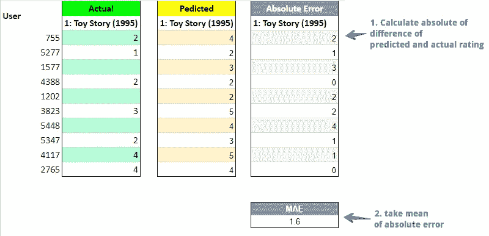
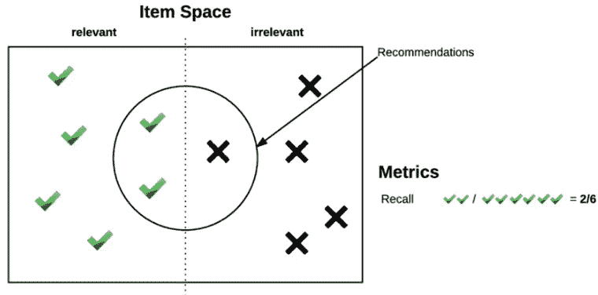
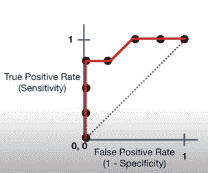
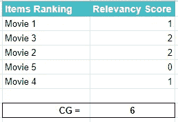
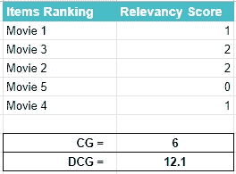
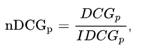
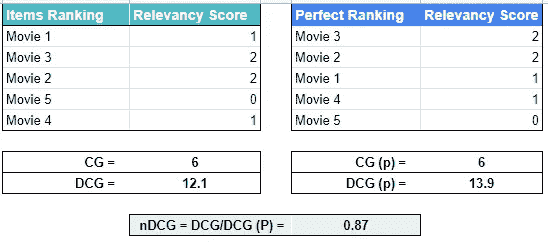
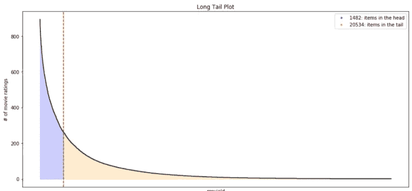

# 评估推荐系统的详尽方法列表

> 原文：<https://towardsdatascience.com/an-exhaustive-list-of-methods-to-evaluate-recommender-systems-a70c05e121de?source=collection_archive---------7----------------------->

## 如何使用不同的评价指标来评价推荐系统？

来源 [bixabay](https://pixabay.com/photos/assess-measure-evaluation-business-2372181/) ，作者 [wokandapix](https://pixabay.com/users/wokandapix-614097/)

想象一下，我们已经建立了一个[基于项目的推荐系统](https://bit.ly/34R3M5G)，根据用户的评分历史向他们推荐电影。现在，我们想评估我们的模型将如何表现。它真的擅长向用户推荐他们会喜欢的电影吗？它能帮助用户从我们系统中的大量电影中找到令人兴奋的新电影吗？这有助于改善我们的业务吗？要回答所有这些问题(以及许多其他问题)，我们必须评估我们的模型。下面我提供了许多不同的技术来评估推荐系统。

首先，我将讨论基于数学的评估方法。这有助于我们从数以亿计的算法中减少可供选择的算法。

之后，我将讨论更多与业务相关的指标，以帮助选择最适合我们业务的技术。

最后，我将讨论几个现实生活中的场景，以帮助我们进一步理解现实生活中的推荐问题以及它如何随领域而变化。

# 基于精度和误差的方法

## 平均绝对误差

平均绝对误差是推荐者预测的值和用户给出的实际值之间的差的平均值。我所说的价值是指用户给出的评分。因此，我们首先通过减去每个用户的预测评级和实际评级来计算误差，然后我们取所有误差的平均值来计算 MAE。

让我们用一个[电子表格](https://docs.google.com/spreadsheets/d/1paJuFRmCX3jrsX79G8NW0So0A6fzQXUS8Hbg1w4AVOM/edit#gid=0)中的例子来看看这一点。假设我们计算了电影《玩具总动员》的推荐分数，并希望评估我们的模型预测分数的准确性。下图显示了如何做到这一点。

[Muffaddal 对电影分级](https://docs.google.com/spreadsheets/d/1paJuFRmCX3jrsX79G8NW0So0A6fzQXUS8Hbg1w4AVOM/edit#gid=1160399286)的 MAE 计算

MAE 显示预测分数与实际分数相差多少。我们取绝对值(顾名思义)是为了取消负号，因为我们对正负分数不感兴趣，我们只想知道真实值和预测值之间的差异。

零 MAE 意味着预测值和实际值之间没有差异，模型预测准确。因此，MAE 越小越好。在我们的例子中，MAE 是 1.5，接近于零，表明我们的模型能够准确预测任何给定用户的电影评级。

下面是它是如何用数学形式表示的:

MAE 方程，来源[维基](https://en.wikipedia.org/wiki/Mean_absolute_error)

## 均方误差

均方误差类似于平均绝对误差，唯一不同的是，我们不是用误差的绝对值来抵消负号，而是对其求平方。

MAE 有助于惩罚结果，因此即使很小的差异也会导致很大的差异。这也表明，如果 MSE 接近于零，这意味着推荐系统确实做得很好，因为否则，MSE 不会这么小。

MSE 方程，来源[维基](https://en.wikipedia.org/wiki/Mean_squared_error)

你能看出 MAE 和 MSE 的唯一区别吗？

MSE 还具有其他特性，尤其是在梯度下降的情况下。我不会在这篇文章中详述，但是你可以看看[李因](https://medium.com/u/9e96fcccfe65?source=post_page-----a70c05e121de--------------------------------)的[文章](https://medium.com/machine-learning-for-li/a-walk-through-of-cost-functions-4767dff78f7)来进一步探索 MSE。

## 均方根误差(RMSE)

MSE 有助于否定负号，但它放大了由于不同等级而无法与实际等级值进行比较的误差。在我们的电子表格中，MAE 是 1.6，但 MSE 是 4。

[Muffaddal 对电影分级](https://docs.google.com/spreadsheets/d/1paJuFRmCX3jrsX79G8NW0So0A6fzQXUS8Hbg1w4AVOM/edit#gid=1160399286)的 MSE 计算

我们可以很容易地理解和比较 MAE 与评级，模型预测的总体差异为 1.6，但我们不能说 4 也是如此，因为我们知道它与用户评级不在同一尺度上。这就是 RMSE 派上用场的地方。

在 RMSE，我们用 MSE 的平方根来标准化 MSE 的规模问题。这使我们的平均结果正常化，其等级与评级等级相同。

RMSE 方程，来源[维基](https://en.wikipedia.org/wiki/Root-mean-square_deviation)

你一定会问梅和 RMSE 有什么不同。有！。RMSE 重建了误差项，而梅没有。梅一视同仁地对待离群值和非离群值，而 RMSE 则不然。此外，RMSE 几乎总是比梅更伟大。Tumas Rackaitis 在他的 [MAE vs RMSE](/evaluating-recommender-systems-root-means-squared-error-or-mean-absolute-error-1744abc2beac) 的文章中详细解释了这一点。

**你注意到了吗？**在我们的例子中，RMSE 也大于平均平均寿命，即分别为 2 和 1.6。

电影评分 MAE vs MSE vs RMSE，Muffaddal

# 决策支持方法

决策支持度量有助于了解推荐器在帮助用户通过选择好的项目和避免坏的项目来做出更好的决策方面有多大用处。两个最常用的指标是精确度和召回率。

## 精确

精度是相关的选定项目的数量。因此，假设我们的推荐系统选择 3 个项目推荐给用户，其中 2 个是相关的，那么精度将是 66%。

精确插图，来源 [researchgate](https://www.researchgate.net/figure/Visualization-of-three-metrics-in-a-recommendation-example-precision-recall-and_fig1_309583367)

精确是指在假设有比你想要的更多的有用项目的情况下，为用户检索最好的项目。

## 回忆

召回是被选择的相关项目的数量。因此，假设有 6 个相关项目，推荐器从中选择 2 个相关项目，那么召回率将是 33%。

回忆插图，来源[研究门户](https://www.researchgate.net/figure/Visualization-of-three-metrics-in-a-recommendation-example-precision-recall-and_fig1_309583367)

召回是为了不遗漏有用的物品。

精确度和召回率通常被用来理解推荐系统的性能。你可以查看 Giorgos Papachristoudis 的[文章](https://medium.com/qloo/popular-evaluation-metrics-in-recommender-systems-explained-324ff2fb427d)来进一步了解他们的细节。

## 受试者工作特征曲线

假设我们决定使用我们的[基于项目的协同过滤](https://bit.ly/34R3M5G)模型向用户推荐 20 个项目。20 个项目列表可以有一半项目被正确预测，而另一半被错误预测。或者它可以有 90%的项目被正确预测，而只有 10%被错误预测。此外，改变推荐项目的数量将改变我们列表中正确和错误的项目数量。

如何确定推荐项目数的最佳阈值，才能得到最大的相关项目和最小的不相关项目？ROC 曲线可以帮助我们回答这个问题。

ROC 曲线有助于确定可以获得最佳结果的阈值。这是它的图形外观

ROC 曲线，来源 [youtube](https://www.youtube.com/watch?v=4jRBRDbJemM)

ROC 是正确预测项目(TPR)和错误预测项目(FPR)之间的曲线。如果目标是调整推荐器以识别其性能的最佳点，它会提供见解。你可以观看这个[视频](https://www.youtube.com/watch?v=4jRBRDbJemM)来更多的了解 ROC。

# 基于排名的方法

到目前为止，我们接触的方法允许我们理解从推荐系统获得的结果的整体性能。但他们没有提供这些物品是如何订购的信息。一个模型可以有一个好的 RMSE 分数，但是如果它推荐的前三项与用户不相关，那么这个推荐就没有多大用处。如果用户必须向下滚动来搜索相关的项目，那么推荐的首要目的是什么？即使没有推荐，用户也可以滚动来寻找他们喜欢的项目。

基于排名的评估方法帮助我们理解建议的项目如何根据它们对于用户的相关性来排序。他们帮助我们衡量项目的质量排名。

## nDCG

nDCG 有三个部分。首先是“CG ”,代表累积收益。它处理这样一个事实:最相关的条目比有些相关的条目更有用，有些相关的条目比不相关的条目更有用。它根据项目的相关性对项目求和，因此称之为累积。假设我们被要求根据项目的相关性进行评分，如下所示

最相关分数=> 2
稍微相关分数= > 1
最不相关分数= > 0

如果我们将这些分数相加，我们将获得给定项目的累积收益。

CG 方程，来源 [wiki](https://en.wikipedia.org/wiki/Discounted_cumulative_gain)

[由 Muffaddal 计算 5 项](https://docs.google.com/spreadsheets/d/1paJuFRmCX3jrsX79G8NW0So0A6fzQXUS8Hbg1w4AVOM/edit#gid=516337976)的累积增益

但是 CG 并没有说明物品在列表中的位置。因此，改变物品的位置不会改变重心。这就是 nDCG 的第二部分发挥作用的地方，即“D”。

贴现累积收益，简称 DCG，惩罚列表中较低的项目。出现在列表末尾的相关项目是不良推荐系统的结果，因此该项目应该被扣除以指示模型的不良性能。为此，我们将项目的相关性分数除以其在列表中排名的对数。

DCG 方程，来源[维基](https://en.wikipedia.org/wiki/Discounted_cumulative_gain)

[5 个项目](https://docs.google.com/spreadsheets/d/1paJuFRmCX3jrsX79G8NW0So0A6fzQXUS8Hbg1w4AVOM/edit#gid=516337976)的贴现累计收益计算，由 Muffaddal

DCG 有助于排名，但假设我们正在比较推荐者的不同列表。每个列表的 DCG 将根据推荐者放置项目的位置而不同。当最相关的项目被放在推荐者的 20 个项目列表的第 10 个位置时，DCG 将会是什么，而当稍微相关的项目被排在第 11 个项目列表的第 10 个位置时，DCG 将会是什么。为了使 nDCG 的这个“n”正常化，第三部分开始发挥作用。

nDCG 将不同数量的项目列表的 DCG 值标准化。为此，我们根据相关性对项目列表进行排序，并计算该列表的 DCG。这将是完美的 DCG 分数，因为项目是按其相关性分数排序的。我们将所有列表的所有 DCG 分数除以这个完美 DCG，得到该列表的归一化分数。

nDCG 方程，来源[维基](https://en.wikipedia.org/wiki/Discounted_cumulative_gain)

[5 个项目](https://docs.google.com/spreadsheets/d/1paJuFRmCX3jrsX79G8NW0So0A6fzQXUS8Hbg1w4AVOM/edit#gid=516337976)的 n-贴现累计收益计算，由 Muffaddal

**平均倒数排名**

平均倒数排名(Mean reciprocal Rank)，简称 MRR，关注的是哪里是推荐列表中的第一个相关项目。第一相关项目位于第三位置的列表的 MRR 将大于第一相关项目位于第四位置的列表。

MRR 取相关项位置的倒数并求和。如果相关项目位于项目列表上的位置 2 和 3，MRR 将为( *1/2+1/3)。*

[MMR 计算，](https://docs.google.com/spreadsheets/d/1paJuFRmCX3jrsX79G8NW0So0A6fzQXUS8Hbg1w4AVOM/edit#gid=1384573311)通过 Muffaddal

这也表明，项目在排名中越高，惩罚越高，并且随着项目在列表中的下降，其惩罚降低。所以 58 号的相关物品无关紧要。

## **平均精度**

Precision 有助于了解模型的整体性能，但不能说明项目的排序是否正确。简而言之，平均精度 AP 有助于衡量推荐模型中所选项目的排名质量。

它只计算推荐的相关项目的精度。

[平均精度](https://docs.google.com/spreadsheets/d/1paJuFRmCX3jrsX79G8NW0So0A6fzQXUS8Hbg1w4AVOM/edit#gid=1365142006)由 Muffaddal

假设我们的模型推荐 8 个项目，如上所述，其中 4 个是正确的，4 个是不正确的。我们取第一个相关项并计算它的精度，在我们的例子中是第一项，因此，它的精度是 1/1。接下来，计算第二个相关项目(项目 3)的精度。它的精度将是 2/3。因为从第 1 项到当前项，总共 3 项中有两项预测正确。我们将对所有相关项目进行同样的处理。最后，取精度列表的平均值来计算平均精度。

该模型的总体精度为 0.5，而平均精度为 0.427。较低的 AP 表示质量排名。

*前 4 项相关时的平均精度是多少？与整体精度相比，其表现如何？*

## 斯皮尔曼等级相关评估

Spearman rank correlation 计算模型如何对项目进行排序，以及它们应该如何排序的分数。让我们用一个例子来理解这一点

[斯皮尔曼等级相关性的模型等级示例](https://docs.google.com/spreadsheets/d/1paJuFRmCX3jrsX79G8NW0So0A6fzQXUS8Hbg1w4AVOM/edit#gid=698408235)，作者 Muffaddal

假设我们的模型按照上图所示的顺序对项目(A 到 E)进行排序。然后，我们列出推荐项目的排名

[Spearman 等级相关性](https://docs.google.com/spreadsheets/d/1paJuFRmCX3jrsX79G8NW0So0A6fzQXUS8Hbg1w4AVOM/edit#gid=698408235)计算，由 Muffaddal

上图中的“推荐者排名”列列出了项目相对于实际项目的排名。因此,“E”实际上排在第 5 位，所以我们将 add 5 存储在项目 E 的“推荐者排名”列中。我们对所有其他项目也是如此。

接下来，我们计算推荐者排名和实际排名之间的差异

[Spearman 等级相关性](https://docs.google.com/spreadsheets/d/1paJuFRmCX3jrsX79G8NW0So0A6fzQXUS8Hbg1w4AVOM/edit#gid=698408235)计算，由 Muffaddal

现在，我们使用差值计算 Spearman 等级相关性，如下所示

穆法达尔的斯皮尔曼等级相关方程

Spearman 等级相关值，由 Muffaddal

Spearman 等级相关范围在 1 和-1 之间，带负号表示项目按相反方向排列。

您可以查看下面的文章，进一步探索 Spearman 等级相关性。

 [## 斯皮尔曼秩序相关

### 本指南将告诉你什么时候应该使用 Spearman 的等级-顺序相关性来分析你的数据，什么假设…

statistics.laerd.com](https://statistics.laerd.com/statistical-guides/spearmans-rank-order-correlation-statistical-guide.php) 

# 其他方法

我们使用了不同的指标来评估推荐系统模型在预测、决策和搜集能力方面的性能。但是它们并不能帮助我们评估问题，比如模型建议的项目总数。或者如果模型推荐不寻常的东西，或者它只推荐与用户的过去历史相似的项目。让我们在本节中讨论这些方法。

## 新闻报道

覆盖率有助于衡量推荐者能够从总项目库中推荐的项目数量。假设我们有 1000 种产品，模型覆盖了不同用户的 800 种产品，那么这意味着我们推荐器的覆盖率是 80%，这还不错。覆盖范围可以进一步细分为项目类型。模型能够建议的填充项与非填充项的百分比。如果目标是向用户建议最大数量的项目，那么覆盖率可以是评估推荐器模型的非常有用的工具。

## 流行

来源[媒体](/evaluation-metrics-for-recommender-systems-df56c6611093)，作者[克莱尔·隆戈](https://medium.com/u/1f6936fe85bb?source=post_page-----a70c05e121de--------------------------------)

某些项目主导用户偏好是正常的。这些是受欢迎的项目。同样正常的是，推荐者也大多推荐受欢迎的商品。这也不是一件坏事。如果我们希望我们的模型推荐受欢迎的商品，或者我们希望推荐者推荐不受欢迎的商品，这取决于我们。受欢迎程度有助于我们评估这一点。能够理解我们的推荐者建议了多少这样的项目可以帮助我们决定我们是否应该继续使用这个模型。

## 新奇

在某些领域，比如音乐推荐，如果模型向用户推荐相似的项目是可以的。但是即使这样，一次又一次地建议相似的项目也会导致糟糕的用户体验，因为用户可能想要探索新的和不同的东西。新奇有助于理解模型的这种行为。我们的推荐模型有能力推荐出人意料的商品吗？。当你在收银台向用户推荐商品时，这种新奇感可能没有用，因为用户会对他们购买的类似商品更感兴趣。但是，一个用户仍在探索网站的地方，建议一些完全新的和不同的东西可能是有用的，新鲜感有助于衡量这一点。

## 多样性

类似于新奇，根据领域和我们要推荐的项目，了解我们模型的多样性也是有用的。衡量我们的模型的建议的多样性是非常有用的。因为高度多样化意味着我们的用户将总是有不同的和多样化的东西来观看和消费。因此，对于我们总是想展示新东西的领域，多样性是我们追求的标准。

## 时间评估

人们的口味随着时间而变化。当你看一部电影时，你可能会给它打 10 分，但两三年后，你的评分可能会下降到 8 分或 6 分。这可能是因为你的品味变了，或者你变得成熟了，或者你现在和你给电影打 10 颗星的时候完全不一样了。有很多因素可以改变你对某样东西的喜好。考虑项目的时间效应也可以帮助我们建立和评估模型。网飞竞赛的获胜者在他们的模型中也有时间因素。考虑用户给出的每一个评分，而只考虑用户最近给出的评分，会对我们的模型预测用户在那个时间点可能喜欢什么的能力产生重大影响。在评估推荐系统的性能时，我们也应该考虑这个因素。

# 业务指标

除了衡量推荐系统的预测能力之外，衡量模型如何实现业务目标也非常重要，甚至更重要。任何模型，无论它有多复杂，都可以帮助支持业务，对吗？。最终目标应该是度量为之构建模型的业务度量。如果这种模式是为了增加收入，如果整合推荐系统后收入增加，那么这就是一个适合你的企业的推荐系统。如果模型的目标是改善应用内的体验，如果你看到每日活跃用户增加，那么你的模型的表现正是它被建立的原因。改善电子邮件活动，提高留存率，增加应用内参与度，如果一个模型能够实现它的构建，那么它就是一个好的推荐系统，否则你应该重新构建并重新评估它。

# 情景练习

无论我们选择什么方法来测试我们的推荐系统，几乎总是取决于我们试图解决的问题。我们需要深入理解我们正在为之构建模型的领域。以下是一些示例场景，帮助您理解评估模型的方法如何随着我们要解决的问题而变化。

请注意，下面讨论的问题可能有不止一个解决方案。我不会去详细说明，我会让你发现。

1-一家电子商务公司向您寻求帮助，希望建立一个模型，在他们的结账页面上推荐两件商品。他们的分析系统拥有大约 30%的用户购买历史和 10%的商品评级历史。你会用什么方法解决这类问题？RMSE，精密，MRR，nDCG 或任何其他方法？

2-一家在线音乐公司希望你建立一个模型，可以向用户推荐他们从未听过的新歌。他们还希望你显示系统推荐的每首歌曲的预测得分。该公司希望增加用户在网站上的平均时间。

3-你的任务是为一家医疗咨询公司建立一个模型，该模型可以根据用户面临的症状和问题向用户推荐最佳顾问。请记住，任何咨询师一次只能招待一个病人，所以向所有人推荐最好的服务是行不通的。此外，你不能向任何病人建议任何顾问。背景和地点也需要考虑。

4- ABC 健身房希望在他们的健身房播放可以激励里面的人的音乐。健身房对男性和女性开放，全天开放。健身房的老板告诉你，他们的客户群由不同背景的人组成。任务是推荐歌曲，考虑顾客的性别、背景、一天中的时间来播放可以激励他们的音乐，并取悦大多数人。

您将使用什么评估方法来测试模型的性能，以克服企业主面临的问题？

**提示:**要解决上述问题，你需要对该领域有很强的理解，并需要考虑业务的各个方面，以决定采用什么方法。

*我强烈推荐查看* [*这个推荐人评估课程*](https://bit.ly/3fQjjYC) *如果你有兴趣学习和解决许多这样的现实生活中的问题。导师们不仅更深入地讨论了评估方法，还解释了许多业务场景以及如何应对它们。*

# 结论

我们提到了一些评估推荐系统性能的方法。我们从讨论基于精度的方法开始，例如 MSE 和 RMSE。然后，我们研究了基于决策的技术，如精确度、召回率和 ROC 曲线。我们还讨论了如何使用 MRR、nDCG 和 AP 等排名方法来评估我们的模型如何对项目进行排名。除了数学方法，我们还涉及了其他方法，如覆盖面，新颖性，多样性和基于时间的方法。最后，我们看到了如何根据我们为之创建模型的业务目标来评估模型

但是不管你使用什么方法，永远记住它始于对我们要解决的领域和问题的深刻理解。有用的评估总是取决于问正确的问题。

# 相似读取

 [## 基于项目的推荐系统综合指南

### 本指南将详细介绍基于项目的推荐系统的工作原理以及如何在实际工作中实现它…

towardsdatascience.com](/comprehensive-guide-on-item-based-recommendation-systems-d67e40e2b75d)