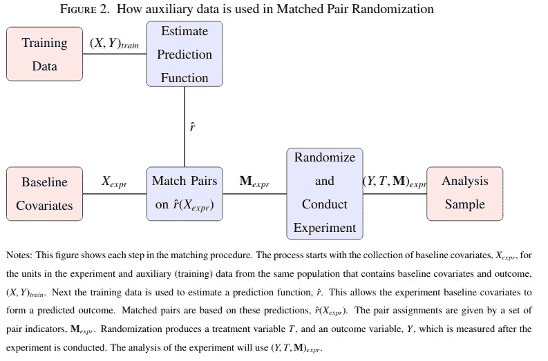
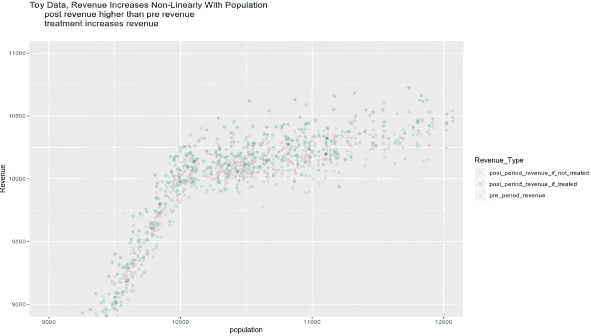
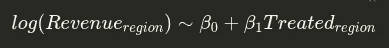
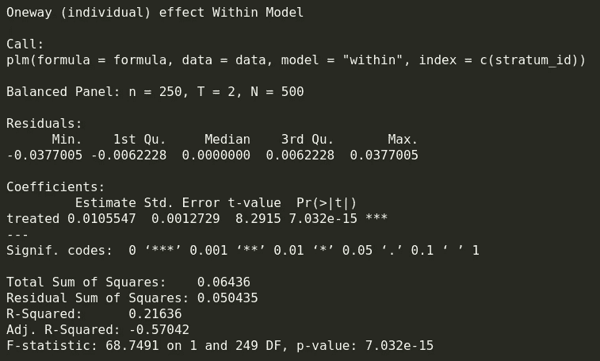
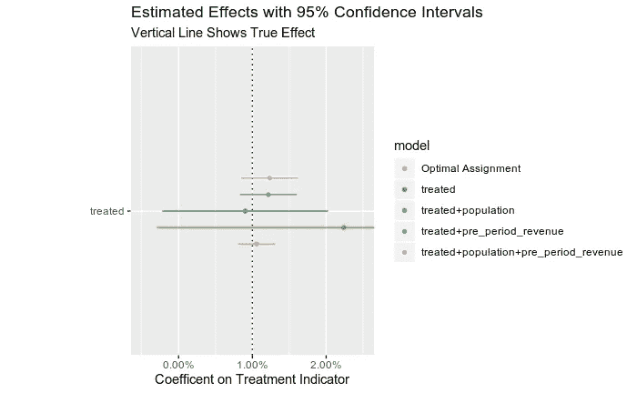
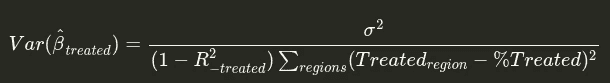

# 一种最大化精度的实验分配机制

> 原文：<https://towardsdatascience.com/an-experiment-assignment-method-all-data-scientists-should-know-e4d57d96b26b?source=collection_archive---------33----------------------->

## 最优分层随机分配

[https://pix abay . com/photos/vaccine-chemist-注射器-秒表-4892059/](https://pixabay.com/photos/vaccine-chemist-syringe-stopwatch-4892059/)

丹·万鲁宁

# 为什么这很重要

随机实验是因果推断的黄金标准:如果你想得到一个治疗效果的无偏(你的估计方法的平均值是真实值)估计，随机实验是最好的方法。

但是实验是昂贵的，你收集的数据越多，花费就越大。使用这篇文章中的方法，你可以提高你的实验精度，这样你就可以用更少的数据和更少的成本来测量效果。

如果你对实验感兴趣，我建议你也看看我的其他帖子

*   [实际实验基础知识所有数据科学家都应该知道](/practical-experiment-fundamentals-all-data-scientists-should-know-f11c77fea1b2)
*   [冷静点！何时将协变量加入线性回归](/get-a-grip-when-to-add-covariates-in-a-linear-regression-f6a5a47930e5?source=friends_link&sk=fa2da69f55faa9641bdc8e19bb3ce4af)

# 方法的高级概要

这篇文章概述了一种在随机实验中实现最佳分层的方法。

该战略如下:

1.  使用实验前协变量，建立一个模型来预测你感兴趣的结果。
2.  根据上一步中训练的模型的预测结果，对您的实验单位(您分配治疗的人群级别:此处区域)进行排序。
3.  将治疗随机分配给预测结果最高的两个单元之一，以及预测结果第三和第四高的两个单元之一，依此类推，直到将治疗分配给预测结果最低的两个单元之一。
4.  然后，为了测量治疗对结果的影响，回归结果~ b0 + b1 治疗+ b[2:N/2+1]对 _ 指标。最后一步中治疗指标的系数是治疗对结果的影响。

参见[论文第 18 页](https://www.google.com/url?sa=t&rct=j&q=&esrc=s&source=web&cd=1&cad=rja&uact=8&ved=2ahUKEwiC-I_00P_nAhVOhOAKHaEBASUQFjAAegQIAhAC&url=https%3A%2F%2Fscholar.harvard.edu%2Ffiles%2Ftbarrios%2Ffiles%2Fopstratv17_0.pdf&usg=AOvVaw1NwZ4ew2X2CWugbWlzKEug)

直观地说，这是分层随机分配，其中每一层是一对实验单元，它们对感兴趣的结果具有非常相似的预测值。

这个职位的其余部分将通过

1.  用玩具数据将事物具体化的示例实验
2.  最简单的分配和效果评估策略
3.  最优策略
4.  为什么协变量不如最优策略有效

# 示例实验

假设我们拥有一家专门从事狗旅行的公司。

[https://pix abay . com/photos/dog-mountain-mombarone-clouds-190056/](https://pixabay.com/photos/dog-mountain-mombarone-clouds-190056/)

我们想衡量一个电视广告对我们收入的影响。电视广告可以分布到不同的地理区域。为了衡量电视广告的影响，我们可以衡量(I)播放电视广告的地区和(ii)没有播放电视广告的地区之间的收入差异。

让我们建立一个玩具数据集来说明这个例子。

该数据集的关键要素是:

*   收入与协变量相关:人口。这种关系是非线性的。
*   如果该地区接受治疗，试验期的收入平均会高出 1%。这就是我们试图测量的效果。

散点图显示了这些元素:

我们还将创建一个助手函数，将实际观察到的收入添加到我们的数据中。

接下来，让我们转向一个简单的回归，可以衡量这种治疗效果。

# 测量效果

## 回归

为了衡量收入的相对变化，我们可以使用以下回归方法:

如果该区域接受了治疗，则为 1，否则为 0。

那么，β₁可以解释为治疗对收入的比例影响:如果一个单位接受治疗，收入将增加

100(1-e^β₁)% ≈ 100β₁%

这是我们对β₁的预期范围的一个很好的近似值(在我们的玩具数据中接近 1%)。

## 简单随机分配

作为第一个原则，我们需要随机分配。否则，我们可能会得到一个有偏差的测量。例如，如果我们决定将广告发送到前期收入最高的所有地区，那么当我们运行上述回归时，我们可能会看到非常大的治疗效果，因为我们将前期收入较大的效果归因于治疗。但是如果我们随机处理，就不会存在这样的混淆变量。

我们在这个实验中测量效果的最简单的方法是随机分配一半的地理位置来获取广告，然后运行前一部分的回归。

我们发现一个估计并不像我们希望的那样接近实际效果水平:当它是 1%的效果时，我们测量的是 2.2%的效果。

我们如何改变我们的分配机制来更精确地测量这 1%的影响？

# 最优分层分配

这篇文章旨在解决的关键问题是:我们如何分配哪些地区应该得到广告(治疗)以获得我们需要的数据来尽可能精确地估计广告的影响。答案是:分层分配，不同的阶层有相似的结果值。

让我们为流程的每一步创建函数。

1.  预测结果，将具有相似预测结果的地理位置(单位)对分配给阶层(随机分配治疗的群体)
2.  在层内随机分配治疗
3.  衡量效果

## 预测结果和划分区域

首先，让我们制作一个使用模型来预测结果的函数。然后，将具有相似预测结果的区域(单元)对分配给相同的层。

## 层内随机分配

接下来，在每个层中，它将随机分配一半的单元进行治疗。

## 测量效果

最后，一个衡量效果的函数。在这里，我们可以运行一个回归，每个层都有虚拟模型，但是这相当于使用“plm”的层固定效应。

## 把它放在一起

让我们用这种最优分配方法重新衡量一下效果。我们将使用简单的回归来预测前期收入:

然后，我们将使用这个模型和我们创建的函数来测量效果。

现在，结果更接近我们期望测量的 1%!标准误差*比简单方法小一个数量级。

就是这个方法！简单，但功能强大！

[https://pix abay . com/photos/flash-雷雨-超级细胞-2568381/](https://pixabay.com/photos/flash-thunderstorm-super-cell-2568381/)

*请注意，我们使用回归分析得出的默认错误，因为它们显示了本文的关键点，但考虑到我们的不确定性来自赋值，随机化推断可能是一个更好的主意。参见[这篇文章，看看如何做随机化推断](/practical-experiment-fundamentals-all-data-scientists-should-know-f11c77fea1b2)。

这篇文章的剩余部分深入探讨了细节。

*   我们不能用协变量来完成同样的事情吗？
*   这种方法为什么有效？

# 协变量

让我们使用简单随机分配的数据，看看我们是否可以用协变量完成同样的事情:

所有这些结果仍然比优化分配差:如上所述，它们不太精确，点估计离真实值更远。为什么？

# 为什么优化分层分配是最好的

如果我们满足普通最小二乘法的一些标准假设(我们的结果和协变量之间的关系是线性的，单位之间不相互影响，治疗和影响结果的其他协变量之间没有相关性，homoskedastity—[请参见我的 stats stackexchange 帖子了解关键假设和含义](https://stats.stackexchange.com/questions/16381/what-is-a-complete-list-of-the-usual-assumptions-for-linear-regression/400600#400600))治疗系数的 OLS 估计方差为:

分母中的总和是处理中的总样本变异。这可以通过将一半区域分配给治疗来最大化(并且它越高，我们的系数估计器越精确)。我们在所有的例子中都这样做了。

$(1-R _ {-treated })$ term 是除了治疗之外，不能被我们的模型**的所有元素解释的治疗中的变化的百分比(如果你将治疗的回归作为所有其他协变量的函数，它是 1 减去 R)。这表明，如果你增加许多与治疗高度相关的特征，你的精确度就会降低。在我们的例子中，处理在所有情况下都是随机的，所以我们希望该项可以忽略不计(其他协变量不应该解释随机处理，所以$(1-R _ {-treated })$应该接近 1)。**

分子是回归的误差方差:如果我们的模型有更强的解释力，精度就会提高。这是我们的例子之间的关键区别。

*   在回归中只有处理项的随机分配表现最差，因为它不能解释模型中只有处理的大量变化。
*   有协变量的模型做得更好，因为它们可以解释模型中人口和/或前期收入的更多结果变化。
*   具有最优分配和固定效果(与地层指标相同)的模型效果最佳。这是因为考虑到人口和收入之间的非线性关系，预测前期结果的模型在预测后期结果方面做得最好。我们可以添加更灵活的协变量函数来解释这种关系，但预测结果的模型可能会做得更好(特别是如果我们使用更灵活的模型，如随机森林)。

有协变量的模型被认为更差的另一个原因是因为回归产生方差加权平均处理效果:见本文第 477 页。当我们使用纯随机分配(非优化分层)时，我们仍然可能将相对更多的控制或处理区域分配给不同水平的协变量。在最终测量中，处理和对照水平更均衡的协变量水平(各约 50%)将被赋予更大的权重。优化的方法避免了这一点，因为它确保我们将总是在每一对中分配一半的治疗和一半的控制，这样所有的协变量空间将大致相等地计数。

# 题外话:倾向得分

你不应该使用倾向分数来创造随机的阶层。上面我们预测了感兴趣的结果，而倾向评分使用过去的数据预测治疗。使用倾向分数来匹配最终会在您的数据中产生更多的不平衡和更不可靠的结果。详情见此视频:

如果你对实验感兴趣，我推荐你也看看我之前的帖子:[所有数据科学家都应该知道的实用实验基础](/practical-experiment-fundamentals-all-data-scientists-should-know-f11c77fea1b2)。