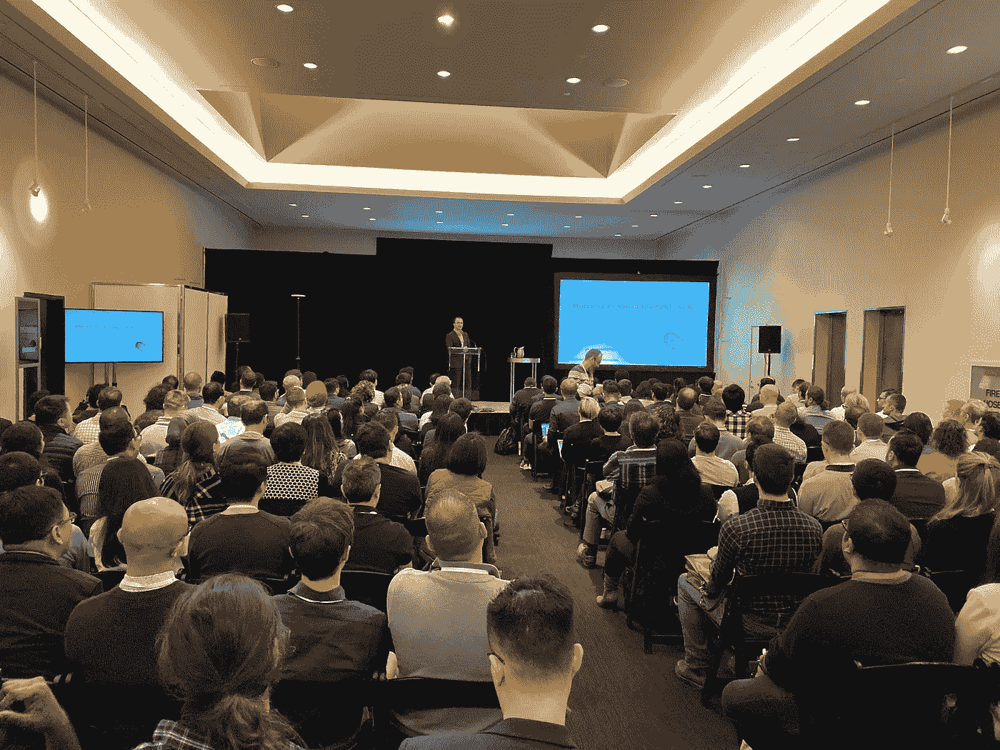

# 对可解释人工智能的内容、原因和方式的解释(XAI)

> 原文：<https://towardsdatascience.com/an-explanation-of-what-why-and-how-of-explainable-ai-xai-117d9c441265?source=collection_archive---------14----------------------->

## 以下是我在 2019 年 11 月[多伦多机器学习峰会](https://torontomachinelearning.com/)上的一次演讲的书面摘要。

现代人工智能系统越来越有能力解决现实世界的问题。然而，一些人工智能系统的[黑箱性质，给出没有理由的结果，阻碍了人工智能的大规模采用。根据普华永道](https://medium.com/element-ai-research-lab/a-taxonomy-of-ai-trustability-challenges-1c68f160d027)的[年度调查，绝大多数(82%)的首席执行官同意，基于人工智能的决策要被信任，它们必须是可解释的。随着人工智能成为我们现代世界越来越不可或缺的一部分，我们需要理解它为什么以及如何做出预测和决策。](https://www.computerweekly.com/news/252462403/Bosses-want-to-see-explainable-AI)

这些为什么和如何的问题是人工智能领域的主题。像人工智能本身一样，XAI 不是一个新的研究领域，人工智能理论和应用的最新进展给解释它的努力带来了新的紧迫性。我在 TMLS 19 上的演讲基于我之前发表的一系列博客文章。该系列探索了 XAI 领域的各个方面，包括它是什么，为什么它很重要，以及如何实现它。

在这里，我不是重复本系列的内容，而是对本系列的五个部分进行概述，并推荐感兴趣的读者进行详细的讨论。

## [可解释人工智能的原因](https://www.elementai.com/news/2019/the-why-of-explainable-ai)

这一部分概述了 XAI 研究的一些最重要的驱动因素，如建立信任、法规遵从性、检测偏差、人工智能模型泛化和调试。

## [该交代什么艾](https://www.elementai.com/news/2019/the-what-of-explainable-ai)

这一部分从现有定义、解释用户角色和给定应用的重要性、可能的权衡以及超出人工智能社区的解释研究等方面深入探讨了解释人工智能模型的真正含义。

## [如何解释人工智能:预建模可解释性](/the-how-of-explainable-ai-pre-modelling-explainability-699150495fe4)

可解释性在人工智能发展的三个主要阶段有不同的含义，即建模阶段之前、期间和之后。这一部分着眼于在建模阶段之前实现可解释性。这包括审查一套方法，以便更好地理解和记录用于建模的数据集。

## [如何解释人工智能:可解释的建模](/the-how-of-explainable-ai-explainable-modelling-55c8c43d7bed)

人工智能模型可以以可解释性和典型的预测性能为目标来开发。这一部分回顾了实现可解释建模的几种方法，包括采用固有可解释模型、混合模型、联合预测和解释，以及通过正则化和架构调整的可解释性。

## [如何解释人工智能:后建模可解释性](/the-how-of-explainable-ai-post-modelling-explainability-8b4cbc7adf5f)

绝大多数 XAI 文学作品都专注于从预先开发的模型中提取解释，以便更好地理解它。这一部分提出了一种新的后建模可解释方法论的分类。这种分类法然后被用作回顾相关文献工作的基础结构。

## XAI 在 H2O.ai

我有幸在 H2O.ai 担任面向客户的数据科学家，h 2 o . ai 是 AI 和 ML 领域的开源领导者。我用了一部分时间来概述 H2O.ai 的企业自动机器学习平台，即[无人驾驶 AI](https://www.h2o.ai/products/h2o-driverless-ai/) ，特别是它的[机器学习可解释性](http://docs.h2o.ai/driverless-ai/latest-stable/docs/booklets/MLIBooklet.pdf) (MLI)能力。

## XAI 的未来

我以三个预测陈述了我对 XAI 前景的看法，以此结束了我的演讲。首先，我预计我们将会看到更多来自人工智能社区之外的解释研究的知识注入。其次，我讨论了 XAI 最佳实践在未来的出现。最后但并非最不重要的一点是，我主张未来在设计的可解释性方面做更多的工作，而不是目前占主导地位的后可解释性范式。

在 19 年的 TMLS 上做了一个关于 XAI 是什么、为什么和如何的演讲，座无虚席