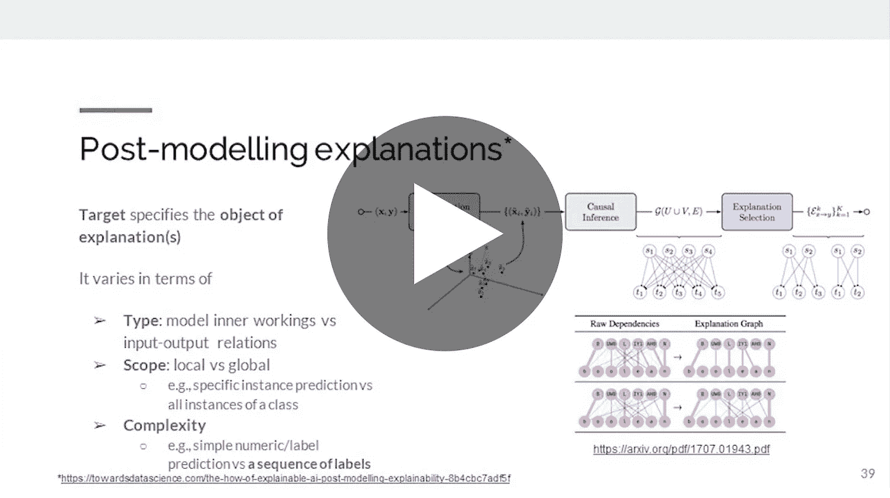

# 对可解释人工智能的内容、原因和方式的解释(XAI)

> 原文：<https://towardsdatascience.com/an-explanation-of-what-why-and-how-of-explainable-ai-xai-6d8ad3ab8d1d?source=collection_archive---------19----------------------->

## [活动讲座](https://towardsdatascience.com/event-talks/home)

## 巴哈多·卡莱吉| TMLS2019

来自多伦多机器学习峰会的演讲:【https://torontomachinelearning.com/ 

## 关于演讲者

Bahador Khaleghi 是 H2O.ai 的客户数据科学家和解决方案工程师。他在过去 13 年中积累了独特的技术背景，涉及广泛的学科，包括机器学习、统计信息融合和信号处理。Bahador 在滑铁卢大学获得 CPAMI 博士学位。在过去的六年中，他积极参与了 R&D 工业项目的各个领域，包括远程信息处理、移动医疗、预测性维护和客户分析。作为 Element AI 可解释性团队的(前任)技术负责人，他目前专注于开发新的方法，以增强 AI 解决方案的透明度、可信任度和可访问性。"

## 关于谈话

“现代人工智能系统越来越有能力解决现实世界的问题。然而，一些人工智能系统的黑箱性质，没有理由地给出结果，正在阻碍人工智能的大规模采用。根据普华永道的一项年度调查，绝大多数(82%)的首席执行官同意，要让基于人工智能的决策可信，它们必须是可解释的。随着人工智能成为我们现代世界越来越不可或缺的一部分，我们需要理解它为什么以及如何做出预测和决策。这些关于为什么和如何的问题是可解释人工智能或 XAI 领域的主题。像人工智能本身一样，XAI 不是一个新的研究领域，人工智能理论和应用的最新进展给解释它的努力带来了新的紧迫性。在这次演讲中，我们将介绍 XAI 的技术概况。演讲将涵盖 XAI 的三个关键问题:“这是什么？”，“为什么重要？”，以及“如何才能实现？".“XAI 是什么”部分深入探讨了从现有定义、解释用户角色和给定应用的重要性、可能的权衡以及超出人工智能社区的解释研究等方面解释人工智能模型的真正意义。在 XAI 的“为什么”部分，我们探索了 XAI 研究的一些最重要的驱动因素，如建立信任、法规遵从性、检测偏差、人工智能模型泛化和调试。最后，在“如何 XAI”部分，我们讨论了如何在人工智能解决方案开发的建模阶段之前、之中和之后应用可解释性原则。特别是，我们引入了一种新的后模型解释方法的分类，然后我们利用它来探索大量的 XAI 文学作品。"

