# Python 中的一个可扩展进化算法实例

> 原文：<https://towardsdatascience.com/an-extensible-evolutionary-algorithm-example-in-python-7372c56a557b?source=collection_archive---------5----------------------->

## 学习如何用不到 50 行代码从头开始编写一个简单的进化算法，供您的项目使用。包括两个例子！


Johannes Plenio 在 [Unsplash](https://unsplash.com?utm_source=medium&utm_medium=referral) 上拍摄的照片

E 进化算法是解决计算问题的特殊方法，比如最优化问题。它们通常会在合理的时间内产生非常好的结果，而无需我们在特定问题的属性上花太多心思。通常，我们只需要调整一些参数，然后让一个相当通用的框架运行，给我们带来一个解决方案。在本文中，您将看到如何用 Python 实现这样一个通用框架。

这在处理极其困难的问题时尤其有趣，比如 [NP-complete](https://en.wikipedia.org/wiki/NP-completeness) 的问题。这些都是现实生活中的相关问题，许多公司每天都必须解决这些问题，而我们却不知道任何有效的算法。其中一个问题是[旅行推销员问题](https://en.wikipedia.org/wiki/Travelling_salesman_problem) (TSP)的优化版本，其表述如下:

> 一个推销员想在 n 个城市销售他的商品。他从城市 1 开始，按照某种顺序访问其他 n-1 个城市中的每一个，恰好一次，然后再次返回城市 1。为了缩短旅行距离，游览城市的最佳顺序是什么？

我们稍后将再次讨论这个问题，作为应用我们的进化算法的一个重要例子。但在此之前，让我们看看什么是进化算法，以及如何将它们应用到一个简单的例子中。

> 如果你只是想看代码，访问我的 [GitHub 页面](https://github.com/Garve/Evo)！；)

# 一个有趣的例子:MarI/O

进化算法的一个有趣的应用是由 Seth Bling 基于“简洁”的论文构建的 MarI/O。一个复杂的神经网络架构是使用进化算法从零开始构建的，以玩经典的[超级马里奥世界](https://en.wikipedia.org/wiki/Super_Mario_World)。怀旧开始了。

# 进化算法

我们现在将看到如何开发一种进化算法来解决一个简单的*函数最大化问题*，即我们想要找到一个输入 *x* ，它最大化给定函数 *f* 的输出。例如，对于 *f(x，y)=-(x +y )* ，唯一的解将是 *(x，y)=(0，0)* 。

该算法可以很容易地适用于解决 TSP 和其他问题。但是首先，让我们看看进化算法实际上是什么。

## 动机

进化算法被设计成类似于自然界中发现的进化。其中，这三个概念是进化的核心:

1.  有一群个体。
2.  个体可以繁殖和死亡。任何这些事情的发生都是由其*适应度*决定的。适应度越高，个体的属性(DNA)在群体中停留的时间就越长，要么是个体本身，要么是其后代。
3.  个体可以变异，也就是稍微改变他们的属性。

我们可以使用这些概念来创建一个*元算法，*，即一个在内部使用其他算法的算法，我们还没有指定*、*来解决我们的问题。别担心，我们会立刻让它充满生机。

## 元算法

1.  **随机生成初始个体群体。**
2.  **评估群体中每个个体的适合度。**
3.  你想重复多少次就重复多少次:
    a)选择健康指数好的个体进行繁殖。
    b)让他们产生后代。使这些后代变异。评估群体中每个个体的适合度。
    f)让适应值不好的个体去死。
4.  **挑选适应度最高的个体作为解。**

等等，这个挺笼统的吧？有许多事情必须详细说明。

> 有哪些个体？
> 第一种群有多少个个体，它们是如何产生的？
> 哪个体能分？多少父母生育多少后代？具体是怎样的？
> 如何变异？有多少人死亡？多长时间重复一次？

现在让我们用最大化一个函数的问题来说明我们如何具体实现一个元算法。

## 一个简单的开始例子

让我们以区间[0，4]上的函数*f(x)=-x(x-1)(x-2)(x-3)(x-4)*为例。我们希望找到一些值来最大化这个函数。一个潜在的问题可能是 1.4 左右的局部最大值，这是我们不想看到的！

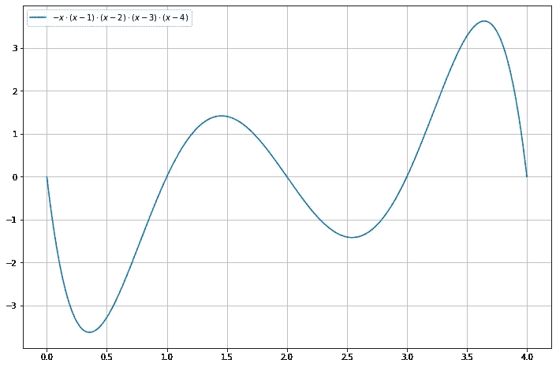

*x* 最大 *f* 约为3.6，最大值也约为 3.6。

让我们看看能否用进化算法重现这一点。所以，让我们开始回答所有未解决的问题。

## 有哪些个体？

> 个体是**总是** **潜在解决问题的**年代。

在我们的例子中，**在 0 和 4** 之间，因为我们只考虑这个区间上的函数。这个很简单，对吧？不会比这更难了，我保证。

## 第一种群中有多少个体，它们是如何产生的？

> 个体的数量是一个超参数，你要补上。如果您不知道解决方案是什么，请尽可能随机地选择初始群体。

在我们的例子中，我们使用 **10 个**随机个体，随机含义为**在 0 和 4** 之间均匀抽取的数字，如何？

我希望使用均匀随机元素是一个好的选择，因为我们可以很好地覆盖整个解空间。例如，如果我们使用平均值为 1.4 的正态分布，也许我们会将我们的解决方案推至 1.4 左右的错误局部最大值。

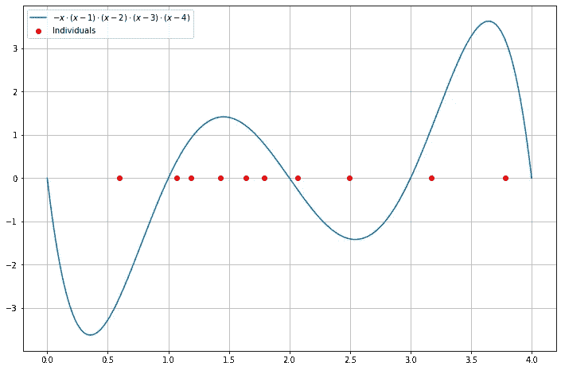

我已经从个人 0.596，1.067，1.184，1.431，1.641，
1.792，2.068，2.495，3.169，3.785 开始。

## 哪个健身分？

> 这个我们也要编一个。我们的解决方案应该具有最高的适应性分数。

我们想最大化我们的函数 *f* ，所以我们可以只使用**我们的函数 *f* 本身**。

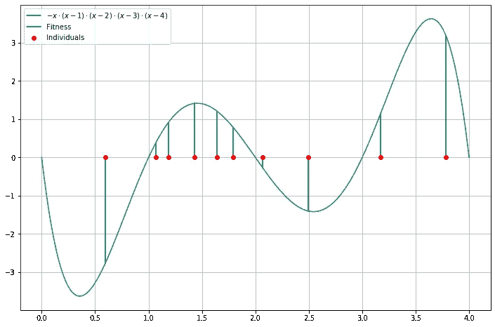

最右边的个体具有大约 3.1 的最高健康分数。一些个体具有大约 1 的健康分数，三个个体甚至具有负的健康分数。

## 多少父母生育多少后代？具体是怎样的？

> 这个我们也要编一个。所有的一切。

在我们的例子中，我们总是可以用两个个体产生一个后代。我们也可以让他们生产更多，但让我们从这里开始。所以，如果我们有两个个体**(也叫*父母*)，他们的**后代**可能就是他们的**平均值**。例如，1.1 和 3.5 的后代可能是 2.3。总的来说，让我们产生三个孩子，总共使用六个不同的父母(即每个父母只有一个伴侣)。**

**再说一遍，这些都是我武断决定的事情。你也可以使用其他策略来完成这一步！每个后代使用一个或三个父母，使父母得到五个孩子，并循环播放。**

**具有最高适合度的六个个体是数字 1.792、1.184、3.169、1.641、1.431 和 3.785(按照适合度的递增顺序)。现在，让我们假设这个列表中的两个邻居得到了后代:**

*   **1.792 与 1.184: **1.488****
*   **3.169 与 1.641: **2.405****
*   **1.431 与 3.785: **2.608****

**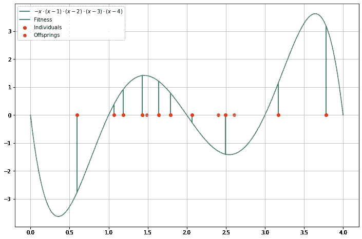**

**生命的奇迹！**

## **如何变异？**

> **从概率上改变后代。这是一个很好的方法，可以在不同的地方探索更多可能的解决方案，不要确定性地走错路。**

**在我们的例子中，我们可以只给每个后代加上**高斯噪声**。也许零的**平均值**和 0.25 的**标准差是可以的。另外，请记住:****

**个人必须是潜在的解决方案！所以，变异不能把孩子推出可行区间[0，4]。如果发生这种情况，请将孩子设置到距离间隔最近的边缘。**

**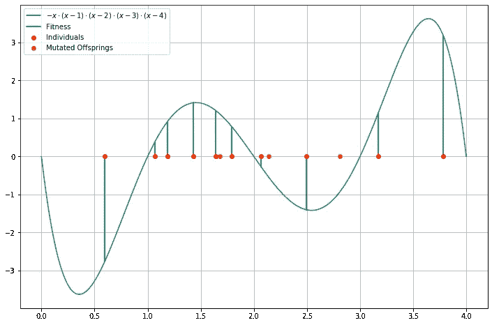**

**突变后，橙色点有所移动。**

## **有多少人死亡？**

> **你喜欢多少就有多少。也许在不同阶段保持相同的人口规模是好的，因为否则人口规模可能会爆炸或者每个人都会在某个时刻死亡。**

**因为我们现在有 13 个个体，让他们中的 3 个死去，我们最终又有了 10 个。让我们挑选出**适应度最差的，**分别是老个体 **0.596 和 2.495** 以及新创建个体 **2.121** 。😔**

**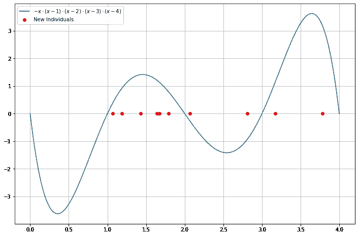**

**生命的循环。**

## **多久重复一次？**

> **你喜欢多久就多久。只是有时检查，直到你看到解决方案不再变得更好。**

**也许让我们修正 50 个纪元，看看会发生什么。在我们的人工进化一路成功后，我们可以检查所有的个体，选择得分最高的一个作为我们问题的解决方案。**

**直到第 50 纪元的进化看起来是这样的:**

**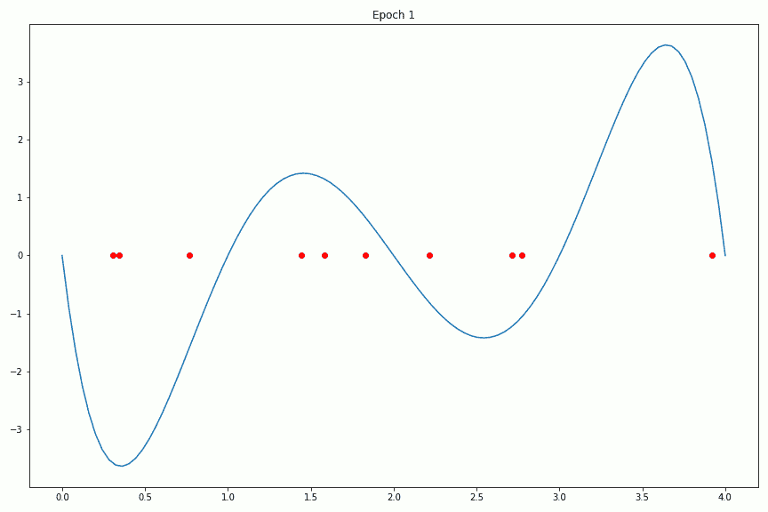**

**我们可以看到算法成功了！但看起来是千钧一发。直到纪元 25，人口聚集在大约 *x* = 1.4 的另一个局部最大值周围。幸运的是，我们有一个远在 4 点的个体，从第 25 纪元开始，它成功地将种群拉向右边。**

**当查看每个时期人口中最佳个体的健康分数时，我们也可以在时期 25 左右看到这种转变。**

**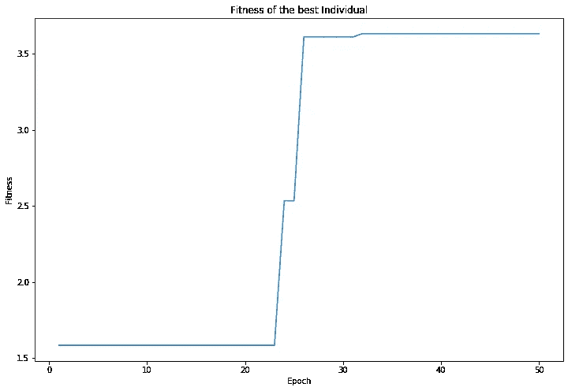**

**它在公元 25 年左右暴涨。**

## **讨论**

**好了，我们已经看到了算法是如何工作的，而且我们最终甚至得到了正确的答案(或者至少是一个非常好的近似值)!其中有一点运气，但这将永远是一样的。我们可能会更不幸，我们的初始人口可能会在当地最大值 1.4 左右开始。那么个人就不太可能逃出这个区域，就像这个例子:**

****

**失败的尝试。该算法只找到错误的局部最大值。**

**仍然可能是这样的情况，一个突变把一个个体推向右边，反过来又把更多的个体拉向右边。但这是极不可能的，因为变异在任何方向上推动个体最多 0.75，概率> 99%，因为标准差是 0.25。**

**那么，用更极端的突变好吗？好吧，如果我们夸大的话，个体只是跳得到处都是或者聚集在两个角落 *x* = 0 和 *x* = 4。因此，我们必须小心选择这里的参数。**

> **从理论的角度来看，你可以把进化算法看作是一种高度随机化的算法。初始种群是随机的，个体通过或多或少复杂的操作产生后代，后代利用随机性变异，所有这一切重复数百、数千、数百万次。**
> 
> **因此，很难分析这些算法，并对它们的成功概率或结果质量给出任何理论界限。对于非常简单的算法来说，这是可能的，例如用于最大化极其简单的函数的 *(1 + 1)进化算法【1】*，或者用于解决*简化的多目标背包问题的算法【2】，*，但是像这样的例子很少见到。**
> 
> **但是，如果运行不起作用，就用相同或其他参数再试一次。**

# **用 Python 实现**

**在这里，我将与你分享我的实现。我试图使它通用和抽象，所以你可以很容易地使用它来达到你的目的。**

**如果你以前从未使用过 AB**B**as**C**lasses，不要担心。类`Individual`只是告诉你应该为代表你个人的对象使用哪个接口。你的个体需要一个值(有效载荷，潜在的解决方案)，你必须实现一个随机的初始化，一个变异，和一个配对函数。**

**然后泳池和进化课会处理剩下的事情。我还实现了函数最大化示例，向您展示这可能是什么样子。我在这里使用了更多的参数，但是如果您将所有的下限替换为 0，上限替换为 4，rate 替换为 0.25，dim 替换为 1，alpha = 0.5，那么您最终将再次使用我们的示例。**

**您可以像这样使用这些类:**

**你走吧！**

**到目前为止，我们已经在一个小玩具问题上获得了一些信心，但现在是时候再次回到困难的 TSP 问题上了。**

# **旅行推销员问题**

**TSP 是关于寻找经过 n 个城市的最短往返旅程。以这些为例:**

**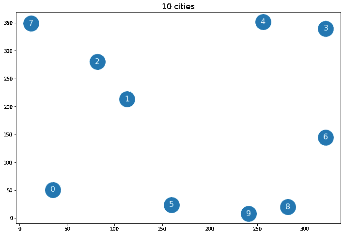**

**地图上的十个城市。**

**TSP 的解决方案如下所示:**

**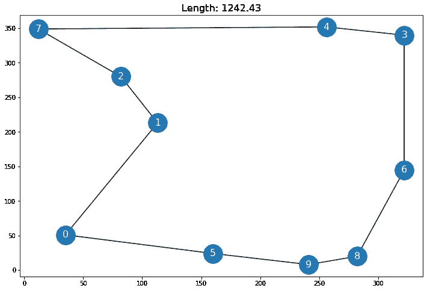**

**最短的往返行程，访问所有城市。**

## **一些简单的事实**

**有许多算法可以解决这个问题。它们的范围从*穷举搜索*(尝试所有方法)到更复杂的算法。然而，所有这些方法都很慢，而且如果 P≠NP，我们永远也不能指望出现任何快速算法。**

**如果你能等几天，详尽的搜索将让你解决多达 15 个城市的问题。其他方法，如[赫尔德-卡普算法](https://en.wikipedia.org/wiki/Held%E2%80%93Karp_algorithm)让你乐观地解决多达 50 个城市的问题。**

**如果你不再需要最好的解决方案，1976 年的[克里斯托菲德斯算法](https://en.wikipedia.org/wiki/Christofides_algorithm)会在很短的时间内给你一个解决方案**也就是说**被证明比最短的往返时间最多多 50%**。****

> ****T 想想为什么这是一个令人敬畏的结果:**我们甚至不知道最短的往返长度**，但我们仍然可以说，这个算法的往返长度比这个未知的解长不到 50%！****

****但是现在，让我们给你你所期待的:一个求解 TSP 的进化算法！****

# ****求解旅行商问题的进化算法****

****这一次，我们从 20 个城市开始。这个量仍然足够低，可以用 Held-Karp 算法来解决它，所以我们甚至可以检查我们最后是否得到了最佳解！这是地图:****

****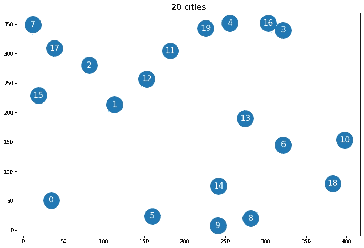****

****地图上的二十个城市。让我们不要费事去尝试对这个进行彻底的搜索。也许这些城市甚至不存在了，直到我们得到最短的往返。****

****现在，我们必须再次回答所有的问题。让我们首先回答更简单的“数字问题”(如果事情不顺利，我们可以轻松调整的超参数):****

*   ****多少个纪元？ **1000******
*   ****有多少个起始个体？ **100******
*   ****多少家长？ **60** (两个产生一个后代，像以前一样)****
*   ****有几个后代？ **30******
*   ****有多少人濒临死亡？ **30******

****令人兴奋的问题是处理我们现在必须定义的类`TSP`的实现。有哪些个体？随机初始化是如何工作的？削皮？变异？健身分数是多少？****

## ****初始人口****

****先说一个基础的:**这里的个体有哪些？普罗提普:不是城市。再次重申:******

> ****个人总是问题的潜在解决方案。****

****在 TSP 的情况下，我们搜索一个短的往返行程。“短”是指往返行程中每两个城市之间的欧几里德距离之和。我们可以将这样一个往返行程表示为一系列 *n* 的数字，例如(0，3，1)读作“从城市 0 开始，然后到城市 3，从那里到城市 1，然后回到城市 0。”。所以，我们的**个体是一列数字**，包含从 0 到 *n* -1 的每个数字恰好一次，即{0，1，2，…，n-1} 上的**排列。******

> ****在整个过程中，我们必须保持这种属性。将不能代表问题可行解决方案的个体留在群体中是没有意义的，因为它阻塞了群体，我们甚至可能在最后选择它，给我们一个无效的解决方案。****

****以及如何初始化它们？好吧，只是从 0 到 *n* -1 随机排列数字。这应该够了。****

```
**def _random_init(self, init_params):
    return np.random.choice(
        a=range(init_params['n_cities']),
        size=init_params['n_cities'],
        replace=False
    )**
```

****让我们继续变异程序。****

## ****变化****

****那么，我们如何以简单的方式改变往返行程呢？假设我们往返五个城市，例如(3，1，4，2，0)。一个简单的方法是随机交换两个元素。我们的例子可能会变成(0，1，4，2，3)或(3，4，1，2，0)。我们还可以多次交换，并从中得出一个超参数`rate`，与之前函数最大化示例中的标准差相当。****

```
**def mutate(self, mutate_params):
    for _ in range(mutate_params['rate']):
        i, j = np.random.choice(
            a=range(len(self.value)),
            size=2,
            replace=False)
        self.value[i], self.value[j] = self.value[j], self.value[i]**
```

****很明显，这种变异保留了个体是排列的性质，即可行解。****

****这里最有意思的大概就是`pair`函数了。****

## ****配对****

****让我们假设我们有以下想要用作父母的个体:****

****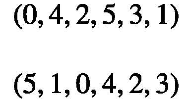****

****方法如下:将第二个个体的右半部分复制到第一个个体的右半部分。****

****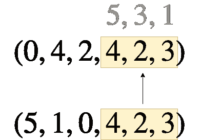****

****第一个个体的右半部分被替换。4 代替旧的 5，2 代替 3，3 代替 1。****

****我们现在想使用改变后的第一个个体作为后代，但是这样做是行不通的，因为现在有重复的数字。因此，必须首先修复被改变的第一个人的左半部分。我们可以这样做:****

****插入右半部分的 4 踢出了之前在那里的 5。所以，让我们用这个 5 代替左半部分的 4，因为它现在不见了。对 2 做同样的事情，把 3 踢出去，得到如下结果:****

****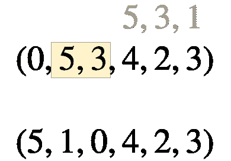****

****但是还有下一个问题:我们现在有两次 3 号了。但是我们可以多次重复这个过程，直到我们再次得到一个可行的个体。3 是问题所在。它最初踢出了 1。所以把左半部分的 3 换成 1，瞧:**后代就是(0，5，1，4，2，3)** 。****

## ****履行****

****总的来说，我们的`TSP`类看起来像这样:****

****在这里，我还引入了另一个超参数α，它决定在哪里分割个体。对于我的例子，我使用 alpha=0.5。****

## ****健身得分****

****由于我们想最小化往返长度，我们可以只使用**减去往返长度**作为适应性分数。****

# ****实验****

****让我们用 20 个城市解决 TSP！我使用了下面的代码:我定义了一个适应度函数、一个计算往返距离的函数和一个计算距离矩阵(两个城市之间的成对距离)的函数。****

****对我来说，适应度函数是这样的:****

****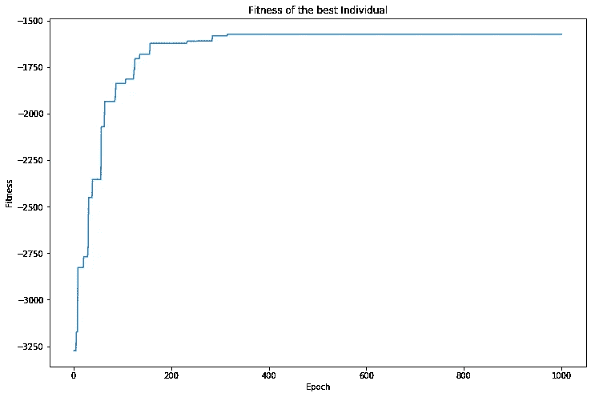****

****以下是每个时代最优秀的人:****

****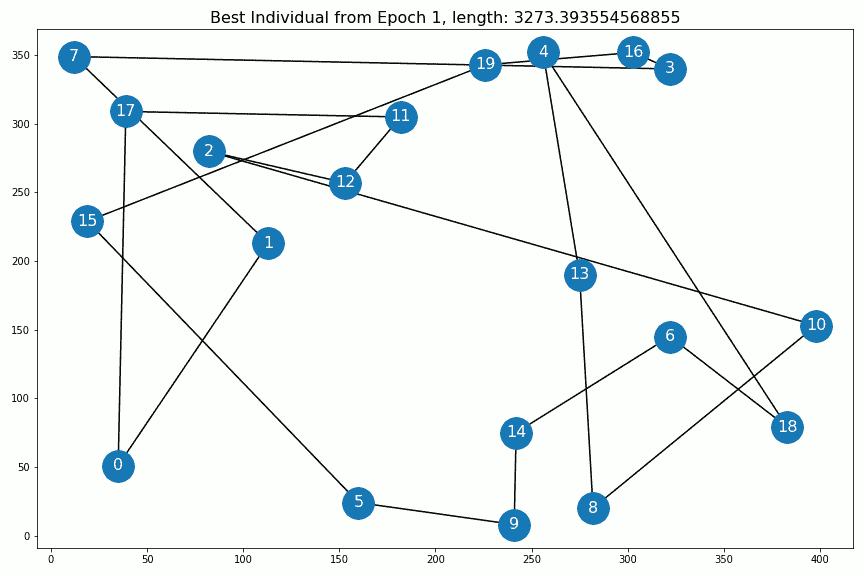****

****解决方案的演变。在公元 400 年之后，一切都没有改变。****

****我们从公元 400 年获得的解决方案甚至是我们能为这 20 个城市获得的最佳解决方案！我用卡尔·埃克洛特的赫尔德-卡普算法实现检查了这一点。****

## ****更多城市！****

****最后一幕，让我们尝试一些真正困难的事情。不仅仅是 10 或 20 个城市，而是 **100 个**，这对于任何精确的算法来说都太多了。****

****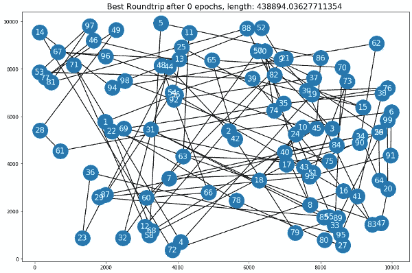********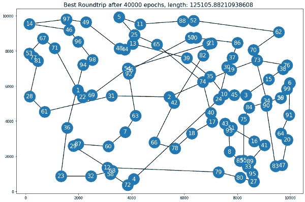****

****从一个非常混乱到一个干净的多，时间短的往返。****

****我不能告诉你这是不是最快的往返，但对我来说，这绝对是一个不错的选择！****

# ****结论****

****在本文中，我们通过两个例子看到了进化算法是如何工作的:最大化一个函数和解决旅行推销员问题。进化算法通常用于解决我们不知道确切答案的难题。这些算法可以非常快，并产生准确的结果。实现起来很容易，你不必是你的问题所在领域的专家，例如，你不必阅读过去 20 年 TSP 研究的论文来编写一个性能良好的算法。****

****可悲的是，很难获得任何理论上的结果，因为进化算法经常与许多以复杂方式相互作用的随机性一起工作。因此，我们无法知道给定的解决方案是好是坏，我们只能检查它对于我们的用例是否足够好。在 100 个城市的例子中，如果我们的目标是以 150，000 或更少的长度旅行到每个城市，算法已经给了我们一个完美的答案。****

# ****参考****

****[1] S. Droste，T. Jansen 和 I. Wegener，[，【1+1】进化算法](https://www.sciencedirect.com/science/article/pii/S0304397501001827)的分析(2002)，理论计算机科学，第 276 卷，第 1-2 期，2002 年 4 月 6 日，第 51-81 页****

****[2] M. Laumanns，L. Thiele 和 E. Zitzler，[对简化的多目标背包问题的进化算法的运行时间分析](https://sop.tik.ee.ethz.ch/publicationListFiles/ltz2004b.pdf) (2004)，自然计算 3，37–51****

****[3] K. Stanley，R. Miikkulainen， [*通过扩充拓扑结构进化神经网络*](http://nn.cs.utexas.edu/downloads/papers/stanley.ec02.pdf)*【2002】*进化计算 10(2) 2002，s . 99–127******

******我希望你今天学到了新的、有趣的、有用的东西。感谢阅读！******

********作为最后一点，如果你********

1.  ********想支持我多写点机器学习和********
2.  ********无论如何，计划获得一个中等订阅，********

********为什么不做** [**通过这个环节**](https://dr-robert-kuebler.medium.com/membership) **？这将对我帮助很大！😊********

*******说白了，给你的价格不变，但大约一半的订阅费直接归我。*******

******非常感谢，如果你考虑支持我的话！******

> *******有问题就在*[*LinkedIn*](https://www.linkedin.com/in/dr-robert-k%C3%BCbler-983859150/)*上写我！*******