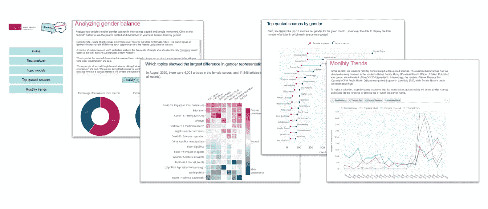
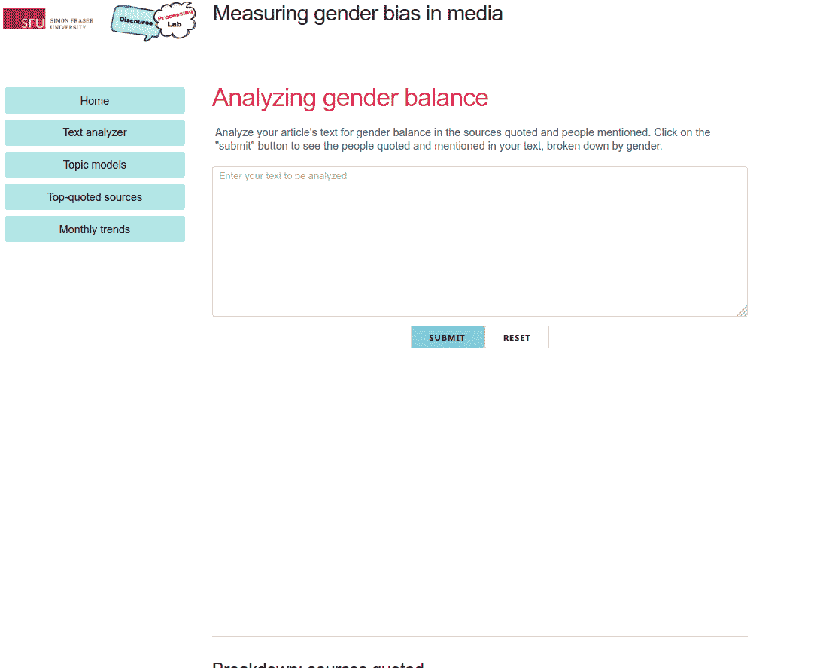
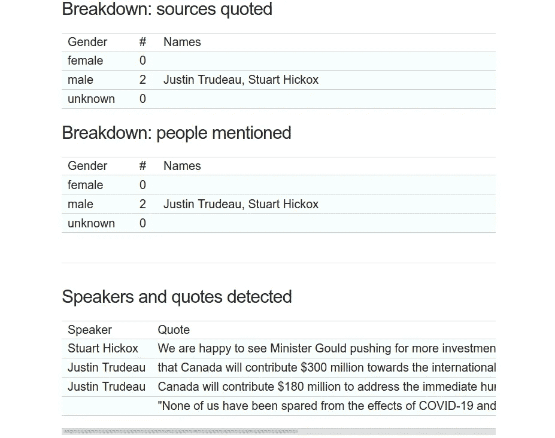
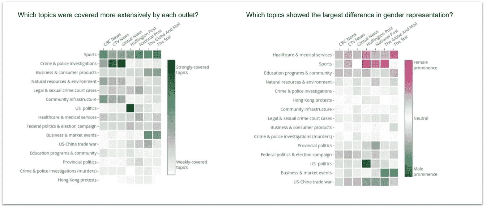
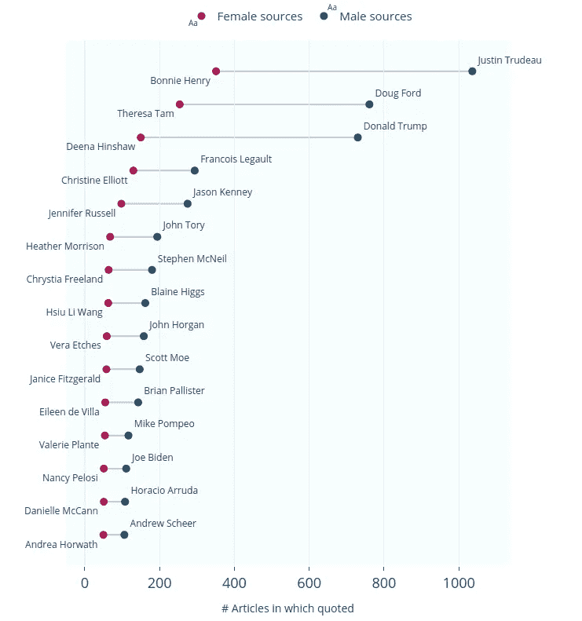
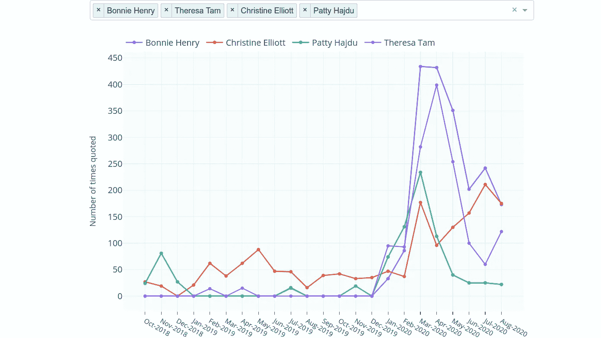
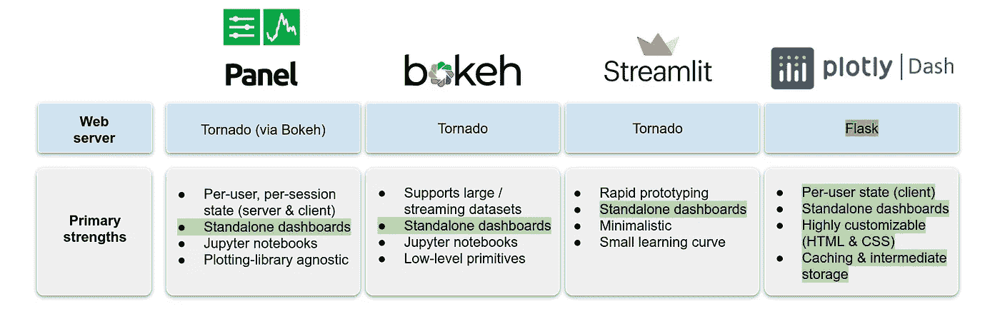
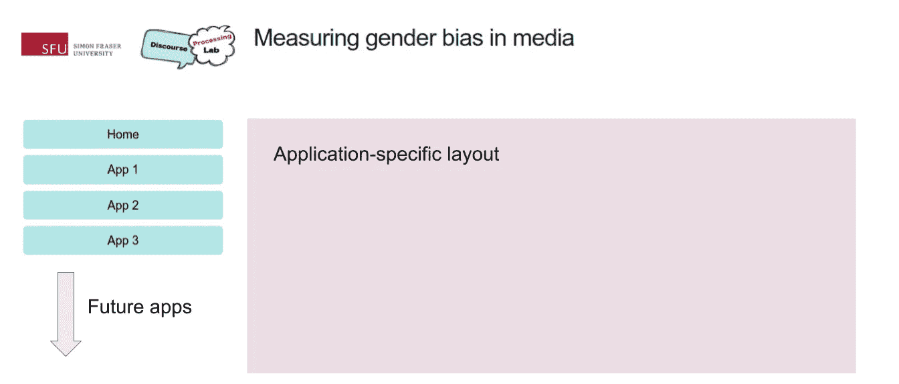

# An extensible, interactive visualization framework to measure gender bias in the news

> 原文：<https://towardsdatascience.com/an-extensible-interactive-visualization-framework-to-measure-gender-bias-in-the-news-56e33ba1655c?source=collection_archive---------30----------------------->

## How we successfully integrated Dash (by Plotly) into our NLP and linguistics research to study women’s portrayal in mainstream Canadian news

How balanced is our representation of gender in the news? (Image credits: [Tumisu via Pixabay](https://pixabay.com/illustrations/gender-equality-man-woman-female-1977912/))

# Background

Over the last several months, I’ve been working at the Discourse Processing Lab at Simon Fraser University (under the leadership of [Dr. Maite Taboada](https://www.sfu.ca/~mtaboada/)), where we’ve been actively developing and extending [the Gender Gap Tracker](https://gendergaptracker.informedopinions.org/), an automated Natural Language Processing (NLP) system that measures men and women’s voices on seven major Canadian news outlets in real time. The Gender Gap Tracker is a collaboration between [Informed Opinions](https://informedopinions.org/), a non-profit dedicated to amplifying women’s voices in the media and Simon Fraser University, through the [Discourse Processing Lab](https://www.sfu.ca/discourse-lab.html) and the [Big Data Initiative](https://www.sfu.ca/big-data/big-data-sfu).

At a high level, we perform the following steps on a daily basis to generate statistics that allow us to quantify the number of men and women quoted in the news:

*   Scrape the text and metadata of news articles from the daily web content of seven Canadian English-language news outlets.
*   Process each article’s text using a variety of NLP techniques (syntactic parsing, named entity recognition, quote extraction) and gender services in order to identify quoted people and their genders.
*   Compute and store individual/aggregated statistics that measure the number of quoted people (i.e., *sources*) from either gender.

> **Disclaimer**: We acknowledge that gender is non-binary, and that there are different social, cultural, and linguistic conceptualizations of gender. For this project, we rely on name lookups from internal/external gender services in order to classify people mentioned and quoted as female, male, or other.

In addition to our daily pipeline, we also run a *monthly* topic modelling pipeline that performs large-scale discovery of topics using Latent Dirichlet Allocation (LDA), on each month’s English news articles. On average, we process 20,000–30,000 articles’ worth of text per month to generate 15 topics (i.e., keyword distributions) for that month, that are then labelled by a human based on real-world knowledge of the month’s events.

All our NLP utilities (including the upstream tools that perform named entity recognition and quote extraction to extract gender statistics) are developed using Python and [spaCy](https://spacy.io/). Topic modelling, for reasons involving the sheer size of data being handled, is done using [PySpark’s scalable implementation of LDA](https://databricks-prod-cloudfront.cloud.databricks.com/public/4027ec902e239c93eaaa8714f173bcfc/3741049972324885/3783546674231782/4413065072037724/latest.html).

Although we do showcase our primary gender statistics (i.e., the proportion of female/male sources quoted by each outlet) on a live, interactive tracker website ([hosted by Informed Opinions](https://gendergaptracker.informedopinions.org/)), we quickly realized the value of building our own custom dashboard for research and exploration purposes. The aim of our research dashboard (hosted [here](https://gendergaptracker.research.sfu.ca/), on Simon Fraser University’s servers) is to provide data scientists and software developers at the Discourse Processing Lab with the means to easily extend the existing data analysis framework, and to help answer new research questions that may arise in the future.

We chose the [Dash](https://plotly.com/dash/) framework (by [Plotly](https://plotly.com/about-us/)) to build our own custom interactive applications within a multi-page dashboard, all in Python. In this article, I’ll highlight some of our results, design decisions, and why Dash is a great framework for tasks related to data science research and exploration.

Multi-page research dashboard built using Dash: [https://gendergaptracker.research.sfu.ca/](https://gendergaptracker.research.sfu.ca/)

# A brief overview of the existing apps

This section highlights a range of interactive tools implemented in the dashboard. Each high-level function is separated into its own application, accessible by clicking the respective button on the [home page](https://gendergaptracker.research.sfu.ca/).

## Text analyzer

This app takes in a user’s input text, typically from a news article or blog post, and runs an NLP algorithm on the backend server to extract the text’s quoted sources and people mentioned. The detected names are passed through our internal cache and gender service scripts to assign each name a gender (any one of ‘female’, ‘male’ or ‘unknown’). A doughnut chart showing the proportion of sources from each gender is displayed, along with the detected names and the quotes in the article/blog post.

[Text analyzer dashboard](https://gendergaptracker.research.sfu.ca/apps/textanalyzer) for the Gender Gap Tracker

Because journalists employ a wide range of styles in naming the persons they quote, a naive system that simply looks for quotation marks in the text is nowhere near sufficient. The [dependency-based parse tree](https://en.wikipedia.org/wiki/Parse_tree#Dependency-based_parse_trees) of a text block, obtained using spaCy, plays a key role in our quote extraction system, locating the beginning and end of quotations using a sentence’s syntactic structure. We first identify key verbs that are commonly used in quotation (defined using a custom, hand-curated verb list), and then locate the objects of each verb, i.e., clauses that are dependent on the verb, based on the parse tree. This allows us to find speakers of quotes regardless of the sentence structure and the presence of quotation marks.

In addition, a coreference resolution algorithm (powered by [neuralcoref](https://huggingface.co/coref/)) is used to link pronoun mentions (‘he’ or ‘she’) to a prior named entity of the type ‘PERSON’. This allows us to capture quotes that do not directly name the speaker. The example snippet shown below highlights the range of quotes detected by our system.

> Prime Minister Justin Trudeau said Saturday that Canada will contribute $300 million towards the international effort to battle COVID-19.
> 
> “None of us have been spared from the effects of COVID-19 and none of us can beat it alone.”
> 
> Canada will contribute $180 million to address the immediate humanitarian and development impacts of the pandemic, he said.
> 
> “We are happy to see Minister Gould pushing for more investment because more is desperately needed,” said Stuart Hickox, the Canadian director of the One Campaign.

Example of the various kinds of quotes and speakers detected by the [text analyzer app](https://gendergaptracker.research.sfu.ca/apps/textanalyzer)

Try out your own custom news snippets [on the text analyzer app](https://gendergaptracker.research.sfu.ca/apps/textanalyzer) to get the gender breakdown of the people quoted/mentioned!

## Topic model explorer

In this app, we showcase a new way to visualize the relationship between the topics covered in a news corpus and the gender of those quoted. Our primary goal through this app is to analyze whether female or male sources are more likely to be associated with specific topics in the news. As described earlier, we perform large-scale topic discovery on each month’s data using an LDA algorithm implemented in Spark. The topic keywords discovered for that month, along with other relevant metadata, are written to a MongoDB database (which also hosts all the raw text data from the news articles). These keywords are then inspected by a human, at the start of each month, and labelled manually based on knowledge of the month’s events.

Because we store the topic distribution (as predicted by LDA) on a per-document basis, we can average these values based on the outlet that published the article. We plot the topic names, as labelled by a human, and these mean ‘topic intensities’ by outlet on a heat map, as shown below for the month of August 2019\. The darker the colour, the more strongly that topic was covered, on average, by that outlet in that particular month.

To study the relationship between topics and the gender of those quoted in articles pertaining to that topic, we first divide our article set for a given month into two subsets — those that quote a majority of female sources (i.e., at least one more female source quoted than male sources), and those that quote a majority of male sources. We then perform a similar averaging of topic intensities (i.e., the topic weights per article obtained from LDA) for each outlet. The results are once again plotted as a heat map, this time with a divergent colour scale from red to blue.

Average topic intensity and topic gender prominence for **August 2019**, in [the topic model dashboard app](https://gendergaptracker.research.sfu.ca/apps/topicmodel)

The topic intensity plot (green) for August 2019 clearly shows that ‘*Sports*’ was a major topic that month, as were ‘*Crime and police investigations*’ and ‘*Business and consumer products*’. ‘*U.S. politics*’ was covered particularly extensively by *Huffington Post Canada*, in comparison to the other outlets. What is more interesting, however, is that in the second heat map, the ‘*Sports*’ and ‘*Healthcare & medical services*’ topics exhibit a strong female *prominence*, which is a term we use to describe topics that are strongly associated with women being quoted the majority of the time on average for that topic. The darker the red colour, the stronger the female prominence for a given topic and a given outlet. Conversely, the darker the blue colour, the stronger the male prominence for that topic.

A deeper analysis on the ‘*Sports*’ topic for August 2019 showed that this was the period in the aftermath of the US women’s soccer team winning the FIFA 2019 women’s world cup. In addition, Canadian tennis player Bianca Andreescu had a dominant performance in the U.S. Open (which she later went on to win in September). As a result of numerous female players and coaches being quoted over the course of August 2019, the sports topic, which would normally be dominated by the quotes of male players and coaches, showed a strong female prominence in this particular month. Unsurprisingly, the ‘*U.S. politics*’ and Canadian ‘*Federal politics*’ topics exhibit strong male prominence, due to the sheer number of male politicians in both the U.S. and Canada being regularly quoted in articles pertaining to politics.

Overall, we obtained some very interesting findings from [the topic model app](https://gendergaptracker.research.sfu.ca/apps/topicmodel), which can be explored in more detail for all months dating back to October 2018.

## Top-quoted sources app

In this app, the quoted persons (male or female) from each article for are collected from our MongoDB database (after having been calculated independently by the NLP modules that run on a daily basis), and then aggregated to retrieve the number of quotes per person for any given month. These lists of top-quoted men and women are plotted as lollipops, the top 15 of which are shown below for the month of May 2020\. Each dot represents the man/woman’s quote count, and the length of the line connecting them represents the disparity in counts between either gender.

Top 15 quoted men and women in May 2020 as per the [top-quoted sources app](https://gendergaptracker.research.sfu.ca/apps/topsources)

It is very interesting that 10 of the top 15 quoted women in May 2020 are either medical officers or healthcare experts, as opposed to just 1 of the top 15 quoted men being from the healthcare domain. Due to the COVID-19 pandemic, many expert women (provincial/regional medical officers and physicians) holding prominent positions in various regions of Canada were brought to the forefront in the news. In fact, our data shows that Bonnie Henry, the Chief Provincial Health Officer of British Columbia, was the most quoted woman all through March-July 2020\. The top-quoted men during the same period overwhelmingly tended to be politicians, both Canadian and American, presumably due to over-representation of men in this domain.

Another interesting aspect of the lollipop plot shown above is its distribution — not only are men always quoted much more frequently than women, but also, the top-quoted people (both men and women) tend to be quoted *far* more often than people in the middle or bottom. This points to the [Pareto principle](https://www.investopedia.com/terms/1/80-20-rule.asp), i.e., that a large proportion of resources is held by a small percentage of the population, also known as the 80/20 rule. While it is certainly possible that some people (especially politicians) get preferential treatment by the media because they already have a voice, recent evidence from the COVID-19 pandemic suggests that having more women in positions of power can increase the likelihood of journalists quoting them and improve gender parity overall.

Similar trends and patterns can be explored in detail using [the top-quoted sources app](https://gendergaptracker.research.sfu.ca/apps/topsources), for all months dating back to October 2018.

## Monthly trends app

This app visualizes a monthly time series of the number of quotes for a given person (male or female). Because of the size of our data (500,000+ articles with thousands of unique male/female sources over two years, and counting), we only display the names of prominent, public-facing men/women that appear in a month’s top 50 quoted people. The trends are displayed using a line chart, as shown below.

Comparing four prominent women in Federal/provincial healthcare positions using the [monthly trends app](https://gendergaptracker.research.sfu.ca/apps/topsourcetrends)

Exposing the number of quotes as a time series allows us to study interesting phenomena pertaining to individuals, such as “the rise of Bonnie Henry”. In the early months of the COVID-19 pandemic (March-April 2020), a sharp increase was observed in the quote count for Bonnie Henry, the Chief Provincial Health Officer of British Columbia. Interestingly, her quote count is significantly higher than that of her federal counterparts (Theresa Tam, the Chief Public Health Officer of Canada and Patty Hajdu, the Federal Minister of Health), as well as that of Christine Elliott, Minister of Health for Ontario, a province with a much higher population than British Columbia. We think this could be due to two factors: 1) British Columbia was a success story in the early days of the COVID-19 pandemic, leading to Bonnie Henry being talked about (and hence quoted) more frequently, and 2) both Ontario and Ottawa had multiple prominent public-facing women for journalists to quote, reducing each woman’s overall share.

Seeing whether [the monthly trends app](https://gendergaptracker.research.sfu.ca/apps/topsourcetrends) can help predict future outcomes, for example, the dominant players in elections, is a very interesting prospect, and we are keen to explore this further.

# A look under the hood

In this section, I’ll explain some of the technical details involved in building the dashboard, including some ideological and design decisions.

## Why Dash?

In a research-focused environment such as ours, front-end web development skills (and knowledge of the associated JavaScript tools) are not easily available. Python is the natural choice of language for all aspects of this project, because of its massive, robust NLP and data science ecosystem. However, the Python visualization ecosystem [is immensely complex](https://pyviz.org/tools.html), and it can quickly become overwhelming to decide between the multitude of options for the specific tasks at hand. There exist a number of great libraries for building dashboards and interactive visualizations in Python, such as [Panel](https://panel.holoviz.org/index.html), [Bokeh,](https://bokeh.org/) [Streamlit](https://www.streamlit.io/), and [Dash](https://dash.plotly.com/introduction).

[Panel](https://panel.holoviz.org/index.html) is a novel, high-level dashboarding solution for Python that allows users to create interactive web apps and connect user-defined widgets to plots, images, tables or text. Unlike many other approaches, Panel attempts to be plotting library and environment-agnostic, i.e., it is designed to support nearly all Python plotting libraries, and work just as well in a Jupyter notebook or on a standalone web server. The key defining feature of Panel is that it allows users to separate their science/engineering/business logic from their GUI implementation, without getting tied to any particular GUI or web frameworks. Developed under the support of [Anaconda Inc.](https://anaconda.com/), Panel is an ambitious project that provides users the flexibility to move expensive computations and data processing between the server side and the client side, depending on the application’s requirements and the size of the data. The [Panel documentation](https://panel.holoviz.org/Comparisons.html) contains a rich and detailed explanation of its features in comparison with other Python dashboarding frameworks.

[Streamlit](https://www.streamlit.io/) is a light-weight, minimalistic framework to build dashboards in Python. The main focus of Streamlit is to provide users with the ability to rapidly prototype their UI designs using as few lines of code as possible. All the heavy lifting typically required to deploy a web application, such as defining the backend server and its routes, handling HTTP requests, etc., are abstracted away from the user. A certain degree of customizability is traded off for ease of use and rapid setup, making it ideal for early-stage interactive exploration of data and modelling results.

[Bokeh](https://bokeh.org/), also developed with the support of Anaconda Inc., is a visualization library that provides lower-level primitives for charts and widgets that can be used to power other higher-level charting libraries (such as Panel, or [chartify](https://github.com/spotify/chartify)). In Bokeh, [high-level “model objects”](https://docs.bokeh.org/en/latest/docs/user_guide/server.html) (representing plots, axes, or other attributes related to plotting) are created in Python (or any other language), converted to JSON, and then consumed by a JavaScript client library, BokehJS. This decoupled architecture allows Bokeh to extend to other languages than Python, provide the backend code that runs the server, and ultimately power the UI event in the front-end (browser) via JavaScript.

[Dash](https://dash.plotly.com/) is a powerful, highly customizable library for building dashboards in Python. It is written on top of Flask, Plotly.js and React.js, allowing for fluid, [reactive web applications](https://www.outsystems.com/blog/posts/reactive-web-applications/) that scale well to multiple client sessions. In terms of its architecture and functionality, Dash is most similar to Bokeh, in that it allows users to define higher-level plot objects in Python (using an underlying Flask web server), whose underlying attributes are then consumed by a JavaScript library (Plotly.js) that fires events on the client side. Unlike Streamlit and Panel, Dash does require users to have some knowledge of the underlying HTML and CSS details, greatly increasing users’ ability to customize the UI to their needs. Although Dash’s web server [can support other Python visualization libraries](https://github.com/plotly/dash-alternative-viz-demo) (such as Altair, Seaborn or matplotlib), it is still somewhat opinionated, with users encouraged to stick to the Plotly graph API for the most part, because this API has been tried and tested in production.

Key features of each dashboarding solution in Python

As can be seen in the above figure, Dash provides the ideal combination of all our primary requirements. To start with, Dash uses a web server built on top of Flask (unlike the other three frameworks, which use [Tornado](https://www.tornadoweb.org/en/stable/)), and is deployed just like traditional Flask servers [using WSGI](https://flask.palletsprojects.com/en/1.1.x/deploying/). Because we already had other dashboards and backend APIs based on Flask, it made more sense to build our new system with some level of compatibility. Dash is designed to store a session’s state on aper-userbasis, within the client (i.e., the browser). This is apt in terms of scalability for our use case, because we need a system where many simultaneous client sessions are able to view results from the database without necessarily using up server resources.

We opt to work around any potential computational bottlenecks on the server side by designing our apps such that they never request huge amounts of data from the server at any one time. Any NLP computations (e.g., in our text analyzer app) only request highly specific data (such as gender values for a given name) and run in near real-time, so the server is unlikely to be bogged down due to compute-heavy requests by many simultaneous client sessions. To avoid repeating expensive calculations for each user, a number of options are available for caching intermediate results (on the client side) that can be reused within the session. Most importantly, Dash offers a great deal of freedom in terms of page design and layout— it allows the developer to directly modify the underlying HTML and CSS attributes, providing much greater flexibility in customizing the dashboard’s appearance.

## Multi-page structure

The dashboard is deployed using a multi-page layout, to make it more extensible as time goes on. A simple, responsive HTML layout [based on this CSS template](https://www.w3schools.com/html/tryit.asp?filename=tryhtml_responsive_media_query3) is used to allow for flexible rearrangement of components based on the user device’s display resolution. Each app’s layout and source code is self-contained, [in its own Python file](https://github.com/sfu-discourse-lab/GenderGapTracker/tree/master/dashboard_for_research/apps), and within a clearly defined zone outside the sidebar as shown below. An arbitrary number of independent apps can be added using this structure.

Extensible, multi-page layout for the dashboard (designed using CSS, as per [this file](https://github.com/sfu-discourse-lab/GenderGapTracker/blob/master/dashboard_for_research/assets/style.css))

## Modularity and code readability

A Dash app can be conceptualized as being made of three main blocks of code. The first of these is the *application layout*, which contains the structure of the web page, including all the interactive widgets and core components (dropdowns, text inputs, etc.) required by the user to modify an app’s state. All code is written in Python, using Dash’s wrappers around Plotly’s graph objects and generic HTML.

The next block defines the *callbacks* for the app, which are functions (defined using Python’s decorator syntax) that allow users to observe, modify and update the properties of any component in the UI. Because all Dash code is written in Python, it integrates very well with pandas, allowing specific results to be returned on the fly based on user input. In this example, a dropdown’s selected value is passed as an input argument to a callback, which executes asynchronously to filter the contents of a preloaded pandas DataFrame, returning just the required data. This data is output as a Plotly `figure` object and rendered as a line chart on the browser.

The third block contains user-defined, custom *functions*, primarily written to make the callbacks and the application layout more readable. For example, if we were performing a slightly more complicated action along with filtering the DataFrame, that portion of code could be factored out into a separate function, making the callback much more readable. The example below is the same as the one above, except that the filtering steps are factored out to an external function, greatly improving readability in complex cases.

Using this 3-block structure, arbitrarily complex apps can be designed to perform data manipulation and NLP tasks on the fly.

## Intermediate data storage

One common problem that arises when performing NLP tasks is that of expensive bottleneck computations that can increase an app’s response time. For example, in the text analyzer app described earlier, we are required to perform named entity recognition, coreference resolution and gender prediction on a potentially large list of names, all in real time, based on arbitrary text input by the user. This is further complicated by the fact that multiple components in the app — the doughnut charts and multiple data tables — all need to access the same intermediate data.

Rather than perform the same (potentially expensive) calculation multiple times for each callback, we apply Dash’s inbuilt mechanisms to [share state between callbacks](https://dash.plotly.com/sharing-data-between-callbacks). The simplest way to do this is to store expensive-to-compute intermediate data as in-memory JSON, that can be accessed by every subsequent callback without wasteful recomputation. An example is shown below.

In the snippet shown above, a user first inputs a condition (e.g., a date filter), for which we read specific data from a MongoDB database using the pymongo library. Then, we perform some expensive calculation on this data (using the function `expensive_calc`) within the first callback. The data computed from this callback is stored as JSON and kept in memory on the client side, where it can then be accessed for free by the second callback. It is trivial to then transform the JSON data blob into a pandas DataFrame, following which it can be output to a Plotly `figure` object and rendered as a chart on the client side.

# Conclusions

In building each application for the Gender Gap Tracker research dashboard, design decisions were taken to minimize the amount of data being transferred between the server and the client. Because our primary data storage layer is in MongoDB, all data must be passed around as JSON. Due to the immense size of the data in this project (500,000+ news articles from over a two year period, and counting), we only work with **aggregated quantities** (precomputed through intermediate operations on these JSON objects) in all our visual components. All charts (heat maps, lollipop plots and line charts) display precomputed values that either sum up or average the individual values over a specified time period. This is mainly done to maintain reasonable response times and to provide a fluid run time experience.

The Gender Gap Tracker is the result of many months’ work by a team of eight at Simon Fraser University, whose findings draw from various fields, including big data, computer science, social science, media and linguistics. We are excited to present more nuanced results of this interdisciplinary work for consumption by the broader public, and are always open to feedback!

## Acknowledgements

We thank Alexandra Wilson at Simon Fraser University, who provided invaluable guidance on the design, layout and colour styles for the dashboard. We’re also grateful to to [Alexandre Lopes](https://www.linkedin.com/in/alexandreaslopes/) at SFU Research Computing, who built and maintains the database and server infrastructure for the Gender Gap Tracker.

## Resources

The research dashboard for the Gender Gap Tracker and our most recent results can be explored in detail here:

 [## Measuring gender bias in media

### Dashboard showcasing results from our study on gender bias in the media

gendergaptracker.research.sfu.ca](https://gendergaptracker.research.sfu.ca/) 

The code for the dashboard and the NLP functionality described in this article is available on the project’s GitHub repo, shown below.

 [## sfu-discourse-lab/GenderGapTracker

### This page contains code for dashboard apps that we are building internally in the discourse processing lab, pertaining…

github.com](https://github.com/sfu-discourse-lab/GenderGapTracker/tree/master/dashboard_for_research)